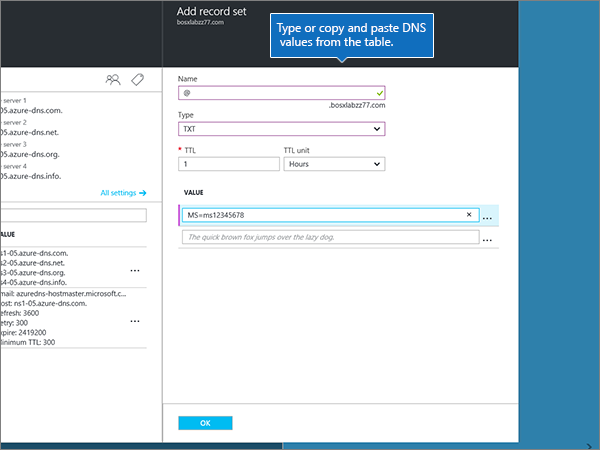

# Crear registros DNS para zonas DNS de Azure

 **[Consulte Preguntas más frecuentes acerca de los dominios](../setup/domains-faq.md)** si no encuentra lo que busca. 
  
Si Azure es su proveedor de host DNS, siga los pasos de este artículo para comprobar su dominio y configurar los registros DNS para el correo electrónico, Skype empresarial online, etc.
  
Estos son los registros principales que es necesario agregar. 
  
- [Cambiar los registros del servidor de nombres (o NS) de su dominio](#change-your-domains-nameserver-ns-records)
    
- [Agregar un registro TXT para verificación](#add-a-txt-record-for-verification)

- [Agregar un registro MX para que el correo electrónico del dominio vaya a Office 365](#add-an-mx-record-so-email-for-your-domain-will-come-to-office-365)
    
- [Agregue los cuatro registros CNAME necesarios para Office 365](#add-the-four-cname-records-that-are-required-for-office-365)
    
- [Agregar un registro TXT para SPF para ayudar a evitar el correo no deseado](#add-a-txt-record-for-spf-to-help-prevent-email-spam)
    
- [Agregar los dos registros SRV necesarios para Office 365](#add-the-two-srv-records-that-are-required-for-office-365)
    
Después de agregar estos registros a Azure, su dominio estará configurado para trabajar con los servicios de Office 365.
  
> [!NOTE]
> Por lo general, los cambios de DNS tardan unos 15 minutos en aplicarse. Sin embargo, a veces los cambios pueden necesitar más tiempo para aplicarse en todo el sistema DNS de Internet. Si tiene problemas con el flujo de correo u otros problemas después de agregar registros DNS, consulte [Solucionar problemas después de cambiar el nombre del dominio o los registros DNS](../get-help-with-domains/find-and-fix-issues.md). 
  
## Cambiar los registros del servidor de nombres (o NS) de su dominio

> [!IMPORTANT]
> Debe realizar este procedimiento en el registrador de dominios en el que compró y registró su dominio. 
  
Al registrarse en Azure, ha creado un grupo de recursos dentro de una zona DNS y, a continuación, ha asignado el nombre de dominio a ese grupo de recursos. Ese nombre de dominio está registrado en un registrador de dominios externo; Azure no ofrece servicios de registro de dominios.
  
Para comprobar y crear registros DNS para su dominio en Office 365, primero debe cambiar los servidores de nombres en el registrador de dominios para que usen los servidores de nombres de Azure asignados a su grupo de recursos.
  
Para cambiar los servidores DNS del dominio en el sitio web del registrador de dominios usted mismo, haga lo siguiente:
  
1. En el sitio web del registrador de dominios, busque el área donde poder modificar los servidores DNS del dominio.
    
2. Cree dos registros de servidor de nombres mediante los valores de la tabla siguiente o edite los registros de servidor de nombres existentes para que cumplan estos valores. A continuación se muestra un ejemplo de los servidores de nombres asignados de Azure.
    

**Primer servidor de nombres:** Use el valor de servidor de nombres asignado por Azure.  
**Segundo servidor de nombres:** Use el valor de servidor de nombres asignado por Azure.  

  
> [!TIP]
> You should use at least two name server records. Si hay otros servidores de nombres enumerados en el sitio web del registrador de dominios, debe eliminarlos. 
  
3. Guarde los cambios.
    
> [!NOTE]
> Las actualizaciones de los registros de los servidores de nombres pueden tardar varias horas en propagarse por el sistema DNS de Internet. A continuación, su correo electrónico y otros servicios de Office 365 estarán listos para funcionar con su dominio. 
  
## Agregar un registro TXT para verificación

Para que pueda usar el dominio con Office 365, tenemos que asegurarnos de que es de su propiedad. Si puede iniciar sesión en la cuenta en su registrador de dominios y crear el registro DNS, Office 365 sabrá que es el propietario del dominio.
  
> [!NOTE]
> Este registro se usa exclusivamente para verificar si se es el propietario de un dominio; no afecta a nada más. Puede eliminarlo más adelante, si lo desea. 
  
1. Para empezar, vaya a su página de dominios en Azure con [este vínculo](https://portal.azure.com ). You'll be prompted to log in first.
    
    
  
2. En la **barra de búsqueda** de la página **Panel** , escriba en **zonas DNS**. En la pantalla de resultados, seleccione **zonas DNS** en la parte **servicios** . Una vez que se haya Redirigido, seleccione el dominio que desea actualizar.
    
    
  
3. En la página de **configuración** de su dominio, en el área **zona DNS** , seleccione **+ conjunto de registros**.
    
    
  
4. En el área **Agregar conjunto de registros** , en los cuadros para el nuevo conjunto de registros, seleccione los valores de la tabla siguiente. 
    
    (Elija los valores **tipo** y TTL de la **unidad** de la lista desplegable). 
    
    |**Name**|**Type**|**TTL**|**Unidad TTL**|**Valor**|
    |:-----|:-----|:-----|:-----|:-----|
    |@    |TXT    |1    |Horas    |MS=ms *XXXXXXXX*    **Nota:** Este es un ejemplo. Utilice aquí su valor de **Dirección o puntos de destino**, de la tabla de Office 365.           [¿Cómo puedo encontrarlo?](../get-help-with-domains/information-for-dns-records.md)          |
   
    
  
5. Seleccione **Aceptar**.
  
6. Espere unos minutos antes de continuar para que el registro que acaba de crear pueda actualizarse en Internet.
    
Now that you've added the record at your domain registrar's site, you'll go back to Office 365 and request Office 365 to look for the record.
  
When Office 365 finds the correct TXT record, your domain is verified.
  
1. En el centro de administración, vaya a la página **configuración** \> de <a href="https://go.microsoft.com/fwlink/p/?linkid=834818" target="_blank">dominios</a> .
    
2. En la página **dominios** , seleccione el dominio que desea comprobar. 
    
    
  
3. En la página **configuración** , seleccione **Iniciar configuración**.
    
    
  
4. En la página **comprobar dominio** , seleccione **comprobar**.
    
    
  
> [!NOTE]
>  Por lo general, los cambios de DNS tardan unos 15 minutos en aplicarse. Sin embargo, a veces los cambios pueden necesitar más tiempo para aplicarse en todo el sistema DNS de Internet. Si tiene problemas con el flujo de correo u otros problemas después de agregar registros DNS, consulte [Solucionar problemas después de cambiar el nombre del dominio o los registros DNS](../get-help-with-domains/find-and-fix-issues.md). 
  
## Agregar un registro MX para que el correo electrónico del dominio vaya a Office 365

1. Para empezar, vaya a su página de dominios en Azure con [este vínculo](https://portal.azure.com ). You'll be prompted to log in first.
    
    
  
2. En la página **Panel** , en el área **todos los recursos** , seleccione el dominio que desea actualizar. 
    
    
  
3. En la página de **configuración** de su dominio, en el área **zona DNS** , seleccione **+ conjunto de registros**.
    
    
  
4. En el área **Agregar conjunto de registros** , en los cuadros para el nuevo conjunto de registros, seleccione los valores de la tabla siguiente. 
    
    (Elija los valores **tipo** y TTL de la **unidad** de la lista desplegable). 
    
    |**Name**|**Type**|**TTL**|**Unidad TTL**|**Preferencia**|**Intercambio de correo**|
    |:-----|:-----|:-----|:-----|:-----|:-----|
    |@    |MX    |1    |Horas    |10     Para obtener más información sobre la prioridad, consulte [¿Qué es una prioridad de MX?](https://support.office.com/article/2784cc4d-95be-443d-b5f7-bb5dd867ba83.aspx)   | *\< clave-de-dominio \>*  . mail.protection.outlook.com        **Nota:** Obtenga la * \<clave\> de dominio* de su cuenta de Office 365.   [¿Cómo puedo encontrarla?](../get-help-with-domains/information-for-dns-records.md)  
   
    
  
5. Seleccione **Aceptar**.
    
    
  
6. Si hay otros registros MX enumerados en la sección **registros MX** , debe eliminarlos. 
    
    En primer lugar, en el área **zona DNS** , seleccione el **conjunto de registros MX**.
    
    
  
    A continuación, seleccione el registro MX que desea eliminar.
    
    
  
7. Seleccione el **menú contextual (...)** y, a continuación, elija **quitar**.
    
    
  
8. Seleccione **Guardar**.
    
    
  
## Agregue los cuatro registros CNAME necesarios para Office 365

1. Para empezar, vaya a su página de dominios en Azure con [este vínculo](https://portal.azure.com ). You'll be prompted to log in first.
    
    
  
2. En la página **Panel** , en el área **todos los recursos** , seleccione el dominio que desea actualizar. 
    
    
  
3. En la página de **configuración** de su dominio, en el área **zona DNS** , seleccione **+ conjunto de registros**.
    
    
  
4. Agregue el primero de los cuatro registros CNAME.
    
    En el área **Agregar conjunto de registros** , en los cuadros para el nuevo conjunto de registros, escriba o copie y pegue los valores de la primera fila en la tabla siguiente. 
    
    (Elija los valores **tipo** y TTL de la **unidad** de la lista desplegable). 
    
    |**Name**|**Type**|**TTL**|**Unidad TTL**|**Alias**|
    |:-----|:-----|:-----|:-----|:-----|
    |autodiscover    |CNAME    |1    |Horas    |autodiscover.outlook.com    |
    |sip    |CNAME    |1    |Horas    |sipdir.online.lync.com    |
    |lyncdiscover    |CNAME    |1    |Horas    |webdir.online.lync.com    |
    
   
    
  
5. Seleccione **Aceptar**.
    
    
  
6. Agregue cada uno de los otros tres registros CNAME.
    
    En el área **zona DNS** , seleccione **+ conjunto de registros**. A continuación, en el conjunto de registros vacío, cree un registro (para hacerlo, use los valores de la siguiente fila de la tabla y vuelva a seleccionar **Aceptar** para completar ese registro). 
    
    Repita este proceso hasta que haya creado los cuatro registros CNAME.
    
7.  Opcional Agregue 2 registros CNAME para MDM.

> [!IMPORTANT]
> Si tiene la administración de dispositivos móviles (MDM) para Office 365, debe crear dos registros CNAME adicionales. Follow the procedure that you used for the other four CNAME records, but supply the values from the following table. (Si no tiene MDM, puede omitir este paso). 
  
|**Name**|**Type**|**TTL**|**Unidad TTL**|**Alias**|
|:-----|:-----|:-----|:-----|:-----|
|enterpriseregistration    |CNAME    |1    |Horas    |enterpriseregistration.windows.net    |
|enterpriseenrollment    |CNAME    |1    |Horas    |enterpriseenrollment-s.manage.microsoft.com    |
   
## Agregar un registro TXT para SPF para ayudar a evitar el correo no deseado

> [!IMPORTANT]
> You cannot have more than one TXT record for SPF for a domain. If your domain has more than one SPF record, you'll get email errors, as well as delivery and spam classification issues. If you already have an SPF record for your domain, don't create a new one for Office 365. En vez de eso, agregue los valores necesarios de Office 365 para el registro actual, de modo que solo tenga un  *único*  registro de SPF que incluya ambos conjuntos de valores. 
  
1. Para empezar, vaya a su página de dominios en Azure con [este vínculo](https://portal.azure.com ). You'll be prompted to log in first.
    
    
  
2. En la página **Panel** , en el área **todos los recursos** , seleccione el dominio que desea actualizar. 
    
    
  
3. En el área **zona DNS** , seleccione el **conjunto de registros txt**.
    
    
  
4. En el área **propiedades del conjunto de registros** , en los cuadros para el nuevo conjunto de registros, seleccione los valores de la tabla siguiente. 
    
    (Elija los valores **tipo** y TTL de la **unidad** de la lista desplegable). 
    
    |**Name**|**Type**|**TTL**|**Unidad TTL**|**Valor**|
    |:-----|:-----|:-----|:-----|:-----|
    |@    |TXT    |1    |Horas    |v=spf1 include:spf.protection.outlook.com -all    **Nota:** Se recomienda copiar y pegar esta entrada para que todo el espaciado sea correcto.           

    
  
5. Seleccione **Guardar**.
    
    
  
## Agregar los dos registros SRV necesarios para Office 365

1. Para empezar, vaya a su página de dominios en Azure con [este vínculo](https://portal.azure.com ). You'll be prompted to log in first.
    
    
  
2. En la página **Panel** , en el área **todos los recursos** , seleccione el dominio que desea actualizar. 
    
    
  
3. En la página de **configuración** de su dominio, en el área **zona DNS** , seleccione **+ conjunto de registros**.
    
    
  
4. Agregue el primero de los dos registros SRV.
    
    En el área **Agregar conjunto de registros** , en los cuadros para el nuevo conjunto de registros, seleccione los valores de la primera fila en la tabla siguiente. 
    
    (Elija los valores **tipo** y TTL de la **unidad** de la lista desplegable). 
    
    |**Name**|**Type**|**TTL**|**Unidad TTL**|**Prioridad**|**Peso**|**Puerto**|**Destino**|
    |:-----|:-----|:-----|:-----|:-----|:-----|:-----|:-----|
    |_sip. _tls    |SRV    |1    |Horas    |100    |1    |443    |sipdir.online.lync.com    |
    |_sipfederationtls. _tcp    |SRV    |1    |Horas    |100    |1    |5061    |sipfed.online.lync.com    

    
  
5. Seleccione **Aceptar**.
    
    
  
6. Agregue el otro registro SRV.
    
    En los cuadros para el nuevo registro, escriba (o copie y pegue) los valores de la segunda fila de la tabla.
    
> [!NOTE]
> Por lo general, los cambios de DNS tardan unos 15 minutos en aplicarse. Sin embargo, a veces los cambios pueden necesitar más tiempo para aplicarse en todo el sistema DNS de Internet. Si tiene problemas con el flujo de correo u otros problemas después de agregar registros DNS, consulte [Solucionar problemas después de cambiar el nombre del dominio o los registros DNS](../get-help-with-domains/find-and-fix-issues.md). 
  
