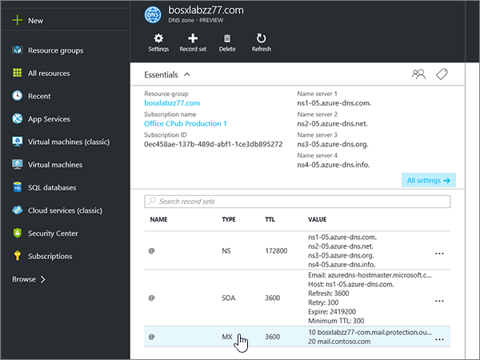
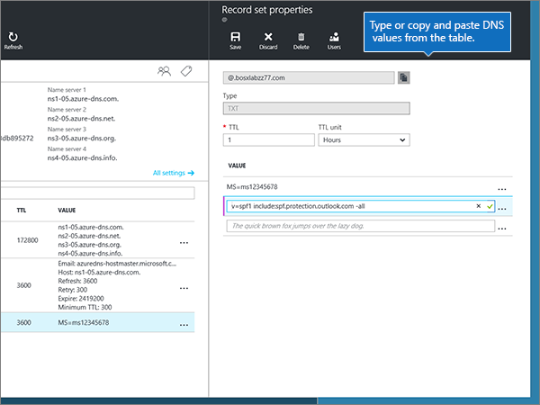
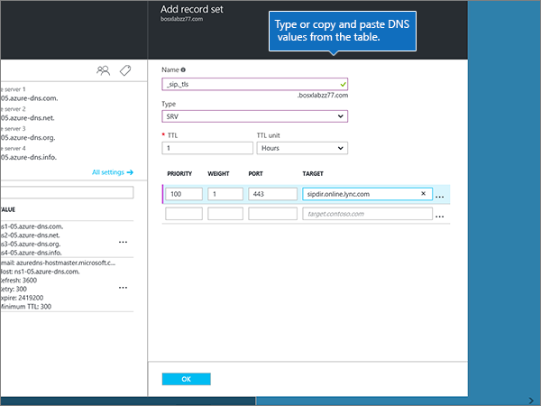

# Crear registros DNS para zonas DNS de AzureCreate DNS records for Azure DNS zones

 **[Consulte Preguntas más frecuentes acerca de los dominios](../setup/domains-faq.yml)** si no encuentra lo que busca.**[Check the Domains FAQ](../setup/domains-faq.yml)** if you don't find what you're looking for. 
  
Si Azure es su proveedor de host DNS, siga los pasos de este artículo para comprobar su dominio y configurar los registros DNS para el correo electrónico, Skype empresarial online, etc.If Azure is your DNS hosting provider, follow the steps in this article to verify your domain and set up DNS records for email, Skype for Business Online, and so on.
  
Estos son los registros principales que es necesario agregar.These are the main records to add. 
  
- [Cambiar los registros del servidor de nombres (o NS) de su dominioChange your domain's nameserver (NS) records](#change-your-domains-nameserver-ns-records)
    
- [Agregar un registro TXT para verificaciónAdd a TXT record for verification](#add-a-txt-record-for-verification)

- [Agregar un registro MX para que el correo electrónico del dominio vaya a MicrosoftAdd an MX record so email for your domain will come to Microsoft](#add-an-mx-record-so-email-for-your-domain-will-come-to-microsoft)
    
- [Agregar los cuatro registros CNAME necesarios para MicrosoftAdd the four CNAME records that are required for Microsoft](#add-the-four-cname-records-that-are-required-for-microsoft)
    
- [Agregar un registro TXT para SPF para ayudar a evitar el correo no deseadoAdd a TXT record for SPF to help prevent email spam](#add-a-txt-record-for-spf-to-help-prevent-email-spam)
    
- [Agregar los dos registros SRV necesarios para MicrosoftAdd the two SRV records that are required for Microsoft](#add-the-two-srv-records-that-are-required-for-microsoft)
    
Después de agregar estos registros a Azure, el dominio estará configurado para funcionar con los servicios de Microsoft.After you add these records at Azure, your domain will be set up to work with Microsoft services.
  
> [!NOTE]
> Por lo general, los cambios de DNS tardan unos 15 minutos en aplicarse. Sin embargo, a veces los cambios pueden necesitar más tiempo para aplicarse en todo el sistema DNS de Internet. Si tiene problemas con el flujo de correo u otros problemas después de agregar registros DNS, consulte [Solucionar problemas después de cambiar el nombre del dominio o los registros DNS](../get-help-with-domains/find-and-fix-issues.md).Typically it takes about 15 minutes for DNS changes to take effect. However, it can occasionally take longer for a change you've made to update across the Internet's DNS system. If you're having trouble with mail flow or other issues after adding DNS records, see [Troubleshoot issues after changing your domain name or DNS records](../get-help-with-domains/find-and-fix-issues.md). 
  
## Cambiar los registros del servidor de nombres (o NS) de su dominioChange your domain's nameserver (NS) records

> [!IMPORTANT]
> Debe realizar este procedimiento en el registrador de dominios en el que compró y registró su dominio.You must perform this procedure at the domain registrar where you purchased and registered your domain. 
  
Al registrarse en Azure, ha creado un grupo de recursos dentro de una zona DNS y, a continuación, ha asignado el nombre de dominio a ese grupo de recursos.When you signed up for Azure, you created a resource group within a DNS zone, and then assigned your domain name to that resource group. Ese nombre de dominio está registrado en un registrador de dominios externo; Azure no ofrece servicios de registro de dominios.That domain name is registered to an external domain registrar; Azure does not offer domain registration services.
  
Para comprobar y crear registros DNS para su dominio en Microsoft, primero debe cambiar los servidores de nombres en el registrador de dominios para que usen los servidores de nombres de Azure asignados a su grupo de recursos.To verify and create DNS records for your domain in Microsoft, you first need to change the nameservers at your domain registrar so that they use the Azure nameservers assigned to your resource group.
  
Para cambiar los servidores DNS del dominio en el sitio web del registrador de dominios usted mismo, haga lo siguiente:To change your domain's name servers at your domain registrar's website yourself, follow these steps.
  
1. En el sitio web del registrador de dominios, busque el área donde poder modificar los servidores DNS del dominio.Find the area on the domain registrar's website where you can edit the nameservers for your domain.
    
2. Cree dos registros de servidor de nombres mediante los valores de la tabla siguiente o edite los registros de servidor de nombres existentes para que cumplan estos valores.Either create two nameserver records by using the values in the following table, or edit the existing nameserver records so that they match these values. A continuación se muestra un ejemplo de los servidores de nombres asignados de Azure.An example of Azure assigned nameservers is shown below.
    

**Primer servidor de nombres:** Use el valor de servidor de nombres asignado por Azure.**First nameserver:** Use the name server value assigned by Azure.  
**Segundo servidor de nombres:** Use el valor de servidor de nombres asignado por Azure.**Second nameserver:** Use the name server value assigned by Azure.  

  
> [!TIP]
> You should use at least two name server records.You should use at least two name server records. Si hay otros servidores de nombres enumerados en el sitio web del registrador de dominios, debe eliminarlos.If there are any other name servers listed at your domain registrar's website, you should delete them. 
  
3. Guarde los cambios.Save your changes.
    
> [!NOTE]
> Your nameserver record updates may take up to several hours to update across the Internet's DNS system.Your nameserver record updates may take up to several hours to update across the Internet's DNS system. El correo electrónico y otros servicios de Microsoft estarán todos establecidos para funcionar con su dominio.Then your Microsoft email and other services will be all set to work with your domain. 
  
## Agregar un registro TXT para verificaciónAdd a TXT record for verification

Antes de utilizar el dominio con Microsoft, tenemos que asegurarnos de que sea el propietario. Si puede iniciar sesión en la cuenta en el registrador de dominio y crear el registro DNS, Microsoft sabrá que es el propietario del dominio.Before you use your domain with Microsoft, we have to make sure that you own it. Your ability to log in to your account at your domain registrar and create the DNS record proves to Microsoft that you own the domain.
  
> [!NOTE]
> Este registro se usa exclusivamente para verificar si se es el propietario de un dominio; no afecta a nada más. Puede eliminarlo más adelante, si lo desea.This record is used only to verify that you own your domain; it doesn't affect anything else. You can delete it later, if you like. 
  
1. Para empezar, vaya a su página de dominios en Azure con [este vínculo](https://portal.azure.com ).To get started, go to your domains page at Azure by using [this link](https://portal.azure.com ). Se le pedirá que inicie sesión primero .You'll be prompted to log in first.
    
    
  
2. En la **barra de búsqueda** de la página **Panel** , escriba en **zonas DNS**.Using the **search bar** on the **Dashboard** page, type in **DNS zones**. En la pantalla de resultados, seleccione **zonas DNS** en la parte **servicios** .In the results display, select **DNS zones** under the **Services** portion. Una vez que se haya Redirigido, seleccione el dominio que desea actualizar.Once you've been redirected, select the domain that you want to update.
    
    
  
3. En la página de **configuración** de su dominio, en el área **zona DNS** , seleccione **+ conjunto de registros**.On the **Settings** page for your domain, in the **DNS zone** area, select **+ Record set**.
    
    
  
4. En el área **Agregar conjunto de registros** , en los cuadros para el nuevo conjunto de registros, seleccione los valores de la tabla siguiente.In the **Add record set** area, in the boxes for the new record set, select the values from the following table. 
    
    (Elija los valores **tipo** y TTL de la **unidad** de la lista desplegable).(Choose the **Type** and **TTL unit** values from the drop-down lists.) 
    
    |**Nombre****Name**|**Tipo****Type**|**TTL****TTL**|**Unidad TTL****TTL unit**|**Valor****Value**|
    |:-----|:-----|:-----|:-----|:-----|
    |@    |TXTTXT    |1 1    |HorasHours    |MS=ms *XXXXXXXX*MS=ms *XXXXXXXX*    **Nota:** esto es un ejemplo.**Note:** This is an example. Utilice aquí su valor de **Dirección de destino**, desde la tabla.Use your specific **Destination or Points to Address** value here, from the table.           [¿Cómo puedo encontrar esto?How do I find this?](../get-help-with-domains/information-for-dns-records.md)          |
   
    
  
5. Seleccione **Aceptar**.Select **OK**.
  
6. Espere unos minutos antes de continuar para que el registro que acaba de crear pueda actualizarse en Internet.Wait a few minutes before you continue, so that the record you just created can update across the Internet.
    
Ahora que ha agregado el registro en el sitio de su registrador de dominios, deberá volver a Microsoft y solicitar el registro.Now that you've added the record at your domain registrar's site, you'll go back to Microsoft and request the record.
  
Cuando Microsoft encuentre el registro TXT correcto, se comprobará su dominio.When Microsoft finds the correct TXT record, your domain is verified.
  
1. En el centro de administración, diríjase a la página **configuración** \> <a href="https://go.microsoft.com/fwlink/p/?linkid=834818" target="_blank">dominios</a>.In the admin center, go to the **Settings** \> <a href="https://go.microsoft.com/fwlink/p/?linkid=834818" target="_blank">Domains</a> page.
    
2. En la página **Dominios**, elija el dominio que está verificando.On the **Domains** page, select the domain that you are verifying. 
    
    
  
3. En la página de **Configuración**, elija **Iniciar configuración**.On the **Setup** page, select **Start setup**.
    
    
  
4. En la página **verificar dominio**, seleccione **verificar**.On the **Verify domain** page, select **Verify**.
    
    
  
> [!NOTE]
>  Por lo general, los cambios de DNS tardan unos 15 minutos en aplicarse. Sin embargo, a veces los cambios pueden necesitar más tiempo para aplicarse en todo el sistema DNS de Internet. Si tiene problemas con el flujo de correo u otros problemas después de agregar registros DNS, consulte [Solucionar problemas después de cambiar el nombre del dominio o los registros DNS](../get-help-with-domains/find-and-fix-issues.md).Typically it takes about 15 minutes for DNS changes to take effect. However, it can occasionally take longer for a change you've made to update across the Internet's DNS system. If you're having trouble with mail flow or other issues after adding DNS records, see [Troubleshoot issues after changing your domain name or DNS records](../get-help-with-domains/find-and-fix-issues.md). 
  
## Agregar un registro MX para que el correo electrónico del dominio vaya a MicrosoftAdd an MX record so email for your domain will come to Microsoft

1. Para empezar, vaya a su página de dominios en Azure con [este vínculo](https://portal.azure.com ).To get started, go to your domains page at Azure by using [this link](https://portal.azure.com ). Se le pedirá que inicie sesión primero .You'll be prompted to log in first.
    
    
  
2. En la página **Panel** , en el área **todos los recursos** , seleccione el dominio que desea actualizar.On the **Dashboard** page, in the **All resources** area, select the domain that you want to update. 
    
    
  
3. En la página de **configuración** de su dominio, en el área **zona DNS** , seleccione **+ conjunto de registros**.On the **Settings** page for your domain, in the **DNS zone** area, select **+ Record set**.
    
    
  
4. En el área **Agregar conjunto de registros** , en los cuadros para el nuevo conjunto de registros, seleccione los valores de la tabla siguiente.In the **Add record set** area, in the boxes for the new record set, select the values from the following table. 
    
    (Elija los valores **tipo** y TTL de la **unidad** de la lista desplegable).(Choose the **Type** and **TTL unit** values from the drop-down lists.) 
    
    |**Nombre****Name**|**Tipo****Type**|**TTL****TTL**|**Unidad TTL****TTL unit**|**Preferencia****Preference**|**Intercambio de correo****Mail Exchange**|
    |:-----|:-----|:-----|:-----|:-----|:-----|
    |@    |MXMX    |1 1    |HorasHours    |10 10    Para obtener más información sobre la prioridad, consulte [¿Qué es una prioridad de MX?](https://docs.microsoft.com/microsoft-365/admin/setup/domains-faq)For more information about priority, see [What is MX priority?](https://docs.microsoft.com/microsoft-365/admin/setup/domains-faq)   | *\<domain-key\>*  .mail.protection.outlook.com*\<domain-key\>*  .mail.protection.outlook.com    **Nota:** Obtén tu  *\<domain-key\>*  cuenta de Microsoft.**Note:** Get your  *\<domain-key\>*  from your Microsoft account.   [¿Cómo puedo encontrar esto?How do I find this?](../get-help-with-domains/information-for-dns-records.md)  
   
    
  
5. Seleccione **Aceptar**.Select **OK**.
    
    
  
6. Si hay otros registros MX enumerados en la sección **registros MX** , debe eliminarlos.If there are any other MX records listed in the **MX Records** section, you must delete them. 
    
    En primer lugar, en el área **zona DNS** , seleccione el **conjunto de registros MX**.First, in the **DNS zone** area, select the **MX Record set**.
    
    
  
    A continuación, seleccione el registro MX que desea eliminar.Next, select the MX record you want to delete.
    
    
  
7. Seleccione el **menú contextual (...)** y, a continuación, elija **quitar**.Select the **Context menu (…)**, and then choose **Remove**.
    
    
  
8. Seleccione **Guardar**.Select **Save**.
    
    
  
## Agregar los cuatro registros CNAME necesarios para MicrosoftAdd the four CNAME records that are required for Microsoft

1. Para empezar, vaya a su página de dominios en Azure con [este vínculo](https://portal.azure.com ).To get started, go to your domains page at Azure by using [this link](https://portal.azure.com ). Se le pedirá que inicie sesión primero .You'll be prompted to log in first.
    
    
  
2. En la página **Panel** , en el área **todos los recursos** , seleccione el dominio que desea actualizar.On the **Dashboard** page, in the **All resources** area, select the domain that you want to update. 
    
    
  
3. En la página de **configuración** de su dominio, en el área **zona DNS** , seleccione **+ conjunto de registros**.On the **Settings** page for your domain, in the **DNS zone** area, select **+ Record set**.
    
    
  
4. Agregue el primero de los cuatro registros CNAME.Add the first of the four CNAME records.
    
    En el área **Agregar conjunto de registros** , en los cuadros para el nuevo conjunto de registros, escriba o copie y pegue los valores de la primera fila en la tabla siguiente.In the **Add record set** area, in the boxes for the new record set, type or copy and paste the values from the first row in the following table. 
    
    (Elija los valores **tipo** y TTL de la **unidad** de la lista desplegable).(Choose the **Type** and **TTL unit** values from the drop-down lists.) 
    
    |**Nombre****Name**|**Tipo****Type**|**TTL****TTL**|**Unidad TTL****TTL unit**|**Alias****Alias**|
    |:-----|:-----|:-----|:-----|:-----|
    |autodiscoverautodiscover    |CNAMECNAME    |1 1    |HorasHours    |autodiscover.outlook.comautodiscover.outlook.com    |
    |sipsip    |CNAMECNAME    |1 1    |HorasHours    |sipdir.online.lync.comsipdir.online.lync.com    |
    |lyncdiscoverlyncdiscover    |CNAMECNAME    |1 1    |HorasHours    |webdir.online.lync.comwebdir.online.lync.com    |
    
   
    
  
5. Seleccione **Aceptar**.Select **OK**.
    
    
  
6. Agregue cada uno de los otros tres registros CNAME.Add each of the other three CNAME records.
    
    En el área **zona DNS** , seleccione **+ conjunto de registros**.In the **DNS zone** area, select **+ Record set**. A continuación, en el conjunto de registros vacío, cree un registro (para hacerlo, use los valores de la siguiente fila de la tabla y vuelva a seleccionar **Aceptar** para completar ese registro).Then, in the empty record set, create a record by using the values from the next row in the table, and again select **OK** to complete that record. 
    
    Repita este proceso hasta que haya creado los cuatro registros CNAME.Repeat this process until you have created all four CNAME records.
    
7.  Opcional Agregue 2 registros CNAME para MDM.(Optional) Add 2 CNAME records for MDM.

> [!IMPORTANT]
> Si tiene administración de dispositivos móviles (MDM) para Microsoft, debe crear dos registros CNAME adicionales.If you have Mobile Device Management (MDM) for Microsoft, then you must create two additional CNAME records. Siga el procedimiento que utilizó para los otros cuatro registros CNAME, pero suministre los valores de la siguiente tabla.Follow the procedure that you used for the other four CNAME records, but supply the values from the following table. (Si no tiene MDM, puede omitir este paso).(If you do not have MDM, you can skip this step.) 
  
|**Nombre****Name**|**Tipo****Type**|**TTL****TTL**|**Unidad TTL****TTL unit**|**Alias****Alias**|
|:-----|:-----|:-----|:-----|:-----|
|enterpriseregistrationenterpriseregistration    |CNAMECNAME    |1 1    |HorasHours    |enterpriseregistration.windows.netenterpriseregistration.windows.net    |
|enterpriseenrollmententerpriseenrollment    |CNAMECNAME    |1 1    |HorasHours    |enterpriseenrollment-s.manage.microsoft.comenterpriseenrollment-s.manage.microsoft.com    |
   
## Agregar un registro TXT para SPF para ayudar a evitar el correo no deseadoAdd a TXT record for SPF to help prevent email spam

> [!IMPORTANT]
> No puede tener más de un registro TXT para el SPF de un dominio.You cannot have more than one TXT record for SPF for a domain. Si su dominio tiene más de un registro de SPF, obtendrá errores de correo, así como problemas de clasificación de entrega y de correo no deseado.If your domain has more than one SPF record, you'll get email errors, as well as delivery and spam classification issues. Si ya tiene un registro de SPF para su dominio, no cree uno nuevo para Microsoft.If you already have an SPF record for your domain, don't create a new one for Microsoft. En su lugar, agregue los valores necesarios de Microsoft al registro activo para que tenga un  *único*  registro de SPF que incluya ambos conjuntos de valores.Instead, add the required Microsoft values to the current record so that you have a  *single*  SPF record that includes both sets of values. 
  
1. Para empezar, vaya a su página de dominios en Azure con [este vínculo](https://portal.azure.com ).To get started, go to your domains page at Azure by using [this link](https://portal.azure.com ). Se le pedirá que inicie sesión primero .You'll be prompted to log in first.
    
    
  
2. En la página **Panel** , en el área **todos los recursos** , seleccione el dominio que desea actualizar.On the **Dashboard** page, in the **All resources** area, select the domain that you want to update. 
    
    
  
3. En el área **zona DNS** , seleccione el **conjunto de registros txt**.In the **DNS zone** area, select the **TXT record set**.
    
    
  
4. En el área **propiedades del conjunto de registros** , en los cuadros para el nuevo conjunto de registros, seleccione los valores de la tabla siguiente.In the **Record set properties** area, in the boxes for the new record set, select the values from the following table. 
    
    (Elija los valores **tipo** y TTL de la **unidad** de la lista desplegable).(Choose the **Type** and **TTL unit** values from the drop-down lists.) 
    
    |**Nombre****Name**|**Tipo****Type**|**TTL****TTL**|**Unidad TTL****TTL unit**|**Valor****Value**|
    |:-----|:-----|:-----|:-----|:-----|
    |@    |TXTTXT    |1 1    |HorasHours    |v=spf1 include:spf.protection.outlook.com -allv=spf1 include:spf.protection.outlook.com -all    **Nota:** recomendamos copiar y pegar esta entrada, para que todo el espacio sea correcto.**Note:** We recommend copying and pasting this entry, so that all of the spacing stays correct.           

    
  
5. Seleccione **Guardar**.Select **Save**.
    
    
  
## Agregar los dos registros SRV necesarios para MicrosoftAdd the two SRV records that are required for Microsoft

1. Para empezar, vaya a su página de dominios en Azure con [este vínculo](https://portal.azure.com ).To get started, go to your domains page at Azure by using [this link](https://portal.azure.com ). Se le pedirá que inicie sesión primero .You'll be prompted to log in first.
    
    
  
2. En la página **Panel** , en el área **todos los recursos** , seleccione el dominio que desea actualizar.On the **Dashboard** page, in the **All resources** area, select the domain that you want to update. 
    
    
  
3. En la página de **configuración** de su dominio, en el área **zona DNS** , seleccione **+ conjunto de registros**.On the **Settings** page for your domain, in the **DNS zone** area, select **+ Record set**.
    
    
  
4. Agregue el primero de los dos registros SRV.Add the first of the two SRV records.
    
    En el área **Agregar conjunto de registros** , en los cuadros para el nuevo conjunto de registros, seleccione los valores de la primera fila en la tabla siguiente.In the **Add record set** area, in the boxes for the new record set, select the values from the first row in the following table. 
    
    (Elija los valores **tipo** y TTL de la **unidad** de la lista desplegable).(Choose the **Type** and **TTL unit** values from the drop-down lists.) 
    
    |**Nombre****Name**|**Tipo****Type**|**TTL****TTL**|**Unidad TTL****TTL unit**|**Prioridad****Priority**|**Grosor****Weight**|**Puerto****Port**|**Destino****Target**|
    |:-----|:-----|:-----|:-----|:-----|:-----|:-----|:-----|
    |_sip._tls_sip._tls    |SRVSRV    |1 1    |HorasHours    |100100    |1 1    |443443    |sipdir.online.lync.comsipdir.online.lync.com    |
    |_sipfederationtls._tcp_sipfederationtls._tcp    |SRVSRV    |1 1    |HorasHours    |100100    |1 1    |50615061    |sipfed.online.lync.comsipfed.online.lync.com    

    
  
5. Seleccione **Aceptar**.Select **OK**.
    
    
  
6. Agregue el otro registro SRV.Add the other SRV record.
    
    En los cuadros para el nuevo registro, escriba (o copie y pegue) los valores de la segunda fila de la tabla.In the boxes for the new record, type or copy and paste the values from the second row of the table.
    
> [!NOTE]
> Por lo general, los cambios de DNS tardan unos 15 minutos en aplicarse. Sin embargo, a veces los cambios pueden necesitar más tiempo para aplicarse en todo el sistema DNS de Internet. Si tiene problemas con el flujo de correo u otros problemas después de agregar registros DNS, consulte [Solucionar problemas después de cambiar el nombre del dominio o los registros DNS](../get-help-with-domains/find-and-fix-issues.md).Typically it takes about 15 minutes for DNS changes to take effect. However, it can occasionally take longer for a change you've made to update across the Internet's DNS system. If you're having trouble with mail flow or other issues after adding DNS records, see [Troubleshoot issues after changing your domain name or DNS records](../get-help-with-domains/find-and-fix-issues.md). 
  
