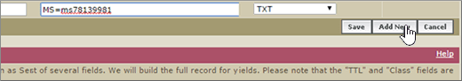

# Crear registros DNS cuando Google (eNom) administra su dominio

 **[Consulte Preguntas más frecuentes acerca de los dominios](../setup/domains-faq.md)** si no encuentra lo que busca. 
  
Para migrar las cuentas de correo a Microsoft, debe crear un registro DNS en el registrador de dominios.
  
Si compró el dominio a través de Google al registrarse para su cuenta **de Google Apps for work** , Google administra los registros DNS, pero se registra con eNom. 
  
Puede tener acceso a eNom y crear DNS a través de la Página Google **Domains** . Solo tiene que seguir los pasos de este artículo. 
  
## Crear el registro DNS

1. En la [consola de administración de Google](https://www.google.com/work/apps/business), seleccione **iniciar sesión**.
    
    
  
2. Escriba su nombre de dominio y, después, seleccione **ir**.
    
    
  
3. En la parte inferior de la página, seleccione **más controles**.
    
    
  
4. Seleccione **Dominios**.
    
    
  
5. En la página **dominios** , seleccione **Agregar o quitar dominios**.
    
    
  
6. En la página **dominios** , seleccione **Configuración avanzada de DNS**.
    
    > [!NOTE]
    > Si no ha comprado un nombre de dominio a través de Google al registrar su cuenta de **Google Apps for Work**, no tendrá **configuración avanzada de DNS** en su página **Dominios**. En su lugar, debe ir directamente al sitio web de su host de su dominio para acceder a la configuración de DNS y para realizar este paso y los siguientes. Consulte [tener acceso a la configuración del dominio de G Suite](https://support.google.com/a/answer/54693?hl=en) para obtener más información. 
  
    
  
7. En la página **Configuración avanzada de DNS** , seleccione **iniciar sesión en la consola DNS**. Anote la información del **nombre de inicio de sesión** y la **contraseña**. La necesitará en el siguiente paso. 
    
    
  
8. Inicie sesión en el **Administrador de dominios** de Google con el **nombre de inicio de sesión** y la **contraseña** de la página **Configuración avanzada de DNS**. 
    
    
  
9. En la página ***domain_name*** , en la sección **registros de host** , seleccione **Editar**.
    
    
  
10. En la sección **registros de host** , seleccione **Agregar nuevo**.
    
    
  
11. En los cuadros para el nuevo registro, escriba o copie y pegue los valores de la tabla siguiente.
    
    |**HOST**|**TXT VALUE**|**TIPO DE REGISTRO**|
    |:-----|:-----|:-----|
    |@    ||TXT    |

    > [!NOTE]
    > This is an example. Utilice aquí su valor de **Dirección de destino**, desde la tabla. 
  
    [¿Cómo puedo encontrar esto?](../get-help-with-domains/information-for-dns-records.md)
  
12. Haga clic en **Guardar**.
    
    
  
13. Seleccione **Guardar cambios**.
    
    
  
> [!NOTE]
>  Por lo general, los cambios de DNS tardan unos 15 minutos en aplicarse. Sin embargo, a veces los cambios pueden necesitar más tiempo para aplicarse en todo el sistema DNS de Internet. Si tiene problemas con el flujo de correo u otros problemas después de agregar registros DNS, consulte [Solucionar problemas después de cambiar el nombre del dominio o los registros DNS](../get-help-with-domains/find-and-fix-issues.md). 
  
