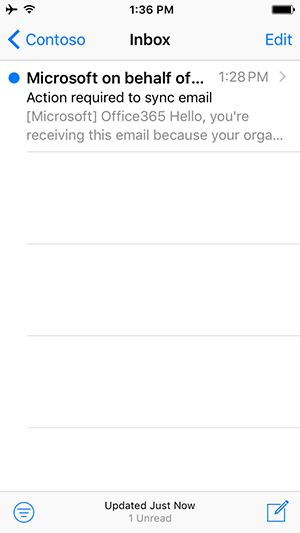

# Opciones para acceder al correo electrónico desde el dispositivo móvil

Su organización configura opciones que controlan qué aplicaciones móviles puede usar para acceder a su cuenta profesional por correo electrónico, calendario y contactos.

Las aplicaciones móviles de Outlook para Android y Outlook para iOS están diseñadas para su correo electrónico profesional o educativo. Estas aplicaciones proporcionan características como la [Bandeja de entrada centrada](https://support.microsoft.com/office/f445ad7f-02f4-4294-a82e-71d8964e3978), que mantiene correos electrónicos importantes delante y en el centro, y [asistente de programación](https://support.microsoft.com/office/scheduling-made-easy-in-outlook-mobile-11c5bee5-d78a-4a2b-80c2-2b386ddb4470), que le ayuda a encontrar horarios de reuniones que funcionan con compañeros y simplemente encuentra salas de conferencias disponibles.
  
## Experiencia del usuario final

### Solo Outlook

Su organización requiere que use las aplicaciones móviles de Outlook para Android o Outlook para iOS para acceder al correo electrónico, el calendario y los contactos de la empresa. Los datos comenzarán a sincronizarse una vez que descargue e instale Outlook para Android o Outlook para iOS.

Consulte [Optimizar la aplicación móvil de Outlook para su teléfono iOS o Android](https://support.microsoft.com/office/de075b19-b73c-4d8a-841b-459982c7e890) para obtener más características de Outlook. Y vaya al [Centro de ayuda de Outlook para iOS y Android](https://support.microsoft.com/office/cd84214e-a5ac-4e95-9ea3-e07f78d0cde6) si tiene algún problema.

### Cualquier aplicación de correo electrónico

Su organización recomienda usar la aplicación móvil de Outlook para Android o iOS para acceder a su cuenta profesional o educativa para el correo electrónico, el calendario y los contactos. Si no realiza ninguna acción en las próximas horas, el correo electrónico comenzará automáticamente a sincronizarse. Si decide usar la aplicación móvil de Outlook para Android o iOS, los datos solo se sincronizarán con la aplicación móvil Outlook para Android o Outlook para iOS. Si decide seguir usando la aplicación de terceros, los datos comenzarán a sincronizarse al instante.