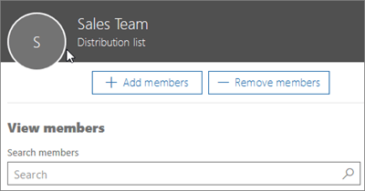

# Agregar un usuario o un contacto a un grupo de distribución de Microsoft 365

Como administrador de una organización, es posible que tenga que agregar uno de los usuarios o contactos a un grupo de distribución (consulte [Creación de grupos de distribución en Microsoft 365](../setup/create-distribution-lists.md). Por ejemplo, puede agregar empleados o asociados externos o proveedores a un grupo de distribución de correo electrónico.
  
## Adición de un usuario o contacto a un grupo de distribución

1. En el centro de administración, vaya a la página **Grupos de grupos**\>.

2. En la página **Grupos** , seleccione el nombre del grupo al que desea agregar un contacto.

3. En la pestaña **Miembros** , seleccione **Ver todos y administrar miembros**.

4. En la página **Ver miembros** , seleccione **Agregar miembros** y seleccione el usuario o contacto que desea agregar al grupo de distribución. 
    
    
  
5. Seleccione **Guardar** y, a continuación, **Cerrar**.

## Inspección: Adición de un usuario a una lista de distribución
  
> [!VIDEO https://www.microsoft.com/videoplayer/embed/ed4e6095-9a6a-4d3d-999d-698c39bb7ec8?autoplay=false]
  
## Próximos pasos

Aprenda a [enviar correo electrónico como grupo de distribución en Microsoft 365](../manage/send-email-as-distribution-list.md).

## Contenido relacionado

[Administrar el desorden de la organización](configure-clutter.md) (artículo)\
[Crear un buzón compartido](create-a-shared-mailbox.md) (artículo)

