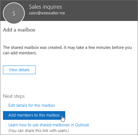

# Creación de un buzón compartidoCreate a shared mailbox 

> [!NOTE]
> Si su organización usa un entorno híbrido de Exchange, debe usar el Centro de administración de Exchange (EAC) local para crear y administrar buzones compartidos.If your organization uses a hybrid Exchange environment, you should use the on-premises Exchange admin center (EAC) to create and manage shared mailboxes. Consulte [Crear buzones compartidos en el centro de administración de Exchange](/Exchange/collaboration/shared-mailboxes/create-shared-mailboxes?preserve-view=true.&view=exchserver-2019)See [Create shared mailboxes in the Exchange admin center](/Exchange/collaboration/shared-mailboxes/create-shared-mailboxes?preserve-view=true.&view=exchserver-2019)  
> Si no está seguro de si debería crear un buzón compartido o un grupo de Microsoft 365 para Outlook, vea [Comparar grupos](../create-groups/compare-groups.md) para tener más clara su decisión.If you're not sure if you should create a shared mailbox or a Microsoft 365 group for Outlook, see [Compare groups](../create-groups/compare-groups.md) for some guidance. Tenga en cuenta que no es posible migrar un buzón compartido a un grupo de Microsoft 365 en este momento.Note that currently, it's not possible to migrate a shared mailbox to a Microsoft 365 group. Si esto le interesaría, indíquelo [votando aquí](https://go.microsoft.com/fwlink/?linkid=871518).If this is something you want, let us know by [voting here](https://go.microsoft.com/fwlink/?linkid=871518).

Es fácil crear buzones compartidos de Office 365 para que un grupo de personas pueda supervisar y enviar correos electrónicos desde una dirección de correo electrónico común, como, por ejemplo, info@contoso.com. Cuando un miembro del grupo responde a un mensaje enviado al buzón compartido, parece que el correo electrónico procede del buzón compartido y no de un usuario individual.It's easy to create shared mailboxes so a group of people can monitor and send email from a common email addresses, like info@contoso.com. When a person in the group replies to a message sent to the shared mailbox, the email appears to be from the shared mailbox, not from the individual user.

Los buzones compartidos incluyen un calendario compartido. A una gran cantidad de pequeñas empresas le gusta usar el calendario compartido como un lugar en el que todos los usuarios pueden insertar sus citas. Por ejemplo, si tiene 3 personas que realizan visitas a clientes, todas ellas pueden usar el calendario compartido para insertar las citas. Esta es una forma sencilla de mantener a todos informados.Shared mailboxes include a shared calendar. A lot of small businesses like to use the shared calendar as a place for everyone to enter their appointments. For example, if you have 3 people who do customer visits, all can use the shared calendar to enter the appointments. This is an easy way to keep everyone informed where people are.

Antes de crear un buzón compartido, asegúrese de leer [acerca de los buzones compartidos](about-shared-mailboxes.md) para obtener más información.Before creating a shared mailbox, be sure to read [About shared mailboxes](about-shared-mailboxes.md) for more information.

## Crear un buzón compartido y agregar miembrosCreate a shared mailbox and add members
  
1. Inicie sesión con una cuenta de administrador global o una cuenta de administrador de Exchange.Sign in with a global admin account or Exchange admin account. Si recibe el mensaje "**No tiene permiso para acceder a esta página o realizar esta acción**" quiere decir que no es administrador.If you get the message "**You don't have permission to access this page or perform this action**," then you aren't an admin. 

::: moniker range="o365-worldwide"

2. En el centro de administración, vaya a la página **Grupos** \> <a href="https://go.microsoft.com/fwlink/p/?linkid=2066847" target="_blank">Buzones compartidos</a>.In the admin center, go to the **Groups** \> <a href="https://go.microsoft.com/fwlink/p/?linkid=2066847" target="_blank">Shared mailboxes</a> page.

::: moniker-end

::: moniker range="o365-germany"

2. En el [centro de administración](https://go.microsoft.com/fwlink/p/?linkid=848041), vaya a la página **Grupos** \> **Buzones compartidos**.In the [admin center](https://go.microsoft.com/fwlink/p/?linkid=848041), go to the **Groups** \> **Shared mailboxes** page.

::: moniker-end

::: moniker range="o365-21vianet"

2. En el [centro de administración](https://go.microsoft.com/fwlink/p/?linkid=850627), vaya a la página **Grupos** \> **Buzones compartidos**.In the [admin center](https://go.microsoft.com/fwlink/p/?linkid=850627), go to the **Groups** \> **Shared mailboxes** page.

::: moniker-end
    
3. En la página **buzones compartidos**, seleccione **+ agregar un buzón**.On the **Shared mailboxes** page, select **+ Add a mailbox**. Escriba un nombre para el buzón compartido.Enter a name for the shared mailbox. A continuación, el asistente elige una dirección de correo electrónico, pero puede editarla.Then the wizard chooses the email address, but you can edit it.
    
    
  
4. Seleccione **Agregar**.Select **Add**. Puede tardar unos minutos antes de poder agregar miembros.It may take a few minutes before you can add members.

5. En **Pasos siguientes**, elija **Agregar miembros a este buzón**.Under **Next steps**, select **Add members to this mailbox**. Los miembros son las personas que podrán ver el correo entrante para este buzón de correo compartido y las respuestas salientes.Members are the people who will be able to view the incoming mail to this shared mailbox, and the outgoing replies.

   

6. Elija el botón **+ Agregar miembros**.Select the **+Add members** button. Coloque una marca de verificación junto a las personas que desea que usen este buzón de correo compartido y seleccione **Guardar**.Put a check mark next to the people who you want to use this shared mailbox, and select **Save**.

   

7. Seleccione **Cerrar**.Select **Close**.

Tiene un buzón compartido que incluye un calendario compartido.You have a shared mailbox and it includes a shared calendar. Ahora, vaya al siguiente paso: bloquear el inicio para la cuenta de buzón compartido.Now go on to the next step: block sign-in for the shared mailbox account.

## ¿Qué permisos debe usar?Which permissions should you use?

Puede usar los siguientes permisos con un buzón compartido:You can use the following permissions with a shared mailbox:

- **Acceso completo**: el permiso Acceso completo permite al usuario iniciar sesión en el buzón compartido y actuar como el propietario de ese buzón.**Full Access**: The Full Access permission lets a user open the shared mailbox and act as the owner of that mailbox. Después de acceder al buzón compartido, un usuario puede crear elementos de calendario, leer, ver, eliminar y cambiar los mensajes de correo electrónico, y crear tareas y contactos de calendario.After accessing the shared mailbox, a user can create calendar items, read, view, delete, and change email messages, and create tasks and calendar contacts. Sin embargo, un usuario con un permiso de Acceso total no puede enviar mensajes de correo electrónico desde el buzón compartido a menos que tenga un permiso para Enviar como o En nombre de.However, a user with Full Access permission can't send email from the shared mailbox unless they also have Send As or Send on Behalf permission.

- **Enviar como**: el permiso para Enviar como le permite al usuario suplantar el buzón compartido al enviar un mensaje de correo.**Send As**: The Send As permission lets a user impersonate the shared mailbox when sending mail. Por ejemplo, si Carlos inicia sesión en el buzón compartido del departamento de marketing y envía un correo electrónico, el remitente de dicho correo será el departamento de marketing.For example, if Katerina logs into the shared mailbox Marketing Department and sends an email, it will look like the Marketing Department sent the email.

- **Enviar en nombre de**: el permiso Enviar en nombre de le permite al usuario enviar mensajes en nombre del buzón compartido.**Send on Behalf**: The Send on Behalf permission lets a user send email on behalf of the shared mailbox. Por ejemplo, si Sergio inicia sesión en el buzón compartido del Edificio de recepción 32 y envía un mensaje de correo electrónico, los destinatarios verán el mensaje como enviado por “Sergio en nombre del Edificio de recepción 32”.For example, if John logs into the shared mailbox Reception Building 32 and sends an email, it will look like the mail was sent by "John on behalf of Reception Building 32". No puede usar el CEF para conceder permisos de Enviar en nombre de. En este caso, debe utilizar el cmdlet **Set-Mailbox** con el parámetro _GrantSendonBehalf_.You can't use the EAC to grant Send on Behalf permissions, you must use the **Set-Mailbox** cmdlet with the _GrantSendonBehalf_ parameter.

### Usar el EAC para editar la delegación de buzones compartidosUse the EAC to edit shared mailbox delegation

1. En el EAC, vaya a **Destinatarios** \> **Compartidos**.In the EAC, go to **Recipients** \> **Shared**. Seleccione el buzón de correo compartido y, después, **Editar** Select the shared mailbox, and then select **Edit** .

2. Seleccione **Delegación de buzón**.Select **Mailbox delegation**.

3. Para conceder o quitar los permisos de Acceso total y Enviar como, seleccione **Agregar**  o **Quitar**  y seleccione los usuarios a los que quiera conceder los permisos.To grant or remove Full Access and Send As permissions, select **Add**  or **Remove**  and then select the users you want to grant permissions to.

   > [!NOTE]
   > El permiso de Acceso completo permite a los usuarios abrir el buzón, así como crear y modificar sus elementos. El permiso Enviar como permite a cualquiera que no sea el propietario del buzón enviar correo electrónico desde este buzón compartido. Ambos permisos son necesarios para que el buzón compartido funcione correctamente.The Full Access permission allows a user to open the mailbox as well as create and modify items in it. The Send As permission allows anyone other than the mailbox owner to send email from this shared mailbox. Both permissions are required for successful shared mailbox operation.

4. Seleccione **Guardar** para guardar los cambios.Select **Save** to save your changes.

## Bloquear el inicio de sesión de la cuenta de buzón compartidoBlock sign-in for the shared mailbox account

Cada buzón compartido tiene una cuenta de usuario correspondiente.Every shared mailbox has a corresponding user account. ¿Ha notado que no se le pidió que proporcionase una contraseña cuando creó el buzón de correo compartido?Notice how you weren't asked to provide a password when you created the shared mailbox? La cuenta tiene una contraseña, pero se ha generado por el sistema (desconocida).The account has a password, but it's system-generated (unknown). No debería usar la cuenta para iniciar sesión en el buzón compartido.You aren't supposed to use the account to log in to the shared mailbox.

Pero, ¿qué sucede si un administrador simplemente restablece la contraseña de la cuenta de usuario del buzón compartido?But what if an admin simply resets the password of the shared mailbox user account? ¿O si un atacante obtiene acceso a las credenciales de cuenta de buzón compartido?Or what if an attacker gains access to the shared mailbox account credentials? Esto permitiría a la cuenta de usuario iniciar sesión en el buzón compartido y enviar correo electrónico.This would allow the user account to log in to the shared mailbox and send email. Para evitar esto, tiene que bloquear el inicio de sesión de la cuenta que está asociada con el buzón compartido.To prevent this, you need to block sign-in for the account that's associated with the shared mailbox.

::: moniker range="o365-worldwide"

1. En el centro de administración, vaya a la página **Usuarios** \> <a href="https://go.microsoft.com/fwlink/p/?linkid=834822" target="_blank">Usuarios activos</a>.In the admin center, go to the **Users** \> <a href="https://go.microsoft.com/fwlink/p/?linkid=834822" target="_blank">Active users</a> page.

::: moniker-end

::: moniker range="o365-germany"

1. En el centro de administración, vaya a la página **Usuarios** \> <a href="https://go.microsoft.com/fwlink/p/?linkid=847686" target="_blank">Usuarios activos</a>.In the admin center, go to the **Users** \> <a href="https://go.microsoft.com/fwlink/p/?linkid=847686" target="_blank">Active users</a> page.

::: moniker-end

::: moniker range="o365-21vianet"

1. En el centro de administración, vaya a la página **Usuarios** \> <a href="https://go.microsoft.com/fwlink/p/?linkid=850628" target="_blank">Usuarios activos</a>.In the admin center, go to the **Users** \> <a href="https://go.microsoft.com/fwlink/p/?linkid=850628" target="_blank">Active users</a> page.
::: moniker-end

1. En la lista de cuentas de usuario, busque la cuenta para el buzón de correo compartido (por ejemplo, cambie el filtro a **usuarios sin licencia**).In the list of user accounts, find the account for the shared mailbox (for example, change the filter to **Unlicensed users**).

1. Seleccione el usuario para abrir su panel de propiedades y seleccione el icono **bloquear este usuario** .Select the user to open their properties pane, and then select the **Block this user** icon .

   **Nota**: Si la cuenta ya está bloqueada, se mostrará **inicio de sesión bloqueado** en la parte superior y el icono indicará **desbloquear este usuario**.**Note**: If the account is already blocked, **Sign in blocked** will appear at the top and the icon will read **Unblock this user**.

1. En el panel **¿bloquear este usuario?**, seleccione **impedir que los usuarios inicien sesión** y seleccione **guardar cambios**.In the **Block this user?** pane, select **Block the user from signing in**, and then select **Save changes**.

Para obtener instrucciones sobre cómo bloquear el inicio de sesión para cuentas con el PowerShell de Azure AD (incluyendo varias cuentas al mismo tiempo), consulte [Bloquear cuentas de usuario con PowerShell de Office 365](../../enterprise/block-user-accounts-with-microsoft-365-powershell.md).For instructions on how to block sign-in for accounts using Azure AD PowerShell (including many accounts at the same time), see [Block user accounts with Office 365 PowerShell](../../enterprise/block-user-accounts-with-microsoft-365-powershell.md).

## Agregar el buzón compartido en OutlookAdd the shared mailbox to Outlook

Si la asignación automática está habilitada en su empresa, como en la mayoría de los casos, el buzón compartido aparecerá automáticamente en la aplicación de Outlook de los usuarios tras cerrar y volver a abrir la aplicación.If you have automapping enabled in your business (by default, most people do), the shared mailbox will appear in your user's Outlook app automatically after they close and restart Outlook. 

La asignación automática se establece en el buzón del usuario, no en el buzón compartido.  Automapping is set on the user's mailbox, not the shared mailbox. Significa que si intenta usar un grupo de seguridad para administrar quién tiene acceso al buzón compartido, la asignación automática no funcionará.This means if you try to use a security group to manage who has access to the shared mailbox, automapping won't work. Por lo tanto, si desea utilizar la asignación automática, debe asignar permisos de forma explícita.So, if you want automapping, you have to assign permissions explicitly. La asignación automática está activada de forma predeterminada.Automapping is on by default. Para obtener información sobre cómo desactivarlo, consulte [eliminar asignación automática para un buzón compartido](/office365/troubleshoot/administration/remove-automapping-for-shared-mailbox).To learn how to turn it off, see [Remove automapping for a shared mailbox](/office365/troubleshoot/administration/remove-automapping-for-shared-mailbox).

Para obtener más información sobre los buzones compartidos en Outlook, consulte:To learn more about shared mailboxes in Outlook, see:

- <a href="https://support.microsoft.com/office/d94a8e9e-21f1-4240-808b-de9c9c088afd" target="_blank">Abrir y usar un buzón compartido en Outlook</a><a href="https://support.microsoft.com/office/d94a8e9e-21f1-4240-808b-de9c9c088afd" target="_blank">Open and use a shared mailbox in Outlook</a>

- <a href="https://support.microsoft.com/office/98b5a90d-4e38-415d-a030-f09a4cd28207" target="_blank">Agregar un buzón compartido a Outlook en la Web</a><a href="https://support.microsoft.com/office/98b5a90d-4e38-415d-a030-f09a4cd28207" target="_blank">Add a shared mailbox to Outlook on the web</a>

- <a href="https://support.microsoft.com/office/f866242c-81b2-472e-8776-6c49c5473c9f" target="_blank">Agregue un buzón compartido en Outlook Mobile</a><a href="https://support.microsoft.com/office/f866242c-81b2-472e-8776-6c49c5473c9f" target="_blank">Add a shared mailbox to Outlook mobile</a>

- <a href="https://support.microsoft.com/office/6ecc39c5-5577-4a1d-b18c-bbdc92972cb2" target="_blank">Abrir una carpeta o un buzón compartido en Outlook para Mac</a><a href="https://support.microsoft.com/office/6ecc39c5-5577-4a1d-b18c-bbdc92972cb2" target="_blank">Open a shared folder or mailbox in Outlook for Mac</a>

- <a href="https://support.microsoft.com/office/b0963400-2a51-4c64-afc7-b816d737d164" target="_blank">Agregar reglas a un buzón compartido</a><a href="https://support.microsoft.com/office/b0963400-2a51-4c64-afc7-b816d737d164" target="_blank">Add rules to a shared mailbox</a>

## Usar un buzón compartido en un dispositivo móvil (teléfono o tableta)Use a shared mailbox on a mobile device (phone or tablet)

Puede obtener acceso a un buzón compartido en un dispositivo móvil de dos maneras:You can access a shared mailbox on a mobile device in two ways:
- Agregue el buzón de correo compartido en la <a href="https://apps.apple.com/us/app/microsoft-outlook/id951937596" target="_blank">aplicación de Outlook para iOS</a> o en la <a href="https://play.google.com/store/apps/details?id=com.microsoft.office.outlook&hl=en_US" target="_blank">aplicación móvil de Outlook para Android</a>.Add the shared mailbox in the <a href="https://apps.apple.com/us/app/microsoft-outlook/id951937596" target="_blank">Outlook for iOS app</a> or the <a href="https://play.google.com/store/apps/details?id=com.microsoft.office.outlook&hl=en_US" target="_blank">Outlook for Android mobile app</a>. 
    
    Para obtener instrucciones, vea <a href="https://support.microsoft.com/office/f866242c-81b2-472e-8776-6c49c5473c9f" target="_blank">Agregar un buzón compartido en Outlook para dispositivos móviles</a>.For instructions, see <a href="https://support.microsoft.com/office/f866242c-81b2-472e-8776-6c49c5473c9f" target="_blank">Add a shared mailbox to Outlook mobile</a>.

- Abra su navegador, inicie sesión y vaya a Outlook en la Web.Open your browser, sign in, and then go to Outlook on the web. Desde Outlook en la Web, podrá acceder al buzón compartido.From Outlook on the web you'll be able to access the shared mailbox.

    Para obtener instrucciones, vea <a href="https://support.microsoft.com/office/98b5a90d-4e38-415d-a030-f09a4cd28207" target="_blank">Agregar un buzón compartido en Outlook en la Web</a>.For instructions, see <a href="https://support.microsoft.com/office/98b5a90d-4e38-415d-a030-f09a4cd28207" target="_blank">Add a shared mailbox to Outlook on the web</a>.
    
> [!NOTE]
> El buzón compartido solo se puede agregar a la aplicación de Outlook para iOS o la aplicación móvil de Outlook para AndroidShared mailbox can only be added to Outlook for iOS app or the Outlook for Android mobile app

## Usar el calendario compartido.Use the shared calendar

Cuando creó el buzón compartido, creó automáticamente un calendario compartido.When you created the shared mailbox, you automatically created a shared calendar. Preferimos usar el calendario de buzón de correo compartido, en lugar de un calendario de SharePoint, para realizar el seguimiento de las citas y de la ubicación de los usuarios.We like the shared mailbox calendar rather than a SharePoint calendar for keeping track of appointments and where people are. Hay un calendario compartido integrado en Outlook y es mucho más fácil de crear y usar que un calendario de SharePoint.A shared calendar is integrated with Outlook and it's much easier to use than a SharePoint calendar.

1. En la aplicación de Outlook, vaya a la vista de calendario y seleccione el buzón compartido.In the Outlook app, go to calendar view, and select the shared mailbox.

2. Al introducir citas, todos los usuarios que son miembros del buzón de correo compartido podrán verlas.When you enter appointments, everyone who is a member of the shared mailbox will be able to see them.

3. Todos los miembros del buzón compartido pueden crear, ver y administrar citas en el calendario, igual que lo hacen con sus citas personales.Any member of the shared mailbox can create, view, and manage appointments on the calendar, just like they would their personal appointments. Todos los usuarios que sean miembros del buzón compartido pueden ver sus cambios en el calendario compartido.Everyone who is a member of shared mailbox can see their changes to the shared calendar.

## Contenido relacionadoRelated content

[Acerca de los buzones compartidos](about-shared-mailboxes.md) (artículo)[About shared mailboxes](about-shared-mailboxes.md) (article)\
[Configurar un buzón compartido](configure-a-shared-mailbox.md) (artículo)[Configure a shared mailbox](configure-a-shared-mailbox.md) (article)\
[Convertir un buzón de usuario en un buzón compartido](convert-user-mailbox-to-shared-mailbox.md) (artículo)[Convert a user mailbox to a shared mailbox](convert-user-mailbox-to-shared-mailbox.md) (article)\
[Quitar la licencia de un buzón compartido](remove-license-from-shared-mailbox.md) (artículo)[Remove a license from a shared mailbox](remove-license-from-shared-mailbox.md) (article)\
[Resolver problemas con los buzones compartidos](resolve-issues-with-shared-mailboxes.md) (artículo)[Resolve issues with shared mailboxes](resolve-issues-with-shared-mailboxes.md) (article)