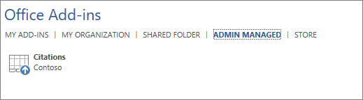

# Administrar complementos en el centro de administración

Los complementos de Office le ayudan a personalizar los documentos y a simplificar la forma en que accede a la información en la web (vea [Start using your Office add-in](https://support.microsoft.com/office/82e665c4-6700-4b56-a3f3-ef5441996862)). 

Después de que un administrador implemente complementos para los usuarios de una organización, el administrador puede desactivar o activar los complementos, editar, eliminar y administrar el acceso a los complementos.

Para obtener más información acerca de la instalación de complementos desde el Centro de administración, vea [Deploy add-ins in the admin center](./manage-deployment-of-add-ins.md).
  
## Estados del complemento

Un complemento puede estar en el **estado On** o **Off.**
  
|**Estado**|**Cómo se produce el estado**|**Impacto**|
|:-----|:-----|:-----|
|**Active**    |El administrador carizó el complemento y lo asignó a usuarios o grupos.    |Los usuarios y grupos asignados al complemento lo ven en los clientes relevantes.    |
|**Desactivado**    |El administrador ha desactivado el complemento.    |Los usuarios y los grupos asignados al complemento ya no tienen acceso al mismo.    Si se cambia el estado del complemento a "activado", los usuarios y grupos tendrán acceso de nuevo.    |
|**Eliminado**    |El administrador ha eliminado el complemento.    |Los usuarios y grupos asignados al complemento ya no tienen acceso al mismo.    |
   
Considere la posibilidad de eliminar un complemento si ya nadie lo está usando. Por ejemplo, desactivar un complemento puede tener sentido si un complemento se usa solo durante determinadas horas del año.

## Eliminar un complemento

También puede eliminar un complemento que se implementó.

1. En el Centro de administración, vaya a la página **Servicios**  >  **& configuración.**

     > [!NOTE]
    > El Centro de administración se actualiza a la experiencia de implementación con aplicaciones integradas. Si no ves los pasos anteriores, ve a la sección Implementación centralizada yendo a **Configuración**  >  **aplicaciones integradas.** En la parte superior de la página Aplicaciones **integradas,** elija Complementos . 

2. Seleccione el complemento implementado.

3. Haga clic **en Eliminar complemento**. Quite el botón Complemento de la esquina inferior derecha.

4. Valide las selecciones y elija **Quitar complemento**.

## Editar acceso a complementos

Después de la implementación, los administradores también pueden administrar el acceso de los usuarios a los complementos.

1. En el Centro de administración, vaya a la página **Servicios**  >  **& configuración.**

     > [!NOTE]
    > El Centro de administración se actualiza a la experiencia de implementación con aplicaciones integradas. Si no ves los pasos anteriores, ve a la sección Implementación centralizada yendo a **Configuración**  >  **aplicaciones integradas.** En la parte superior de la página Aplicaciones **integradas,** elija Complementos . 

2. Seleccione el complemento implementado.

3. Haga clic **en Editar** en Quién **tiene Access**.

4. Guarde los cambios.

## Impedir descargas de complementos desactivando la Tienda Office en todos los clientes (excepto Outlook)

> [!NOTE]
> La instalación del complemento de Outlook se administra mediante un [proceso diferente.](/exchange/clients-and-mobile-in-exchange-online/add-ins-for-outlook/specify-who-can-install-and-manage-add-ins)

Como organización, es posible que desee impedir la descarga de nuevos complementos de Office desde la Tienda Office. Esto se puede usar junto con la implementación centralizada para garantizar que solo los complementos aprobados por la organización se implementen en los usuarios de la organización.
  
**Para desactivar la adquisición de complementos**
  
1. En el centro de administración, vaya a la página **Configuración** \>[de servicios &amp;complementos](https://go.microsoft.com/fwlink/p/?linkid=2053743).

     > [!NOTE]
    > El Centro de administración se actualiza a la experiencia de implementación con aplicaciones integradas. Si no ves los pasos anteriores, ve a la sección Implementación centralizada yendo a **Configuración**  >  **aplicaciones integradas.** En la parte superior de la página Aplicaciones **integradas,** elija Complementos . 
    
3. Seleccione **Aplicaciones y servicios de propiedad del usuario.**
    
4. Desactive la opción para permitir que los usuarios accedan al almacén de Office.

Esto impedirá que todos los usuarios adquieran los siguientes complementos de la tienda.
  
- Complementos para Word, Excel y PowerPoint 2016 desde:
    
  - Windows
    
  - Mac
    
  - Office
    
    
- Adquisiciones a partir de **AppSource**
    
- Complementos de Microsoft 365
    
Un usuario que intente acceder a la tienda verá el siguiente mensaje: Lo **sentimos, Microsoft 365** se ha configurado para impedir la adquisición individual de complementos de la Tienda Office.
  
La compatibilidad para desactivar la Tienda Office está disponible en las siguientes versiones:
  
- Windows: 16.0.9001: disponible actualmente.
    
- Mac: 16.10.18011401- Actualmente disponible.
    
- iOS: 2.9.18010804: disponible actualmente.
    
- La web: disponible actualmente.
    
Esto no impide que un administrador use la implementación centralizada para asignar un complemento desde la Tienda Office.
  
Para evitar que un usuario inicie sesión con una cuenta de Microsoft, puede restringir el inicio de sesión para usar solo la cuenta de la organización. Para obtener más información, vea [Identity, authentication, and authorization in Office 2016](/DeployOffice/security/identity-authentication-and-authorization-in-office).  

> [!NOTE]
> Impedir que los usuarios accedan a la tienda de office también impedirá que puedan realizar la instalación local de [complementos de Office para realizar pruebas.](/office/dev/add-ins/testing/create-a-network-shared-folder-catalog-for-task-pane-and-content-add-ins)

## Más información sobre la experiencia del usuario final con complementos

Después de implementar un complemento, los usuarios finales pueden empezar a usarlo en sus aplicaciones de Office (vea [Start using your Office Add-in](https://support.microsoft.com/office/82e665c4-6700-4b56-a3f3-ef5441996862)). El complemento aparece en todas las plataformas compatibles con el complemento.
  
Si el complemento es compatible con comandos de complemento, estos aparecerán en la cinta de opciones de Office. En el siguiente ejemplo, el comando **Buscar cita** aparece para el complemento **Citas**. 

  
Si el complemento implementado no admite comandos de complemento o si desea ver todos los complementos implementados, puede verlos a través de **Mis complementos**. 
  
### En Word 2016, Excel 2016 o PowerPoint 2016

1. Seleccione **Insertar \> mis complementos**. 
    
2. Seleccione la pestaña **Gestionado por el administrador** en la ventana Complementos de Office. 
    
3. Haga doble clic en el complemento que ha implementado antes (en este ejemplo, **Citas** ).  
  
### En Outlook

1. En la **cinta de** opciones Inicio, seleccione **Obtener complementos**. 
  
2. Seleccione **Administrado por el administrador** en la navegación izquierda. 

## Más información

[Implementar complementos en el centro de administración](./manage-deployment-of-add-ins.md)

Obtenga más información sobre la creación y generación de [complementos de Office](/office/dev/add-ins/overview/office-add-ins).
  
[Use cmdlets de PowerShell de implementación centralizada para administrar complementos.](../../enterprise/use-the-centralized-deployment-powershell-cmdlets-to-manage-add-ins.md)
  
[Solución de problemas: el usuario no ve complementos](/office365/troubleshoot/access-management/user-not-seeing-add-ins)

[Menores y adquirir complementos de Microsoft Store](./minors-and-acquiring-addins-from-the-store.md)