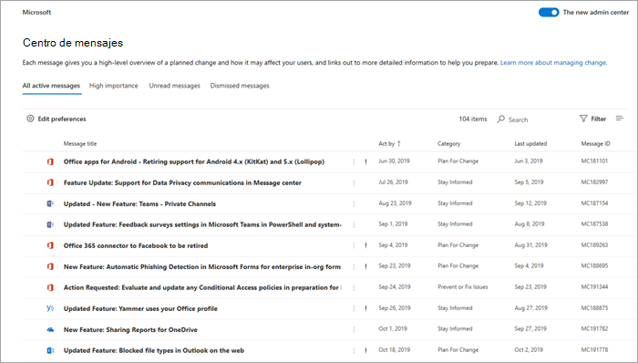
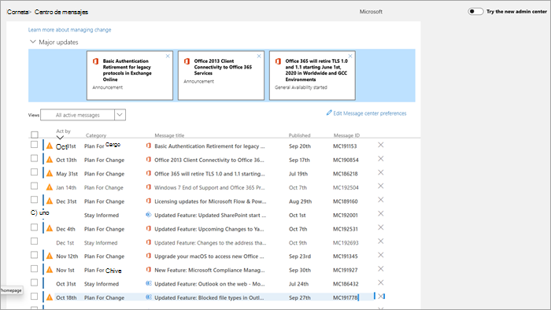

# Administrar mensajes en el Centro de mensajes

Las publicaciones del Centro de mensajes son anuncios importantes sobre características nuevas y cambiadas. En este artículo, se proporciona más información sobre las cosas que puede hacer con los mensajes para ayudar con la administración de cambios en su organización.
  
## Leer un mensaje

Para ir al Centro de mensajes, vaya a [Centro de administración](https://go.microsoft.com/fwlink/p/?linkid=2024339) y seleccione **Mantenimiento** > **Centro de mensajes**. 

Seleccione un título de mensaje para abrirlo en el panel de lectura. Cada mensaje contiene un resumen del cambio, una explicación sobre el modo en que el cambio puede afectarle, información sobre cómo puede preparar a su organización para el cambio y (en la mayoría de los casos) un vínculo de información adicional donde puede obtener más información. La información adicional seguirá estando disponible, incluso después de que expire un mensaje.

## Filtrar y ordenar

::: moniker range="o365-worldwide"

Utilice el menú desplegable **Filtrar** para seleccionar una vista filtrada de los mensajes.

Puede seleccionar cualquier encabezado de columna para ordenar los mensajes en orden ascendente o descendente. Por ejemplo, en este diagrama los mensajes se ordenan por fecha en **Acción hecha el**.

::: moniker-end

::: moniker range="o365-germany"

Utilice el menú desplegable **Vista** para seleccionar una vista filtrada de los mensajes. 
 
Puede seleccionar cualquier encabezado de columna para ordenar los mensajes en orden ascendente o descendente. Por ejemplo, en esta ilustración los mensajes se ordenan por fecha en **Acción hecha el**.

::: moniker-end

::: moniker range="o365-21vianet"

Utilice el menú desplegable **Vista** para seleccionar una vista filtrada de los mensajes. 
 
Puede seleccionar cualquier encabezado de columna para ordenar los mensajes en orden ascendente o descendente. Por ejemplo, en esta ilustración los mensajes se ordenan por fecha en **Acción hecha el**.

::: moniker-end

## Enviar comentarios en una publicación

En el Centro de mensajes, puede seleccionar un mensaje para ver los detalles.

Si desea enviar comentarios en el mensaje, seleccione el icono **Me gusta** o **No me gusta** y proporcione los comentarios en el cuadro de texto que aparece. La información personal no debe ser proporcionada. De manera opcional, **Puede ponerse en contacto conmigo para obtener estos comentarios** y después seleccionar **Enviar**.

## Compartir un mensaje

¿Ve algún mensaje sobre el que otra persona debe tomar acción? Puede compartir el contenido del mensaje con cualquier usuario por correo electrónico:
  
1. Seleccione el mensaje para abrirlo y después seleccione **Compartir**.
  
2. Para compartir el mensaje, escriba hasta dos direcciones de correo electrónico separadas por dos puntos. Puede enviar a direcciones de correo electrónico de forma individual o de grupo. Opcionalmente, puede optar por recibir una copia del mensaje en el correo electrónico (el mensaje irá a su dirección de correo electrónico principal) o bien agregar un mensaje personal para proporcionar a los destinatarios más contexto.
  
3. Seleccione **Compartir** para enviar el correo electrónico.
    
## Obtener un vínculo

¿Necesita realizar un seguimiento con otro administrador para asegurarse de que es consciente de un cambio y de tomar medidas? Puede generar un vínculo para compartir mediante correo electrónico o mensajería instantánea, por ejemplo, que conectará al usuario directamente a ese mensaje. La persona con la que comparte el vínculo tiene que ser administrador de Microsoft 365 para su organización o no tendrá acceso al mensaje vinculado.

::: moniker range="o365-worldwide"

1. Seleccione el mensaje para abrirlo.

2. Seleccione el icono **Copiar enlace al portapapeles** (vínculo).

3. Permita que la página web pueda acceder a su Portapapeles. Un vínculo directo se ha copiado en su Portapapeles.

4. Use Ctrl+V o haga clic con el botón derecho y seleccione **Pegar** para insertar el vínculo.

::: moniker-end

::: moniker range="o365-germany"

1. Seleccione el mensaje para abrirlo.

2. Elija **Más** \> **Obtener un vínculo** en la barra de acciones.

3. Permita que la página web pueda acceder a su Portapapeles. Un vínculo directo se ha copiado en su Portapapeles.

4. Use Ctrl+V o haga clic con el botón derecho y seleccione **Pegar** para insertar el vínculo.

::: moniker-end

::: moniker range="o365-21vianet"

1. Seleccione el mensaje para abrirlo.

2. Elija **Más** \> **Obtener un vínculo** en la barra de acciones.

3. Permita que la página web pueda acceder a su Portapapeles. Un vínculo directo se ha copiado en su Portapapeles.

4. Use Ctrl+V o haga clic con el botón derecho y seleccione **Pegar** para insertar el vínculo.

::: moniker-end

## Estados leídos y no leídos

Todos los mensajes del Centro de mensajes no leídos se mostrarán en negrita. Al abrir un mensaje, se marca como leído. Usted puede marcar un mensaje como no leído.

::: moniker range="o365-worldwide"

1. En la página principal del centro de mensajes, seleccione un mensaje.

2. Seleccione el icono **Marcar como no leído** (sobre) en la parte superior del mensaje.
  
::: moniker-end

::: moniker range="o365-germany"

1. Seleccione el mensaje para abrirlo.

2. Seleccione **Más** \> **Marcar como no leído**.

3. Cierre el mensaje.

::: moniker-end

::: moniker range="o365-21vianet"

1. Seleccione el mensaje para abrirlo.

2. Seleccione **Más** \> **Marcar como no leído**.

3. Cierre el mensaje.

::: moniker-end

## Archivar y restaurar

Si ve un mensaje cuyo contenido no le concierne, o quizás ya ha actuado sobre él, puede archivar el mensaje para eliminarlo de la vista del Centro de mensajes. La vista que se ve en el centro de mensajes es específica de su cuenta de usuario, por lo que archivar desde su vista no afecta a otros administradores.

::: moniker range="o365-worldwide"

- En la página principal del Centro de mensajes, seleccione un mensaje y después **Archivar** encima de la lista de mensajes.

- Abra el mensaje y, después, **Archivar** en la parte inferior del mensaje.

¿Necesita recuperar un mensaje archivado? No pasa nada.
  
1. Seleccione la **Mensajes archivados** pestaña en la parte superior del Centro de mensajes. Aparece una lista de mensajes archivados. 

2. Seleccione el mensaje, haga clic en **Restaurar** y el mensaje se restaurará a los mensajes activos.

::: moniker-end

::: moniker range="o365-germany"

Hay dos formas de archivar un mensaje.
  
- Seleccione la X que aparece a la derecha del Id. de mensaje. El mensaje se ha eliminado de su lista. O bien

- Abra el mensaje y después seleccione **Archivar** en la parte superior del mensaje.

¿Necesita recuperar un mensaje descartado? No pasa nada.
  
1. Seleccione el filtro de **Mensajes archivados** en el menú desplegable **Vistas**. Aparece una lista de mensajes archivados.

2. Seleccione **Restaurar** a la derecha del Id. del mensaje, y el mensaje se restaurará a los mensajes activos.

::: moniker-end

::: moniker range="o365-21vianet"

Hay dos formas de archivar un mensaje.
  
- Seleccione la X que aparece a la derecha del Id. de mensaje. El mensaje se ha eliminado de su lista. O bien

- Abra el mensaje y después seleccione **Archivar** en la parte superior del mensaje.

¿Necesita recuperar un mensaje archivado? No pasa nada.
  
1. Seleccione el filtro de **Mensajes archivados** en el menú desplegable **Vistas**. Aparece una lista de mensajes archivados.

2. Seleccione **Restaurar** a la derecha del Id. del mensaje, y el mensaje se restaurará a los mensajes activos.

::: moniker-end

## Seguir las tareas del Centro de mensajes en Planner

En el Centro de mensajes de Microsoft 365 no deja de llegarle información útil sobre los cambios en los servicios de Microsoft 365. Puede resultar difícil hacer un seguimiento de los cambios que requieren tareas, cuándo y por quién, y seguir cada tarea hasta su finalización. También puede anotar algo y etiquetarlo para comprobarlo más adelante. Puede hacer todo esto y más si sincroniza sus mensajes del Centro de administración de Microsoft 365 con Microsoft Planner. Para obtener más información, vea [Seguir sus tareas del centro de mensajes en Planner](https://docs.microsoft.com/office365/planner/track-message-center-tasks-planner).

Para obtener información general sobre el Centro de mensajes, vea [Centro de mensajes en Microsoft 365](message-center.md). O bien, para obtener información sobre cómo establecer sus preferencias de idioma para habilitar la traducción automática para publicaciones del Centro de mensajes, vea [Traducción de idioma para publicaciones del Centro de mensajes](language-translation-for-message-center-posts.md). Si desea programar una forma alternativa para obtener información sobre el estado del servicio en tiempo real y las comunicaciones del Centro de mensajes, vea [Información general de la API de comunicaciones del servicio de Microsoft 365](https://go.microsoft.com/fwlink/p/?linkid=848507).
  
