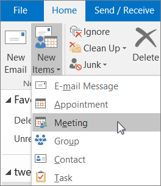

# Buzones de sala y equipamientoRoom and equipment mailboxes

Si tiene una sala de conferencias, un coche de la empresa o equipamiento que todos necesitan usar, entonces necesita encontrar una manera de hacer que todos los usuarios puedan reservar esos recursos. La mejor manera de hacerlo es crear un buzón de correo de equipamiento o de sala en Microsoft 365 para cada recurso. Puede crear uno para la sala de conferencias de la primera planta, el equipamiento multimedia o un camión de mudanza.If you have a conference room, company car, or equipment that everyone needs to use, then you need to come up with a way to make those resources reservable to everyone. The best way to do that is to create a room or equipment mailbox in Microsoft 365 for each resource. You might create one for your first floor conference room, media equipment, or a moving truck.
  
Una vez que cree un buzón de sala o equipamiento, todas las personas de la empresa pueden reservarlo para reuniones o eventos con Outlook. Obtenga información **sobre cómo usarlo** y **cómo configurarlo** en las dos pestañas siguientes. Aquí se muestran otras preguntas comunes sobre los buzones de sala y equipamiento.Once you create a room or equipment mailbox, everyone in the company can reserve it for meetings or events using Outlook. Learn **how to use it** and **how to set it up** on the next two tabs. Here are some other common questions about room and equipment mailboxes. 
  
## Usar buzones de sala y equipamientoUse room and equipment mailboxes

Para usar buzones de equipamiento o de sala, abra Outlook desde su equipo o inicie sesión en Outlook en la Web. Programe una reunión nueva y agregue la sala o el equipamiento a la reunión como haría al invitar a otros empleados o clientes. Ahora ya lo ha reservado.To use room or equipment mailboxes, open Outlook from your computer or sign in to Outlook on the web. Schedule a new meeting and add the room or equipment to the meeting like you would when inviting other employees or customers. You've now reserved it.
  
1. Abra **Outlook** en el equipo.Open **Outlook** on your computer. 
    
2. En la pestaña **Inicio**, pulse **Nuevos elementos** \> **Reunión**.On the **Home** tab, choose **New Items** \> **Meeting**.  O, desde su calendario, simplemente seleccione **Nueva reunión**.Or, from your Calendar, just select **New Meeting**.
    
3. En el campo Para, escriba el nombre de la sala de conferencias o del equipamiento que quiere reservar, además de los asistentes a los que quiere invitar.In the To field, type the name of the conference room or equipment you want to reserve, in addition to any attendees you'd like to invite. O, seleccione **Para** y haga doble clic en la sala de conferencias o en el equipamiento de la lista.Or, select **To** then double-click the conference room or equipment from the list. A continuación, seleccione **Aceptar**.Then select **OK**. 
  
4. En la línea **Asunto**, escriba la finalidad de la reserva o de la reunión.In the **Subject** line, type the purpose of the reservation or meeting. 
    
5. Cambie el valor de la **ubicación** o déjelo como está.Change the **Location** value or leave as is. 
    
6. Cambie la **Hora de inicio** y la **Hora de finalización**.Change the **Start time** and **End time**. O, seleccione **Todo el día**.Or, select **All day event**. Para que se repita la reserva o la reunión, seleccione **Periodicidad** en la parte superior.To make the meeting or reservation repeat, select **Recurrence** at the top. 
  
7. Escriba un mensaje describiendo la finalidad y adjunte algún archivo si es necesario.Type a message describing the purpose and attach any files if needed.
    
8. Para permitir que otras personas se unan en línea o llamen a la reunión, seleccione **Reunión de Skype**.To allow others to join online or call in to the meeting, select **Skype Meeting**.
    
9. Para garantizar que la sala, el equipamiento y las personas que ha invitado están disponibles, seleccione **Asistente para programación** en la parte superior.To make sure the room, equipment, and people you've invited are available, select **Scheduling Assistant** at the top. Después, seleccione una hora disponible en el calendario.Then select an available time in the calendar.   Sugerencia: en el calendario de la programación, azul significa que la sala o el equipamiento está reservado u ocupado.TIP: In the scheduling calendar, blue means the room or equipment is reserved, or busy. Seleccione el área libre o en blanco del calendario.Select the white, or free, area on the calendar. 
  
10. Cuando finalice, haga clic en **Enviar**.When finished, select **Send**.
    
## Administrar buzones de sala y equipamientoSet up room and equipment mailboxes

Para configurar un buzón de sala o equipamiento, vaya al Centro de administración de Microsoft 365.To set up a room or equipment mailbox, go to the Microsoft 365 admin center. (Necesitará tener permisos de administrador para realizar esto). Cree el buzón e indique a todos los usuarios que pueden empezar a reservarlo para reuniones y eventos.(You'll need to have admin permission to do this.) Create the mailbox and let everyone know they can start reserving it for meetings and events.
  
1. En el centro de administración, vaya a la página **Recursos** \> [Salas y equipamiento](https://go.microsoft.com/fwlink/p/?linkid=2067334).In the admin center, go to the **Resources** \> [Rooms &amp; equipment](https://go.microsoft.com/fwlink/p/?linkid=2067334) page.
  
2. Seleccione **Agregar**.Select **Add**.
    
3. Rellene los campos de la sala o del equipamiento:Fill out the room or equipment fields:  
  
  - **Sala** o **Equipamiento**: el tipo de buzón que quiere crear.**Room** or **Equipment**: the type of mailbox you'd like to create.
    
  - **Nombre**: un nombre descriptivo o incluso una descripción breve.**Name**: a friendly name or even short description.
    
  - **Correo electrónico**: el alias de correo electrónico de la sala o del equipamiento. Esto es necesario para enviar una solicitud de reunión a la sala o al equipamiento.**Email**: the email alias of the room or equipment. This is necessary to send a meeting request to the room or equipment.
    
  - **Capacidad**: el número de personas que pueden encontrarse en la sala o usar el equipamiento a la vez.**Capacity**: the number of people who can fit in the room or use the equipment at the same time.
    
  - **Ubicación**: el número de la sala o la ubicación de esta en un edificio o región.**Location**: the room number or location of the room in a building or region.
    
  - **Número de teléfono**: el número de la sala. Esto es diferente del número de teléfono de la reunión que se ha generado al usar Skype Empresarial.**Phone number**: the number of the room itself. This is different from the meeting phone number generated when using Skype for Business.
    
4. Seleccione **Agregar**.Select **Add**.
    
5. Seleccione el buzón de sala o equipamiento que creó para ver o editar los detalles.Select the room or equipment mailbox you created to see or edit the details.
  
6. Si ha realizado cambios, seleccione **Guardar** y, después, **Cerrar**.If you made changes, select **Save** and then **Close**.

> [!Note]
> Para garantizar la seguridad de sus buzones de sala y equipamiento, bloquee el inicio de sesión en estos buzones.To keep your room and equipment mailboxes secure, block sign-in to these mailboxes. Para obtener más información, consulte [Bloquear el inicio de sesión de la cuenta de buzón compartido](https://docs.microsoft.com/office365/admin/email/create-a-shared-mailbox?view=o365-worldwide#block-sign-in-for-the-shared-mailbox-account).For more information, see [Block sign-in for the shared mailbox account](https://docs.microsoft.com/office365/admin/email/create-a-shared-mailbox?view=o365-worldwide#block-sign-in-for-the-shared-mailbox-account).

## Preguntas comunes sobre los buzones de sala y equipamiento.Common questions about room and equipment mailboxes

### ¿Cómo puede saber si la sala o el equipamiento está disponible?How can you tell when the room or equipment is available?

Abra Outlook y cree una nueva reunión.Open Outlook and create a new meeting. Agregue la sala o el equipamiento a la reunión como si fuera una persona y seleccione **Asistente para programación** para ver una vista del calendario dinámico de la disponibilidad de la sala o el equipamiento.Add the room or equipment to the meeting as if it were a person and select **Scheduling Assistant** to see a live calendar view of the room or equipment's availability. Si el espacio horario está vacío, está disponible; si está azul, está reservado.If the hour slot is clear, it's available; if it's blue, it's reserved. 
  
### ¿Cómo puede cancelar una solicitud de sala o equipamiento?How do you cancel a room or equipment request?

Abra la reunión que ha programado en Outlook y, después, quite la sala o el equipamiento de la reunión como si fuera un asistente. Esto liberará la sala para que otros puedan reservarla.Open the meeting you scheduled in Outlook and then remove the room or equipment from the meeting like you would an attendee. This will free up the room for others to reserve.
  
### ¿Alguien tiene que aceptar o rechazar cada solicitud de sala o equipamiento?Does someone have to accept or decline every room or equipment request?

 No, no necesita que nadie acepte o rechace las solicitudes. Puede decidir si quiere permitir que la sala o el equipamiento se puedan reservar de manera automática o si prefiere que lo administre un miembro de la empresa.No, you don't need someone to accept or decline requests. You can decide whether you want to let the room or equipment be automatically booked or managed by someone in your company. 
  
### ¿Un buzón de sala o un buzón de correo de equipamiento necesitan una licencia de producto?Does a room mailbox or equipment mailbox need a product license?

No. Aunque la mayoría de los usuarios de su organización necesita una licencia para usar Microsoft 365, no tiene que asignar ninguna licencia a un buzón de sala o buzón de correo de equipamiento.No. While most people in your organization need a license to use Microsoft 365, you don't need to assign a license to a room mailbox or equipment mailbox.
  
### ¿Necesito un propietario que se encargue de reservar las salas o el equipamiento?Do I need an owner in charge of booking the rooms or equipment?

 No, no necesita que nadie se encargue del buzón de sala o del buzón de correo de equipamiento.No, you don't need someone in charge of the room mailbox or equipment mailbox. 
