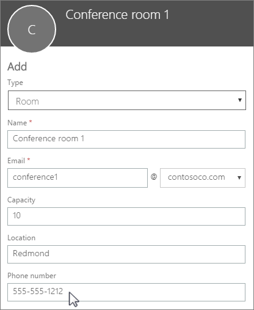

# Crear buzones de sala y equipamiento de Microsoft 365

If you have a conference room, company car, or equipment that everyone needs to use, then you need to come up with a way to make those resources reservable to everyone. The best way to do that is to create a room or equipment mailbox in Microsoft 365 for each resource. You might create one for your first floor conference room, media equipment, or a moving truck.
  
Once you create a room or equipment mailbox, everyone in the company can reserve it for meetings or events using Outlook. Learn **how to use it** and **how to set it up** on the next two tabs. Here are some other common questions about room and equipment mailboxes.
  
## Usar buzones de sala y equipamiento

To use room or equipment mailboxes, open Outlook from your computer or sign in to Outlook on the web. Schedule a new meeting and add the room or equipment to the meeting like you would when inviting other employees or customers. You've now reserved it.
  
1. Abra **Outlook** en el equipo.

2. En la pestaña **Inicio**, pulse **Nuevos elementos** \> **Reunión**.

   

   O, desde su calendario, simplemente seleccione **Nueva reunión**.
    
3. En el campo Para, escriba el nombre de la sala de conferencias o del equipamiento que quiere reservar, además de los asistentes a los que quiere invitar.

   Or, select **To** then double-click the conference room or equipment from the list. Then select **OK**.

   
  
4. En la línea **Asunto**, escriba la finalidad de la reserva o de la reunión. 
    
5. Cambie el valor de la **ubicación** o déjelo como está. 
    
6. Change the **Start time** and **End time**. Or, select **All day event**. To make the meeting or reservation repeat, select **Recurrence** at the top.
 
   
  
7. Escriba un mensaje describiendo la finalidad y adjunte algún archivo si es necesario.
    
8. Para permitir que otras personas se unan en línea o llamen a la reunión, seleccione **Reunión de Teams**.
    
9. To make sure the room, equipment, and people you've invited are available, select **Scheduling Assistant** at the top. Then select an available time in the calendar.

   

   > [!TIP]
   > In the scheduling calendar, blue means the room or equipment is reserved, or busy. Select the white, or free, area on the calendar. 
  
10. Cuando finalice, haga clic en **Enviar**.
    
## Administrar buzones de sala y equipamiento

To set up a room or equipment mailbox, go to the <a href="https://go.microsoft.com/fwlink/p/?linkid=2024339" target="_blank">Microsoft 365 admin center</a>. (You'll need to have admin permission to do this.) Create the mailbox and let everyone know they can start reserving it for meetings and events.
  
1. En el centro de administración, vaya a la página **Recursos** \> [Salas y equipamiento](https://go.microsoft.com/fwlink/p/?linkid=2067334).
  
2. Seleccione **Agregar**.
    
3. Rellene los campos de la sala o del equipamiento:

   
  
   - **Sala** o **Equipamiento**: el tipo de buzón que quiere crear.
    
   - **Nombre**: un nombre descriptivo o incluso una descripción breve.
    
   - **Email**: the email alias of the room or equipment. This is necessary to send a meeting request to the room or equipment.
    
   - **Capacidad**: el número de personas que pueden encontrarse en la sala o usar el equipamiento a la vez.
    
   - **Ubicación**: el número de la sala o la ubicación de esta en un edificio o región.
    
   - **Phone number**: the number of the room itself. This is different from the meeting phone number generated when using Microsoft Teams.
    
4. Seleccione **Agregar**.
    
5. Seleccione el buzón de sala o equipamiento que creó para ver o editar los detalles.
  
6. Si ha realizado cambios, seleccione **Guardar** y, después, **Cerrar**.

> [!Note]
> Para garantizar la seguridad de sus buzones de sala y equipamiento, bloquee el inicio de sesión en estos buzones. Para obtener más información, consulte [Bloquear el inicio de sesión de la cuenta de buzón compartido](/office365/admin/email/create-a-shared-mailbox#block-sign-in-for-the-shared-mailbox-account).

## Preguntas comunes sobre los buzones de sala y equipamiento.

### ¿Cómo puede saber si la sala o el equipamiento está disponible?

Open Outlook and create a new meeting. Add the room or equipment to the meeting as if it were a person and select **Scheduling Assistant** to see a live calendar view of the room or equipment's availability. If the hour slot is clear, it's available; if it's blue, it's reserved. 
  
### ¿Cómo puede cancelar una solicitud de sala o equipamiento?

Open the meeting you scheduled in Outlook and then remove the room or equipment from the meeting like you would an attendee. This will free up the room for others to reserve.
  
### ¿Alguien tiene que aceptar o rechazar cada solicitud de sala o equipamiento?

No, you don't need someone to accept or decline requests. You can decide whether you want to let the room or equipment be automatically booked or managed by someone in your company. 
  
### ¿Un buzón de sala o un buzón de correo de equipamiento necesitan una licencia de producto?

No. While most people in your organization need a license to use Microsoft 365, you don't need to assign a license to a room mailbox or equipment mailbox, in case the resource mailbox doesn't need to have a size bigger than 50 GB, or, in case some features aren't needed (Retention policies from Security and Compliance, or, Hold from Exchange Online), or, in case the resource mailbox doesn't need an Online Archive attached to it.
  
### ¿Necesito un propietario que se encargue de reservar las salas o el equipamiento?

 No, no necesita que nadie se encargue del buzón de sala o del buzón de correo de equipamiento.
