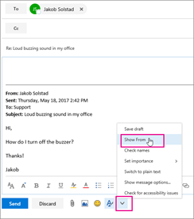

# Enviar un correo electrónico como una lista de distribuciónSend email as a distribution list

En Microsoft 365, puede enviar correo electrónico como una lista de distribución.In Microsoft 365, you can send email as a distribution list. Cuando una persona que es miembro de la lista de distribución responde a un mensaje enviado a la lista de distribución, parece que el correo electrónico se encuentra en la lista de distribución y no en el usuario individual.When a person who is a member of the distribution list replies to a message sent to the distribution list, the email appears to be from the distribution list, not from the individual user. En este tema se muestra cómo hacerlo.This topic shows you how to do this.
  
## Enviar un correo electrónico como una lista de distribuciónSend email as a distribution list

Antes de llevar a cabo estos pasos, asegúrese de que se ha agregado a una lista de distribución de Microsoft 365 y que se le ha concedido permiso de enviar como.Before you perform these steps, make sure you've been added to a Microsoft 365 distribution list and you've have been granted Send as permission on it.
  
 **Administradores**: Asegúrese de que ha seguido los pasos indicados en los temas sobre [Cómo agregar un usuario o un contacto de Microsoft 365 a una lista](../email/add-user-or-contact-to-distribution-list.md) y [permitir a los miembros enviar un correo electrónico como un grupo de Microsoft 365](../create-groups/allow-members-to-send-as-or-send-on-behalf-of-group.md#allow-members-to-send-email-as-a-group) y se agregaron las personas correctas a la lista de distribución.**Admins**: Make sure you've followed the steps in the [Add a Microsoft 365 user or contact to a list](../email/add-user-or-contact-to-distribution-list.md) and [Allow members to send email as a Microsoft 365 Group](../create-groups/allow-members-to-send-as-or-send-on-behalf-of-group.md#allow-members-to-send-email-as-a-group) topics, and added the correct people to the distribution list.
  
1. Abra Outlook en la web y vaya a la bandeja de entrada.Open Outlook on the web and go to your inbox. 
    
2. Abrir un mensaje que se ha enviado a la lista de distribución.Open a message that was sent to the distribution list. 
    
3. Seleccione **responder**.Select **Reply**. 
    
4. En la parte inferior del mensaje, seleccione **más** \> **Mostrar en**.At the bottom of the message, select **More** \> **Show from**.  
  
5. Haga clic con el botón derecho en la dirección de (por ejemplo,?) `Ina@weewalter.me` y elija **quitar**.Right-click on the From address - such as `Ina@weewalter.me` - and choose **Remove**.  
  
6. A continuación, escriba la dirección de la lista de distribución, por ejemplo, support@contoso.com, y envíe el mensaje.Then type the distribution list address such as support@contoso.com, and send the message. La próxima vez que responda a la lista de distribución, su dirección aparecerá como una opción en la lista **de** .The next time you reply from the distribution list, its address will appear as an option in the **From** list. 
  

