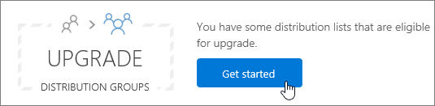

# <a name="upgrade-distribution-lists-to-microsoft-365-groups-in-outlook"></a>Actualizar listas de distribución a Microsoft 365 grupos en Outlook

Puede actualizar listas de distribución a grupos Microsoft 365 en Outlook. Esta es una excelente manera de proporcionar a las listas de distribución de su organización todas las características y funcionalidades de Microsoft 365 grupos. [Por qué debería actualizar sus listas de distribución a grupos de Outlook](https://support.microsoft.com/office/7fb3d880-593b-4909-aafa-950dd50ce188)

Puede actualizar las DLs una a la vez o varias al mismo tiempo.

## <a name="upgrade-one-or-many-distribution-list-groups-to-microsoft-365-groups-in-outlook"></a>Actualizar uno o varios grupos de listas de distribución a Microsoft 365 grupos en Outlook

Debe ser un administrador global o un administrador Exchange para actualizar un grupo de listas de distribución. Para actualizar a Microsoft 365, el grupo de lista de distribución debe tener un propietario con un buzón.

### <a name="use-the-new-eac-to-upgrade-one-or-many-distribution-list-groups-to-microsoft-365-groups-in-outlook"></a>Use el nuevo EAC para actualizar uno o varios grupos de listas de distribución a Microsoft 365 grupos de Outlook

1. Vaya al nuevo centro [Exchange de administración](https://admin.exchange.microsoft.com)y vaya a Grupos **de** \> **destinatarios**.

2. Seleccione el grupo de lista de distribución (también denominado grupo de **distribución)** que desea actualizar a Microsoft 365 en la **página** Grupos.

3. Seleccione el **grupo de distribución Actualizar** de la barra de herramientas.

4. En el cuadro de diálogo **¿Listo para actualizar?**, haga clic en **Actualizar**. El proceso comienza inmediatamente. Según el tamaño y el número de grupos de listas de distribución que actualice, el proceso puede tardar minutos u horas.

> [!NOTE]
> Un banner en la parte superior indica la actualización, por ejemplo, los grupos de distribución *se han actualizado. Los cambios tardarán 5 minutos. Filtrar por Microsoft 365 para ver los grupos de distrrución actualizados*.

### <a name="use-the-classic-eac-to-upgrade-one-or-many-distribution-list-groups-to-microsoft-365-groups-in-outlook"></a>Use el EAC clásico para actualizar uno o varios grupos de listas de distribución a Microsoft 365 grupos de Outlook

1. Vaya al Centro de <a href="https://go.microsoft.com/fwlink/p/?linkid=2059104" target="_blank">administración Exchange clásico.</a>

2. En el Centro Exchange administración, vaya a **Grupos de** \> **destinatarios**.<br/>Verá un aviso que indica que tiene listas de distribución (también denominadas grupos de **distribución)** que son aptas para actualizarse a Microsoft 365 grupos.<br/> 

3. Seleccione una o más listas de distribución (también denominadas **grupos de distribución)** en la **página grupos.**<br/>

4. Seleccione el icono de actualización.<br/>

5. En el cuadro de diálogo información, seleccione **Sí** para confirmar la actualización. El proceso comienza inmediatamente. Según el tamaño y el número de direcciones URL que actualice, el proceso puede tardar minutos u horas.<br/>Si la lista de distribución no se puede actualizar, aparece un cuadro de diálogo que lo dice. Vea [¿Qué listas de distribución no se pueden actualizar?](#which-distribution-lists-cant-be-upgraded).

6. Si va a actualizar varias listas de distribución, use la lista desplegable para filtrar qué listas de distribución se han actualizado. Si la lista no está completa, espere un tiempo más y, a continuación, seleccione **Actualizar** para ver lo que se ha actualizado correctamente.<br/>No hay ningún aviso que le indique cuándo se ha completado el proceso de actualización para todas las direcciones URL que seleccionó. Para averiguarlo, vea lo que aparece en **Disponible para actualización** o Direcciones DLL **actualizadas.**

7. Si seleccionó un archivo DL para la actualización, pero aún aparece en la página como Disponible para actualizar, no se pudo actualizar. Consulte [What to do if the upgrade doesn't work](#what-to-do-if-the-upgrade-doesnt-work).

> [!NOTE]
> Si estás recibiendo los mensajes de correo electrónico de resumen de grupos, es posible que observes en la parte inferior que a veces te permitirá actualizar las listas de distribución elegibles de las que seas propietario. Consulta [Tener una conversación en grupo en Outlook](https://support.microsoft.com/office/a0482e24-a769-4e39-a5ba-a7c56e828b22) para obtener más información acerca de los correos electrónicos de resumen.

## <a name="what-to-do-if-the-upgrade-doesnt-work"></a>Qué hacer si la actualización no funciona

Las listas de distribución que no se pueden actualizar permanecen sin cambios.

Si una o más listas **de** distribución elegibles no se pueden actualizar, abra un [vale de soporte](../../business-video/get-help-support.md)técnico . El problema tendrá que escalarse al equipo de ingeniería de grupos para que puedan averiguar el problema.

Es posible que la lista de distribución no se haya actualizado debido a una interrupción del servicio, pero es poco probable. Si lo desea, espere un tiempo y vuelva a intentar actualizar la DL.

## <a name="how-to-use-powershell-to-upgrade-several-distribution-lists-at-the-same-time"></a>Cómo usar PowerShell para actualizar varias listas de distribución al mismo tiempo

Si tienes experiencia en el uso de PowerShell, es posible que quieras ir a esta ruta en lugar de usar la interfaz de usuario. Tenemos un conjunto de cmdlets que le ayudarán a actualizar listas de distribución. Véalo a continuación.

### <a name="upgrade-a-single-dl"></a>Actualizar una sola DL

Para actualizar una sola DL, ejecute el siguiente comando:

```PowerShell
Upgrade-DistributionGroup -DlIdentities \<Dl SMTP address\>`
```

Por ejemplo, si desea actualizar un DLs con direcciones SMTP dl1@contoso.com, ejecute el siguiente comando:

```PowerShell
Upgrade-DistributionGroup -DlIdentities dl1@contoso.com`
```

> [!NOTE]
> También puede actualizar una lista de distribución única a un grupo Microsoft 365 con el cmdlet de PowerShell [New-UnifiedGroup](/powershell/module/exchange/new-unifiedgroup)

### <a name="upgrade-multiple-dls-in-a-batch"></a>Actualizar varias direcciones URL en un lote

También puede pasar varias direcciones URL como un lote y actualizarlas juntas:

```PowerShell
Upgrade-DistributionGroup -DlIdentities \<DL SMTP address1\>, \< DL SMTP address2\>,
\< DL SMTP address3\>, \< DL SMTP address 4\>
```

Por ejemplo, si desea actualizar cinco direcciones URL con dirección SMTP y `dl1@contoso.com` , y , ejecute el siguiente `dl2@contoso.com` `dl3@contoso.com` `dl4@contoso.com` `dl5@contoso.com` comando:

`Upgrade-DistributionGroup -DlIdentities dl1@contoso.com, dl2@contoso.com, dl3@contoso.com, dl4@contoso.com, dl5@contoso.com`

### <a name="upgrade-all-eligible-dls"></a>Actualizar todas las DLs elegibles

Hay dos formas de actualizar todas las direcciones URL elegibles.

> [!NOTE]
> El cmdlet Upgrade-DistributionGroup no recibe datos de la canalización, por lo que es necesario usar el operador "foreach-object" para {} ejecutarse correctamente.

1. Obtener las direcciones URL elegibles en el inquilino y actualizarlas mediante el comando de actualización:

```PowerShell
Get-EligibleDistributionGroupForMigration | Foreach-Object{
    Upgrade-DistributionGroup -DlIdentities $_.PrimarySMTPAddress
}
```

2. Obtener la lista de todas las direcciones DLL y actualizar solo las direcciones URL elegibles:

```PowerShell
Get-DistributionGroup| Foreach-Object{
    Upgrade-DistributionGroup -DlIdentities $_.PrimarySMTPAddress
}
```

## <a name="faq-about-upgrading-distribution-lists-to-microsoft-365-groups-in-outlook"></a>Preguntas frecuentes sobre cómo actualizar listas de distribución Microsoft 365 grupos en Outlook

### <a name="which-distribution-lists-cant-be-upgraded"></a>¿Qué listas de distribución no se pueden actualizar?

Solo puede actualizar listas de distribución sencillas y no anidadas administradas en la nube. En la tabla siguiente se enumeran las listas de distribución **que no** se pueden actualizar.

|**Property**|**¿Elegible?**|
|:-----|:-----|
|Lista de distribución administrada local.  <br/> |No  <br/> |
|Listas de distribución anidadas. La lista de distribución tiene grupos secundarios o es miembro de otro grupo.  <br/> |No  <br/> |
|Listas de distribución con **miembros RecipientTypeDetails distintos** de **UserMailbox**, **SharedMailbox**, **TeamMailbox**, **MailUser**  <br/> |No  <br/> |
|Lista de distribución con más de 100 propietarios  <br/> |No  <br/> |
|Lista de distribución que solo tiene miembros pero ningún propietario  <br/> |No  <br/> |
|Lista de distribución con alias que contiene caracteres especiales  <br/> |No  <br/> |
|Si la lista de distribución está configurada para ser una dirección de reenvío para buzón compartido  <br/> |No  <br/> |
|Si dl forma parte de la **restricción del remitente** en otro DL.  <br/> |No  <br/> |
|Grupos de seguridad  <br/> |No  <br/> |
|Listas de distribución dinámica  <br/> |No  <br/> |
|Listas de distribución que se convirtieron en **RoomLists**  <br/> |No  <br/> |
|Listas de distribución **donde MemberJoinRestriction** y/o **MemberDepartRestriction** está **Cerrado**  <br/> |No  <br/> |

### <a name="check-which-dls-are-eligible-for-upgrade"></a>Comprobar qué direcciones URL son aptas para la actualización

Si desea comprobar si un archivo DL es apto o no, puede ejecutar el siguiente comando:

`Get-DistributionGroup \<DL SMTP address\> | Get-EligibleDistributionGroupForMigration`

Si desea comprobar qué direcciones DLL son aptas para la actualización, ejecute el siguiente comando:

`Get-EligibleDistributionGroupForMigration`

### <a name="who-can-run-the-upgrade-scripts"></a>Quién Puede ejecutar los scripts de actualización?

Personas con derechos de administrador global Exchange administrador.

### <a name="why-is-the-contact-card-still-showing-a-distribution-list-what-should-i-do-to-prevent-an-upgraded-distribution-list-from-showing-up-in-my-auto-suggest-list"></a>¿Por qué la tarjeta de contacto sigue mostrando una lista de distribución? ¿Qué debo hacer para evitar que una lista de distribución actualizada se muestre en mi lista de sugerencias automáticas?

- For Outlook: When someone tries to send an email in Outlook by typing the Microsoft 365 group name after migration, the recipient will be resolved as the distribution list instead of the group. La tarjeta de contacto del destinatario será la tarjeta de contacto de listas de distribución. Esto se debe a la caché de destinatarios o a la caché de nombres de nick en Outlook. El correo electrónico se enviará correctamente al grupo, pero puede causar confusión al remitente.<br/>Puede realizar los pasos de este artículo, Información sobre la lista Outlook [Autocompletar](/outlook/troubleshoot/contacts/information-about-the-outlook-autocomplete-list) para restablecer la memoria caché, lo que solucionará este problema.

- For Outlook on the web: In case of Outlook on the web, the distribution list recipient will still remain in the cache. Puede seguir los pasos descritos en [Quitar](https://support.microsoft.com/office/9E1419D9-E88F-445B-B07F-F558B8A37C58) el nombre sugerido o la dirección de correo electrónico de la lista de autocompletar para actualizar la memoria caché para ver la tarjeta de contacto del grupo.

### <a name="do-new-group-members-get-a-welcome-email-in-their-inbox"></a>¿Los nuevos miembros del grupo reciben un correo electrónico de bienvenida en su bandeja de entrada?

No. La configuración para habilitar los mensajes de bienvenida se establece en false de forma predeterminada. Esta configuración afecta tanto a los miembros de grupo existentes como a los nuevos que pueden unirse una vez completada la migración. Si el propietario del grupo permite más adelante a los usuarios invitados, los usuarios invitados no recibirán un correo electrónico de bienvenida en su bandeja de entrada. Los miembros invitados pueden seguir trabajando con el grupo.

### <a name="what-if-one-or-some-of-the-dls-are-not-upgraded"></a>¿Qué ocurre si uno o algunos de los DLs no se actualizan?

Hay algunos casos en los que, aunque DL es apto pero no se pudo actualizar. La DL no se actualiza y permanece como un ARCHIVO DL.

- Cuando el administrador **ha** aplicado la directiva de direcciones de correo electrónico de grupo para los grupos de una organización y tratan de actualizar direcciones DLL que no cumplen los criterios, la DL no se actualiza

- Las DLs **con MemberJoinRestriction** o **MemberDepartRestriction** establecidas en **Closed**, no se pudieron actualizar

### <a name="what-happens-to-the-dl-if-the-upgrade-from-eac-fails"></a>¿Qué sucede con la DL si se produce un error en la actualización desde EAC?

La actualización solo se realizará cuando se envía la llamada al servidor. Si se produce un error en la actualización, las direcciones DLL estarán intactas. Funcionarán como antes.
