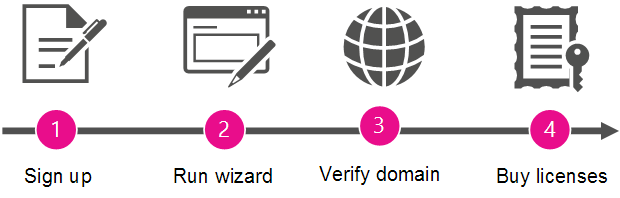

# Convertirse en administrador y comprar Office 365 para su organizaciónBecome the admin and purchase Office 365 for your organization

Microsoft simplifica el registro y uso de herramientas de productividad y servicios para los usuarios de su organización sin que tengan que esperar a que el departamento de TI las implemente formalmente.Microsoft makes it simple for people in your organization to sign up and use productivity tools and services without waiting for formal deployment by your IT department.
  
La organización puede permitir a las personas seguir usando estos servicios "tal cual". Sin embargo, si hay personas que se registran en Reuniones de Skype como uno de estos servicios, puede asignar un administrador para que actualice y obtenga una solución de reuniones más completa con aplicaciones de Office y Skype Empresarial, almacenamiento y uso compartido de archivos, etc.Your organization can let people continue to use these services "as is." But if people signed up for Skype Meetings as one of those services, you can assign an admin to upgrade and get a more complete meeting solution with Skype for Business and Office applications, file storage and sharing, and more.
  
## ¿Por qué convertirse en administrador y comprar Office 365 para su organización?Why become the admin and buy Office 365 for your organization?

Cuando los empleados se registran en Reuniones de Skype con su cuenta profesional no pueden administrar el servicio. Solo obtienen las características más básicas: pueden tener un número ilimitado de reuniones pero solo con 10 participantes o menos (después de 60 días, el número máximo de participantes es de tres personas).When an employee signs up for Skype Meetings with their work account, they can't manage the service. And they get only the most basic features: they can have unlimited meetings but only with 10 or fewer participants (after 60 days, the maximum participants is three people). 
  
Si configura un administrador del servicio y compra Office 365 para los usuarios, estos reciben características más avanzadas. Además, así tiene la posibilidad de administrar los servicios, por lo que puede aplicar directivas y agregar nuevos usuarios.When you set up an admin for the service and buy Office 365 for your users, they get more advanced features. And you get the ability to manage the services, so you can enforce policies and add new users.
  
Como bonificación, obtendrá soporte técnico por teléfono 24 horas.As a bonus, you get 24/7 phone support.
  
## Cómo convertirse en administradorHow to become the admin

Para convertirse en administrador, deberá demostrar primero que es el propietario del dominio con el que se registran los usuarios (como contoso.com). Luego deberá actualizar a Office 365 para todas las personas de la compañía que ya usan Reuniones de Skype. Un asistente le guiará por los pasos.To become the admin, you'll first prove that you own the domain that people signed up with (like contoso.com). Then you'll upgrade to Office 365 for everyone in the company who is already using Skype Meetings. A wizard walks you through the steps.
  
> [!NOTE]
> Convertirse en administrador y actualizar a Office 365 forman parte del mismo proceso. No puede actualizar sin convertirse antes en administrador ni puede administrar los servicios como administrador a menos que también se actualice a Office 365.Becoming the admin and upgrading to Office 365 are part of the same process. You can't upgrade without first becoming the admin, and you can't manage the services as an admin unless you also upgrade to Office 365. 
  
 **¿Por qué le pedimos que demuestre que es el propietario del dominio?****Why do we ask you to prove that you own the domain?** Porque todos los usuarios que se registran con una dirección de correo electrónico en el mismo dominio (por ejemplo, rob@contoso.com y sara@contoso.com) se agrupan por el nombre de dominio.Because everyone who signs up with an email address on the same domain (say, rob@contoso.com and sara@contoso.com) is grouped together by the domain name. Decidimos a qué grupo pertenece cada persona la parte de dominio de sus direcciones de correo electrónico (como contoso.com), por lo que los usuarios de la misma organización pueden trabajar juntos.We decide what group each person belongs to by the domain portion of their email addresses (like contoso.com), so people from the same organization can work together. Dado que pertenecen al mismo grupo, pueden colaborar entre sí.Because they belong to the same group, they can collaborate with each other.
  
Para convertirse en el administrador del grupo, compruebe que es propietario del dominio en el que se agrupan todos los usuarios de la organización. Si tiene autoridad para demostrar la propiedad del dominio (iniciando sesión en donde se administra el dominio), es lógico que pueda administrar los servicios de Office 365 para quienes usan ese dominio.To become the admin for the group, you verify that you own the domain that everyone in your organization is grouped under. If you have the authority to prove domain ownership (by signing in where the domain is managed), it makes sense that you can manage Office 365 services for people using that domain.
  
Tras convertirse en administrador, si quiere, puede también agregar nuevos usuarios o aplicar directivas.After you become the admin, you can also add new users or enforce policies, if you like.
  
## Introducción a los pasosOverview of the steps

  
Un asistente le guiará por el proceso, pero aquí tiene un resumen de cada paso.A wizard guides you through the process, but here's a summary of each step.
  
|||
|:-----|:-----|
||**Registro**: para convertirse en administrador, debe estar registrado ya en Reuniones de Skype con su dirección de correo electrónico del trabajo.**Sign up** Before you can become the admin, you must already be signed up for Skype Meetings with your work email address.    |
||**Ejecución del asistente**: una vez registrado, ejecute el asistente mediante uno de estos procedimientos:**Run the wizard** After you've signed up, run the wizard by doing one of the following:     Ejecute el Asistente para **convertirse en Administrador** que aparece después de seleccionar **Administrador** en el iniciador de aplicaciones.Run the **Become the admin** wizard that appears after selecting **Admin** in the app launcher .     O BIENOR     Elija **actualizar a office 365** en reuniones de Skype y, a continuación, seleccione la suscripción de Office 365 a la que desea actualizar.Choose to **Upgrade to Office 365** in Skype Meetings, and then select the Office 365 subscription you want to upgrade to.    |
||**Comprobación de la propiedad del dominio**: después tendrá que comprobar en Office 365 que es el propietario o administrador del nombre de dominio (como contoso.com) que está asociado a las direcciones de correo electrónico de la organización. Solo el propietario del nombre de dominio está autorizado a hacerlo.  **Verify domain ownership** Next, you'll verify to Office 365 that you own or manage the domain name (like contoso.com) that's associated with your organization's email addresses. Only the owner of the domain name has the authority to do this.    |
||**Compra de licencias**: en el último paso del asistente, puede comprar licencias de Office 365 para cada persona de la organización que se haya registrado en Reuniones de Skype con el correo electrónico del trabajo.**Buy licenses** In the last step in the wizard, you'll buy Office 365 licenses for each person within your organization who's signed up for Skype Meetings with their work email.    Por ejemplo, si se han suscrito dos usuarios en Reuniones de Skype con su correo electrónico del trabajo, tendrá que comprar dos licencias, una para cada uno.For example, if two users have signed up for Skype Meetings with their work email, you'll need to buy two licenses—one for each of them.    > [!NOTE]> No podrá administrar Office 365 hasta que haya comprado las licencias.> [!NOTE]> You can't manage Office 365 until after you've bought the licenses.           |

## Su suscripción a Office 365Your Office 365 subscription

Cuando haya comprobado el dominio y comprado licencias, su organización se actualizará a Office 365. Así se transfiere también (a la suscripción de pago) la configuración personal de la suscripción de Reuniones de Skype que los distintos usuarios usaban.After you've verified the domain and bought licenses, your organization is upgraded to Office 365. This also transfers (to the paid subscription) the personal settings from the Skype Meetings subscription that individual users were using.
  
La suscripción a Office 365 que a la que se actualiza la organización depende del asistente que se use:The Office 365 subscription that your organization is upgraded to depends on which wizard you used:
  
|||
|:-----|:-----|
|**Cómo se inicia el asistente****How the wizard was launched**   |**Opciones de suscripción****Subscription options**   |
|Mediante el icono Administrador del iniciador de aplicacionesBy using the Admin tile in the app launcher    |Office 365 Empresa EssentialsOffice 365 Business Essentials    |
|Mediante la elección de **Actualización a Office 365** en Reuniones de SkypeBy choosing **Upgrade to Office 365** in Skype Meetings    |Office 365 Empresa Essentials u Office 365 Empresa PremiumOffice 365 Business Essentials or Office 365 Business Premium    |
   
## ?Cu?l es el siguiente paso?What's next?

Ahora que es el administrador, es posible que desee hacer lo siguiente:Now that you're the admin, you may want to do the following:
  
|\*\*\*\*Tarea\*\*\*\*\*\*\*\*Task\*\*\*\*|\*\*\*\*Detalles\*\*\*\*\*\*\*\*Details\*\*\*\*|
|:-----|:-----|
|Agregar o quitar licenciasAdd or remove licenses    |Puede [Agregar más licencias](../../commerce/licenses/buy-licenses.md) para los usuarios que no usan Office 365 todavía, o [quitar las licencias de los usuarios](../manage/remove-licenses-from-users.md) que no quiere que usen la suscripción de Office 365 de su organización.You can [add more licenses](../../commerce/licenses/buy-licenses.md) for users who aren't using Office 365 yet, or [remove licenses from users](../manage/remove-licenses-from-users.md) that you don't want using your organization's Office 365 subscription.    |
|Póngase en contacto con otros usuarios que ya se hayan registradoContact others who already signed up    |Póngase en contacto con otros usuarios y notifíqueles que administra la suscripción a Office 365 y que han sido actualizados. [Siga estos pasos](../add-users/add-users.md) para ver una lista de **Usuarios activos** y sus direcciones de correo electrónico.  Reach out to the other users and let them know that you're managing their Office 365 subscription and that they've been upgraded. [Follow these steps](../add-users/add-users.md) to see a list of **Active Users** and their email addresses.    |
|Empezar a usar Office 365Start using Office 365    |Visite el [Centro de aprendizaje de Office 365](https://support.office.com/learn/office365-for-business) y obtenga información sobre cómo iniciar sesión, consultar el correo electrónico, compartir documentos, etc. Usted y sus usuarios pueden usar este sitio para empezar a usar Office 365.  Visit the [Office 365 Learning Center](https://support.office.com/learn/office365-for-business) and learn how to sign in, check email, share documents, and more. You and your users can use this site to get started with Office 365.    |
|Administrar su suscripción a Office 365Manage your Office 365 subscription    |Visite el [centro de ayuda para administradores de Office 365](../admin-home.md) y obtenga información sobre tareas administrativas comunes, como agregar y quitar usuarios, restablecer contraseñas y configurar dispositivos móviles.Visit [Office 365 Admin help center](../admin-home.md) and learn common administrative tasks like adding and removing users, resetting passwords, and setting up mobile devices.    |

## ¿Sigue necesitando ayuda?Still need help?

[Llamar al soporte técnico de MicrosoftCall Microsoft support](../contact-support-for-business-products.md)