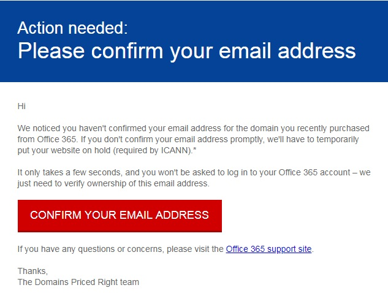

# ICANN la comprobación de la información de contactoICANN Verification of Contact Information

Al comprar un dominio o realizar cambios en la información de contacto de un dominio, se necesita el registrador para validar la información de contacto para cumplir con las regulaciones ICANN.When you purchase a domain or make changes to the contact information for a domain, the registrar is required to validate your contact information to comply with ICANN regulations.

Para la validación, se envía un correo electrónico a la dirección de la persona registrada.For validation, an email is sent to the registrant's address.

 **Para comprobar la información de contacto, selecciona el vínculo en el correo electrónico de verificación.****To verify your contact information, select the link in the verification email.** Si los propietarios del dominio no comprueban la dirección de correo electrónico, se suspenderá el dominio.If the domain owners don't verify the the email address, the domain will be suspended. A continuación, vaya a la [Página dominios](https://admin.microsoft.com/adminportal/home?ref=Domains) en el centro de administración y compruebe el estado del dominio.Then, go to the [Domains page](https://admin.microsoft.com/adminportal/home?ref=Domains) in the admin center and check your domain status.

El correo electrónico tendrá un aspecto similar al siguiente:The email will look like this:

