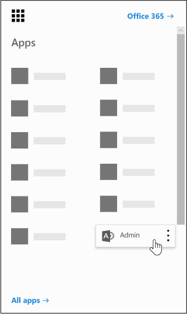

# Power BI en su organizaciónPower BI in your organization

Esta página describe cómo los usuarios de su organización pueden usar Power BI y cómo puede controlar el modo en que la organización adquiere este servicio.This page describes how users in your organization can use Power BI and how you can control how your organization acquires this service.
    
## ¿Qué es Power BI?What is Power BI?

Microsoft Power BI permite a los usuarios visualizar datos, compartir descubrimientos y colaborar de maneras nuevas e intuitivas. Para obtener más información, consulte el [sitio Web de Power BI](https://powerbi.microsoft.com/en-us/).Microsoft Power BI enables users to visualize data, share discoveries, and collaborate in intuitive new ways. To learn more, see the [Power BI Web site](https://powerbi.microsoft.com/en-us/).
  
## ¿Power BI cumple los requisitos de cumplimiento nacionales, regionales y específicos del sector?Does Power BI meet national, regional, and industry-specific compliance requirements?

Para obtener más información sobre el cumplimiento de Power BI, consulte el [centro de confianza de Microsoft](https://go.microsoft.com/fwlink/?LinkId=785324).To learn more about Power BI compliance, see the [Microsoft Trust Center](https://go.microsoft.com/fwlink/?LinkId=785324).
  
## ¿Cómo se registran los usuarios en Power BI?How do users sign up for Power BI?

Como administrador, puede registrarse en Power BI a través del [sitio web de Power BI](https://powerbi.microsoft.com/en-us/).As an administrator, you can sign up for Power BI through the [Power BI web site](https://powerbi.microsoft.com/en-us/). También puede registrarse a través de la página servicios de compra en el centro de administración de Microsoft 365.You can also sign up through the purchase services page on the Microsoft 365 admin center. Cuando un administrador se registra en Power BI, puede asignar licencias de suscripción a usuarios que deberían tener acceso.When an administrator signs up for Power BI, they can assign user subscription licenses to users who should have access.
  
Además, los usuarios individuales en su organización pueden registrarse en Power BI a través del [sitio web de Power BI](https://powerbi.microsoft.com/en-us/). Cuando un usuario de su organización se registra en Power BI, se le asigna automáticamente una licencia de Power BI.Additionally, individual users in your organization may be able to sign up for Power BI through the [Power BI web site](https://powerbi.microsoft.com/en-us/). When a user in your organization signs up for Power BI, that user is assigned a Power BI license automatically.
  
## ¿Cómo se registran los usuarios individuales de mi organización?How do individual users in my organization sign up?

Hay tres posibles situaciones para los usuarios de su organización:There are three scenarios that might apply to users in your organization:
  
### Situación 1: La organización ya tiene un entorno existente de Office 365 y el usuario que se registra en Power BI ya tiene una cuenta de Office 365.Scenario 1: Your organization already has an existing Office 365 environment and the user signing up for Power BI already has an Office 365 account.

En este caso, si un usuario ya tiene una cuenta profesional o educativa en el inquilino (por ejemplo, contoso.com) pero aún no tiene Power BI, Microsoft simplemente activa el plan para dicha cuenta y se notificará automáticamente al usuario cómo usar el servicio Power BI.In this scenario, if a user already has a work or school account in the tenant (for example, contoso.com) but does not yet have Power BI, Microsoft will simply activate the plan for that account, and the user will automatically be notified of how to use the Power BI service.
  
### Situación 2: La organización tiene un entorno existente de Office 365 y el usuario que se registra en Power BI no tiene una cuenta de Office 365.Scenario 2: Your organization has an existing Office 365 environment and the user signing up for Power BI doesn't have an Office 365 account.

En este caso, el usuario tiene una dirección de correo electrónico del dominio de la organización (por ejemplo, contoso.com) pero todavía no tiene una cuenta de Office 365. En este caso, el usuario puede registrarse en Power BI y se le asignará automáticamente una cuenta. Esto permite al usuario acceder al servicio de Power BI. Por ejemplo, si una empleada llamada Natalia utiliza su dirección de correo profesional (por ejemplo, Natalia@contoso.com ) para registrarse, Microsoft agregará automáticamente a Natalia como un usuario del entorno de Office 365 de Contoso y activará Power BI para esa cuenta.In this scenario, the user has an email address in your organization's domain (for example, contoso.com) but does not yet have an Office 365 account. In this case, the user can sign up for Power BI and will automatically be given an account. This lets the user access the Power BI service. For example, if an employee named Nancy uses her work email address (for example, Nancy@contoso.com) to sign up, Microsoft will automatically add Nancy as a user in Contoso's Office 365 environment and activate Power BI for that account.
  
### Situación 3: La organización no tiene un entorno de Office 365 conectado a su dominio de correo electrónico.Scenario 3: Your organization does not have an Office 365 environment connected to your email domain.

La organización no necesita tomar acciones administrativas para aprovechar las ventajas de Power BI.There are no administrative actions your organization needs to take to take advantage of Power BI.
  
> [!IMPORTANT]
> Si su organización tiene varios dominios de correo electrónico y prefiere que todas las extensiones de direcciones de correo electrónico estén en el mismo inquilino, antes de que los usuarios creen el inquilino principal, agregue todos los dominios de direcciones de correo electrónico a ese inquilino antes de que los usuarios creen el inquilino principal.If your organization has multiple email domains and you prefer all email address extensions to be in the same tenant, before any users create your primary tenant, add all email address domains to that tenant before any users create your primary tenant. No hay ningún mecanismo automatizado para mover a los usuarios entre espacios empresariales después de haberlos creado.There is no automated mechanism to move users across tenants after they have been created. Para obtener más información sobre este proceso, vea [si tengo varios dominios, ¿puedo controlar el inquilino de Office 365 al que se agregan los usuarios?](#if-i-have-multiple-domains-can-i-control-the-office-365-tenant-that-users-are-added-to) más adelante en este artículo y [Agregar un dominio a Office 365](../setup/add-domain.md) online.For more information on this process, see [If I have multiple domains, can I control the Office 365 tenant that users are added to?](#if-i-have-multiple-domains-can-i-control-the-office-365-tenant-that-users-are-added-to) later in this article and [Add a domain to Office 365](../setup/add-domain.md) online. 
  
## ¿Cómo cambio la forma en la que administro las identidades de los usuarios en mi organización?How will this change the way I manage identities for users in my organization today?

Si la organización ya tiene un entorno existente de Office 365 y todos los usuarios de su organización tienen cuentas de Office 365, la administración de identidades no cambiará.If your organization already has an existing Office 365 environment and all users in your organization have Office 365 accounts, identity management will not change.
  
Si su organización ya tiene un entorno existente de Office 365 pero no todos los usuarios de su organización tienen cuentas de Office 365, crearemos un usuario en el inquilino y asignaremos licencias según la cuenta profesional o educativa del usuario. Esto significa que el número de usuarios que administra en un tiempo en particular crecerá a medida que los usuarios de su organización se registren en el servicio.If your organization already has an existing Office 365 environment but not all users in your organization have Office 365 accounts, we will create a user in the tenant and assign licenses based on the user's work or school email address. This means that the number of users you are managing at any particular time will grow as users in your organization sign up for the service.
  
Si administra su directorio de forma local y usa Active_Directory_Federation_Services_(AD_FS), Microsoft no agregará usuarios a su inquilino y los usuarios que intenten unirse a su inquilino recibirán un mensaje indicándoles que se pongan en contacto con el administrador de su organización.If you are managing your directory on-premises, and use Active Directory Federation Services (AD FS), Microsoft will not add users to your tenant, and users attempting to join your tenant will receive a message to contact their organization's admin.
  
Si su organización no tiene un entorno de Office 365 conectado al dominio de correo electrónico, no se realizarán cambios en el modo de administrar identidades. Los usuarios se agregarán a un nuevo directorio de usuario exclusivamente en la nube y tendrá la opción de tener el puesto de administrador de inquilino para administrarlos.If your organization does not have an Office 365 environment connected to your email domain, there will be no change in how you manage identity. Users will be added to a new, cloud-only user directory, and you will have the option to elect to take over as the tenant admin and manage them.
  
## ¿Cuál es el proceso para administrar un inquilino creado por Microsoft para mis usuarios?What is the process to manage a tenant created by Microsoft for my users?

Si un inquilino ha sido creado por Microsoft, puede reclamar y administrar dicho inquilino siguiendo estos pasos:If a tenant was created by Microsoft, you can claim and manage that tenant by following these steps:
  
1. Únase al inquilino [registrándose en Power BI](https://go.microsoft.com/fwlink/?LinkId=522448) con un correo electrónico que coincida con el dominio del inquilino que desea administrar. Por ejemplo, si Microsoft ha creado el inquilino contoso.com, deberá unirse al inquilino con una dirección de correo electrónico que termine en @contoso.com.Join the tenant by [signing up for Power BI](https://go.microsoft.com/fwlink/?LinkId=522448) using an email address domain that matches the tenant domain you want to manage. For example, if Microsoft created the contoso.com tenant, you will need to join the tenant with an email address ending with @contoso.com. 
    
2. Solicite el control de administración verificando la propiedad del dominio: una vez que esté en el inquilino, puede ascender al puesto de administrador verificando la propiedad del dominio. Para hacerlo, siga estos pasos:Claim admin control by verifying domain ownership: once you are in the tenant, you can promote yourself to the admin role by verifying domain ownership. To do so, follow these steps:
 
::: moniker range="o365-worldwide"
   
3. Vaya a [https://admin.microsoft.com](https://admin.microsoft.com).Go to [https://admin.microsoft.com](https://admin.microsoft.com).
 

::: moniker-end

::: moniker range="o365-germany"

3. Vaya a [https://portal.office.de](https://portal.office.de).Go to [https://portal.office.de](https://portal.office.de).

::: moniker-end

::: moniker range="o365-21vianet"

3. Vaya a [https://portal.partner.microsoftonline.cn](https://portal.partner.microsoftonline.cn).Go to [https://portal.partner.microsoftonline.cn](https://portal.partner.microsoftonline.cn).

::: moniker-end

    
4. Seleccione el icono del iniciador de aplicaciones en la esquina superior izquierda y elija **Administrador**.Select the app launcher icon in the upper-left and choose **Admin**.
    
    
  
5. Lea las instrucciones de la página **convertirse en Administrador** y, después **, seleccione Sí, deseo ser el administrador**.Read the instructions on the **Become the admin** page and then select **Yes, I want to be the admin**.
    
    > [!NOTE]
    >  Si esta opción no aparece, ya hay un administrador en su ubicación.If this option doesn't appear, there is already an administrator in place. 
  
## Si tengo varios dominios, ¿puedo controlar el inquilino de Office 365 al que se agregan los usuarios?If I have multiple domains, can I control the Office 365 tenant that users are added to?

Si no hace nada, se creará un inquilino para cada dominio y subdominio de correo electrónico de usuario.If you do nothing, a tenant will be created for each user email domain and subdomain.
  
Si desea que todos los usuarios estén en el mismo inquilino independientemente de sus extensiones de dirección de correo electrónico:If you want all users to be in the same tenant regardless of their email address extensions:
  
- Cree un inquilino de destino con antelación o utilice un inquilino existente y agregue todos los dominios y subdominios existentes que quiera que se consoliden en ese inquilino. A continuación, todos los usuarios con direcciones de correo electrónico que terminen en estos dominios y subdominios se unirán de forma automática al inquilino de destino al registrarse.Create a target tenant ahead of time or use an existing tenant, and add all the existing domains and subdomains that you want consolidated within that tenant. Then all the users with email addresses ending in those domains and subdomains will automatically join the target tenant when they sign up.
    
> [!IMPORTANT]
> No hay ningún mecanismo automatizado compatible para mover los usuarios en los inquilinos una vez que se han creado.There is no supported automated mechanism to move users across tenants once they have been created. Para obtener información sobre cómo agregar dominios a un solo inquilino de Office 365, vea [Agregar un dominio a office 365](../setup/add-domain.md).To learn about adding domains to a single Office 365 tenant, see [Add a domain to Office 365](../setup/add-domain.md). 
  
> [!IMPORTANT]
> Para obtener información adicional y orientación sobre la administración de los inquilinos, vea [¿Qué es la administración de Power BI?](https://docs.microsoft.com/power-bi/service-admin-administering-power-bi-in-your-organization).For additional information and guidance on managing tenants, see [What is Power BI administration?](https://docs.microsoft.com/power-bi/service-admin-administering-power-bi-in-your-organization). 
  
## ¿Cómo puedo evitar que los usuarios se unan al inquilino actual de Office 365?How can I prevent users from joining my existing Office 365 tenant?

Hay pasos que puede realizar como administrador para evitar que los usuarios se unan al inquilino de Office 365 existente.There are steps you can take as an admin to prevent users from joining your existing Office 365 tenant. Si se bloquea esto, se producirá un error en los intentos de inicio de sesión de los usuarios y se les dirigirá para ponerse en contacto con el administrador de su organización. No es necesario que repita este proceso si ya ha deshabilitado la distribución automática de licencias (por ejemplo, Office 365 educación para estudiantes, profesores y personal).If you do block this, users' attempts to sign in will fail and they will be directed to contact their organization's admin. You do not need to repeat this process if you have already disabled automatic license distribution before (e.g. Office 365 Education for Students, Faculty and Staff).
  
Estos pasos requieren el uso de Windows PowerShell. Para empezar a trabajar con Windows PowerShell, consulte la [Guía de introducción a PowerShell](https://go.microsoft.com/fwlink/p/?LinkID=286814).These steps require the use of Windows PowerShell. To get started with Windows PowerShell, see the [PowerShell getting started guide](https://go.microsoft.com/fwlink/p/?LinkID=286814).
  
Para llevar a cabo los pasos siguientes, debe instalar la última versión de 64 bits del [Azure Active Directory Module para Windows PowerShell](https://www.powershellgallery.com/packages/AzureADPreview/2.0.2.5).To perform the following steps, you must install the latest 64-bit version of the [Azure Active Directory Module for Windows PowerShell](https://www.powershellgallery.com/packages/AzureADPreview/2.0.2.5).
  
Una vez seleccionado el vínculo, seleccione **Ejecutar** para ejecutar el paquete del instalador.After you select the link, select **Run** to run the installer package. 
  
 **Deshabilitar la opción de unión automática al inquilino**: utilice este comando de Windows PowerShell para evitar que los nuevos usuarios se unan a un inquilino administrado:**Disable automatic tenant join**: Use this Windows PowerShell command to prevent new users from joining a managed tenant:
  
Para deshabilitar la unión automática al inquilino para nuevos usuarios:  `Set-MsolCompanySettings -AllowEmailVerifiedUsers $false`To disable automatic tenant join for new users:  `Set-MsolCompanySettings -AllowEmailVerifiedUsers $false`
  
Para habilitar la unión automática al inquilino para nuevos usuarios:  `Set-MsolCompanySettings -AllowEmailVerifiedUsers $true`To enable automatic tenant join for new users:  `Set-MsolCompanySettings -AllowEmailVerifiedUsers $true`
  
> [!NOTE]
> Este bloqueo impide que los nuevos usuarios de la organización se inicien sesión en Power BI.This blocking prevents new users in your organization from signing up for Power BI. Los usuarios que se registran en Power BI antes de deshabilitar las nuevas suscripciones para su organización seguirán conservando sus licencias.Users that sign up for Power BI prior to disabling new signups for your organization will still retain their licenses. Vea [¿Cómo Quito Power BI para los usuarios que ya se han registrado?](#how-do-i-remove-power-bi-for-users-that-already-signed-up) para obtener instrucciones sobre cómo quitar el acceso a Power BI para los usuarios que se hayan registrado previamente en el servicio.See the [How do I remove Power BI for users that already signed up?](#how-do-i-remove-power-bi-for-users-that-already-signed-up) for instructions on how you can remove access to Power BI for users that had previously signed up for the service. 
  
## ¿Cómo puedo permitir que los usuarios se unan a mi inquilino actual de Office 365?How can I allow users to join my existing Office 365 tenant?

Para permitir que los usuarios se unan a su inquilino, ejecute el comando contrario como se describe en la pregunta anterior:  `Set-MsolCompanySettings -AllowEmailVerifiedUsers $true`To allow users to join your tenant, run the opposite command as described in the question above:  `Set-MsolCompanySettings -AllowEmailVerifiedUsers $true`
  
## ¿Cómo puedo comprobar si el bloqueo del inquilino está activado?How do I verify if I have the block on in the tenant?

Utilice la siguiente secuencia de comandos de PowerShell:  `Get-MsolCompanyInformation | fl allow*`Use the following PowerShell script:  `Get-MsolCompanyInformation | fl allow*`
  
## ¿Cómo puedo evitar que mis usuarios existentes comiencen a usar Power BI?How can I prevent my existing users from starting to use Power BI?

 **Deshabilitar la distribución automática de licencias:** Use este script de Windows PowerShell para deshabilitar las distribuciones de licencias automáticas para los usuarios existentes.**Disable automatic license distribution:** Use this Windows PowerShell script to disable automatic license distributions for existing users. No es necesario que repita este proceso si ya ha deshabilitado la distribución automática de licencias (por ejemplo, Office 365 educación para estudiantes, profesores y personal).You do not need to repeat this process if you have already disabled automatic license distribution before (e.g. Office 365 Education for Students, Faculty and Staff). 
  
Para deshabilitar la distribución automática de licencias para los usuarios existentes:  `Set-MsolCompanySettings -AllowAdHocSubscriptions $false`To disable automatic license distribution for existing users:  `Set-MsolCompanySettings -AllowAdHocSubscriptions $false`
  
Para habilitar la distribución automática de licencias para los usuarios existentes:  `Set-MsolCompanySettings -AllowAdHocSubscriptions $true`To enable automatic license distribution for existing users:  `Set-MsolCompanySettings -AllowAdHocSubscriptions $true`
  
> [!NOTE]
> La marca *AllowAdHocSubscriptions* se usa para controlar varias capacidades de usuario de la organización, incluida la posibilidad de que los usuarios se registren en el servicio Azure Rights Management.The *AllowAdHocSubscriptions* flag is used to control several user capabilities in your organization, including the ability for users to sign up for the Azure Rights Management Service. El cambio de este indicador afectará a todas estas capacidades.Changing this flag will affect all of these capabilities. 
  
## ¿Cómo puedo permitir que mis usuarios actuales se registren para usar Power BI?How can I allow my existing users to sign up for Power BI?

Para permitir que los usuarios existentes se registren para usar Power BI, ejecute el comando contrario como se describe en la pregunta anterior:  `Set-MsolCompanySettings -AllowAdHocSubscriptions $true`To allow your existing users to sign up for Power BI, run the opposite command as described in the question above:  `Set-MsolCompanySettings -AllowAdHocSubscriptions $true`
  
## ¿Cómo puedo quitar Power BI para los usuarios que ya se han registrado?How do I remove Power BI for users that already signed up?

Si un usuario se registró en Power BI pero ya no desea que tenga acceso a Power BI, puede quitar la licencia individual de Power BI para ese usuario.If a user signed up for Power BI but you no longer want them to have access to Power BI, you can remove the Power BI license for that user.

::: moniker range="o365-worldwide"

> [!NOTE]
> Si no usa el nuevo Centro de administración de Microsoft 365, puede activarlo seleccionando **Probar el nuevo centro de administración** ubicado en la parte superior de la página de inicio.If you're not using the new Microsoft 365 admin center, you can turn it on by selecting the **Try the new admin center** toggle located at the top of the Home page.
  
1. En el centro de administración, vaya a la página **Usuarios** \> <a href="https://go.microsoft.com/fwlink/p/?linkid=834822" target="_blank">Usuarios activos</a>.In the admin center, go to the **Users** \> <a href="https://go.microsoft.com/fwlink/p/?linkid=834822" target="_blank">Active users</a> page.
    
2. Busque el usuario para el que quiera quitar la licencia y, después, seleccione su nombre.Find the user you want to remove the license for, then select their name.
    
3. En la pestaña **licencias y aplicaciones** , desactive la casilla **Microsoft Power BI** .On the **Licenses and Apps** tab, clear the **Microsoft Power BI** check box.
    
4. Seleccione **Guardar cambios**.Select **Save changes**.

::: moniker-end

  
::: moniker range="o365-germany"

1. En el centro de administración, vaya a la página **Usuarios** \> <a href="https://go.microsoft.com/fwlink/p/?linkid=847686" target="_blank">Usuarios activos</a>.In the admin center, go to the **Users** \> <a href="https://go.microsoft.com/fwlink/p/?linkid=847686" target="_blank">Active users</a> page.

2. Busque el usuario para el que quiera quitar la licencia y, después, seleccione su nombre.Find the user you want to remove the license for, then select their name.
    
3. Junto a **licencias de producto**, seleccione **Editar**.Next to **Product licenses**, select **Edit**. 
    
4. Desactivar la opción de **Microsoft Power BI** .Toggle off the **Microsoft Power BI** option.
    
5. Seleccione **Guardar**.Select **Save**.

::: moniker-end

::: moniker range="o365-21vianet"

1. En el centro de administración, vaya a la página **Usuarios** \> <a href="https://go.microsoft.com/fwlink/p/?linkid=850628" target="_blank">Usuarios activos</a>.In the admin center, go to the **Users** \> <a href="https://go.microsoft.com/fwlink/p/?linkid=850628" target="_blank">Active users</a> page.

2. Busque el usuario para el que quiera quitar la licencia y, después, seleccione su nombre.Find the user you want to remove the license for, then select their name.
    
3. Junto a **licencias de producto**, seleccione **Editar**.Next to **Product licenses**, select **Edit**. 
    
4. Desactivar la opción de **Microsoft Power BI** .Toggle off the **Microsoft Power BI** option.
    
5. Seleccione **Guardar**.Select **Save**.

::: moniker-end 

## ¿Cómo puedo saber cuándo se han unido nuevos usuarios a mi inquilino?How do I know when new users have joined my tenant?

Los usuarios que ya se unieron al inquilino como parte del programa tienen asignada una única licencia por que puede filtrar en su panel de usuarios activos en el panel de administrador.Users who have joined your tenant as part of this program are assigned a unique license that you can filter on within your active user pane in the admin dashboard.
  
Para crear esta nueva vista, en el centro de administración, siga los pasos para [crear una vista de usuario personalizada](../add-users/create-edit-or-delete-a-custom-user-view.md#create-a-custom-user-view).To create this new view, in the admin center, follow the steps to in [Create a custom user view](../add-users/create-edit-or-delete-a-custom-user-view.md#create-a-custom-user-view). En **licencia de producto asignada**, seleccione **Microsoft Power BI**.Under **Assigned product license**, select **Microsoft Power BI**. Una vez creada la nueva vista, podrá ver todos los usuarios de su espacio empresarial que se han inscrito en este programa.After the new view has been created, you will be able to see all the users in your tenant who have enrolled in this program.
  
## ¿Debería estar preparado para alguna otra cuestión?Are there any additional things I should be prepared for?

Puede experimentar un aumento de solicitudes de recuperación de contraseña.You might experience an increase in password reset requests. Para obtener más información sobre este proceso, vea [Restablecer la contraseña de un usuario](../add-users/reset-passwords.md).For information about this process, see [Reset a user's password](../add-users/reset-passwords.md).
  
Puede quitar a un usuario de su espacio empresarial mediante el proceso estándar en el centro de administración.You can remove a user from your tenant via the standard process in the admin center. Sin embargo, si el usuario aún tiene una dirección de correo electrónico activa de su organización, podrá unirse de nuevo a menos que lo bloquee.However, if the user still has an active email address from your organization, they will be able to rejoin unless you block all users from joining.
  
## ¿Por qué se muestra 1 millón de licencias para Microsoft Power BI en mi inquilino de Office 365?Why did 1 million licenses for Microsoft Power BI show up in my Office 365 tenant?

Como organización cualificada, los usuarios de la organización pueden usar el servicio Microsoft Power BI y estas licencias representan la capacidad disponible para nuevos usuarios de Power BI en el espacio empresarial.As a qualifying organization, users in your organization are eligible to use the Microsoft Power BI service and these licenses represent the available capacity for new Power BI users in your tenant. Estas licencias no tienen cargo.There is no charge for these licenses. Si ha elegido permitir que los usuarios se suscriban a Power BI, se les asignará una de estas licencias gratuitas cuando completen el proceso de registro.If you've chosen to allow users to sign up for Power BI themselves, they will be assigned one of these available free licenses when they complete the sign up process. También puede elegir asignar estas licencias a los usuarios a través del centro de administración.You can also choose to assign these licenses to users yourself through the admin center.
  
## ¿Es este gratuito?Is this free? ¿Se me cobrará por estas licencias?Will I be charged for these licenses?

Estas licencias son para la versión gratuita de Power BI. Si está interesado en otras capacidades, eche un vistazo a la versión Power BI Pro.These licenses are for the free version of Power BI. If you're interested in additional capabilities, take a look at the Power BI Pro version.
  
## ¿Por qué un millón de licencias?Why 1 million licenses?

Elegimos un número lo suficientemente grande como para que la mayoría de las organizaciones tuvieran licencias para proporcionar este beneficio sin demora a sus usuarios.We chose a number that was large enough that the majority of organizations would have ample licenses to provide this benefit without delay to their users.
  
## ¿Qué debo hacer si necesito más de un millón de licencias?What if I need more than 1 million licenses?

Póngase en contacto con el representante de su cuenta de Microsoft para obtener más información si necesita adquirir licencias adicionales.Contact your Microsoft account representative for more information if you will need to acquire additional licenses.