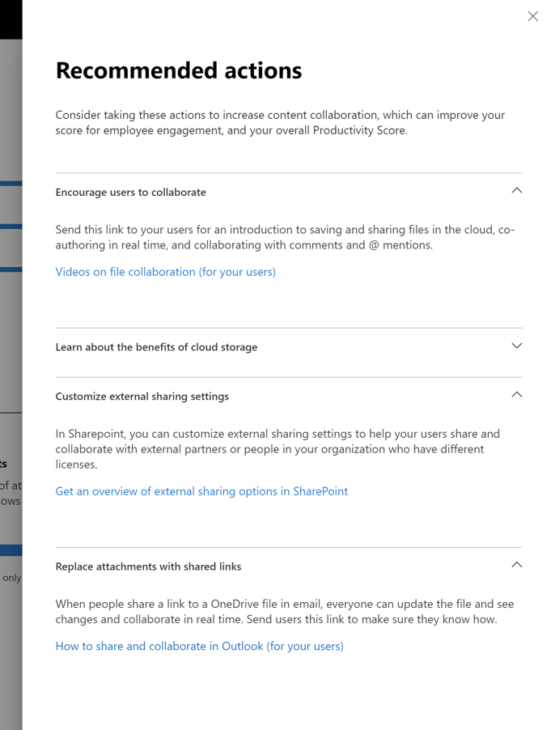

# Puntuación de productividad de Microsoft (versión preliminar)

Microsoft 365 ofrece soluciones de productividad que permiten a su organización cumplir sus objetivos empresariales. La puntuación de productividad proporciona información para usar estas soluciones que se pueden transformar en el modo en que se realiza el trabajo.Contiene: 

- **Visibilidad** al ayudarles a comprender cómo trabajan las personas en forma de su puntuación actual con un desglose entre categorías de experiencia de los empleados y experiencia tecnológica (próximamente). 
- **Información** sobre cómo identificar oportunidades para habilitar experiencias mejoradas. 
- **Acciones** para actualizar las habilidades y los sistemas para que todos los usuarios puedan hacer su mejor trabajo. 

La puntuación y la información están presentes en dos categorías:  

- **Experiencia de los empleados:** muestra cómo Microsoft 365 está ayudando a crear un personal productivo y dedicado mediante la cuantificación del modo en que los usuarios colaboran en el contenido, trabajan en cualquier lugar, comprenden los estilos de comunicación (próximamente) y desarrollan una cultura de la reunión (próximamente) 

- **Experiencia tecnológica** (próximamente): le ayuda a optimizar sus experiencias de dispositivo, como corregir de forma proactiva los problemas comunes del Departamento de soporte técnico, y mejorar el tiempo de inicio del equipo y la red para asegurarse de que las aplicaciones funcionan correctamente.  

## Cómo funciona

### Áreas de puntuación 

Dentro de cada categoría de puntuación, la puntuación de productividad proporciona información sobre la transformación de trabajo en las áreas. Las áreas cubiertas dentro de la experiencia de los empleados son:

- Colaborar en el contenido  
- Trabajar en cualquier lugar 
- Descripción de los estilos de comunicación (próximamente) 
- Desarrollar una cultura de la reunión (próximamente) 

### Puntuación de acciones de usuario 

Dentro de cada área, medimos las acciones clave basadas en investigación que representan las maneras de trabajar que permiten a las organizaciones transformar en una organización altamente productiva. Para cada área, calculamos el% de los usuarios que realizan estas acciones en los últimos 28 días. 

La puntuación de la experiencia del empleado es creados como una puntuación media en todas las áreas. Tenga en cuenta que seguiremos agregando más áreas a la experiencia de los empleados y a la experiencia tecnológica a lo largo del tiempo. 

### Productos incluidos en la puntuación de productividad 

La puntuación de productividad incluye actualmente señales de las cargas de trabajo de Microsoft 365: OneDrive, SharePoint, Word, Excel, PowerPoint, OneNote, Outlook, Yammer, Teams, Skype. 

La puntuación se actualiza diariamente y refleja las acciones del usuario completadas en los últimos 28 días (incluido el día actual).

## Acceso y permisos necesarios 

Para la experiencia de los empleados, debe tener una suscripción a un plan de Office 365 para la empresa o a un plan de negocio de Microsoft 365 con varios usuarios. 

Para tener permiso de acceso a la puntuación de productividad de Microsoft, debe tener los siguientes roles: 

- Administrador global 
- Administradores de Exchange 
- Administradores de SharePoint 
- Administradores de Skype Empresarial 
- Administrador de Teams 
- Lector global 
- Lector de informes 

Puede tener acceso a la experiencia desde la Página principal de administración de Microsoft 365 eligiendo **informes** > de**puntuación de productividad** en el panel de navegación izquierdo.

## Interpretación de la puntuación de productividad 

### Obtener información sobre cómo funciona la organización 

la página de inicio de puntuación de productividad proporciona la puntuación y el historial actuales en un porcentaje, información primaria sobre áreas de cada categoría de puntuación complementadas con benchmarks. 

1.**la puntuación de productividad** se muestra en un porcentaje, así como en <numerator> / <denominator> el formato, de modo que también puede ver los puntos absolutos (Numerator) y los puntos máximos posibles  
1. Esta tabla dinámica le permite seleccionar la categoría de puntuación en la que desea centrarse. En la vista previa, solo puede ver la **experiencia del empleado**, pero la selección se expandirá pronto para incluir **experiencia tecnológica**. 
1. Las pruebas comparativas **del mismo nivel** le permiten comparar su puntuación actual con organizaciones como usted. La medida del Banco de pruebas se calcula como el promedio de las medidas dentro de un conjunto de organizaciones similares. El conjunto está compuesto por organizaciones que tienen un número similar de usuarios habilitados, región, los tipos de licencias que posee, la industria y la permanencia dentro de Microsoft 365 u Office 365. 
1. La sección **categorías de puntuación** proporciona un desglose de la puntuación de productividad con benchmarks por categoría.
1. **Historial de puntuación** muestra cómo se ha movido su puntuación en cada categoría en los últimos 6 meses.
1. El conocimiento principal para **colaborar en el contenido** muestra las medidas pertinentes con benchmarks de esta área que contribuyen a la puntuación. Seleccione **Ver detalles** para ver la página de detalles del área.
1. La información principal para **trabajar en cualquier lugar** muestra las medidas pertinentes con benchmarks de esta área que contribuyen a la puntuación. Seleccione **Ver detalles** para ver la página de detalles del área.  

### Información sobre cómo identificar oportunidades para mejorar las experiencias 

Para cada área, seleccione **Ver detalles** en el panel de información principal para ver la página de detalles de área que muestra información adicional, la investigación y las acciones relacionadas para mejorar su puntuación. .

Todas las páginas de detalles de área siguen la estructura siguiente: 

- Parte superior izquierda: información principal guardada desde la Página principal.
- Parte inferior izquierda: admitir información con acciones contextuales.  
- Right: investigación académica que muestra la relación entre el área y la productividad.

Además, toda la información contiene los siguientes elementos: 

- Header: impresiones o resultados clave que se controlan para cada conocimiento;
- Resumen: una explicación más detallada sobre por qué las medidas en la información son importantes para la productividad de su organización. 
- Visualización de datos: cuantifica visualmente el puesto de su organización con respecto a las medidas en la visión de los benchmarks según corresponda.
- Acciones: acción contextual que puede ayudar a impulsar más el resultado deseado por la visión y, de este modo, mejorar su puntuación.

### Página de detalles del área: colaborar en el contenido 

La página colaborar en el contenido contiene la información principal de la página de inicio de la puntuación de productividad. Tiene los siguientes componentes:

1. Header: cuantifica qué porcentaje de los usuarios están colaborando en el contenido (resultado clave).
1. Body: más información sobre cómo la colaboración aumentada conduce a una mayor productividad.
1. Visualización: esto cuantifica visualmente cada elemento que contribuye a la puntuación de esta área con pruebas comparativas:

    - **Lectores**: cuantifica a los usuarios que obtienen acceso o descargan archivos en la nube (OneDrive y SharePoint) en una base de usuarios habilitados para OneDrive y SharePoint.
    - **Autores**: cuantifica a los usuarios que modifican, cargan, sincronizan, protegen, copian o mueven archivos en la nube (OneDrive y SharePoint) en una base de usuarios habilitados para OneDrive y SharePoint.
    - **Colaboradores**: cuantifica a los usuarios que colaboran en los archivos de la nube (OneDrive y SharePoint) en una base de usuarios habilitados para OneDrive y SharePoint. Dos usuarios son colaboradores si uno de ellos ha leído o editado un documento de Word, Excel, PowerPoint, OneNote o PDF en la nube después de haber sido creado o modificado en un período de 28 días.

1. **Por qué es importante se** proporciona un resumen de la investigación vinculando la colaboración en los archivos de la nube con la productividad. **Lea la investigación de Forrester** va a un artículo de investigación que proporciona más contexto sobre cómo favorece la colaboración para aumentar la productividad.
1. Admitir la información sobre la **colaboración en varios archivos** cuantifica el modo en que los usuarios de la organización colaboran en archivos diferentes. 
1. Admitir información sobre el **uso compartido de archivos** en la nube cuantifica si los usuarios están compartiendo contenido en la nube mientras dibujan la distinción entre uso compartido interno y externo.
1. Admitir información sobre el **correo electrónico los archivos en la nube** cuantifica si los usuarios que comparten archivos a través del correo electrónico usan datos adjuntos frente a vínculos a archivos de la nube.

Los tipos de archivo considerados para la colaboración son Word/Excel/PowerPoint/OneNote/PDF.

### Página de detalles de área: trabajo en cualquier lugar 

La página trabajar en cualquier lugar cuantifica los usuarios (como un porcentaje y un valor absoluto) que usó al menos una aplicación de productividad en dos o más plataformas, que son de escritorio, móviles y Web. Los usuarios obtienen un mayor nivel de puntuación para usar más aplicaciones y plataformas. Las aplicaciones que se consideran son Outlook, Teams, Word, Excel, PowerPoint, OneNote, Yammer y Skype. La base de la información está habilitada para los usuarios de Office 365 ProPlus, Exchange, Yammer, Skype o Teams.

1. **Por qué es importante se** proporciona un resumen de la investigación que vincula el uso de varias plataformas a una mayor productividad. **Lea la investigación de Forrester** va a un artículo de investigación que proporciona más contexto sobre cómo el trabajo en todo es propicio a la mayor productividad.
1. Admitir la comprensión del **correo electrónico en cualquier lugar** cuantifica el número de usuarios de la organización mediante Outlook en todas las plataformas dentro de la base de usuarios activos en Outlook.
1. La compatibilidad de la información sobre **chat en cualquier lugar** cuantifica la forma en que los usuarios de la organización usan Microsoft Teams en las distintas plataformas dentro de los usuarios activos en Teams.
1. Apoyar la información sobre el **acceso a documentos de Office en cualquier lugar** cuantifica la forma en que los usuarios de su organización usan Word, Excel, PowerPoint y OneNote entre plataformas dentro de la base de usuarios activos en Word, Excel, PowerPoint o OneNote.

### Acciones para actualizar sistemas y habilidades 

Para favorecer la capacidad de la acción, cada información auxiliar incluye acciones en línea que pueden ayudar a transformar la experiencia de los empleados, algunas de las cuales pueden ser cambios de configuración o campañas de conciencia. Al hacer clic en estas llamadas a la acción se abre en las opciones de panel acciones recomendadas que puede considerar. Actualmente están habilitadas las acciones de la **colaboración en el contenido** .

1. Las **acciones de vista** se redirigen a un panel en el que se enumeran todas las acciones relacionadas con la colaboración en el contenido.
1. **Anime a los usuarios a colaborar** en una lista de vídeos guía sobre la colaboración con temas como la co-autoría y la @mentions. 
1. Personalización de la configuración de **uso compartido externo** va a una página con información general sobre el uso compartido externo que describe lo que ocurre cuando los usuarios comparten recursos, en función de lo que comparten y con los que están compartiendo.  
1. **Reemplazar datos adjuntos con vínculos compartidos** va a una página que explica cómo compartir vínculos de OneDrive en lugar de datos adjuntos por correo electrónico para una mejor colaboración.

Al seleccionar cualquiera de los botones de acción se abre el panel **acciones recomendadas** de la derecha, que contiene un resumen de cada acción y un vínculo a las páginas de documentación.

## Queremos conocer su opinión 

Queremos usar el programa de vista previa privada para recopilar comentarios y usar los aprendizajes para crear el producto con usted en el futuro. Puede usar las secciones de **comentarios** del producto y/o ponerse en contacto con el equipo de puntuación de productividad en ProductivityScorePreview@service.microsoft.com.

Para solicitar acceso a la vista previa privada, rellene el formulario https://aka.ms/productivityscorepreviewen.  
