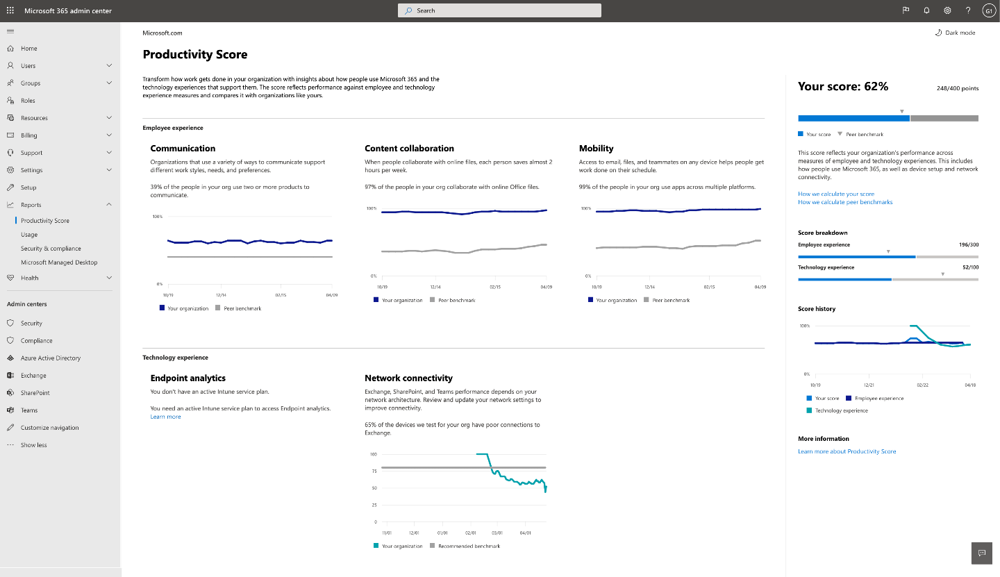

# Puntuación de productividad de MicrosoftMicrosoft Productivity Score 

La puntuación de productividad ayuda a las organizaciones a transformar cómo se realiza el trabajo con información sobre cómo los usuarios usan Microsoft 365 y las experiencias tecnológicas que los admiten.Productivity Score helps organizations transform how work gets done with insights about how people use Microsoft 365 and the technology experiences that support them. La puntuación refleja el rendimiento de su organización con respecto a los usuarios y a las experiencias tecnológicas, y compara su puntuación con organizaciones como la suya.The score reflects your organization’s performance against people and technology experiences measures and compares your score with organizations like yours.

La puntuación incluye:The score includes:

- **Métricas** que le ayudarán a ver cómo los usuarios usan productos de 365 de Microsoft para colaborar, comunicarse y trabajar en todas las plataformas.**Metrics** to help you see how people are using Microsoft 365 products to collaborate, communicate, and work across platforms.
- **Información acerca de** los datos para ayudarle a identificar las oportunidades para mejorar la productividad y la satisfacción de los empleados.**Insights** about the data to help you identify opportunities to improve employee productivity and satisfaction.
- **Acciones recomendadas** que puede llevar a cabo para ayudar a las personas de su organización a usar los productos de Microsoft 365 de forma eficaz para que todos los usuarios puedan realizar su mejor trabajo.**Recommended actions** you can take to help the people in your organization use Microsoft 365 products efficiently so everyone can do their best work.

Proporcionamos datos, información y recomendaciones en dos áreas:We provide data, insights, and recommendations in two areas: 

- **Experiencias de personas:** Mide cómo colaboran los usuarios en el contenido, cómo usan los productos de 365 de Microsoft para comunicarse y si usan Microsoft 365 en varias plataformas.**People experiences:** Measures how people collaborate on content, how they use Microsoft 365 products to communicate, and whether they use Microsoft 365 across multiple platforms. 

    Proporcionamos esta información porque cuando los usuarios colaboran en línea, ahorran tiempo y, con la libertad de trabajar en cualquier dispositivo, su productividad es más productiva y satisfactoria.We provide these insights because when people collaborate online, they save time, and with the freedom to work on any device makes then more productive and satisfied. La capacidad de comunicarse de una manera flexible hace que los usuarios sean más eficientes, capaces de formar mejores relaciones, por lo que su organización es más unificada.The ability to communicate in a flexible way makes people more efficient, able to form better relationships therefore making your organization more unified. Para obtener evidencia, consulte [Forrester Report](https://vc2prod.blob.core.windows.net/vc-resources/TEIStudies/TEI%20of%20Microsoft%20365%20E5%20-%20Oct%202018.pdf).For evidence, see [Forrester report](https://vc2prod.blob.core.windows.net/vc-resources/TEIStudies/TEI%20of%20Microsoft%20365%20E5%20-%20Oct%202018.pdf).

- **Experiencias tecnológicas:** La productividad depende de una tecnología fiable y con buen rendimiento, así como del uso eficaz de Microsoft 365.**Technology experiences:** Productivity depends on reliable and well performing technology as well as the efficient use of Microsoft 365. Proporcionamos [análisis de extremos](https://aka.ms/endpointanalytics), que le ayuda a comprender cómo la productividad de los usuarios puede verse afectada por problemas de rendimiento y estado con el hardware y software de extremo.We provide [endpoint analytics](https://aka.ms/endpointanalytics), which helps you understand how your users’ productivity can be impacted by performance and health issues with your endpoint hardware and software. También proporcionamos acciones recomendadas para corregirlos, así como la información de conectividad de red de Microsoft 365 para su organización.We also provide recommended actions to remediate them as well as Microsoft 365 network connectivity insights for your organization.

Consulte [What is Endpoint Analytics](https://docs.microsoft.com/mem/analytics/overview) para obtener información general y requisitos previos.See [What is Endpoint Analytics](https://docs.microsoft.com/mem/analytics/overview) for an overview and prerequisite details. Para obtener más información acerca de la información de conectividad de red 365 de Microsoft, lea [la introducción a la conectividad de red](https://docs.microsoft.com/microsoft-365/enterprise/microsoft-365-networking-overview).To learn more about Microsoft 365 network connectivity insights, read [the network connectivity overview](https://docs.microsoft.com/microsoft-365/enterprise/microsoft-365-networking-overview).
  

## Cómo se calcula la puntuaciónHow the score is calculated

La puntuación de productividad se basa en los resultados combinados de las categorías de personas y experiencias tecnológicas.Your Productivity Score is based on the combined scores of your people and technology experiences categories. Cada categoría se pondera equitativamente, con un total de 100 puntos.Each category is weighted equally, with a total of 100 points. La mayor puntuación de productividad posible es de 500.The highest possible Productivity Score is 500.

### Categorías de puntuaciónScore categories 

- Colaboración de contenido (100 puntos)Content collaboration (100 points)
- Comunicación (100 puntos)Communication (100 points)
- Mobility (100 puntos)Mobility (100 points)
- Análisis de extremos (100 puntos)Endpoint analytics (100 points)
- Conectividad de red (100 puntos)Network connectivity (100 points)
- **Total posible = 500 puntos****Total possible = 500 points**
 
 En cada categoría, identificamos patrones para actividades clave que son indicadores sobre cómo los usuarios usan los productos de 365 de Microsoft para colaborar, comunicarse y trabajar en todas las plataformas.In each category, we identify patterns for key activities that are indicators for how people use Microsoft 365 products to collaborate, communicate, and work across platforms. Proporcionamos vistas de las actividades clave de 28 días y 180 días.We provide 28-day and 180-day views of the key activities. También proporcionamos métricas auxiliares que no forman parte del cálculo de la puntuación, pero son importantes para ayudarle a identificar los comportamientos y configuraciones subyacentes en los que puede actuar.We also provide supporting metrics that are not part of the score calculation but are important for helping you identify underlying behaviors and settings that you can act on.

### Productos incluidos en la puntuación de productividadProducts included in Productivity Score 

La puntuación de productividad incluye datos de Exchange, SharePoint, OneDrive, Teams, Word, Excel, PowerPoint, OneNote, Outlook, Yammer y Skype.Productivity Score includes data from Exchange, SharePoint, OneDrive, Teams, Word, Excel, PowerPoint, OneNote, Outlook, Yammer, and Skype.

La puntuación se actualiza diariamente y refleja las acciones del usuario completadas en el último 28 (incluido el día actual).Your score is updated daily and reflects user actions completed in the last 28 (including the current day).

## Requisitos previosPre-requisites 

Para que los usuarios experimenten datos, necesita una suscripción de Microsoft 365 para empresas o Office 365 para empresas, y necesita usar los servicios en la nube multiinquilino.To get people experiences data you need a Microsoft 365 for business or Office 365 for enterprise subscription, and you need to be using multi-tenant cloud services. Para obtener datos de análisis de extremos para el espacio empresarial, debe agregar Microsoft Intune a su suscripción.To get endpoint analytics data for your tenant, you need to add Microsoft Intune to your subscription. Intune le ayuda a proteger los datos de su organización mediante la administración de dispositivos y aplicaciones.Intune helps you protect your organization’s data by managing devices and apps.       Una vez que tenga Intune, puede activar el análisis de extremo en la experiencia de Intune.Once you have Intune, you can turn on endpoint analytics within the Intune experience. Obtenga más información sobre Microsoft Intune.Learn more about Microsoft Intune. 

Para ver la puntuación de productividad de su organización, debe tener uno de los siguientes roles:To view the Productivity Score for your organization, you must have of one of the following roles: 

- Administrador globalGlobal admin 
- Administradores de ExchangeExchange admins
- Administrador de SharePointSharePoint admin 
- Administrador de Skype EmpresarialSkype for Business admin 
- Administrador de TeamsTeams admin 
- Lector globalGlobal Reader 
- Lector de informesReports Reader 

Puede tener acceso a la experiencia desde la Página principal de administración de Microsoft 365 en **Reports**  >  **score score** .You can access the experience from Microsoft 365 Admin home under **Reports** > **Productivity Score** .

## Interpretación de la puntuación de productividadInterpreting Productivity Score 

La página de inicio de la puntuación de productividad muestra el historial de puntuación y la puntuación totales y la información principal de cada categoría.The Productivity Score home page shows your total score and score history and the primary insight for each category.

**La puntuación** se muestra como un valor porcentual y en puntos.**Your score** is shown as a percent value and in points. Puede ver los puntos en el numerador y los puntos máximos posibles en el denominador.You can see your points in the numerator and the maximum possible points in the denominator.

Las pruebas comparativas **del mismo nivel** le permiten comparar su puntuación con organizaciones como la suya.**Peer benchmarks** allow you to compare your score with organizations like yours. Para las categorías de experiencias de personas, la medida de Benchmark del mismo nivel se calcula como el promedio de medidas dentro de un conjunto de organizaciones similares.For the people experiences categories, the peer benchmark measure is calculated as the average of measures within a set of similar organizations. El conjunto está compuesto por organizaciones en su región con un número similar de usuarios con licencia, tipos de licencias, industria y permanencia con Microsoft 365.The set is composed of organizations in your region with a similar number of licensed users, types of licenses, industry, and tenure with Microsoft 365. 

El punto de referencia del punto de conexión del análisis de extremos incluye objetivos para el rendimiento de inicio de dispositivo y la configuración de software recomendada en función de los valores de la mediana agregada en todos los inquilinos.The endpoint analytics peer benchmark includes targets for device startup performance and recommended software configuration based on aggregated median values across all tenants.

Para la conectividad de red, el benchmark recomendado es de 80 puntos.For network connectivity, the recommended benchmark is 80 points.

La sección de **desglose de puntuación** proporciona un desglose de la puntuación de productividad con los benchmarks de las personas y las áreas de experiencia de tecnología.The **Score breakdown** section provides a breakdown of your Productivity Score with benchmarks by people and technology experience areas.

Historial de puntuación muestra cómo ha cambiado su puntuación en cada categoría en los últimos 6 meses.Score history displays how your score in each category has changed in the past 6 months.

Las áreas experiencias de las **personas** y **experiencias tecnológicas** contienen la visión principal de las categorías de esas áreas.The **People experiences** and **Technology experiences** areas contain the primary insights for the categories in those areas. Puede hacer clic en cada categoría para ver información más detallada.You can click on each category to see deeper insights.

## Páginas de detalles de categoríaCategory details pages

En cada página de detalles de categoría se muestran las métricas principales de conocimiento y apoyo, así como la investigación y las acciones relacionadas que puede realizar para impulsar el cambio en su organización.Each category details page shows the primary insight and supporting metrics as well as related research and actions you can take to drive change in your organization. La investigación apoya la importancia y la lógica que hay tras la información principal de cada categoría.Research supports the importance and rationale behind the primary insights for each category. para obtener más información, [Lea el informe de Forrester](https://vc2prod.blob.core.windows.net/vc-resources/TEIStudies/TEI%20of%20Microsoft%20365%20E5%20-%20Oct%202018.pdf).for more information, [read the Forrester report](https://vc2prod.blob.core.windows.net/vc-resources/TEIStudies/TEI%20of%20Microsoft%20365%20E5%20-%20Oct%202018.pdf).

Las páginas de detalles son:The details pages are:
- [Colaboración de contenido: experiencias de personasContent collaboration – People experiences](content-collaboration.md)
- [Comunicación: experiencias de personasCommunication – People experiences](communication.md)
- [Reuniones: experiencias de personasMeetings – People experiences](meetings.md)
- [Movilidad: experiencias de personasMobility – People experiences](mobility.md)
- [Trabajo en equipo: experiencias de personasTeamwork – People experiences](teamwork.md)
- [Experiencias de tecnología de Microsoft 365, estado de las aplicacionesMicrosoft 365 apps health – Technology experiences](apps-health.md)

## Informe especial de continuidad del negocioBusiness continuity special report

El informe de continuidad empresarial es un informe de inteligencia de trabajo limitado disponible para todos los clientes de Microsoft 365 para ayudarles a guiar a sus organizaciones durante este difícil tiempo.The Business continuity report is a limited-time Workplace Intelligence report available to all Microsoft 365 customers to help them guide their organizations during this challenging time.  

Este informe ayuda a los líderes de negocios a comprender:This report helps business leaders understand: 

- Modo en que la colaboración y la comunicación se ven afectadas por el cambio al trabajo remoto.How collaboration and communication are affected by the shift to remote work. 

- El impacto en el saldo de la vida laboral mientras los usuarios se ajustan a trabajar desde casa.The impact on work-life balance as people adjust to working from home. 

- Si las reuniones remotas admiten la toma de decisiones efectiva.If remote meetings support effective decision-making.

[Obtenga más información sobre el informe de continuidad empresarialLearn more about the Business continuity report](https://aka.ms/bcrps)

[Más información sobre Microsoft GraphLearn more about Microsoft Graph](https://docs.microsoft.com/graph/)

## Queremos conocer su opiniónWe want to hear from you

Comparta sus ideas sobre la puntuación de productividad y sus ideas sobre cómo mejorarla.Share your thoughts about Productivity Score and your ideas about how to improve it. Use las secciones de **comentarios** del producto y/o póngase en contacto con el equipo de puntuación de productividad en ProductivityScorePreview@service.microsoft.com.Use the **Feedback** sections within the product and/or reach out to the Productivity Score team at ProductivityScorePreview@service.microsoft.com.
