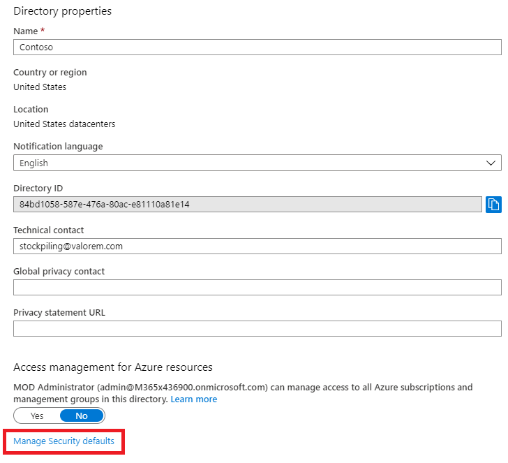
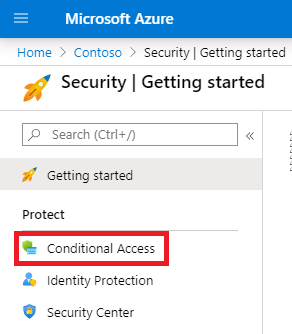
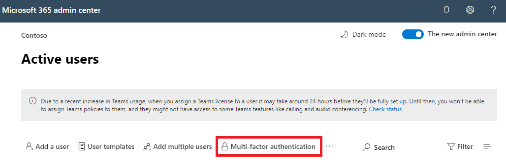

# Autenticación multifactor para Microsoft 365Multi-factor authentication for Microsoft 365

Las contraseñas son el método más común para autenticar un inicio de sesión en un equipo o servicio en línea, pero también son las más vulnerables.Passwords are the most common method of authenticating a sign-in to a computer or online service, but they are also the most vulnerable. Los usuarios pueden elegir contraseñas fáciles y usar las mismas contraseñas para varios inicios de sesión en diferentes equipos y servicios.People can choose easy passwords and use the same passwords for multiple sign-ins to different computers and services.

Para proporcionar un nivel adicional de seguridad para los inicios de sesión, debe usar la autenticación multifactor (MFA), que usa una contraseña, que debe ser segura, y un método de comprobación adicional basado en:To provide an additional level of security for sign-ins, you must use multi-factor authentication (MFA), which uses both a password, which should be strong, and an additional verification method based on:

- Algo que tiene con usted que no se duplica fácilmente, como un teléfono inteligente.Something you have with you that is not easily duplicated, such as a smart phone.
- Algo que tiene de forma única y biológica, como sus huellas digitales, rostro u otro atributo biométrico.Something you uniquely and biologically have, such as your fingerprints, face, or other biometric attribute.

El método de comprobación adicional no se emplea hasta después de comprobar la contraseña del usuario.The additional verification method is not employed until after the user's password has been verified. Con MFA, incluso si se pone en peligro una contraseña de usuario segura, el atacante no tiene el teléfono inteligente ni la huella digital para completar el inicio de sesión.With MFA, even if a strong user password is compromised, the attacker does not have your smart phone or your fingerprint to complete the sign-in.

## Compatibilidad con MFA en Microsoft 365MFA support in Microsoft 365

De forma predeterminada, tanto Microsoft 365 como Office 365 mfa para cuentas de usuario que usan:By default, both Microsoft 365 and Office 365 support MFA for user accounts using:

- Un mensaje de texto enviado a un teléfono que requiere que el usuario escriba un código de verificación.A text message sent to a phone that requires the user to type a verification code.
- Una llamada telefónica.A phone call.
- La Microsoft Authenticator de teléfono inteligente.The Microsoft Authenticator smart phone app.

En ambos casos, el inicio de sesión de MFA usa el método "algo que tienes contigo que no se duplica fácilmente" para la comprobación adicional.In both cases, the MFA sign-in is using the "something you have with you that is not easily duplicated" method for the additional verification. Hay varias maneras de habilitar MFA para Microsoft 365 y Office 365:There are multiple ways in which you can enable MFA for Microsoft 365 and Office 365:

- Con valores predeterminados de seguridadWith security defaults
- Con directivas de acceso condicionalWith Conditional Access policies
- Para cada cuenta de usuario individual (no recomendada)For each individual user account (not recommended)

Estas formas se basan en su Microsoft 365 plan.These ways are based on your Microsoft 365 plan.

|PlanPlan|RecomendaciónRecommendation|Tipo de clienteType of customer|
|---|---|---|
|Todos Microsoft 365 planesAll Microsoft 365 plans|Use valores predeterminados de seguridad, que requieren MFA para todas las cuentas de usuario.Use security defaults, which require MFA for all user accounts. 
 También puede configurar MFA por usuario en cuentas de usuario individuales, pero esto no se recomienda.You can also configure per-user MFA on individual user accounts, but this is not recommended.|Empresa pequeñaSmall business|
|Microsoft 365 Empresa PremiumMicrosoft 365 Business Premium 
 Microsoft 365 E3Microsoft 365 E3 
 Azure Active Directory (Azure AD) Premium licencias P1Azure Active Directory (Azure AD) Premium P1 licenses|Use directivas de acceso condicional para requerir MFA para cuentas de usuario basadas en la pertenencia a grupos, aplicaciones u otros criterios.Use Conditional Access policies to require MFA for user accounts based on group membership, apps, or other criteria.|Pequeña empresa a empresaSmall business to enterprise|
|Microsoft 365 E5Microsoft 365 E5 
 Licencias Premium P2 de Azure ADAzure AD Premium P2 licenses|Use Azure AD Identity Protection para requerir MFA en función de los criterios de riesgo de inicio de sesión.Use Azure AD Identity Protection to require MFA based on sign-in risk criteria.|EmpresaEnterprise|
||||

### Valores predeterminados de seguridadSecurity defaults

Los valores predeterminados de seguridad son una nueva característica para las suscripciones pago o de prueba de Microsoft 365 y Office 365 creadas después del 21 de octubre de 2019.Security defaults is a new feature for Microsoft 365 and Office 365 paid or trial subscriptions created after October 21, 2019. Estas suscripciones tienen activados los valores predeterminados de seguridad, que:These subscriptions have security defaults turned on, which:

- Requiere que todos los usuarios usen MFA con la Microsoft Authenticator aplicación.Requires all of your users to use MFA with the Microsoft Authenticator app.
- Bloquea la autenticación heredada.Blocks legacy authentication.

Los usuarios tienen 14 días para registrarse en MFA con la aplicación Microsoft Authenticator desde sus teléfonos inteligentes, que comienzan a contar desde la primera vez que inician sesión después de que se hayan habilitado los valores predeterminados de seguridad.Users have 14 days to register for MFA with the Microsoft Authenticator app from their smart phones, which begins from the first time they sign in after security defaults has been enabled. Transcurridos 14 días, el usuario no podrá iniciar sesión hasta que el registro de MFA se haya completado.After 14 days have passed, the user won't be able to sign in until MFA registration is completed.

Los valores predeterminados de seguridad garantizan que todas las organizaciones tengan un nivel básico de seguridad para el inicio de sesión de usuario habilitado de forma predeterminada.Security defaults ensure that all organizations have a basic level of security for user sign-in that is enabled by default. Puede deshabilitar los valores predeterminados de seguridad a favor de MFA con directivas de acceso condicional.You can disable security defaults in favor of MFA with Conditional Access policies.

Los valores predeterminados de seguridad se habilitan o deshabilitan en el panel **Propiedades** de Azure AD en Azure Portal.You enable or disable security defaults from the **Properties** pane for Azure AD in the Azure portal.

Puede usar valores predeterminados de seguridad con cualquier Microsoft 365 plan.You can use security defaults with any Microsoft 365 plan.

Para más información, vea esta [información general de los valores predeterminados de seguridad](/azure/active-directory/fundamentals/concept-fundamentals-security-defaults).For more information, see this [overview of security defaults](/azure/active-directory/fundamentals/concept-fundamentals-security-defaults).

### Directivas de acceso condicionalConditional Access policies

Las directivas de acceso condicional son un conjunto de reglas que especifican las condiciones en las que se evalúan y permiten los inicios de sesión.Conditional Access policies are a set of rules that specify the conditions under which sign-ins are evaluated and allowed. Por ejemplo, puede crear una directiva de acceso condicional que indique lo siguiente:For example, you can create a Conditional Access policy that states:

- Si el nombre de la cuenta de usuario es miembro de un grupo de usuarios a los que se han asignado los roles de administrador de Exchange, de usuarios, de contraseñas, de seguridad, de SharePoint o global, requerir MFA antes de permitir el acceso.If the user account name is a member of a group for users that are assigned the Exchange, user, password, security, SharePoint, or global administrator roles, require MFA before allowing access.

Esta directiva le permite exigir MFA en función de la pertenencia a grupos, en lugar de intentar configurar cuentas de usuario individuales para MFA cuando se asignan o se quitan estos roles de administrador.This policy allows you to require MFA based on group membership, rather than trying to configure individual user accounts for MFA when they are assigned or unassigned from these administrator roles.

También puedes usar directivas de acceso condicional para funcionalidades más avanzadas, como requerir MFA para aplicaciones específicas o que el inicio de sesión se realiza desde un dispositivo compatible, como el portátil que ejecuta Windows 10.You can also use Conditional Access policies for more advanced capabilities, such as requiring MFA for specific apps or that the sign-in is done from a compliant device, such as your laptop running Windows 10.

Las directivas de acceso condicional se configuran **desde** el panel Seguridad de Azure AD en Azure Portal.You configure Conditional Access policies from the **Security** pane for Azure AD in the Azure portal.

Puede usar directivas de acceso condicional con:You can use Conditional Access policies with:

- Microsoft 365 Empresa PremiumMicrosoft 365 Business Premium
- Microsoft 365 E3 y E5Microsoft 365 E3 and E5
- Licencias de Azure AD Premium P1 y Azure AD Premium P2Azure AD Premium P1 and Azure AD Premium P2 licenses

Para pequeñas empresas con Microsoft 365 Empresa Premium, puede usar fácilmente directivas de acceso condicional con los siguientes pasos:For small businesses with Microsoft 365 Business Premium, you can easily use Conditional Access policies with the following steps:

1. Cree un grupo para contener las cuentas de usuario que requieren MFA.Create a group to contain the user accounts that require MFA.
2. Habilite la **directiva Requerir MFA para administradores** globales.Enable the **Require MFA for global admins** policy.
3. Cree una directiva de acceso condicional basada en grupos con esta configuración:Create a group-based Conditional Access policy with these settings:
    - Asignaciones > usuarios y grupos: el nombre del grupo del paso 1 anterior.Assignments > Users and groups: The name of your group from Step 1 above.
    - Asignaciones > o acciones en la nube: todas las aplicaciones en la nube.Assignments > Cloud apps or actions: All cloud apps.
    - Controles de > conceder > conceder acceso > Requerir autenticación multifactor.Access controls > Grant > Grant access > Require multi-factor authentication.
4. Habilite la directiva.Enable the policy.
5. Agregue una cuenta de usuario al grupo creado en el paso 1 anterior y pruebe.Add a user account to the group created in Step 1 above and test.
6. Para requerir MFA para cuentas de usuario adicionales, agrégrelas al grupo creado en el paso 1.To require MFA for additional user accounts, add them to the group created in Step 1.

Esta directiva de acceso condicional le permite implantar el requisito de MFA a los usuarios a su propio ritmo.This Conditional Access policy allows you to roll out the MFA requirement to your users at your own pace.

Las empresas deben usar [directivas comunes de acceso condicional](/azure/active-directory/conditional-access/concept-conditional-access-policy-common) para configurar las siguientes directivas:Enterprises should use [Common Conditional Access policies](/azure/active-directory/conditional-access/concept-conditional-access-policy-common) to configure the following policies:

- [Requerir MFA para los administradoresRequire MFA for administrators](/azure/active-directory/conditional-access/howto-conditional-access-policy-admin-mfa)
- [Requerir MFA para todos los usuariosRequire MFA for all users](/azure/active-directory/conditional-access/howto-conditional-access-policy-all-users-mfa)
- [Bloquear la autenticación heredadaBlock legacy authentication](/azure/active-directory/conditional-access/howto-conditional-access-policy-block-legacy)

Para más información, vea esta [información general sobre el acceso condicional](/azure/active-directory/conditional-access/overview).For more information, see this [overview of Conditional Access](/azure/active-directory/conditional-access/overview).

### Azure AD Identity ProtectionAzure AD Identity Protection

Con Azure AD Identity Protection, puede crear una directiva de acceso condicional adicional para requerir MFA cuando el riesgo de inicio de sesión [es medio o alto.](../../security/office-365-security/identity-access-policies.md#require-mfa-based-on-sign-in-risk)With Azure AD Identity Protection, you can create an additional Conditional Access policy to [require MFA when sign-in risk is medium or high](../../security/office-365-security/identity-access-policies.md#require-mfa-based-on-sign-in-risk).

Puede usar Azure AD Identity Protection y directivas de acceso condicional basadas en riesgos con:You can use Azure AD Identity Protection and risk-based Conditional Access policies with:

- Microsoft 365 E5Microsoft 365 E5
- Licencias Premium P2 de Azure ADAzure AD Premium P2 licenses

Para más información, vea esta [información general sobre la protección de identidad de Azure AD Identity Protection](/azure/active-directory/identity-protection/overview-identity-protection).For more information, see this [overview of Azure AD Identity Protection](/azure/active-directory/identity-protection/overview-identity-protection).

### MFA heredada por usuario (no recomendada)Legacy per-user MFA (not recommended)

Debe usar los valores predeterminados de seguridad o las directivas de acceso condicional para requerir MFA para los inicios de sesión de la cuenta de usuario. Sin embargo, si cualquiera de estos no se puede usar, Microsoft recomienda encarecidamente MFA para cuentas de usuario que tienen roles de administrador, especialmente el rol de administrador global, para cualquier suscripción de tamaño.You should be using either security defaults or Conditional Access policies to require MFA for your user account sign-ins. However, if either of these cannot be used, Microsoft strongly recommends MFA for user accounts that have administrator roles, especially the global administrator role, for any size subscription.

Puede habilitar MFA para cuentas de usuario individuales desde el **panel usuario** activo del centro Microsoft 365 administración.You enable MFA for individual user accounts from the **Active user** pane of the Microsoft 365 admin center.

Después de habilitarse, la próxima vez que el usuario inicia sesión, se le pedirá que se registre en MFA y que elija y pruebe el método de comprobación adicional.After being enabled, the next time the user signs in, they will be prompted to register for MFA and to choose and test the additional verification method.

### Usar estos métodos conjuntamenteUsing these methods together

Esta tabla muestra los resultados de habilitar MFA con los valores predeterminados de seguridad, las directivas de acceso condicional y la configuración de cuenta por usuario.This table shows the results of enabling MFA with security defaults, Conditional Access policies, and per-user account settings.

|*Elemento**Item*|HabilitadoEnabled|DeshabilitadoDisabled|Método de autenticación secundarioSecondary authentication method|
|---|---|---|---|
|**Valores predeterminados de seguridad****Security defaults**|No se pueden usar directivas de acceso condicionalCan't use Conditional Access policies|Se pueden usar directivas de acceso condicionalCan use Conditional Access policies|Aplicación Microsoft AuthenticatorMicrosoft Authenticator app|
|**Directivas de acceso condicional****Conditional Access policies**|Si hay alguno habilitado, no puede habilitar los valores predeterminados de seguridadIf any are enabled, you can't enable security defaults|Si se deshabilitan todos, puede habilitar los valores predeterminados de seguridadIf all are disabled, you can enable security defaults|Especificado por el usuario durante el registro de MFAUser-specified during MFA registration|
|**MFA heredada por usuario (no recomendada)****Legacy per-user MFA (not recommended)**|Invalida los valores predeterminados de seguridad y las directivas de acceso condicional que requieren MFA en cada inicio de sesiónOverrides security defaults and Conditional Access policies requiring MFA at each sign in|Invalidadas por valores predeterminados de seguridad y directivas de acceso condicionalOverridden by security defaults and Conditional Access policies|Especificado por el usuario durante el registro de MFAUser-specified during MFA registration|
||||

Si los valores predeterminados de seguridad están habilitados, se pedirá a todos los usuarios nuevos el registro de MFA y el uso de la aplicación Microsoft Authenticator en su siguiente inicio de sesión.If security defaults are enabled, all new users are prompted for MFA registration and the use of the Microsoft Authenticator app at their next sign-in.

## Formas de administrar la configuración de MFAWays to manage MFA settings

Hay dos formas de administrar la configuración de MFA.There are two ways to manage MFA settings.

En Azure Portal, puede:In the Azure portal, you can:

- Habilitar y deshabilitar valores predeterminados de seguridadEnable and disable security defaults
- Configurar directivas de acceso condicionalConfigure Conditional Access policies

En el centro Microsoft 365 administración, puede configurar la configuración de MFA por usuario y servicio.In the Microsoft 365 admin center, you can configure per-user and service MFA settings.

## Pasos siguientesNext steps

[Configurar MFA para Microsoft 365Set up MFA for Microsoft 365](set-up-multi-factor-authentication.md)

## Contenido relacionadoRelated content

[Activar la autenticación multifactor](../../business-video/turn-on-mfa.md) (vídeo)[Turn on multi-factor authentication](../../business-video/turn-on-mfa.md) (video)\
[Activar la autenticación multifactor para su teléfono (Vídeo)](../../business-video/set-up-mfa.md)[Turn on multi-factor authentication for your phone](../../business-video/set-up-mfa.md) (video)