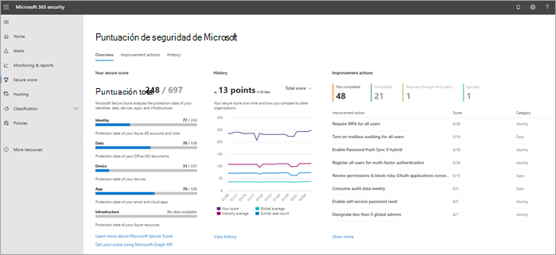

# Las diez formas principales de proteger los planes de Microsoft 365 para empresas

::: moniker range="o365-21vianet"

> [!NOTE]
> El Centro de administración está cambiando. Si su experiencia no coincide con los detalles presentados aquí, consulte [Acerca del nuevo Centro de administración de Microsoft 365](https://docs.microsoft.com/microsoft-365/admin/microsoft-365-admin-center-preview?view=o365-21vianet).

::: moniker-end

Si es una organización pequeña o mediana que usa uno de los planes de negocio de Microsoft y el tipo de organización está dirigido a los delincuentes cibernéticos y los hackers, use las instrucciones de este artículo para aumentar la seguridad de su organización. Esta guía ayuda a su organización a lograr los objetivos descritos en el [manual](https://go.microsoft.com/fwlink/?linkid=2015598&amp;clcid=0x409)de la campaña Harvard Kennedy School Cybersecurity.
  
Microsoft recomienda que complete las tareas que se enumeran en la siguiente tabla que se aplican a su plan de servicio. 
  
||**Tarea**|**Microsoft 365 Empresa Estándar**|**Microsoft 365 Empresa Premium**|
|:-----|:-----|:-----|:-----|
|1     |[Configurar la autenticación multifactor](secure-your-business-data.md#setup)   |             |             |
|segundo    |[Proporcionar formación a los usuarios](secure-your-business-data.md#train)   |             |             |
|3    |[Usar cuentas de administrador dedicadas](secure-your-business-data.md#admin)   |             |             |
|4     |[Aumentar el nivel de protección contra malware en correo](secure-your-business-data.md#malware)   |             |             |
|5     |[Protección contra ransomware](secure-your-business-data.md#ransomware)   |             |             |
|6     |[Detener el reenvío automático de correo electrónico](secure-your-business-data.md#forwarding)   |             |             |
|7     |[Usar el cifrado de mensajes de Office](secure-your-business-data.md#encryption)   ||             |
|8     |[Proteger el correo electrónico de ataques de suplantación de identidad](secure-your-business-data.md#phishing)   ||             |
|9     |[Protección contra archivos adjuntos malintencionados y archivos con datos adjuntos seguros de ATP](secure-your-business-data.md#atp)   ||             |
|10      |[Proteger contra ataques de suplantación de identidad con vínculos seguros de ATP](secure-your-business-data.md#phishingatp)   ||             |
   
Antes de empezar, Compruebe la [puntuación segura de microsoft 365](https://docs.microsoft.com/microsoft-365/security/mtp/microsoft-secure-score) en el centro de seguridad de Microsoft 365. Desde un panel centralizado, puede supervisar y mejorar la seguridad de las identidades, los datos, las aplicaciones, los dispositivos y la infraestructura de Microsoft 365. Se le proporcionan puntos para configurar las características de seguridad recomendadas, realizar tareas relacionadas con la seguridad (como ver informes) o dirigir recomendaciones con una aplicación o software de terceros. Con información adicional y una mayor visibilidad en un conjunto más amplio de productos y servicios de Microsoft, puede sentirse seguro de informar sobre el estado de seguridad de la organización.
  

  
## 1: configurar la autenticación multifactor

El uso de multi-factor Authentication es una de las formas más sencillas y eficaces de aumentar la seguridad de su organización. Es más fácil de lo que suena cuando inicia sesión, multi-factor Authentication significa que escriba un código de su teléfono para obtener acceso a Microsoft 365. Esto puede impedir que los hackers sepan si conocen su contraseña. La autenticación multifactor también se denomina verificación en 2 pasos. Los usuarios pueden agregar la verificación en dos pasos a la mayoría de las cuentas fácilmente, por ejemplo, a sus cuentas de Google o Microsoft. Esta es la manera de [Agregar la verificación en dos pasos a su cuenta de Microsoft personal](https://go.microsoft.com/fwlink/?linkid=2016403&amp;clcid=0x409).
  
Para empresas que usen Microsoft 365, agregue una configuración que requiera que los usuarios inicien sesión con la autenticación multifactor. Al realizar este cambio, se les pedirá a los usuarios que configuren su teléfono para la autenticación en dos fases, la próxima vez que inicien sesión.
Para ver un vídeo de aprendizaje sobre cómo configurar la MFA y cómo los usuarios pueden completar la configuración, consulte [configurar MFA](https://support.microsoft.com/office/e12187b8-216a-4490-9e3b-df34a06fb787) y [configurar el usuario](https://support.microsoft.com/office/a32541df-079c-420d-9395-9d59354f7225).
  
Para configurar la autenticación multifactor:

1. En el [centro de administración](https://go.microsoft.com/fwlink/p/?linkid=834822), seleccione usuarios activos de **usuarios**  >  **Active Users**.

2. En la sección **usuarios activos** , seleccione **multi-factor Authentication**.

3. En la página **autenticación multifactor** , seleccione **usuario** si está habilitando esta opción para un usuario o puede realizar una **actualización masiva**.

4. Seleccione **Habilitar** en **pasos rápidos**.

5. En la ventana emergente, elija **Habilitar multi-factor Authentication**.

Después de configurar la autenticación multifactor para su organización, sus usuarios deberán configurar una verificación de dos pasos en sus dispositivos. Para obtener más información, consulte [configurar la verificación en dos pasos para Microsoft 365](https://support.microsoft.com/office/ace1d096-61e5-449b-a875-58eb3d74de14).
  
Para obtener detalles completos y recomendaciones completas, vea [set up multi-factor Authentication for users](set-up-multi-factor-authentication.md).
  
## 2: entrenar a los usuarios

El manual Harvard Kennedy School [Cybersecurity Campaign Handbook](https://go.microsoft.com/fwlink/?linkid=2015598&amp;clcid=0x409) proporciona una excelente orientación sobre cómo establecer una cultura fuerte de conciencia de la seguridad dentro de la organización, incluido el aprendizaje de usuarios para identificar ataques de suplantación de identidad. 
  
Además de esta guía, Microsoft recomienda que los usuarios realicen las acciones descritas en este artículo: [Proteja su cuenta y sus dispositivos de hackers y malware](https://support.microsoft.com/office/066d6216-a56b-4f90-9af3-b3a1e9a327d6). Entre estas acciones se incluyen:
  
- Uso de contraseñas seguras
    
- Protección de dispositivos
    
- Habilitación de las características de seguridad en equipos con Windows 10 y Mac
    
Microsoft también recomienda que los usuarios protejan sus cuentas de correo electrónico personales llevando a cabo las acciones recomendadas en los siguientes artículos:
  
- [Ayuda para proteger su cuenta de correo electrónico de Outlook.com](https://support.microsoft.com/office/a4f20fc5-4307-4ece-8231-6d4d4bd8a9ba)
    
- [Proteger la cuenta de gmail con verificación en dos pasos](https://go.microsoft.com/fwlink/?linkid=2015688&amp;clcid=0x409)
    
## 3: usar cuentas de administrador dedicadas

Las cuentas administrativas que se usan para administrar el entorno de Microsoft 365 incluyen privilegios elevados. Estos son objetivos muy valiosos para los hackers y los delincuentes cibernéticos. Use cuentas de administrador solo para la administración. Los administradores deben tener una cuenta de usuario independiente para uso normal, no administrativo y solo usar su cuenta administrativa cuando sea necesario para completar una tarea asociada a su función de trabajo. Recomendaciones adicionales:
  
- Asegúrese de que las cuentas de administrador también están configuradas para multi-factor Authentication. 
    
- Antes de usar cuentas de administrador, cierre todas las sesiones y aplicaciones del explorador no relacionadas, incluidas las cuentas de correo electrónico personales.
    
- Después de completar las tareas de administración, asegúrese de cerrar la sesión del explorador.
    
## 4: aumentar el nivel de protección contra malware en correo

Su entorno de Microsoft 365 incluye protección contra malware, pero puede aumentar esta protección bloqueando los datos adjuntos con tipos de archivo que se usan habitualmente para malware. Para desplazarse por la protección contra malware en el correo electrónico, vea un [breve vídeo de aprendizaje](https://support.microsoft.com/office/02b5783a-eea0-42e8-8856-62440718c3f0)o siga los pasos que se indican a continuación:
  
1. Vaya a [https://protection.office.com](https://protection.office.com) e inicie sesión con las credenciales de su cuenta de administrador. 
    
2. En el panel de navegación izquierdo del centro de seguridad y cumplimiento, en &amp; **Administración de amenazas**, elija **Policy** \> **antimalware**de directiva.
    
3. Haga doble clic en la directiva predeterminada para editar esta directiva de toda la compañía.
    
4. Seleccione **Configuración**.
    
5. En **filtro de tipos de datos adjuntos comunes**, seleccione **activado**. Los tipos de archivo que están bloqueados aparecen en la ventana que se encuentra justo debajo de este control. Puede Agregar o eliminar tipos de archivo más adelante, si es necesario.
    
6. Seleccione **Guardar.**
    
Para obtener más información, consulte [Anti-Malware Protection](https://go.microsoft.com/fwlink/?linkid=2015692&amp;clcid=0x409).
  
## 5: proteger contra ransomware

Ransomware restringe el acceso a los datos mediante el cifrado de los archivos o el bloqueo de las pantallas del equipo. A continuación, intenta extort dinero de víctimas solicitando "Ransom", normalmente en forma de cryptocurrencies como bitcoin, en Exchange para tener acceso a los datos. 
  
Puede proteger contra ransomware si crea una o más reglas de flujo de correo para bloquear extensiones de archivo que se usan habitualmente para ransomware o para advertir a los usuarios que reciben estos datos adjuntos en el correo electrónico. Un buen punto de partida es crear dos reglas:
  
- Advierta a los usuarios antes de abrir datos adjuntos de archivos de Office que incluyen macros. Ransomware puede estar oculto dentro de las macros, por lo que se advertirá a los usuarios que no abren estos archivos de personas que no saben. 
    
- Bloquear tipos de archivo que podrían contener ransomware o cualquier otro código malintencionado. Comenzaremos con una lista común de ejecutables (que se enumeran en la tabla siguiente). Si su organización usa cualquiera de estos tipos de ejecutables y espera que se envíen en un correo electrónico, agréguelos a la regla anterior (advierta a los usuarios).
    
Para crear una regla de transporte de correo, vea un [vídeo de aprendizaje corto](https://support.microsoft.com/office/a9ecca03-42a6-4867-b9fd-38e3f6bb06ad)o realice los pasos siguientes:
  
1. Vaya al <a href="https://go.microsoft.com/fwlink/p/?linkid=2059104" target="_blank">Centro de administración de Exchange</a>.

2. En la categoría **flujo de correo** , seleccione **reglas**.
    
3. Seleccione **+** y, a continuación, **cree una nueva regla**.
    
4. Seleccione * * * * en la parte inferior del cuadro de diálogo para ver el conjunto completo de opciones. 
    
5. Aplique la configuración de la tabla siguiente para cada regla. Deje el resto de las opciones de configuración en el valor predeterminado, a menos que quiera cambiarlos.
    
6. Seleccione **Guardar**.
    
|**Valor**|**Advertir a los usuarios antes de abrir datos adjuntos de archivos de Office**|**Bloquear tipos de archivo que puedan contener ransomware o cualquier otro código malintencionado**|
|:-----|:-----|:-----|
|Nombre    |Regla antiransomware: advertir a los usuarios    |Regla antiransomware: bloquear tipos de archivo    |
|Aplicar esta regla si. . .    |Los datos adjuntos. . . coincidencias de extensión de archivo. . .    |Los datos adjuntos. . . coincidencias de extensión de archivo. . .    |
|Especificar palabras o frases    |Agregue estos tipos de archivo:    dotm, docm, xlsm, sltm, XLA, XLAM, xll, pptm, potm, PPAM, ppsm sldm    |Agregue estos tipos de archivo:    ADE, ADP, Ani, Bas, Bat, CHM, CMD, com, cpl, CRT, HLP, HT, HTA, INF, ins, ISP, Job, JS, JSE, lnk, MDA, MdB, MDE, MDZ, MSC, MSI, MSP, MST, PCD, reg, SCR, SCT, SHS, URL, VB, VBE, vbs, WSC, wsf, WSH, exe, PIF    |
|Haga lo siguiente. . .    |Notificar al destinatario con un mensaje    |Bloquear el mensaje. . . rechazar el mensaje e incluir una explicación    |
|Proporcionar el texto del mensaje    |No abra estos tipos de archivos, a menos que los haya esperado, porque los archivos pueden contener código malintencionado y saber que el remitente no es una garantía de seguridad.    ||
   
> [!TIP]
> También puede Agregar los archivos que desee bloquear a la lista antimalware en el [paso 4](#4-raise-the-level-of-protection-against-malware-in-mail).

Para obtener más información, vea:
  
- [Cómo tratar con ransomware](https://go.microsoft.com/fwlink/?linkid=2016501&amp;clcid=0x409)
    
- [Restaurar su OneDrive](https://support.microsoft.com/office/fa231298-759d-41cf-bcd0-25ac53eb8a15)
    
## 6: detener el reenvío automático para correo electrónico

Los hackers que obtienen acceso al buzón de un usuario pueden desfiltrar el correo configurando el buzón para reenviar automáticamente el correo electrónico. Esto puede ocurrir incluso sin la conciencia del usuario. Puede evitar que esto suceda mediante la configuración de una regla de flujo de correo. 
  
Para crear una regla de transporte de correo:
  
1. Vaya al <a href="https://go.microsoft.com/fwlink/p/?linkid=2059104" target="_blank">Centro de administración de Exchange</a>.

2. En la categoría **flujo de correo** , seleccione **reglas**.
    
3. Seleccione **+** y, a continuación, **cree una nueva regla**.
    
4. Seleccione **más opciones** en la parte inferior del cuadro de diálogo para ver el conjunto completo de opciones. 
    
5. Aplique la configuración de la tabla siguiente. Deje el resto de las opciones de configuración en el valor predeterminado, a menos que quiera cambiarlos.
    
6. Seleccione **Guardar**.
    
|**Valor**|**Rechazar correos electrónicos de reenvío automático a dominios externos**|
|:-----|:-----|
|Nombre    |Impedir el reenvío automático de correo electrónico a dominios externos    |
|Aplicar esta regla si...    |El remitente. . . es externo/interno. . . Dentro de la organización    |
|Agregar condición    |El destinatario. . . es externo/interno. . . Fuera de la organización    |
|Agregar condición    |Las propiedades del mensaje. . . incluir el tipo de mensaje. . . Reenvío automático    |
|Haga lo siguiente...    |Bloquear el mensaje. . . rechazar el mensaje e incluir una explicación.    |
|Proporcionar el texto del mensaje    |El reenvío automático de correo electrónico fuera de esta organización se impide por motivos de seguridad.    |
   
## 7: usar el cifrado de mensajes de Office

El cifrado de mensajes de Office se incluye con Microsoft 365. Ya está configurado. Con el cifrado de mensajes de Office, su organización puede enviar y recibir mensajes de correo electrónico cifrados entre personas de dentro y fuera de la organización. El cifrado de mensajes de Office 365 funciona con Outlook.com, Yahoo!, gmail y otros servicios de correo electrónico. El cifrado de mensajes de correo electrónico ayuda a garantizar que solo los destinatarios deseados puedan ver el contenido de los mensajes.
  
El cifrado de mensajes de Office proporciona dos opciones de protección al enviar correo:
  
- No reenviar
    
- Cifrar
    
Es posible que su organización haya configurado opciones adicionales que apliquen una etiqueta a un correo electrónico, como confidencial.
  
### Para enviar correo electrónico protegido

En Outlook para PC, seleccione **Opciones** en el correo electrónico y, a continuación, elija **permisos**. 
  

  
En Outlook.com, seleccione **proteger** en el correo electrónico. La protección predeterminada es **no reenviar**. Para cambiarlo a cifrar, seleccione **cambiar permisos** \> **cifrados**. 
  

  
### Para recibir correo electrónico cifrado

Si el destinatario tiene Outlook 2013 o Outlook 2016 y una cuenta de correo electrónico de Microsoft, verán una alerta sobre los permisos restringidos del elemento en el panel de lectura. Después de abrir el mensaje, el destinatario puede ver el mensaje igual que cualquier otro.
  
Si el destinatario usa otro cliente de correo electrónico o una cuenta de correo electrónico, como Gmail o Yahoo, verán un vínculo que les permite iniciar sesión para leer el mensaje de correo electrónico o solicitar un código de acceso de un solo uso para ver el mensaje en un explorador Web. Si los usuarios no reciben el correo electrónico, pídales que comprueben el correo no deseado o la carpeta de correo no deseado. 
  
Para obtener más información, vea [enviar, ver y responder a mensajes cifrados en Outlook para PC](https://support.microsoft.com/office/eaa43495-9bbb-4fca-922a-df90dee51980).
  
## 8. proteger el correo electrónico de los ataques de suplantación de identidad

Si ha configurado uno o más dominios personalizados para su entorno de Microsoft 365, puede configurar la protección contra suplantas de identidad (phishing) específica. La protección contra suplantación de identidad ATP, parte de la protección contra amenazas avanzada de Office 365, puede ayudar a proteger a su organización de ataques de suplantación de identidad (phishing) malintencionados y otros ataques de suplantación de identidad. Si no ha configurado un dominio personalizado, no es necesario que lo haga.
  
Le recomendamos que empiece con esta protección creando una directiva para proteger a los usuarios más importantes y a su dominio personalizado. 
  

  
Para crear una directiva contra la suplantación de identidad ATP, vea un [vídeo de aprendizaje corto](https://support.microsoft.com/office/86c425e1-1686-430a-9151-f7176cce4f2c)o realice los pasos siguientes:
  
1. Vaya a [https://protection.office.com](https://protection.office.com). 
    
2. En el centro de seguridad y &amp; cumplimiento, en el panel de navegación izquierdo, en **Administración de amenazas**, seleccione **Directiva**.
    
3. En la página Directiva, seleccione **protección contra phishing de ATP**.
    
4. En la página contra la suplantación de identidad, seleccione **+ crear**. Se inicia un asistente que le guía por el proceso de definición de la Directiva antiphishing.
    
5. Especifique el nombre, la descripción y la configuración de la Directiva tal y como se recomienda en el siguiente gráfico. Para obtener más información, consulte [información sobre las opciones de directiva de antiphishing de ATP](https://go.microsoft.com/fwlink/?linkid=2016505&amp;clcid=0x409) . 
    
6. Una vez que haya revisado la configuración, seleccione **crear esta directiva** o **Guardar**, según corresponda.

|**Configuración u opción**|**Valor recomendado**  |
|:-----|:-----|
|Nombre    |Dominio y personal de la campaña más valioso    |
|Descripción    |Asegúrese de que el personal más importante y nuestro dominio no se están suplantando.    |
|Agregar usuarios que proteger    |Seleccionar **+ Agregar condición, el destinatario es**. Escriba los nombres de usuario o escriba la dirección de correo electrónico del candidato, el administrador de campañas y otros miembros importantes del personal. Puede Agregar hasta 20 direcciones internas y externas que desee proteger de la suplantación.    |
|Agregar dominios que proteger    |Seleccionar **+ Agregar una condición, el dominio del destinatario es**. Escriba el dominio personalizado asociado con la suscripción de Microsoft 365, si ha definido uno. Puede escribir más de un dominio.    |
|Elegir acciones    |Si un usuario suplantado envía un correo electrónico: seleccione **redirigir un mensaje a otra dirección de correo electrónico**y, a continuación, escriba la dirección de correo electrónico del administrador de seguridad; por ejemplo, securityadmin@contoso.com.          Si un dominio suplantado envía un correo electrónico: seleccione **mensaje en cuarentena**.    |
|Inteligencia de buzones    |De forma predeterminada, se selecciona inteligencia de buzones al crear una directiva contra suplantación de identidad (anti-phishing). Deje esta configuración **activada** para obtener mejores resultados.    |
|Agregar dominios y remitentes de confianza    |En este ejemplo, no defina ninguna invalidación.    |
|Aplicado a    |Seleccione**El dominio del destinatario es**. En **Cualquiera de estos**, seleccione **Elegir**. Seleccione **+ Agregar**. Active la casilla de verificación situada junto al nombre del dominio, por ejemplo, contoso.com, en la lista y, a continuación, seleccione **Agregar**. Seleccione **Listo**.    |
|
   
Para obtener más información, consulte [configurar las directivas de anti-phishing de Office 365 ATP](https://go.microsoft.com/fwlink/?linkid=2016505&amp;clcid=0x409).
  
## 9: protección contra archivos adjuntos malintencionados y archivos con datos adjuntos seguros de ATP

Los usuarios envían, reciben y comparten con regularidad datos adjuntos, como documentos, presentaciones, hojas de cálculo, etc. No siempre es fácil saber si los datos adjuntos son seguros o malintencionados solo mirando un mensaje de correo electrónico. Office 365 Advanced Threat Protection incluye protección contra datos adjuntos seguros de ATP, pero esta protección no está activada de forma predeterminada. Le recomendamos que cree una nueva regla para comenzar a usar esta protección. Esta protección se extiende a los archivos de SharePoint, OneDrive y Microsoft Teams.
  
Para crear una directiva de datos adjuntos seguros para ATP, vea un [vídeo de aprendizaje corto](https://support.microsoft.com/office/e7e68934-23dc-4b9c-b714-e82e27a8f8a5)o realice los pasos siguientes:
  
1. Vaya a [https://protection.office.com](https://protection.office.com) e inicie sesión con su cuenta de administrador. 
    
2. En el centro de seguridad y &amp; cumplimiento, en el panel de navegación izquierdo, en **Administración de amenazas**, seleccione **Directiva**.
    
3. En la página Directiva, seleccione **datos adjuntos seguros de ATP**.
    
4. En la página datos adjuntos seguros, aplique esta protección ampliando la selección de la casilla **Activar ATP para SharePoint, OneDrive y Microsoft Teams** . 
    
5. Seleccione esta **+** Directiva para crear una nueva Directiva. 
    
6. Aplique la configuración de la tabla siguiente. 
    
7. Una vez que haya revisado la configuración, seleccione **crear esta directiva** o **Guardar**, según corresponda.
    

|**Configuración u opción**|**Valor recomendado**  |
|:-----|:-----|
|Nombre    |Bloquear los correos electrónicos actuales y futuros con malware detectado.    |
|Descripción    |Bloquear los mensajes de correo electrónico y datos adjuntos futuros y futuros con malware detectado.    |
|Guardar datos adjuntos respuesta de malware desconocida    |Seleccione **bloquear: bloquear los correos electrónicos y datos adjuntos actuales y futuros con malware detectado**.    |
|Redirigir datos adjuntos en detección    |Habilitar redirección (Seleccione esta casilla) escriba la cuenta de administrador o una configuración de buzón para la cuarentena.          Aplique la selección anterior si se produce un error de análisis de malware para datos adjuntos de tiempo de espera o error (Active esta casilla).    |
|Aplicado a    |El dominio del destinatario es. . . Seleccione su dominio.    |
|
   
Para obtener más información, consulte [configurar las directivas de anti-phishing de Office 365 ATP](https://go.microsoft.com/fwlink/?linkid=2016505&amp;clcid=0x409).
  
## 10: protección contra ataques de suplantación de identidad con vínculos seguros de ATP

A veces, los hackers ocultan sitios Web malintencionados en vínculos de correo electrónico u otros archivos. Vínculos seguros de ATP de Office 365 (vínculos seguros de ATP), parte de la protección contra amenazas avanzada de Office 365, puede ayudar a proteger su organización proporcionando una comprobación del tiempo de clic de direcciones web (URL) en mensajes de correo electrónico y documentos de Office. La protección se define mediante las directivas de vínculos seguros de ATP.
  
Le recomendamos que haga lo siguiente:
  
- Modifique la directiva predeterminada para aumentar la protección.
    
- Agregue una nueva Directiva dirigida a todos los destinatarios de su dominio.
    
Para acceder a vínculos seguros de ATP, vea un [vídeo de aprendizaje corto](https://support.microsoft.com/office/61492713-53c2-47da-a6e7-fa97479e97fa)o realice los pasos siguientes:
  
1. Vaya a [https://protection.office.com](https://protection.office.com) e inicie sesión con su cuenta de administrador. 
    
2. En el centro de seguridad y &amp; cumplimiento, en el panel de navegación izquierdo, en **Administración de amenazas**, seleccione **Directiva**.
    
3. En la página Directiva, seleccione **vínculos seguros ATP**.
    
Para modificar la directiva predeterminada:
  
1. En la página vínculos seguros, en **directivas que se aplican a toda la organización**, seleccione la directiva **predeterminada** . 
    
2. En **configuración que se aplica al contenido excepto al correo electrónico**, seleccione **Microsoft 365 apps for Enterprise, Office para iOS y Android**.
    
3. Seleccione **Guardar**. 
    
Para crear una nueva Directiva dirigida a todos los destinatarios de su dominio:
  
1. En la página vínculos seguros, en **directivas que se aplican a toda la organización**, seleccione **+** para crear una nueva Directiva. 
    
2. Aplique la configuración que se muestra en la tabla siguiente.
    
3. Seleccione **Guardar**. 
    
|**Configuración u opción**|**Valor recomendado**  |
|:-----|:-----|
|Nombre    |Directiva de vínculos seguros para todos los destinatarios del dominio    |
|Seleccionar la acción para direcciones URL potencialmente malintencionadas desconocidas en los mensajes    |Seleccione **activado: las direcciones URL se rescribirán y comprobarán con una lista de vínculos malintencionados conocidos cuando el usuario haga clic en el vínculo**.    |
|Usar datos adjuntos seguros para analizar contenido descargable    |Seleccione esta casilla.    |
|Aplicado a    |El dominio del destinatario es. . . Seleccione su dominio.    |
|
   
Para obtener más información, consulte [vínculos seguros de Office 365 ATP](https://go.microsoft.com/fwlink/?linkid=2016138&amp;clcid=0x409).
