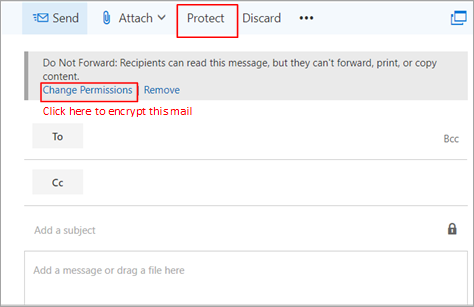

# 10 formas principales de proteger los planes de Microsoft 365 para empresas

::: moniker range="o365-21vianet"

> [!NOTE]
> El Centro de administración está cambiando. Si su experiencia no coincide con los detalles presentados aquí, consulte [Acerca del nuevo Centro de administración de Microsoft 365](https://docs.microsoft.com/microsoft-365/admin/microsoft-365-admin-center-preview?view=o365-21vianet&preserve-view=true).

::: moniker-end

Si es una organización pequeña o mediana que usa uno de los planes empresariales de Microsoft y su tipo de organización está dirigida por ciberdelincuentes y hackers, use las instrucciones de este artículo para aumentar la seguridad de su organización. Esta guía ayuda a su organización a lograr los objetivos descritos en el Manual de campaña de [ciberseguridad](https://go.microsoft.com/fwlink/p/?linkid=2015598)de la escuela Desaceditiva Desc.

Microsoft recomienda completar las tareas enumeradas en la tabla siguiente que se aplican al plan de servicio.

||Task|Microsoft 365 Empresa Estándar|Microsoft 365 Empresa Premium|
|---|---|---|---|
|1 |[Configurar la autenticación multifactor](secure-your-business-data.md#setup)|||
|2 |[Proporcionar formación a los usuarios](secure-your-business-data.md#train)|||
|3 |[Usar cuentas de administrador dedicadas](secure-your-business-data.md#admin)|||
|4 |[Aumentar el nivel de protección contra malware en el correo](secure-your-business-data.md#malware)|||
|5 |[Protección contra ransomware](secure-your-business-data.md#ransomware)|||
|6 |[Detener el reenvío automático de correo electrónico](secure-your-business-data.md#forwarding)|||
|7 |[Usar el cifrado de mensajes de Office](secure-your-business-data.md#encryption)|||
|8 |[Proteger el correo electrónico de ataques de suplantación de identidad](secure-your-business-data.md#phishing)|||
|9 |[Protegerse contra archivos y datos adjuntos malintencionados con datos adjuntos seguros](secure-your-business-data.md#atp)|||
|10  |[Protección contra ataques de suplantación de identidad con vínculos seguros](secure-your-business-data.md#phishingatp)|||

Antes de empezar, compruebe la puntuación de seguridad de [Microsoft 365](https://docs.microsoft.com/microsoft-365/security/mtp/microsoft-secure-score) en el Centro de seguridad de Microsoft 365. Desde un panel centralizado, puede supervisar y mejorar la seguridad de sus identidades, datos, aplicaciones, dispositivos e infraestructura de Microsoft 365. Se le indican puntos para configurar las características de seguridad recomendadas, realizar tareas relacionadas con la seguridad (como ver informes) o tratar recomendaciones con una aplicación o software de terceros. Con información adicional y más visibilidad de un conjunto más amplio de productos y servicios de Microsoft, puede confiar en los informes sobre el estado de seguridad de su organización.

## 1: Configurar la autenticación multifactor

El uso de la autenticación multifactor es una de las formas más sencillas y eficaces de aumentar la seguridad de la organización. Es más fácil de lo que parece: al iniciar sesión, la autenticación multifactor significa que escribirá un código desde el teléfono para obtener acceso a Microsoft 365. Esto puede impedir que los hackers se haga cargo si conocen su contraseña. La autenticación multifactor también se denomina verificación en dos pasos. Los usuarios individuales pueden agregar verificación en dos pasos a la mayoría de las cuentas fácilmente, por ejemplo, a sus cuentas de Google o Microsoft. Aquí te explicamos cómo agregar [la verificación en dos pasos a tu cuenta personal de Microsoft.](https://go.microsoft.com/fwlink/p/?linkid=2016403)

Para las empresas que usan Microsoft 365, agregue una configuración que requiera que los usuarios inicien sesión con la autenticación multifactor. Cuando realice este cambio, se pedirá a los usuarios que configuren su teléfono para la autenticación en dos fases la próxima vez que inicien sesión.
Para ver un vídeo de aprendizaje sobre cómo configurar MFA y cómo los usuarios completan la configuración, consulta configurar [MFA](https://support.microsoft.com/office/e12187b8-216a-4490-9e3b-df34a06fb787) y [configurar usuarios.](https://support.microsoft.com/office/a32541df-079c-420d-9395-9d59354f7225)

Para configurar la autenticación multifactor, active los valores predeterminados de seguridad:

En la mayoría de las organizaciones, los valores predeterminados de seguridad ofrecen un buen nivel de seguridad adicional de inicio de sesión. Para obtener más información, vea [¿Qué son los valores predeterminados de seguridad?](https://docs.microsoft.com/azure/active-directory/fundamentals/concept-fundamentals-security-defaults)

Si la suscripción es nueva, es posible que los valores predeterminados de seguridad ya estén activados automáticamente.

Puede habilitar o deshabilitar los valores predeterminados de seguridad en el panel **Propiedades** de Azure Active Directory (Azure AD) en Azure Portal.

1. Inicie sesión en el [centro de administración de Microsoft 365](https://admin.microsoft.com) con credenciales de administrador global.
2. En el panel de navegación izquierdo, elija **Mostrar todo** y, en **Centros de administración**, elija **Azure Active Directory**.
3. En el **Centro de administración de Azure Active Directory** elija **Azure Active Directory** > **Propiedades**.
4. En la parte inferior de la página, elija **Administrar los valores predeterminados de seguridad**.
5. Elija **Sí** para habilitar los valores predeterminados de seguridad y **No** para deshabilitar los valores predeterminados de seguridad; a continuación, elija **Guardar**.

Después de configurar la autenticación multifactor para su organización, sus usuarios deberán configurar una verificación de dos pasos en sus dispositivos. Para obtener más información, vea Configurar la verificación en [dos pasos para Microsoft 365.](https://support.microsoft.com/office/ace1d096-61e5-449b-a875-58eb3d74de14)

Para obtener información detallada y recomendaciones completas, consulte [Configurar la autenticación multifactor para los usuarios.](set-up-multi-factor-authentication.md)

## 2: Formar a los usuarios

El Manual  de campañas de ciberseguridad de la escuela Desaceditiva de Phish proporciona instrucciones excelentes para establecer una cultura sólida de concienciación sobre la seguridad en su organización, incluida la formación de los usuarios para identificar ataques de suplantación de identidad.

Además de esta guía, Microsoft recomienda que los usuarios tomen las acciones descritas en este artículo: Proteger su cuenta y dispositivos de [hackers y malware.](https://support.microsoft.com/office/066d6216-a56b-4f90-9af3-b3a1e9a327d6) Entre estas acciones se incluyen:

- Uso de contraseñas seguras

- Protección de dispositivos

- Habilitación de características de seguridad en equipos Con Windows 10 y Mac

Microsoft también recomienda que los usuarios protejan sus cuentas de correo electrónico personales mediante las acciones recomendadas en los siguientes artículos:

- [Ayudar a proteger su Outlook.com de correo electrónico](https://support.microsoft.com/office/a4f20fc5-4307-4ece-8231-6d4d4bd8a9ba)

- [Proteger su cuenta de Gmail con verificación en dos pasos](https://go.microsoft.com/fwlink/p/?linkid=2015688&)

## 3: Usar cuentas de administrador dedicadas

Las cuentas administrativas que usa para administrar el entorno de Microsoft 365 incluyen privilegios elevados. Estos son objetivos valiosos para hackers y ciberdelincuentes. Use cuentas de administrador solo para la administración. Los administradores deben tener una cuenta de usuario independiente para uso normal y no administrativo y usar solo su cuenta administrativa cuando sea necesario para completar una tarea asociada a su función de trabajo. Recomendaciones adicionales:

- Asegúrese de que las cuentas de administrador también están configuradas para la autenticación multifactor.

- Antes de usar cuentas de administrador, cierre todas las aplicaciones y sesiones de explorador no relacionadas, incluidas las cuentas de correo electrónico personales.

- Después de completar las tareas de administración, asegúrese de cerrar la sesión del explorador.

## 4: Aumentar el nivel de protección contra malware en el correo

El entorno de Microsoft 365 incluye protección contra malware, pero puede aumentar esta protección bloqueando los datos adjuntos con tipos de archivo que se usan habitualmente para malware. Para proteger contra malware en el correo electrónico, vea un [breve vídeo de](https://support.microsoft.com/office/02b5783a-eea0-42e8-8856-62440718c3f0)aprendizaje o siga estos pasos:

1. Vaya e <https://protection.office.com> inicie sesión con las credenciales de su cuenta de administrador.

2. En el Centro de & cumplimiento, en el panel de navegación izquierdo, en Administración de **amenazas,** **elija** \> **Directiva antimalware.**

3. Haga doble clic en la directiva predeterminada para editar esta directiva en toda la empresa.

4. Seleccione **Configuración**.

5. En **Filtro de tipos comunes de datos adjuntos,** seleccione **Activar**. Los tipos de archivo bloqueados se muestran en la ventana justo debajo de este control. Puede agregar o eliminar tipos de archivo más adelante, si es necesario.

6. Seleccione **Guardar.**

Para obtener más información, vea [Protección antimalware en EOP.](https://docs.microsoft.com/microsoft-365/security/office-365-security/anti-malware-protection)

## 5: Proteger contra ransomware

Ransomware restringe el acceso a los datos mediante el cifrado de archivos o el bloqueo de pantallas del equipo. A continuación, intenta extorsionar dinero a las víctimas solicitando "rescate", normalmente en forma de criptodivisas, como Crypto, a cambio de acceso a los datos.

Puede protegerse contra ransomware creando una o más reglas de flujo de correo para bloquear las extensiones de archivo que se usan habitualmente para ransomware, o para advertir a los usuarios que reciben estos datos adjuntos por correo electrónico. Un buen punto de partida es crear dos reglas:

- Advertir a los usuarios antes de abrir datos adjuntos de archivos de Office que incluyan macros. El ransomware se puede ocultar dentro de las macros, por lo que le advertiremos a los usuarios que no abran estos archivos de personas que no conocen.

- Bloquear tipos de archivo que puedan contener ransomware u otro código malintencionado. Empezaremos con una lista común de archivos ejecutables (enumerados en la tabla siguiente). Si su organización usa cualquiera de estos tipos ejecutables y espera que se envíen por correo electrónico, agrégrelos a la regla anterior (advierte a los usuarios).

Para crear una regla de transporte de correo, vea un [breve vídeo de aprendizaje](https://support.microsoft.com/office/a9ecca03-42a6-4867-b9fd-38e3f6bb06ad)o siga estos pasos:

1. Vaya al [Centro de administración de Exchange](https://go.microsoft.com/fwlink/p/?linkid=2059104).

2. En la **categoría de flujo de** correo, seleccione **reglas.**

3. Seleccione **+** y, **a continuación, cree una nueva regla.**

4. Seleccione **** en la parte inferior del cuadro de diálogo para ver el conjunto completo de opciones.

5. Aplique la configuración de la tabla siguiente para cada regla. Deje el resto de la configuración de forma predeterminada, a menos que desee cambiarla.

6. Seleccione **Guardar**.
    
| Setting | Advertir a los usuarios antes de abrir los datos adjuntos de los archivos de Office | Bloquear tipos de archivo que podrían contener ransomware u otro código malintencionado |
|:-----|:-----|:-----|
|Nombre    |Regla anti ransomware: advertir a los usuarios    |Regla anti ransomware: bloquear tipos de archivo    |
|Aplique esta regla si . . .    |Los datos adjuntos. . . la extensión de archivo coincide con . . .    |Los datos adjuntos. . . la extensión de archivo coincide con . . .    |
|Especificar palabras o frases    |Agregue estos tipos de archivo:    dotm, docm, xlsm, sltm, xla, xlam, xll, pptm, potm, ppam, ppsm, sldm    |Agregue estos tipos de archivo:    ade, adp, ani, bas, bat, chm, cmd, com, cpl, crt, hlp, ht, hta, inf, ins, isp, job, js, jse, lnk, mda, mdb, mde, mdz, msc, msi, msp, mst, pcd, reg, scr, sct, shs, url, vb, vbe, vbs, wsc, wsf, wsh, exe, pif    |
|Haga lo siguiente. . .    |Anteponer un aviso de declinación de responsabilidades    |Bloquear el mensaje . . . rechazar el mensaje e incluir una explicación    |
|Proporcionar texto del mensaje    |No abra estos tipos de archivos, a menos que los esperara, porque los archivos pueden contener código malintencionado y saber que el remitente no es una garantía de seguridad.    ||
   
> [!TIP]
> También puede agregar los archivos que desea bloquear a la lista antimalware en el [paso 4.](#4-raise-the-level-of-protection-against-malware-in-mail)

Para obtener más información, vea:

- [Ransomware: cómo reducir el riesgo](https://www.microsoft.com/security/blog/2020/04/28/ransomware-groups-continue-to-target-healthcare-critical-services-heres-how-to-reduce-risk/)

- [Restaurar onedrive](https://support.microsoft.com/office/fa231298-759d-41cf-bcd0-25ac53eb8a15)

## 6: Detener el reenvío automático de correo electrónico

Los hackers que obtienen acceso al buzón de un usuario pueden filtrar el correo configurando el buzón para reenviar automáticamente el correo electrónico. Esto puede suceder incluso sin el conocimiento del usuario. Puede evitar que esto ocurra configurando una regla de flujo de correo.

Para crear una regla de transporte de correo:

1. Vaya al [Centro de administración de Exchange](https://go.microsoft.com/fwlink/p/?linkid=2059104).

2. En la **categoría de flujo de** correo, seleccione **reglas.**

3. Seleccione **+** y, **a continuación, cree una nueva regla.**

4. Seleccione **Más opciones** en la parte inferior del cuadro de diálogo para ver el conjunto completo de opciones.

5. Aplique la configuración de la tabla siguiente. Deje el resto de la configuración de forma predeterminada, a menos que desee cambiarla.

6. Seleccione **Guardar**.

|Setting|Rechazar el reenvío automático de correos electrónicos a dominios externos|
|---|---|
|Nombre|Impedir el reenvío automático de correo electrónico a dominios externos|
|Aplique esta regla si ...|El remitente . . . es externo/interno. . . Dentro de la organización|
|Agregar condición|El destinatario . . . es externo/interno. . . Fuera de la organización|
|Agregar condición|Las propiedades del mensaje . . . incluir el tipo de mensaje . . . Reenvío automático|
|Haga lo siguiente...|Bloquear el mensaje . . . rechazar el mensaje e incluir una explicación.|
|Proporcionar texto del mensaje|El reenvío automático de correo electrónico fuera de esta organización se impide por motivos de seguridad.|

## 7: Usar el cifrado de mensajes de Office

El cifrado de mensajes de Office se incluye con Microsoft 365. Ya está configurado. Con el cifrado de mensajes de Office, su organización puede enviar y recibir mensajes de correo electrónico cifrados entre personas dentro y fuera de su organización. Cifrado de mensajes de Office 365 funciona con Outlook.com, Yahoo!, Gmail y otros servicios de correo electrónico. El cifrado de mensajes de correo electrónico ayuda a garantizar que solo los destinatarios puedan ver el contenido del mensaje.

El cifrado de mensajes de Office proporciona dos opciones de protección al enviar correo:

- No reenviar

- Cifrar

Es posible que su organización haya configurado opciones adicionales que apliquen una etiqueta al correo electrónico, como Confidencial.

### Para enviar correo electrónico protegido

En Outlook para PC, seleccione **Opciones en** el correo electrónico y, a continuación, **elija Permisos.**

En Outlook.com, seleccione **Proteger** en el correo electrónico. La protección predeterminada es **No reenviar.** Para cambiar esto para cifrar, seleccione **Cambiar permisos** \> **cifrar**.

### Para recibir correo electrónico cifrado

Si el destinatario tiene Outlook 2013 o Outlook 2016 y una cuenta de correo electrónico de Microsoft, verá una alerta sobre los permisos restringidos del elemento en el panel de lectura. Después de abrir el mensaje, el destinatario puede ver el mensaje como cualquier otro.

Si el destinatario usa otro cliente de correo electrónico o cuenta de correo electrónico, como Gmail o Yahoo, verá un vínculo que le permite iniciar sesión para leer el mensaje de correo electrónico o solicitar un código de acceso de un solo uso para ver el mensaje en un explorador web. Si los usuarios no reciben el correo electrónico, haga que comprueben su carpeta correo no deseado o correo no deseado.

Para obtener más información, vea [Enviar, ver y responder a](https://support.microsoft.com/office/eaa43495-9bbb-4fca-922a-df90dee51980)mensajes cifrados en Outlook para PC.

## 8. Proteger el correo electrónico contra ataques de suplantación de identidad

Si ha configurado uno o más dominios personalizados para su entorno de Microsoft 365, puede configurar la protección contra suplantación de identidad dirigida. La protección contra la suplantación de identidad(phishing), que forma parte de Microsoft Defender para Office 365, puede ayudar a proteger su organización de ataques de suplantación de identidad malintencionados y otros ataques de suplantación de identidad. Si no ha configurado un dominio personalizado, no es necesario hacerlo.

Se recomienda empezar a usar esta protección mediante la creación de una directiva para proteger los usuarios más importantes y el dominio personalizado.

Para crear una directiva contra suplantación de identidad en Defender para Office 365, vea un breve [vídeo](https://support.microsoft.com/office/86c425e1-1686-430a-9151-f7176cce4f2c)de aprendizaje o siga estos pasos:

1. Vaya a <https://protection.office.com>.

2. En el Centro de & cumplimiento, en el panel de navegación izquierdo, en Administración de **amenazas,** **seleccione Directiva.**

3. En la página Directiva, seleccione **Anti-phishing**.

4. En la página Contra la suplantación de identidad, seleccione **+ Crear**. Se inicia un asistente que le permite definir la directiva contra suplantación de identidad.

5. Especifique el nombre, la descripción y la configuración de la directiva como se recomienda en el gráfico siguiente. Para obtener más información, vea las opciones [de Microsoft Defender para Office 365](https://docs.microsoft.com/microsoft-365/security/office-365-security/set-up-anti-phishing-policies) sobre la directiva contra suplantación de identidad.

6. Después de revisar la configuración, seleccione **Crear esta directiva** o **Guardar,** según corresponda.

|Configuración u opción|Valor recomendado|
|---|---|
|Nombre|Dominio y personal de campaña más valioso|
|Description|Asegúrese de que el personal más importante y nuestro dominio no se suplantan.|
|Agregar usuarios que proteger|Seleccione **+ Agregar una condición, El destinatario es**. Escriba nombres de usuario o escriba la dirección de correo electrónico del candidato, el jefe de campaña y otros miembros importantes del personal. Puede agregar hasta 20 direcciones internas y externas que desee proteger contra la suplantación.|
|Agregar dominios que proteger|Seleccione **+ Agregar una condición, el dominio del destinatario es**. Escriba el dominio personalizado asociado a su suscripción de Microsoft 365, si ha definido uno. Puede escribir más de un dominio.|
|Elegir acciones|Si un usuario suplantado envía correo electrónico: seleccione Redirigir mensaje a otra dirección de correo electrónico y, a continuación, escriba la dirección de correo electrónico del administrador de seguridad; por ejemplo, securityadmin@contoso.com.   Si un dominio suplantado envía correo electrónico: seleccione **Cuarentena de mensajes.**|
|Inteligencia de buzones|De forma predeterminada, se selecciona inteligencia de buzones al crear una directiva contra suplantación de identidad (anti-phishing). Deje esta configuración **activada** para obtener mejores resultados.|
|Agregar dominios y remitentes de confianza|En este ejemplo, no defina ninguna invalidación.|
|Aplicado a|Seleccione **El dominio del destinatario es**. En **Cualquiera de estos**, seleccione **Elegir**. Seleccione **+ Agregar**. Active la casilla junto al nombre del dominio, por ejemplo, contoso.com, en la lista y, a continuación, **seleccione Agregar**. Seleccione **Listo**.|
|

Para obtener más información, vea [Configurar directivas contra suplantación de identidad en Defender para Office 365.](https://docs.microsoft.com/microsoft-365/security/office-365-security/configure-atp-anti-phishing-policies)

## 9: Proteger contra archivos adjuntos malintencionados con datos adjuntos seguros

Las personas envían, reciben y comparten datos adjuntos periódicamente, como documentos, presentaciones, hojas de cálculo y mucho más. No siempre es fácil saber si un archivo adjunto es seguro o malintencionado con solo mirar un mensaje de correo electrónico. Microsoft Defender para Office 365 incluye protección de datos adjuntos seguros, pero esta protección no está activada de forma predeterminada. Se recomienda crear una nueva regla para empezar a usar esta protección. Esta protección se extiende a los archivos de SharePoint, OneDrive y Microsoft Teams.

Para crear una directiva de datos adjuntos seguros, vea [un breve vídeo de aprendizaje](https://support.microsoft.com/office/e7e68934-23dc-4b9c-b714-e82e27a8f8a5)o siga estos pasos:

1. Ve e <https://protection.office.com> inicia sesión con tu cuenta de administrador.

2. En el Centro de & cumplimiento, en el panel de navegación izquierdo, en Administración de **amenazas,** **seleccione Directiva.**

3. En la página Directiva, seleccione **Datos adjuntos seguros.**

4. En la página Datos adjuntos seguros, aplique esta protección ampliamente activando la casilla Activar ATP para **SharePoint, OneDrive** y Microsoft Teams.

5. Seleccione **+** esta opción para crear una nueva directiva.

6. Aplique la configuración de la tabla siguiente.

7. Después de revisar la configuración, seleccione **Crear esta directiva** o **Guardar,** según corresponda.

|Configuración u opción|Valor recomendado|
|---|---|
|Nombre|Bloquear correos electrónicos actuales y futuros con malware detectado.|
|Description|Bloquear correos electrónicos y datos adjuntos actuales y futuros con malware detectado.|
|Guardar datos adjuntos respuesta de malware desconocido|Seleccione **Bloquear: bloquee los correos electrónicos y** los datos adjuntos actuales y futuros con malware detectado.|
|Redirigir datos adjuntos al detectarse|Habilitar redirección (seleccione este cuadro)   Escriba la cuenta de administrador o una configuración de buzón para la cuarentena.   Aplica la selección anterior si se ha finalizado el análisis de malware para datos adjuntos o si se produce un error (selecciona este cuadro).|
|Aplicado a|El dominio del destinatario es . . . seleccione su dominio.|
|

Para obtener más información, vea [Configurar directivas contra suplantación de identidad en Defender para Office 365.](https://docs.microsoft.com/microsoft-365/security/office-365-security/configure-atp-anti-phishing-policies)

## 10: Proteger contra ataques de suplantación de identidad con vínculos seguros

A veces, los hackers ocultan sitios web malintencionados en vínculos de correo electrónico u otros archivos. Vínculos seguros, que forma parte de Microsoft Defender para Office 365, puede ayudar a proteger su organización proporcionando la comprobación con el tiempo de clic de las direcciones web (URL) en los mensajes de correo electrónico y documentos de Office. La protección se define mediante directivas de vínculos seguros.

Le recomendamos que haga lo siguiente:

- Modifique la directiva predeterminada para aumentar la protección.

- Agregue una nueva directiva destinada a todos los destinatarios de su dominio.

Para ir a Vínculos seguros, vea un [breve vídeo de](https://support.microsoft.com/office/61492713-53c2-47da-a6e7-fa97479e97fa)aprendizaje o siga estos pasos:

1. Ve e <https://protection.office.com> inicia sesión con tu cuenta de administrador.

2. En el Centro de & cumplimiento, en el panel de navegación izquierdo, en Administración de **amenazas,** **seleccione Directiva.**

3. En la página Directiva, seleccione **Vínculos seguros.**

Para modificar la directiva predeterminada:

1. En la página Vínculos seguros, en **Directivas que se aplican a** toda la organización, haga doble clic en la **directiva** predeterminada.

2. En Configuración que se aplica al contenido de **Office 365,** escriba una dirección URL que se bloqueará, como _example.com_ y seleccione **+** .

3. En Configuración **que** se aplica al contenido excepto al correo electrónico, seleccione Aplicaciones de **Office 365** **,** no realice un seguimiento de cuándo los usuarios hacen clic en vínculos seguros y no permita a los usuarios hacer clic a través de vínculos seguros a la dirección **URL original.**

4. Seleccione **Guardar**.

Para crear una nueva directiva destinada a todos los destinatarios de su dominio:

1. En la página Vínculos seguros, en Directivas que se aplican a destinatarios **específicos,** seleccione **+** crear una nueva directiva.

2. Aplique la configuración que se muestra en la tabla siguiente.

3. Seleccione **Guardar**.

|Configuración u opción|Valor recomendado|
|---|---|
|Nombre|Directiva de vínculos seguros para todos los destinatarios del dominio|
|Seleccionar la acción para direcciones URL potencialmente malintencionadas desconocidas en los mensajes|Seleccionar Activado: las direcciones URL se reescribirán y se comprobarán con una lista de **vínculos malintencionados** conocidos cuando el usuario haga clic en el vínculo.|
|Aplicar análisis de url en tiempo real para vínculos sospechosos y vínculos que apunten a archivos|Seleccione este cuadro.|
|Aplicado a|El dominio del destinatario es . . . seleccione su dominio.|
|

Para obtener más información, vea [Vínculos seguros en Microsoft Defender para Office 365.](https://docs.microsoft.com/microsoft-365/security/office-365-security/atp-safe-links)
