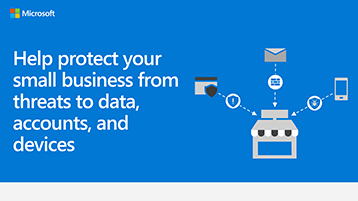

# Gráfico de información de seguridad para pequeñas empresas

**Resumen:** Obtenga información sobre los términos básicos de las amenazas a las que se enfrenta su empresa y lo que puede hacer para proteger los datos, las cuentas y los dispositivos. Como administrador de Microsoft 365 para empresas, tome medidas para que su empresa sea más segura y ayude a todos los empleados a aprender a proteger los datos empresariales y los dispositivos.

Los vínculos de PowerPoint y PDF siguientes se pueden descargar e imprimir en formato tabloide (también conocido como libro de contabilidad, 11 x 17 o A3).

[PDF](downloads/smbthreatprotection-infographic.pdf) | [PowerPoint](downloads/smbthreatprotection-infographic.pptx)
