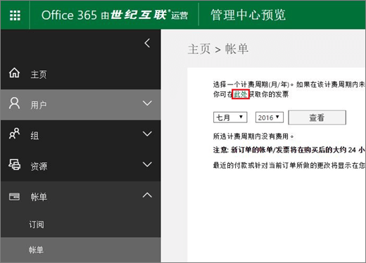
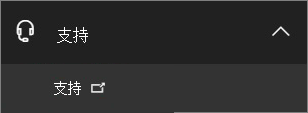
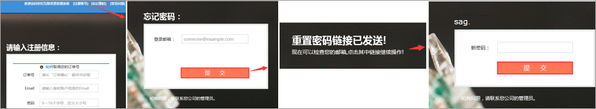

# Solicitar un Fapiao para Office 365 operado por 21Vianet

Puede enviar su solicitud de Fapiao al sistema de administración de Fapiao de 21Vianet unos tres días después de haber pagado. Después de enviar la solicitud de Fapiao, se procesará en dos días.
  

  
## Paso 1: Solicitar un Fapiao

Hay dos formas de solicitar un Fapiao:
  
1. Después de realizar un pago en el Office 365 operado por el sitio web de 21Vianet, recibirá un correo electrónico de confirmación de pedido que contiene su número de pedido y un vínculo al sistema de administración de Fapiao. Puede usar el vínculo del correo electrónico para crear una cuenta en el sistema de administración de información <a href="https://go.microsoft.com/fwlink/p/?linkid=837466" target="_blank">21Vianet Fapiao</a>.

    O bien:

2. Puede solicitar un Fapiao desde el Centro <a href="https://go.microsoft.com/fwlink/p/?linkid=850627" target="_blank">de administración.</a>

    
  
## Paso 2: Registrarse con el sistema de administración de Fapiao de 21Vianet

> [!NOTE]
> Puedes usar el mismo nombre de correo electrónico y contraseña que tu Office 365 cuenta, o puedes usar algo diferente.
  
1. Vaya al sistema de administración <a href="https://go.microsoft.com/fwlink/p/?linkid=837466" target="_blank">de información 21Vianet Fapiao</a>.

2. En el formulario de registro, escriba el número de pedido, la dirección de correo electrónico y la contraseña y, a continuación, seleccione **Registro**.

    
  
3. Una vez completado el registro, el sistema enviará un mensaje de correo electrónico de activación a su dirección de correo electrónico. Abra el mensaje de correo electrónico y seleccione el vínculo para activar su cuenta.

## Paso 3: Enviar la factura de un Fapiao

1. Inicie sesión en el <a href="https://go.microsoft.com/fwlink/p/?linkid=837465" target="_blank">sistema de administración de Fapiao</a>.

2. Seleccione el registro de facturación y, a continuación, **seleccione Aplicar factura**.

    > [!NOTE]
    > El sistema de pago está en una plataforma de terceros y tarda tres días en sincronizar el pedido y el registro de pago.
  
    
  
3. Seleccione el tipo Fapiao, escriba la información necesaria y, a continuación, **seleccione Siguiente**.

    
  
    > [!NOTE]
    > - Para un Fapiao de IVA normal, solo tiene que escribir el nombre del comprador.
    > - Si es necesario, puedes solicitar un Fapiao con un título diferente. Sin embargo, solo puede aplicar un título Fapiao para una factura en el sistema. Si desea dividir el Fapiao en diferentes cantidades o títulos, envíe su solicitud <a href="https://portal.partner.microsoftonline.cn/Support/SupportOverview.aspx" target="_blank">en el Centro de administración.</a>
    > - La próxima vez que solicite un Fapiao, el sistema presenta automáticamente la información anterior de Fapiao.
    > - Si necesitas un certificado de compra o un reembolso, el nombre del pagador y el título de Fapiao deben coincidir.

4. Seleccione un método de envío y escriba la información de correo. Puede elegir Yunda o SF (recolección de carga). También puede ir a la rama 21Vianet Shanghai para obtener el Fapiao. seleccione **Siguiente**.

    
  
    **21Vianet Dirección de la compañía de la sucursal de Shanghai:**

    Shanghai, Pudong Nueva área Keyuan Road No. 88, Centro alemán, edificio 3, 657

    **Información de contacto:**

    Zhu qin qin 021-28986102

5. Compruebe que la información es correcta y, a continuación, **seleccione Confirmar**.

    
  
## Paso 4: Comprobar el progreso de la aplicación

La aplicación se transmite automáticamente al Centro de servicios de 21Vianet y se completará en dos días laborables.
  
Después de enviar la aplicación, puede comprobar el progreso en cualquier momento. Actualizaremos el estado de la aplicación con comentarios como **Emitido** o **Enviado por correo**.
  

  
Cuando Fapiao está fuera de uso, el sistema mostrará un aviso e indicará el tiempo esperado para emitir el Fapiao.
  

  
## Preguntas frecuentes

### ¿Qué servicios puedo obtener del soporte técnico en línea?

Puedes comprobar el progreso de tu solicitud de Fapiao y averiguar por qué no has recibido el Fapiao.
  
Si quieres cambiar el título de Fapiao, envíanos el Fapiao de vuelta y volveremos a emitir el Fapiao. Puede enviar la solicitud a través del <a href="https://portal.partner.microsoftonline.cn/Support/SupportOverview.aspx" target="_blank">Centro de administración.</a>
  

  
### ¿Cómo cambio mi dirección de correo electrónico y contraseña de inicio de sesión?

1. Inicie sesión en el sistema de <a href="https://go.microsoft.com/fwlink/p/?linkid=837465" target="_blank">administración de Fapiao</a>y, a continuación, **seleccione Cambiar dirección de correo electrónico**.

    
  
2. Si ha olvidado la contraseña de inicio de sesión, puede usar su dirección de correo electrónico de inicio de sesión para restablecer la contraseña. El sistema de administración de Fapiao enviará una nueva contraseña a su dirección de correo electrónico. Puede usar la nueva contraseña para iniciar sesión.

    
  
3. Si ha olvidado su dirección de correo electrónico de inicio de sesión, póngase en contacto con el servicio de atención al cliente de 21Vianet al (86) 400-089-0365.

### ¿Cómo puedo encontrar el identificador de mi pedido?

1. En el [Centro de administración,](https://go.microsoft.com/fwlink/p/?linkid=850627)vaya a la página  \> **Facturación & pagos.**

2. Busca la factura que quieras, selecciona para ver o elige descargar el PDF.

### ¿Qué ocurre si escribo la dirección de correo electrónico incorrecta al registrarme?

Si escribe la dirección de correo electrónico incorrecta al registrarse, no recibirá el correo electrónico de activación. El vínculo de registro en el correo electrónico expirará automáticamente después de 24 horas. Puede volver a la página <a href="https://go.microsoft.com/fwlink/p/?linkid=837466" target="_blank">de registro y</a> volver a registrarse con la dirección de correo electrónico correcta.
  
### ¿Qué ocurre si no recibo un correo electrónico de activación?

Si no recibe un correo electrónico de activación de cuenta dentro de las 24 horas 24 horas después de registrarse, vaya al sistema de administración de información <a href="https://go.microsoft.com/fwlink/p/?linkid=837466" target="_blank">21Vianet Fapiao</a>, escriba su dirección de correo electrónico y, a continuación, seleccione **Reenviar** el correo electrónico de activación. El sistema reenviará el correo electrónico de activación de la cuenta a su dirección de correo electrónico registrada.
  

  
Si aún no recibe un correo electrónico de activación, póngase en contacto con el servicio de atención al cliente de 21Vianet al (86) 400-089-0365.