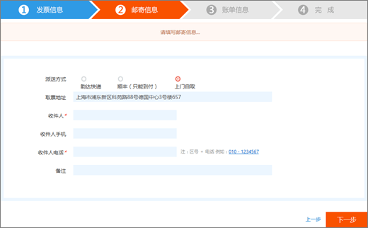
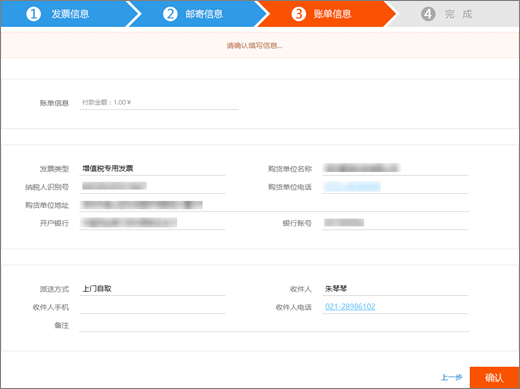

# Solicitar una Fapiao para Office 365 operado por 21VianetApply for a Fapiao for Office 365 operated by 21Vianet

::: moniker range="o365-21vianet"

> [!NOTE]
> El Centro de administración está cambiando.The admin center is changing. Si su experiencia no coincide con los detalles presentados aquí, consulte [Acerca del nuevo Centro de administración de Microsoft 365](https://docs.microsoft.com/microsoft-365/admin/microsoft-365-admin-center-preview?view=o365-21vianet).If your experience doesn't match the details presented here, see [About the new Microsoft 365 admin center](https://docs.microsoft.com/microsoft-365/admin/microsoft-365-admin-center-preview?view=o365-21vianet).

::: moniker-end

Puede enviar su solicitud de Fapiao al sistema de administración de 21Vianet Fapiao tres días después de haber pagado.You can submit your Fapiao request to the 21Vianet Fapiao management system about three days after you have paid. Después de enviar su solicitud de Fapiao, se procesará en dos días.After you submit your Fapiao request, it will be processed in two days.
  

  
## Paso 1: solicitar un FapiaoStep 1: Apply for a Fapiao

Hay dos formas de aplicar una Fapiao:There are two ways to apply for a Fapiao:
  
1. Después de realizar un pago en el sitio web de Office 365 operado por 21Vianet, recibirá un correo electrónico de confirmación de pedido que contiene el número de pedido y un vínculo al sistema de administración de Fapiao.After making a payment in the Office 365 operated by 21Vianet website, you'll receive an order confirmation email that contains your order number and a link to the Fapiao management system. Puede usar el vínculo del correo electrónico para crear una cuenta en el <a href="https://go.microsoft.com/fwlink/p/?linkid=837466" target="_blank">sistema de administración de información de 21Vianet Fapiao</a>.You can use the link in the email to create an account in the <a href="https://go.microsoft.com/fwlink/p/?linkid=837466" target="_blank">21Vianet Fapiao information management system</a>.
    
    O bien:Or
    
2. Puede solicitar un Fapiao en el centro de <a href="https://go.microsoft.com/fwlink/p/?linkid=850627" target="_blank">Administración</a>.You can apply for a Fapiao from the <a href="https://go.microsoft.com/fwlink/p/?linkid=850627" target="_blank">admin center</a>.
    
    
  
## Paso 2: registrarse con el sistema de administración de 21Vianet FapiaoStep 2: Register with the 21Vianet Fapiao management system

> [!NOTE]
> Puede usar el mismo nombre de correo electrónico y la misma contraseña que su cuenta de Office 365 o puede usar algo diferente.You can use the same email name and password as your Office 365 account, or you can use something different. 
  
1. Vaya al <a href="https://go.microsoft.com/fwlink/p/?linkid=837466" target="_blank">sistema de administración de información de 21Vianet Fapiao</a>.Go to the <a href="https://go.microsoft.com/fwlink/p/?linkid=837466" target="_blank">21Vianet Fapiao information management system</a>.
    
2. En el formulario de registro, escriba el número de pedido, la dirección de correo electrónico y la contraseña y, a continuación, seleccione **registro**.In the registration form, enter your order number, email address, and password, then select **Registration**.
    
    
  
3. Una vez finalizado el registro, el sistema enviará un mensaje de correo de activación a su dirección de correo electrónico.After your registration is complete, the system will send an activation email message to your email address. Abra el mensaje de correo electrónico y seleccione el vínculo para activar su cuenta.Open the email message and select the link to activate your account.
    
## Paso 3: enviar la factura a un FapiaoStep 3: Submit your bill for a Fapiao

1. Inicie sesión en el <a href="https://go.microsoft.com/fwlink/p/?linkid=837465" target="_blank">sistema de administración de Fapiao</a>.Log in to the <a href="https://go.microsoft.com/fwlink/p/?linkid=837465" target="_blank">Fapiao management system</a>.
    
2. Seleccione el registro de facturación y, después, seleccione **Aplicar efecto**.Select the billing record, then select **Apply bill**.
    
    > [!NOTE]
    > El sistema de pago está en una plataforma de terceros y tarda tres días en sincronizar el registro de pedidos y pagos.The payment system is on a third-party platform and takes three days to synchronize the order and payment record. 
  
    
  
3. Seleccione el tipo Fapiao, especifique la información necesaria y, a continuación, seleccione **siguiente**.Select the Fapiao type, enter the required information, then select **Next**.
    
    
  
    > [!NOTE]
    > - Para una Fapiao de IVA normal, solo tienes que especificar el nombre del comprador.For a normal VAT Fapiao, you only need to enter the buyer's name.
    > - Si es necesario, puede solicitar un Fapiao con un título diferente.If necessary, you can apply for a Fapiao with different a title. Sin embargo, solo puede aplicar un título de Fapiao para una factura en el sistema.However, you can only apply one Fapiao title for one bill in the system. Si desea dividir la Fapiao en diferentes importes o títulos, <a href="https://portal.partner.microsoftonline.cn/Support/SupportOverview.aspx" target="_blank">Envíe su solicitud en el centro de administración</a>.If you want to split the Fapiao into different amounts or titles, please <a href="https://portal.partner.microsoftonline.cn/Support/SupportOverview.aspx" target="_blank">submit your request in the admin center</a>.
    > - La próxima vez que se aplica a un Fapiao, el sistema presenta automáticamente la información del Fapiao anterior.The next time you apply for a Fapiao, the system automatically presents the previous Fapiao information.
    > - Si necesita un certificado de compra o un reembolso, el nombre del pagador y el título de la Fapiao deben coincidir.If you need a purchase certificate or a refund, the payer name and the Fapiao title must match.
    
4. Seleccione un método de envío y especifique la información de correo.Select a shipping method and enter the mailing information. Puede elegir Yunda o CF (flete Collect).You can choose Yunda or SF (freight collect). También puede ir a la rama Shanghái de 21Vianet para obtener la Fapiao.You can also go to the 21Vianet Shanghai branch to get the Fapiao. Seleccione **siguiente**.select **Next**.
    
    
  
    **Dirección de la empresa de la sucursal Shanghái de 21Vianet:****21Vianet Shanghai branch company address:**

    Shanghái, Pudong nueva área Keyuan Nº de carreteraShanghai, Pudong New Area Keyuan Road No. 88, centro de Alemania, edificio 3, 65788, German Center, building 3, 657

    **Información de contacto:****Contact information:**

    Zhu Qin Qin 021-28986102Zhu qin qin 021-28986102
   
5. Compruebe que la información es correcta y, a continuación, seleccione **confirmar**.Verify that the information is correct, then select **Confirm**.
    
    
  
## Paso 4: comprobar el progreso de la aplicaciónStep 4: Check application progress

La aplicación se transmite automáticamente al centro de servicios de 21Vianet y se completará en dos días laborables.Your application is automatically transmitted to the 21Vianet Service Center, and will be completed in two working days.
  
Después de enviar la aplicación, puede comprobar el progreso en cualquier momento.After you submit the application, you can check the progress at any time. Se actualizará el estado de la aplicación con comentarios como **emitido** o **enviado por correo**.We will update the status of your application with remarks like **Issued** or **Mailed out**.
  

  
Cuando Fapiao está fuera de uso, el sistema mostrará un aviso y indicará el tiempo que se espera para emitir el Fapiao.When Fapiao is out of use, the system will display a notice, and will indicate the expected time to issue the Fapiao.
  

  
## Preguntas frecuentesFAQs

### ¿Qué servicios puedo obtener de soporte en línea?What services can I get from online support?

Puede comprobar el progreso de la solicitud de Fapiao y averiguar por qué no ha recibido el Fapiao.You can check the progress of your Fapiao request, and find out why you haven't received the Fapiao.
  
Si desea cambiar el título de la Fapiao, vuelva a enviarnos el Fapiao y volver a emitir el Fapiao.If you want to change the Fapiao title, please send the Fapiao back to us and we will reissue the Fapiao. Puede enviar la solicitud a través del <a href="https://portal.partner.microsoftonline.cn/Support/SupportOverview.aspx" target="_blank">centro de administración</a>.You can submit the request through the <a href="https://portal.partner.microsoftonline.cn/Support/SupportOverview.aspx" target="_blank">admin center</a>.
  

  
### ¿Cómo puedo cambiar mi dirección de correo electrónico y contraseña de inicio de sesión?How do I change my login email address and password?

1. Inicie sesión en el <a href="https://go.microsoft.com/fwlink/p/?linkid=837465" target="_blank">sistema de administración de Fapiao</a>y, a continuación, seleccione **cambiar dirección de correo electrónico**.Log in to the <a href="https://go.microsoft.com/fwlink/p/?linkid=837465" target="_blank">Fapiao management system</a>, then select **Change email address**.
    
    
  
2. Si ha olvidado la contraseña de inicio de sesión, puede usar su dirección de correo electrónico de inicio de sesión para restablecer la contraseña.If you forgot your login password, you can use your login email address to reset the password. El sistema de administración de Fapiao enviará una contraseña nueva a su dirección de correo electrónico.The Fapiao management system will send a new password to your email address. Puede usar la nueva contraseña para iniciar sesión.You can use the new password to login.
    
    
  
3. Si ha olvidado su dirección de correo electrónico de inicio de sesión, póngase en contacto con el servicio de atención al cliente de 21Vianet en (86) 400-089-0365.If you forgot your login email address, please contact 21Vianet customer service at (86) 400-089-0365.
    
### ¿Cómo encuentro el identificador de pedido?How do I find my order ID?

1. En el [centro de administración](https://go.microsoft.com/fwlink/p/?linkid=850627), vaya a **la** \> página **facturas & pagos** .In the [admin center](https://go.microsoft.com/fwlink/p/?linkid=850627), go to the **Billing** \> **Bills & payments** page.
    
2. Busque la factura que desee, seleccione para verla o seleccione descargar el archivo PDF.Find the invoice you want, select to view, or choose to download the PDF.

  
### ¿Qué ocurre si escribo una dirección de correo electrónico incorrecta al registrarme?What if I enter the wrong email address when I register?

Si escribe una dirección de correo electrónico incorrecta al registrarse, no recibirá el correo electrónico de activación.If you enter the wrong email address when you register, you won't receive the activation email. El vínculo de registro del correo electrónico expirará automáticamente transcurridas 24 horas.The registration link in the email will automatically expire after 24 hours. Puede volver a la <a href="https://go.microsoft.com/fwlink/p/?linkid=837466" target="_blank">Página de registro</a> y volver a registrarse con la dirección de correo electrónico correcta.You can return to the <a href="https://go.microsoft.com/fwlink/p/?linkid=837466" target="_blank">registration page</a> and register again with the correct email address. 
  
### ¿Qué ocurre si no recibo un correo de activación?What if I don't receive an activation email?

Si no recibe un correo electrónico de activación de la cuenta en un plazo de 24 horas tras el registro, vaya al <a href="https://go.microsoft.com/fwlink/p/?linkid=837466" target="_blank">sistema de administración de información de Fapiao de 21Vianet</a>, escriba su dirección de correo electrónico y, después, seleccione volver a **Enviar el correo electrónico de activación**.If you don't receive an account activation email within 24 hours after you register, go to the <a href="https://go.microsoft.com/fwlink/p/?linkid=837466" target="_blank">21Vianet Fapiao information management system</a>, enter your email address, then select **Resend the activation email**. El sistema volverá a enviar el correo electrónico de activación de cuenta a su dirección de correo electrónico registrada.The system will resend the account activation email to your registered email address.
  

  
Si sigue sin recibir un correo electrónico de activación, póngase en contacto con el servicio de atención al cliente de 21Vianet en (86) 400-089-0365.If you still don't receive an activation email, please contact 21Vianet customer service at (86) 400-089-0365.
