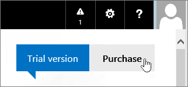

# Comprar o probar las suscripciones para Office 365 operado por 21VianetBuy or try subscriptions for Office 365 operated by 21Vianet

> [!NOTE]
>  Este artículo se aplica a Office 365 operado por 21Vianet en China.This article applies to Office 365 operated by 21Vianet in China.

## Compre o pruebe Office 365Buy or try Office 365

Puede comprar una suscripción inmediatamente o puede probar Office 365 durante un máximo de 30 días.You can buy a subscription right away, or you can try Office 365 for up to 30 days. Si lo desea, puede comprar su suscripción de prueba y mantener el dominio, los datos y la configuración que ha configurado en la versión de prueba.If you like it, you can buy your trial subscription and keep the domain, data, and configuration you set up in your trial.

1. Vaya a [comparar Office 365 para planes de empresa](https://go.microsoft.com/fwlink/p/?linkid=393691&amp;clcid=0x409) y seleccione el nombre del plan que desea comprar.Go to [Compare Office 365 for business plans](https://go.microsoft.com/fwlink/p/?linkid=393691&amp;clcid=0x409) and select the name of the plan you want to buy. A continuación, seleccione **comprar ahora**.Then, select **Buy now**.

2. Cree una cuenta rellenando la página **sólo unos pocos detalles** .Create an account by filling out the **Just a few details** page.

3. Siga las instrucciones para configurar su versión de prueba de 30 días o para completar la compra.Follow the instructions to set up your 30-day trial or to complete your purchase.

## Comprar la suscripción de pruebaBuy your trial subscription

1. [Inicie sesión en Office 365](https://go.microsoft.com/fwlink/p/?linkid=513813) con su cuenta profesional o educativa.[Sign in to Office 365](https://go.microsoft.com/fwlink/p/?linkid=513813) with your work or school account.

2. Si aún no se encuentra en la página de inicio, seleccione **Office 365** en la parte superior izquierda.If you're not already on the start page, select **Office 365** in the top-left hand corner.

    

3. En la parte superior derecha de la página, debajo de la barra de navegación, haga clic en **Comprar**.At the top right-hand corner of the page, under the navigation bar, select **Purchase**.

    

4. En la página **Comprar suscripciones**, verá los distintos planes que puede comprar. El plan que ha probado se identifica con el banner **En prueba**.On the **Purchase subscriptions** page, you'll see the different plans that you can buy. The plan that you've been trying is identified by the **In Trial** banner.

    > [!IMPORTANT]
    > Si adquiere un plan diferente del plan de prueba, tiene que reasignar las licencias del plan de prueba al nuevo plan (antes de que finalice el período de gracia de 90 días después de que expire el plan de prueba) para conservar los datos, las cuentas y la configuración.If you purchase a different plan from your trial plan, you have to reassign your licenses from your trial plan to your new plan (before your 90-day grace period ends after your trial plan expires) in order to retain your data, accounts, and configuration. De lo contrario, se perderán los datos, las cuentas y la configuración.Otherwise, you will lose your data, accounts, and configuration.

5. Seleccione la suscripción que desea comprar y seleccione **Comprar ahora**.Select the subscription that you want to purchase and then select **Buy now**.

6. Siga los pasos para desproteger.Follow the steps to check out.

## Agregar suscripciones o complementos a una cuenta de Office 365 existenteAdd subscriptions or add-ons to an existing Office 365 account

1. En el [centro de administración](https://go.microsoft.com/fwlink/p/?linkid=850627), vaya a **Billing** la \> Página servicios de **compra** de facturación.In the [admin center](https://go.microsoft.com/fwlink/p/?linkid=850627), go to the **Billing** \> **Purchase services** page.

2. Seleccione los servicios que quiera comprar, seleccione **comprar**y, a continuación, seleccione **Desproteger ahora**.Select the service(s) that you'd like to purchase, select **Buy**, and then select **Check out now**.

3. Sigue las instrucciones para completar la compra.Follow the instructions to complete your purchase.

## Opciones de pagoPayment options

Puede pagar la suscripción de la siguiente manera:You can pay for your subscription by:

- FacturaInvoice

- Pago en línea con Alipay o UnionPay de ChinaOnline payment using Alipay or China UnionPay

La prueba de pago se proporcionará en forma de Fapiaos.Proof of payment will be provided in the form of Fapiaos. Puede enviar su solicitud de Fapiao a nuestro [sistema de Fapiao](https://go.microsoft.com/fwlink/p/?LinkId=395314) aproximadamente tres (3) días después de pagar.You can submit your Fapiao request to our [Fapiao system](https://go.microsoft.com/fwlink/p/?LinkId=395314) about three (3) days after you have paid. Para obtener más información, consulte [Apply for a Fapiao for Office 365 operated by 21Vianet](apply-for-a-fapiao.md).For more information, see [Apply for a Fapiao for Office 365 operated by 21Vianet](apply-for-a-fapiao.md).

> [!NOTE]
>  No se aceptan tarjetas de crédito internacionales.International credit cards are not accepted.
