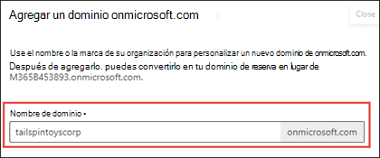

# Agregar un dominio a Microsoft 365

 **[Consulte Preguntas más frecuentes acerca de los dominios](domains-faq.yml)** si no encuentra lo que busca.

Consulte [ayuda de Microsoft 365 para pequeñas empresas](https://go.microsoft.com/fwlink/?linkid=2197659) en YouTube.
  
## Antes de empezar

Para agregar, modificar o quitar dominios, **debe** ser un administrador **de nombres de dominio** o **administrador global** de un [plan empresarial](https://products.office.com/business/office). Estos cambios afectan a todo el inquilino, los *administradores personalizados* o *usuarios normales* no podrán realizar estos cambios.

> [!TIP]
> Si necesita ayuda con los pasos que se describen en este tema, considere la posibilidad de [trabajar con un especialista en pequeñas empresas de Microsoft](https://go.microsoft.com/fwlink/?linkid=2186871). Con Business Assist, usted y sus empleados obtienen acceso de forma ininterrumpida a especialistas de pequeñas empresas a medida que hace crecer su negocio, desde la incorporación laboral hasta el uso cotidiano.

## Ver: Agregar un dominio

Consulte este vídeo y otros en nuestro [canal de YouTube](https://go.microsoft.com/fwlink/?linkid=2198213).

> [!VIDEO https://www.microsoft.com/videoplayer/embed/RE4dN8c?autoplay=false]

Es posible que su empresa necesite varios nombres de dominio para distintos fines. Por ejemplo, es posible que quiera agregar una ortografía diferente del nombre de la empresa porque los clientes ya la están usando y sus comunicaciones no han podido llegarle.

1. En el Centro de administración de Microsoft 365, elija <a href="https://go.microsoft.com/fwlink/p/?linkid=2171997" target="_blank">**Configuración**</a>.
1. En **Configurar el dominio personalizado**, seleccione **Ver** > **Administrar** > **Agregar dominio**.
1. Escriba el nuevo nombre de dominio que desea agregar y seleccione **Siguiente**.
1. Inicie sesión en el registrador de dominios y seleccione **Siguiente**.
1. Elija los servicios para el nuevo dominio.
1. Seleccione **Siguiente** > **Autorizar** > **Siguiente** y **Finalizar**. Ya tiene agregado el nuevo dominio.

## Agregar un dominio

Siga estos pasos para agregar, configurar o continuar configurando un dominio. 

::: moniker range="o365-worldwide"

1. Vaya al Centro de administración en <a href="https://go.microsoft.com/fwlink/p/?linkid=2024339" target="_blank">https://admin.microsoft.com</a>.

::: moniker-end

::: moniker range="o365-21vianet"

1. Vaya al Centro de administración en <a href="https://go.microsoft.com/fwlink/p/?linkid=850627" target="_blank">https://portal.partner.microsoftonline.cn</a>.

::: moniker-end
    
2. Vaya a la página **Configuración** > **Dominios**. 

3. Seleccione **Agregar dominio**.
    
4. Escriba el nombre del dominio que quiere agregar y seleccione **Siguiente**.
    
5. Elija cómo quiere comprobar que es el propietario del dominio.
    
    1. Si el registrador de dominios usa [Domain Connect](#domain-connect-registrars-integrating-with-microsoft-365), Microsoft [ configurará los registros automáticamente](../get-help-with-domains/domain-connect.md) haciendo que inicie sesión en el registrador y confirme la conexión a Microsoft 365. Volverá al centro de administración y Microsoft comprobará automáticamente su dominio.
    2. You can use a TXT record to verify your domain. Select this and select **Next** to see instructions for how to add this DNS record to your registrar's website. This can take up to 30 minutes to verify after you've added the record. 
    3. Puede agregar un archivo de texto al sitio web de su dominio. Seleccione y descargue el archivo .txt desde el asistente para la instalación y cargue el archivo en la carpeta de nivel superior del sitio web. La ruta de acceso al archivo debe ser similar a: `http://mydomain.com/ms39978200.txt`. Para confirmar que es el propietario del dominio, buscaremos el archivo en su sitio web.
    
6. Elija cómo quiere realizar los cambios de DNS necesarios para que Microsoft use su dominio.
    
    1. Elija **Agregar los registros DNS para mí** si su registrador admite [Domain Connect](#domain-connect-registrars-integrating-with-microsoft-365) y Microsoft [configurará los registros automáticamente](../get-help-with-domains/domain-connect.md) haciendo que inicie sesión en el registrador y confirme la conexión a Microsoft 365.
    2. Choose **I'll add the DNS records myself** if you want to attach only specific Microsoft 365 services to your domain or if you want to skip this for now and do this later. **Choose this option if you know exactly what you're doing.**

7. Si decide *agregar registros DNS usted mismo*, seleccione **Siguiente** y verá una página con todos los registros que necesita agregar al sitio web de registradores para configurar el dominio. 

    Si el portal no reconoce el registrador, puede [seguir estas instrucciones generales.](../get-help-with-domains/create-dns-records-at-any-dns-hosting-provider.md)
    
    Si no conoce el proveedor de host DNS o el registrador de dominios de su dominio, vea [Encuentre su registrador de dominios o proveedor de host DNS](../get-help-with-domains/find-your-domain-registrar.md).
    
    Si quiere esperar a más tarde, anule la selección de todos los servicios y haga clic en **Continuar** o, en el paso de conexión de dominio anterior, elija **Más opciones** y seleccione **Omitir esto por ahora**.
    
8. Seleccione **Finalizar**. Ya está todo.

## Agregar o editar registros DNS personalizados

Siga los pasos que se indican a continuación para agregar un registro personalizado para un sitio web o un servicio de terceros.

1. Inicie sesión en el Centro de administración de Microsoft en <a href="https://go.microsoft.com/fwlink/p/?linkid=2024339" target="_blank">https://admin.microsoft.com</a>.

2. Vaya a la página **Configuración**  > **Dominios**.

3. En la página **Dominios**, seleccione un dominio. 
    
4. En **Configuración de DNS**, seleccione **Registros personalizados**; después, seleccione **Nuevo registro personalizado**.

5. Seleccione el tipo de registro DNS que quiere agregar y escriba la información para el nuevo registro.
    
6. Haga clic en **Guardar**.

## Registradores con Domain Connect

Los registradores habilitados para [Domain Connect](https://www.domainconnect.org/) le permiten agregar el dominio a Microsoft 365 en un proceso de tres pasos que tarda minutos. 
  
En el asistente, solo confirmaremos que es el propietario del dominio y configuraremos automáticamente los registros del dominio, para lo que el correo electrónico que llega a Microsoft 365 y otros servicios de Microsoft 365, como Teams, funcione con su dominio.
  
> [!NOTE]
> Asegúrese de desactivar los bloqueadores de ventanas emergente en el explorador antes de iniciar el Asistente de configuración.
  
### Registradores de Domain Connect que se integran con Microsoft 365

- [1&amp;1 IONOS](https://www.1and1.com/)
- [EuroDNS](https://www.eurodns.com/)
- [Cloudflare](https://www.cloudflare.com/)
- [GoDaddy](https://www.godaddy.com/)
- [WordPress.com](https://wordpress.com/)
- [Plesk](https://www.plesk.com/)
- [MediaTemple](https://mediatemple.net/)
- SecureServer o WildWestDomains (revendedores de GoDaddy que usan el hospedaje DNS de SecureServer)
    - Ejemplos:
        - [DomainsPricedRight](https://www.domainspricedright.com/products/domain-registration)
        - [DomainRightNow](https://www.domainrightnow.com/)

### ¿Qué ocurre con mi correo electrónico y mi sitio web?

After you finish setup, the MX record for your domain is updated to point to Microsoft 365 and all email for your domain will start coming to Microsoft 365. Make sure you've added users and set up mailboxes in Microsoft 365 for everyone who gets email on your domain!
  
If you have a website that you use with your business, it will keep working where it is. The Domain Connect setup steps don't affect your website.

### Agregar un dominio de onmicrosoft.com

Cada organización de Microsoft 365 puede tener hasta cinco dominios onmicrosoft.com.

> [!NOTE]
> Debe ser administrador global o administrador de nombres de dominio para agregar un dominio.
> Al crear un dominio .onmicrosoft adicional y usarlo como predeterminado, no se cambiará el nombre de SharePoint Online. Para realizar cambios en el dominio .onmicrosoft de SharePoint, tendría que usar la [versión preliminar del cambio de nombre de dominio de SharePoint](/sharepoint/change-your-sharepoint-domain-name) (actualmente disponible para cualquier inquilino con menos de 10 000 sitios).
> Si usa servicios de correo de Microsoft 365, no se admite la eliminación del dominio .onmicrosoft inicial.

Para agregar un dominio onmicrosoft.com:

1. En el Centro de administración de Microsoft 365, seleccione **Configuración** y, después, **dominios**.

2. Seleccione un dominio *.onmicrosoft.com* existente.

    
  

3. En la pestaña **Información general**, seleccione **Agregar dominio onmicrosoft.com**.

    

4. En la página **Agregar dominio de Onmicrosoft** , en el cuadro **Nombre de dominio** , escriba el nombre del nuevo dominio onmicrosoft.com. 

    

    > [!NOTE]
    > Asegúrese de comprobar la ortografía y la precisión del nombre de dominio especificado. Está limitado a cinco dominios onmicrosoft.com y actualmente no se pueden eliminar una vez creados.     

5. Seleccione **Agregar dominio**. Cuando se agregue correctamente, verá un mensaje que indica esto. 
    
    

Puede establecer cualquier dominio que posea como dominio predeterminado. 

Para obtener más información sobre cómo agregar un dominio onmicrosoft.com, consulte [Agregar o reemplazar el dominio de onmicrosoft.com](add-or-replace-your-onmicrosoftcom-domain.md).

## Contenido relacionado

[Preguntas más frecuentes sobre dominios](domains-faq.yml) (artículo) 
[What is a domain?](../get-help-with-domains/what-is-a-domain.md) (article) 
[Comprar un nombre de dominio en Microsoft 365](../get-help-with-domains/buy-a-domain-name.md) (artículo) 
[Agregar registros DNS para conectar el dominio](../get-help-with-domains/create-dns-records-at-any-dns-hosting-provider.md) (artículo) 
[Cambiar los servidores DNS para configurar Microsoft 365 con cualquier registrador de dominios](../get-help-with-domains/change-nameservers-at-any-domain-registrar.md) (artículo)
