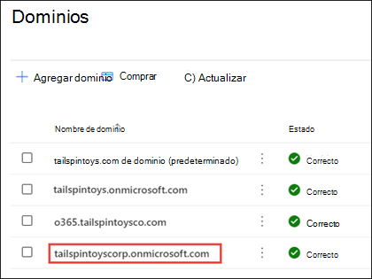

# Agregar y reemplazar el dominio de reserva de onmicrosoft.com en Microsoft 365

Al registrarse en Microsoft 365, Microsoft proporciona un dominio *de onmicrosoft.com* (el **dominio de reserva** ) en caso de que no sea propietario de un dominio o no quiera conectarlo a Microsoft 365 (por ejemplo, tailspintoys.onmicrosoft.com). El dominio de reserva se usa de forma predeterminada en:

- Nombres de usuario y direcciones de correo electrónico
- Los equipos de Microsoft 365 & grupos de alias de correo electrónico
- Movimientos automáticos de dependencia de dominio

Actúa como una dirección de enrutamiento de correo electrónico predeterminada para el entorno de Microsoft 365. Cuando un usuario está configurado con un buzón de correo, el correo electrónico se enruta al dominio de reserva.  Incluso si se usa un dominio personalizado (por ejemplo, tailspintoys.com), si ese dominio personalizado se elimina del entorno de Microsoft 365, el dominio de reserva garantiza que el correo electrónico del usuario se enrute correctamente.

Puede cambiar el dominio de reserva en el Centro de administración de Microsoft 365. Entre los motivos comunes por los que los clientes cambian su dominio de reserva se incluyen:

- No conocer el nombre de la empresa que se usará cuando se registraron por primera vez en Microsoft 365. Ahora que conocen el nombre de la empresa, quieren que sus usuarios tengan nombres de cuenta de inicio de sesión adecuados. 
- Quieren cambiar el aspecto de sus direcciones URL de SharePoint al crear un nuevo sitio. Las direcciones URL de SharePoint en el entorno de Microsoft 365 se crean en función del nombre de dominio de reserva. Si no usó el nombre de empresa correcto cuando se registró por primera vez, las direcciones URL de SharePoint para los sitios seguirán usando ese nombre al crear nuevos sitios de SharePoint. 

Aunque puede agregar dominios de onmicrosoft.com adicionales, solo se puede usar un dominio onmicrosoft.com como dominio de reserva. En los pasos de este artículo se describe cómo:
- Creación de un nuevo dominio de onmicrosoft.com
- Asignarlo como dominio de reserva

> [!NOTE]
> Está limitado a un total de cinco dominios onmicrosoft.com en su entorno de Microsoft 365. Una vez agregados, no se pueden quitar. 
  
## Antes de empezar

Para agregar, modificar o quitar dominios, **debe** ser un administrador **de nombres de dominio** o **administrador global** de un [plan empresarial](https://products.office.com/business/office). Estos cambios afectan a todo el inquilino, los *administradores personalizados* o *usuarios normales* no podrán realizar estos cambios.

## Adición de un nuevo dominio de onmicrosoft.com

1. En el Centro de administración de Microsoft 365, seleccione **Configuración** y, después, **dominios**.
2. Seleccione el onmicrosoft.com dominio predeterminado.

    
  
3. En la página de propiedades del dominio, en la sección **Acerca de este dominio** , seleccione **Agregar dominio de Microsoft**.

    

4. En la página **Agregar dominio de Onmicrosoft** , en el cuadro **Nombre de dominio** , escriba el nombre del nuevo dominio onmicrosoft.com. 

    

    > [!NOTE]
    > Asegúrese de comprobar la ortografía y la precisión del nombre de dominio especificado. Está limitado a cinco dominios onmicrosoft.com y actualmente no se pueden eliminar una vez creados.     

5. Seleccione **Agregar dominio**. Cuando se agregue correctamente, verá un mensaje que indica esto. 
    
    

## Convertir el nuevo dominio onmicrosoft.com en dominio de reserva

> [!NOTE]
> Antes de cambiar el dominio de reserva a un nuevo dominio de onmicrosoft.com, es posible que desee considerar la posibilidad de cambiar el dominio de SharePoint onmicrosoft.com. Crear un dominio onmicrosoft adicional y usarlo como dominio de reserva no cambiará el nombre de SharePoint Online. Las direcciones URL de SharePoint y OneDrive existentes seguirán siendo las mismas.  Puede cambiar el dominio de SharePoint de.onmicrosoft mediante los pasos de PowerShell proporcionados en [la versión preliminar del cambio de nombre de dominio de SharePoint](/sharepoint/change-your-sharepoint-domain-name) (actualmente disponible para cualquier inquilino con menos de 10 000 sitios).

Después de crear el nuevo dominio de onmicrosoft.com, haga lo siguiente para cambiarlo al dominio de reserva.

1. En el Centro de administración de Microsoft 365, seleccione **Configuración** y, después, **dominios**. 

2. Seleccione el nuevo dominio de onmicrosoft.com que ha creado.

     

3. En la página de propiedades del dominio, seleccione **Crear dominio de reserva**.
 
     

4. Se mostrará un mensaje en la página que indica que el dominio de reserva ha cambiado al nuevo dominio.

     

## Contenido relacionado

[Preguntas más frecuentes sobre dominios](domains-faq.yml) (artículo) 
[¿Qué es un dominio?](../get-help-with-domains/what-is-a-domain.md) (artículo) 
[Comprar un nombre de dominio en Microsoft 365](../get-help-with-domains/buy-a-domain-name.md) (artículo) 
[Agregar registros DNS para conectar el dominio](../get-help-with-domains/create-dns-records-at-any-dns-hosting-provider.md) (artículo) 
[Cambiar los servidores DNS para configurar Microsoft 365 con cualquier registrador de dominios](../get-help-with-domains/change-nameservers-at-any-domain-registrar.md) (artículo)
