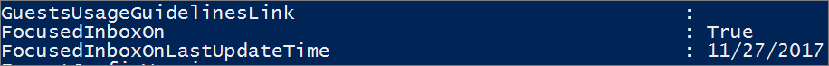

# <a name="configure-focused-inbox-for-everyone-in-your-organization"></a><span data-ttu-id="6dd7c-103">Configurar la Bandeja de entrada Prioritarios para todos los usuarios de la organización</span><span class="sxs-lookup"><span data-stu-id="6dd7c-103">Configure Focused Inbox for everyone in your organization</span></span>

  <span data-ttu-id="6dd7c-104">Si es el responsable de configurar el modo en que el correo electrónico trabaja para todos los usuarios de la empresa, este artículo le interesa.</span><span class="sxs-lookup"><span data-stu-id="6dd7c-104">If you're responsible for configuring how email works for EVERYONE in a business this article is for you!</span></span> <span data-ttu-id="6dd7c-105">En él se explica cómo personalizarlo o desactivarlo para su empresa y responde a temas sobre [Preguntas más frecuentes](#faq-for-focused-inbox).</span><span class="sxs-lookup"><span data-stu-id="6dd7c-105">It explains how to customize it or turn it off for your business, and answers [frequently asked questions](#faq-for-focused-inbox).</span></span>  <br/> <span data-ttu-id="6dd7c-106">Si quiere desactivar la Bandeja de entrada Prioritarios solo para usted, vea [Desactivar la Bandeja de entrada Prioritarios](https://support.office.com/article/f714d94d-9e63-4217-9ccb-6cb2986aa1b2.aspx).</span><span class="sxs-lookup"><span data-stu-id="6dd7c-106">If you would like to turn off Focused Inbox for just yourself, please see [Turn off Focused Inbox](https://support.office.com/article/f714d94d-9e63-4217-9ccb-6cb2986aa1b2.aspx).</span></span>  
   
<span data-ttu-id="6dd7c-p102">Si quiere asegurarse de que los usuarios reciben mensajes de correo electrónico específicos de un aspecto de la empresa como, por ejemplo, los recursos humanos o las nóminas, puede configurar la Bandeja de entrada Prioritarios para que estos mensajes se muestren en la vista Prioritarios. También puede controlar si los usuarios de su organización pueden ver la Bandeja de entrada Prioritarios en su buzón.</span><span class="sxs-lookup"><span data-stu-id="6dd7c-p102">If you want to be sure that your users receive business-specific email messages, for example, from HR or payroll, you can configure Focused Inbox so these messages reach the Focused view. You can also control whether users in your organization see the Focused Inbox in their mailbox.</span></span>
  
## <a name="turn-focused-inbox-on-or-off-in-your-organization"></a><span data-ttu-id="6dd7c-109">Activar o desactivar la Bandeja de entrada Prioritarios en su organización</span><span class="sxs-lookup"><span data-stu-id="6dd7c-109">Turn Focused Inbox On or Off in your organization</span></span>

<span data-ttu-id="6dd7c-110">Use PowerShell para activar o desactivar la Bandeja de entrada Prioritarios para todos los usuarios de la organización.</span><span class="sxs-lookup"><span data-stu-id="6dd7c-110">You use PowerShell to turn Focused Inbox on or off for everyone in your organization.</span></span> <span data-ttu-id="6dd7c-111">¿Quiere hacerlo en el Centro de administración de Microsoft 365?</span><span class="sxs-lookup"><span data-stu-id="6dd7c-111">Do you want to do this in the Microsoft 365 admin center?</span></span> <span data-ttu-id="6dd7c-112">Informe a nuestro equipo de ingeniería.</span><span class="sxs-lookup"><span data-stu-id="6dd7c-112">Let our Engineering team know.</span></span> <span data-ttu-id="6dd7c-113">**[¡Vote aquí!](https://go.microsoft.com/fwlink/?linkid=862489)**</span><span class="sxs-lookup"><span data-stu-id="6dd7c-113">**[Vote here!](https://go.microsoft.com/fwlink/?linkid=862489)**</span></span>
  
 <span data-ttu-id="6dd7c-114">**Para desactivar la Bandeja de entrada Prioritarios:**</span><span class="sxs-lookup"><span data-stu-id="6dd7c-114">**To turn off Focused Inbox:**</span></span>
  
<span data-ttu-id="6dd7c-p104">En el siguiente ejemplo de PowerShell se **desactiva** la Bandeja de entrada Prioritarios de la organización. Sin embargo, no se bloquea la disponibilidad de la característica para los usuarios. Si quieren, pueden volver a habilitar la Bandeja de entrada Prioritarios en cada uno de sus clientes. </span><span class="sxs-lookup"><span data-stu-id="6dd7c-p104">The following PowerShell example turns Focused Inbox **Off** in your organization. However, it doesn't block the availability of the feature for your users. If they want, they can still re-enable Focused Inbox again on each of their clients.</span></span> 
  
1. <span data-ttu-id="6dd7c-118">[Conectarse a Exchange Online mediante PowerShell remoto](https://go.microsoft.com/fwlink/p/?LinkId=396554).</span><span class="sxs-lookup"><span data-stu-id="6dd7c-118">[Connect to Exchange Online using remote PowerShell](https://go.microsoft.com/fwlink/p/?LinkId=396554).</span></span>
    
2. <span data-ttu-id="6dd7c-p105">Debe tener permisos asignados para poder realizar estos procedimientos. Para ver qué permisos necesita, consulte la entrada "Reglas de transporte" de [Permisos de directivas de mensajería y conformidad](https://go.microsoft.com/fwlink/p/?LinkId=829796).</span><span class="sxs-lookup"><span data-stu-id="6dd7c-p105">You need to be assigned permissions before you can perform this procedure or procedures. To see what permissions you need, see the "Transport rules" entry in [Messaging policy and compliance permissions](https://go.microsoft.com/fwlink/p/?LinkId=829796).</span></span>
    
3. <span data-ttu-id="6dd7c-121">Ejecute el cmdlet **Get-OrganizationConfig**.</span><span class="sxs-lookup"><span data-stu-id="6dd7c-121">Run the **Get-OrganizationConfig** cmdlet.</span></span> 
    
 ``` PowerShell
Get-OrganizationConfig
 ```

4. <span data-ttu-id="6dd7c-122">Busque **FocusedInboxOn** para ver la configuración actual:</span><span class="sxs-lookup"><span data-stu-id="6dd7c-122">Look for **FocusedInboxOn** to view its current setting:</span></span> 
    
    
  
5. <span data-ttu-id="6dd7c-124">Ejecute el cmdlet siguiente para desactivar la Bandeja de entrada Prioritarios.</span><span class="sxs-lookup"><span data-stu-id="6dd7c-124">Run the following cmdlet to turn Focused Inbox off.</span></span>
    
 ``` PowerShell
 Set-OrganizationConfig -FocusedInboxOn $false
 ```

6. <span data-ttu-id="6dd7c-125">Ejecute el cmdlet **Get-OrganizationConfig** y verá que FocusedInboxOn se establece en $false, lo que significa se ha desactivado.</span><span class="sxs-lookup"><span data-stu-id="6dd7c-125">Run the **Get-OrganizationConfig** cmdlet again and you'll see that FocusedInboxOn is set to $false, which means it's been turned off.</span></span> 
    
 <span data-ttu-id="6dd7c-126">**Para activar la Bandeja de entrada Prioritarios:**</span><span class="sxs-lookup"><span data-stu-id="6dd7c-126">**To turn on Focused Inbox:**</span></span>
  
- <span data-ttu-id="6dd7c-127">En el Paso 5 anterior, ejecute el cmdlet siguiente para activar la Bandeja de entrada Prioritarios.</span><span class="sxs-lookup"><span data-stu-id="6dd7c-127">In Step 5 above, run the following cmdlet to turn Focused Inbox on.</span></span>
    
 ``` PowerShell
 Set-OrganizationConfig -FocusedInboxOn $true
 ```

## <a name="what-do-users-see-after-i-turn-on-focused-inbox"></a><span data-ttu-id="6dd7c-128">¿Qué ven los usuarios después de que se active la Bandeja de entrada Prioritarios? </span><span class="sxs-lookup"><span data-stu-id="6dd7c-128">What do users see after I turn on Focused Inbox?</span></span>

<span data-ttu-id="6dd7c-p106">Los usuarios verán la vista Prioritarios solo tras cerrar y reiniciar Outlook. Cuando reinicien Outlook, verán una sugerencia en la interfaz de usuario de Outlook, en la que se les dará la opción de usar la nueva Bandeja de entrada Prioritarios. </span><span class="sxs-lookup"><span data-stu-id="6dd7c-p106">Your users will see the Focused view only after they close and restart Outlook. When they restart Outlook, they'll see a Tip in the Outlook user interface giving them to the option to use the new Focused Inbox.</span></span>
  

  
<span data-ttu-id="6dd7c-p107">Si va a cambiar de Otros correos a Bandeja de entrada Prioritarios, los usuarios podrán decidir si habilitan (en "Probar") o si descartan la característica. Si el usuario tiene varios clientes (compatibles), puede habilitar o deshabilitar la Bandeja de entrada Prioritarios de forma individual para cada uno de ellos. La sugerencia tiene un aspecto similar a este:</span><span class="sxs-lookup"><span data-stu-id="6dd7c-p107">If you're switching from Clutter to Focused Inbox, they can decide to enable it ("Try it") or dismiss the feature. If the user has multiple (supported) clients, they can enable/disable Focused Inbox individually on each one. The tip looks like this:</span></span>
  

  
<span data-ttu-id="6dd7c-p108">Cuando un usuario decide empezar a usar la Bandeja de entrada Prioritarios, Otros correos se deshabilita automáticamente. La carpeta Otros correos se convierte en una carpeta estándar que el usuario puede renombrar o eliminar.</span><span class="sxs-lookup"><span data-stu-id="6dd7c-p108">When a user decides to start using Focused Inbox, Clutter gets disabled automatically. The Clutter folder gets converted into a standard folder, that allows the user to rename or delete it.</span></span>
  
## <a name="turn-focused-inbox-on-or-off-for-specific-users"></a><span data-ttu-id="6dd7c-138">Activar o desactivar la Bandeja de entrada Prioritarios para usuarios específicos</span><span class="sxs-lookup"><span data-stu-id="6dd7c-138">Turn Focused Inbox On or Off for specific users</span></span>

<span data-ttu-id="6dd7c-p109">En este ejemplo se **desactiva** la Bandeja de entrada Prioritarios para Íker Arteaga en la organización de Contoso. Sin embargo, no bloquea la disponibilidad de la característica para él. Si quiere, puede volver a habilitar la Bandeja de entrada Prioritarios en cada uno de sus clientes.</span><span class="sxs-lookup"><span data-stu-id="6dd7c-p109">This example turns Focused Inbox **Off** for Tim Matthews in the Contoso organization. However, it doesn't block the availability of the feature to him. If his wants, he can still re-enable Focused Inbox again on each of his clients.</span></span> 
  
1. <span data-ttu-id="6dd7c-142">[Conectarse a Exchange Online mediante PowerShell remoto](https://go.microsoft.com/fwlink/p/?LinkId=396554).</span><span class="sxs-lookup"><span data-stu-id="6dd7c-142">[Connect to Exchange Online using remote PowerShell](https://go.microsoft.com/fwlink/p/?LinkId=396554).</span></span>
    
2. <span data-ttu-id="6dd7c-p110">Debe tener permisos asignados antes de poder realizar estos procedimientos. Para ver qué permisos necesita, consulte la entrada "Reglas de transporte" del tema Permisos de directivas de mensajería y conformidad.</span><span class="sxs-lookup"><span data-stu-id="6dd7c-p110">You need to be assigned permissions before you can perform this procedure or procedures. To see what permissions you need, see the "Transport rules" entry in the Messaging policy and compliance permissions topic.</span></span>
    
3. <span data-ttu-id="6dd7c-145">Ejecute el cmdlet **Get-FocusedInbox**, por ejemplo:</span><span class="sxs-lookup"><span data-stu-id="6dd7c-145">Run the **Get-FocusedInbox** cmdlet, for example:</span></span> 
    
 ``` PowerShell
 Get-FocusedInbox -Identity <tim@contoso.com>
 ```

4. <span data-ttu-id="6dd7c-146">Busque FocusedInboxOn para ver la configuración actual:</span><span class="sxs-lookup"><span data-stu-id="6dd7c-146">Look for FocusedInboxOn to view its current setting:</span></span>
    
    
  
5. <span data-ttu-id="6dd7c-148">Ejecute el cmdlet siguiente para desactivar la Bandeja de entrada Prioritarios:</span><span class="sxs-lookup"><span data-stu-id="6dd7c-148">Run the following cmdlet to turn Focused Inbox off:</span></span>
    
 ``` PowerShell
 Set-FocusedInbox -Identity <tim@contoso.com> -FocusedInboxOn $false
 ```

6. <span data-ttu-id="6dd7c-149">También puede ejecutar el cmdlet siguiente para activarlo:</span><span class="sxs-lookup"><span data-stu-id="6dd7c-149">OR, run the following cmdlet to turn it on:</span></span>
    
 ``` PowerShell
 Set-FocusedInbox -Identity <tim@contoso.com> -FocusedInboxOn $true
 ```

## <a name="use-the-ui-to-create-a-transport-rule-to-direct-email-messages-to-the-focused-view-for-all-your-users"></a><span data-ttu-id="6dd7c-150">Usar la interfaz de usuario para crear reglas de transporte que dirijan los mensajes de correo electrónico hacia la vista Prioritarios de todos los usuarios</span><span class="sxs-lookup"><span data-stu-id="6dd7c-150">Use the UI to create a transport rule to direct email messages to the Focused view for all your users</span></span>

1. <span data-ttu-id="6dd7c-151">Vaya al <a href="https://go.microsoft.com/fwlink/p/?linkid=2059104" target="_blank">Centro de administración de Exchange</a>.</span><span class="sxs-lookup"><span data-stu-id="6dd7c-151">Go to the <a href="https://go.microsoft.com/fwlink/p/?linkid=2059104" target="_blank">Exchange admin center</a>.</span></span>
    
2. <span data-ttu-id="6dd7c-152">Vaya a **flujo de correo** \> **Reglas**.</span><span class="sxs-lookup"><span data-stu-id="6dd7c-152">Navigate to **mail flow** \> **Rules**.</span></span> <span data-ttu-id="6dd7c-153">Seleccione  y, a continuación, seleccione **Crear una nueva regla...**.</span><span class="sxs-lookup"><span data-stu-id="6dd7c-153">Select  and then select **Create a new rule...**.</span></span> 
    
3. <span data-ttu-id="6dd7c-154">Cuando termine de crear la regla, seleccione **Guardar** para iniciarla.</span><span class="sxs-lookup"><span data-stu-id="6dd7c-154">After you're done creating the new rule, select **Save** to start the rule.</span></span> 
    
    <span data-ttu-id="6dd7c-155">En la siguiente imagen, se muestra un ejemplo en el que todos los mensajes del "Departamento de nóminas" se entregarán en la Bandeja de entrada Prioritarios.</span><span class="sxs-lookup"><span data-stu-id="6dd7c-155">The following image shows an example where all messages From "Payroll Department" are to be delivered to the Focused Inbox.</span></span>
    
    
  
## <a name="use-powershell-to-create-a-transport-rule-to-direct-email-messages-to-the-focused-view-for-all-your-users"></a><span data-ttu-id="6dd7c-157">Usar PowerShell para crear reglas de transporte que dirijan los mensajes de correo electrónico hacia la vista Prioritarios de todos los usuarios</span><span class="sxs-lookup"><span data-stu-id="6dd7c-157">Use PowerShell to create a transport rule to direct email messages to the Focused view for all your users</span></span>

1. <span data-ttu-id="6dd7c-158">[Conectarse a Exchange Online mediante PowerShell remoto](https://go.microsoft.com/fwlink/p/?LinkId=396554).</span><span class="sxs-lookup"><span data-stu-id="6dd7c-158">[Connect to Exchange Online using remote PowerShell](https://go.microsoft.com/fwlink/p/?LinkId=396554).</span></span>
    
2. <span data-ttu-id="6dd7c-p112">Debe tener permisos asignados para poder realizar estos procedimientos. Para ver qué permisos necesita, consulte la entrada "Reglas de transporte" de [Permisos de directivas de mensajería y conformidad](https://go.microsoft.com/fwlink/p/?LinkId=829796).</span><span class="sxs-lookup"><span data-stu-id="6dd7c-p112">You need to be assigned permissions before you can perform this procedure or procedures. To see what permissions you need, see the "Transport rules" entry in [Messaging policy and compliance permissions](https://go.microsoft.com/fwlink/p/?LinkId=829796).</span></span>

3. <span data-ttu-id="6dd7c-161">Ejecute el comando siguiente para permitir que todos los mensajes del "Departamento de nóminas", por ejemplo, se entreguen en la Bandeja de entrada Prioritarios.</span><span class="sxs-lookup"><span data-stu-id="6dd7c-161">Run the following command to allow all messages from "Payroll Department," for example, to be delivered to the Focused Inbox.</span></span>
    
 ``` PowerShell
 New-TransportRule -Name <name_of_the_rule> -From "Payroll Department" -SetHeaderName "X-MS-Exchange-Organization-BypassFocusedInbox" -SetHeaderValue "true"
 ```

> [!IMPORTANT]
> <span data-ttu-id="6dd7c-162">En este ejemplo, tanto "X-MS-Exchange-Organization-BypassFocusedInbox" como "true" distinguen mayúsculas de minúsculas.</span><span class="sxs-lookup"><span data-stu-id="6dd7c-162">In this example, both "X-MS-Exchange-Organization-BypassFocusedInbox" and "true" are case sensitive.</span></span>
> <span data-ttu-id="6dd7c-163">Además, la Bandeja de entrada Prioritarios respetará el encabezado X que omite Otros correos, por lo que si usa esta configuración en Otros correos, se usará en la Bandeja de entrada Prioritarios.</span><span class="sxs-lookup"><span data-stu-id="6dd7c-163">Also, Focused Inbox will honor the X-header that bypasses Clutter, so if you use this setting in Clutter, it will be used in Focused Inbox.</span></span> <span data-ttu-id="6dd7c-164">Para obtener información detallada acerca de la sintaxis y los parámetros, vea [New-TransportRule](https://go.microsoft.com/fwlink/p/?LinkId=830194).</span><span class="sxs-lookup"><span data-stu-id="6dd7c-164">For detailed syntax and parameter information, see [New-TransportRule](https://go.microsoft.com/fwlink/p/?LinkId=830194).</span></span>

### <a name="how-do-you-know-this-worked"></a><span data-ttu-id="6dd7c-165">¿Cómo saber si el proceso se completó correctamente?</span><span class="sxs-lookup"><span data-stu-id="6dd7c-165">How do you know this worked?</span></span>

<span data-ttu-id="6dd7c-166">Puede comprobar los encabezados de los mensajes de correo electrónico para ver si los mensajes de correo electrónico están llegando a la Bandeja de entrada debido a la omisión de la regla de transporte de Bandeja de entrada Prioritarios.</span><span class="sxs-lookup"><span data-stu-id="6dd7c-166">You can check email message headers to see if the email messages are landing in the Inbox due to the Focused Inbox transport rule bypass.</span></span> <span data-ttu-id="6dd7c-167">Seleccione un mensaje de correo electrónico de un buzón de la organización en el que se aplique la regla de transporte de la Bandeja de entrada Prioritarios.</span><span class="sxs-lookup"><span data-stu-id="6dd7c-167">Pick an email message from a mailbox in your organization that has the Focused Inbox transport rule applied.</span></span> <span data-ttu-id="6dd7c-168">Compruebe los encabezados del mensaje. Debería ver el encabezado **X-MS-Exchange-Organization-BypassFocusedInbox: true**.</span><span class="sxs-lookup"><span data-stu-id="6dd7c-168">Look at the headers stamped on the message, and you should see the **X-MS-Exchange-Organization-BypassFocusedInbox: true** header.</span></span> <span data-ttu-id="6dd7c-169">Esto significa que la omisión está funcionando.</span><span class="sxs-lookup"><span data-stu-id="6dd7c-169">This means the bypass is working.</span></span> <span data-ttu-id="6dd7c-170">Consulte el artículo [Ver la información de encabezado de Internet en un mensaje de correo electrónico](https://go.microsoft.com/fwlink/p/?LinkId=822530) para obtener información sobre cómo encontrar la información del encabezado.</span><span class="sxs-lookup"><span data-stu-id="6dd7c-170">Check out the [View the Internet header information for an email message](https://go.microsoft.com/fwlink/p/?LinkId=822530) article for info on how to find the header information.</span></span> 
 
## <a name="turn-onoff-clutter"></a><span data-ttu-id="6dd7c-171">Desactivar o activar Otros correos</span><span class="sxs-lookup"><span data-stu-id="6dd7c-171">Turn on/off Clutter</span></span>
 
<span data-ttu-id="6dd7c-p115">Hemos recibido informes en los que se indica que Otros correos dejó de funcionar para algunos usuarios. Si esto ocurre, puede volver a habilitar la carpeta para usuarios específicos. Vea [Configurar Otros correos para su organización](../email/configure-clutter.md).</span><span class="sxs-lookup"><span data-stu-id="6dd7c-p115">We've received reports that Clutter suddenly stopped working for some users. If this happens, you can enable it again for specific users. See [Configure Clutter for your organization](../email/configure-clutter.md).</span></span>
 
## <a name="faq-for-focused-inbox"></a><span data-ttu-id="6dd7c-175">Preguntas más frecuentes sobre la Bandeja de entrada Prioritarios</span><span class="sxs-lookup"><span data-stu-id="6dd7c-175">FAQ for Focused Inbox</span></span>

<span data-ttu-id="6dd7c-176">Aquí encontrará respuestas a las preguntas más frecuentes sobre la Bandeja de entrada Prioritarios.</span><span class="sxs-lookup"><span data-stu-id="6dd7c-176">Here are answers to Frequently Asked Questions about Focused Inbox.</span></span> 

### <a name="can-i-control-how-i-roll-out-focused-inbox-in-my-organization"></a><span data-ttu-id="6dd7c-177">¿Puedo controlar la implementación de la Bandeja de entrada Prioritarios en mi organización?</span><span class="sxs-lookup"><span data-stu-id="6dd7c-177">Can I control how I roll out Focused Inbox in my organization?</span></span>

<span data-ttu-id="6dd7c-p116">Sí. Puede activar o desactivar la Bandeja de entrada Prioritarios para toda la organización. También puede activarla o desactivarla para usuarios específicos. Vea la información que aparece más arriba.</span><span class="sxs-lookup"><span data-stu-id="6dd7c-p116">Yes. You can turn Focused Inbox on or off for your entire organization, or you can turn it on or off for specified users. See above.</span></span>
  
### <a name="is-the-focused-inbox-feature-only-available-for-office-2016-clients"></a><span data-ttu-id="6dd7c-181">¿La característica Bandeja de entrada Prioritarios solo está disponible para los clientes de Office 2016?</span><span class="sxs-lookup"><span data-stu-id="6dd7c-181">Is the Focused Inbox feature ONLY available for Office 2016 clients?</span></span>

<span data-ttu-id="6dd7c-182">Sí, solo los usuarios de Office 2016 se verán afectados.</span><span class="sxs-lookup"><span data-stu-id="6dd7c-182">Yes, only users with Office 2016 are affected.</span></span> <span data-ttu-id="6dd7c-183">Esta característica no se incorporará a Outlook 2013 ni a las versiones anteriores.</span><span class="sxs-lookup"><span data-stu-id="6dd7c-183">The feature is not going to be backported to Outlook 2013 or earlier.</span></span>
  
### <a name="how-long-does-it-take-for-focused-inbox-changes-to-take-place-in-outlook"></a><span data-ttu-id="6dd7c-184">¿Cuánto tiempo tardan los cambios de la Bandeja de entrada Prioritarios en aplicarse en Outlook?</span><span class="sxs-lookup"><span data-stu-id="6dd7c-184">How long does it take for Focused Inbox changes to take place in Outlook?</span></span>

<span data-ttu-id="6dd7c-185">Cuando haya activado o desactivado la Bandeja de entrada Prioritarios, la configuración empezará a aplicarse cuando los usuarios cierren y reinicien Outlook.</span><span class="sxs-lookup"><span data-stu-id="6dd7c-185">Once you turn on or turn off Focused Inbox, the settings will take effect once your users close and restart Outlook.</span></span>
  
### <a name="what-happens-to-clutter-once-i-turn-on-focused-inbox"></a><span data-ttu-id="6dd7c-186">¿Qué pasa con Otros correos cuando activo la Bandeja de entrada Prioritarios?</span><span class="sxs-lookup"><span data-stu-id="6dd7c-186">What happens to Clutter once I turn on Focused Inbox?</span></span>

<span data-ttu-id="6dd7c-p118">Después de cambiar, ya no recibirá el correo electrónico que requiere menos acciones en la carpeta Otros correos. En su lugar, el correo electrónico se dividirá entre las pestañas Prioritarios y Otros de la bandeja de entrada. La Bandeja de entrada Prioritarios usa el mismo algoritmo que movía elementos a la carpeta Otros correos, por lo que los mensajes que antes se movían a Otros correos se moverán ahora a Otros. Los mensajes que ya están en la carpeta Otros correos permanecerán en ella hasta que decida moverlos o eliminarlos.</span><span class="sxs-lookup"><span data-stu-id="6dd7c-p118">After switching, you'll no longer receive less actionable email in the Clutter folder. Instead, email will be split between the Focused and Other tabs in your inbox. The same algorithm that moved items to the Clutter folder now powers Focused Inbox, meaning that any emails that were set to move to Clutter will now be moved to Other. Any messages already in your Clutter folder will remain there until you decide to delete or move them.</span></span>
  
<span data-ttu-id="6dd7c-191">Lea esta publicación de [Tony Redmond](https://www.petri.com/author/tony-redmond), MVP (Most Valuable Professional) de Microsoft: [La Bandeja de entrada Prioritarios sustituye a Otros correos en Office 365](https://www.petri.com/focused-inbox-office-365).</span><span class="sxs-lookup"><span data-stu-id="6dd7c-191">Check out this post by [Tony Redmond](https://www.petri.com/author/tony-redmond), Microsoft MVP: [How the Focused Inbox Replaces Clutter Inside Office 365](https://www.petri.com/focused-inbox-office-365).</span></span>
  
### <a name="can-i-keep-users-on-clutter-what-is-microsofts-recommendation-when-it-comes-to-using-clutter-vs-focused-inbox"></a><span data-ttu-id="6dd7c-192">¿Puedo mantener a los usuarios en Otros correos?</span><span class="sxs-lookup"><span data-stu-id="6dd7c-192">Can I keep users on Clutter?</span></span> <span data-ttu-id="6dd7c-193">¿Cuál es la recomendación de Microsoft cuando se trata de usar Otros correos frente a Bandeja de entrada Prioritarios?</span><span class="sxs-lookup"><span data-stu-id="6dd7c-193">What is Microsoft's recommendation when it comes to using Clutter vs Focused Inbox?</span></span>

<span data-ttu-id="6dd7c-p120">Sí, puede mantener a los usuarios en Otros correos y deshabilitar la Bandeja de entrada Prioritarios. Sin embargo, la Bandeja de entrada Prioritarios sustituirá a Otros correos tarde o temprano, por lo que Microsoft recomienda cambiar a la Bandeja de entrada Prioritarios. Para obtener más información sobre cuándo usar Otros correos con Exchange Online, consulte la entrada de blog: [Actualización de la Bandeja de entrada Prioritarios y planes para Otros correos](https://techcommunity.microsoft.com/t5/Outlook-Blog/Update-on-Focused-Inbox-and-our-plans-for-Clutter/ba-p/136448).</span><span class="sxs-lookup"><span data-stu-id="6dd7c-p120">Yes, you can keep users on Clutter and disable Focused Inbox, however, eventually Clutter will be fully replaced with Focused Inbox so Microsoft's recommends moving to Focused Inbox now. To learn more about when you use Clutter with Exchange Online, see this blog post: [Update on Focused Inbox and our plans for Clutter](https://techcommunity.microsoft.com/t5/Outlook-Blog/Update-on-Focused-Inbox-and-our-plans-for-Clutter/ba-p/136448).</span></span>
  
### <a name="should-i-disable-clutter-for-my-end-users-if-we-are-going-to-move-everyone-to-focused-inbox"></a><span data-ttu-id="6dd7c-196">¿Si quiero cambiar toda la organización a la Bandeja de entrada Prioritarios, tendré que deshabilitar Otros correos para mis usuarios finales?</span><span class="sxs-lookup"><span data-stu-id="6dd7c-196">Should I disable Clutter for my end users if we are going to move everyone to Focused Inbox?</span></span>

<span data-ttu-id="6dd7c-p121">No. Puede deshabilitar Otros correos para un buzón específico ejecutando el cmdlet Set-Clutter. Sin embargo, si lo hace, el propietario del buzón verá que los mensajes previamente redirigidos a la carpeta Otros correos se quedan en la bandeja de entrada, y deberá procesarlos hasta que se actualice su cliente a una versión compatible con la Bandeja de entrada Prioritarios. Por tanto, es mejor no deshabilitar Otros correos hasta que los clientes actualizados están disponibles.</span><span class="sxs-lookup"><span data-stu-id="6dd7c-p121">No. It's possible to disable Clutter for a mailbox explicitly by running the Set-Clutter cmdlet. However, if you do this, the mailbox owner will see messages that were previously redirected to the Clutter folder remain in the Inbox and they'll have to process those messages until their client is upgraded to a version that supports the Focused Inbox. It's therefore best not to disable Clutter until the upgraded clients are available.</span></span>
  
### <a name="why-are-there-two-different-cmdlets-for-managing-focused-inbox"></a><span data-ttu-id="6dd7c-201">¿Por qué hay dos cmdlets diferentes para administrar la Bandeja de entrada Prioritarios?</span><span class="sxs-lookup"><span data-stu-id="6dd7c-201">Why are there two different cmdlets for managing Focused Inbox?</span></span>

<span data-ttu-id="6dd7c-202">Hay dos estados asociados a la Bandeja de entrada Prioritarios.</span><span class="sxs-lookup"><span data-stu-id="6dd7c-202">There are two states associated with Focused Inbox.</span></span>
  
- <span data-ttu-id="6dd7c-203">**Nivel de organización**: el estado de la Bandeja de entrada Prioritarios y una marca de tiempo de última actualización asociada.</span><span class="sxs-lookup"><span data-stu-id="6dd7c-203">**Organization Level**: Focused Inbox state, and an associated last update time-stamp.</span></span> 
    
- <span data-ttu-id="6dd7c-204">**Nivel de buzón**: el estado de la Bandeja de entrada Prioritarios y una marca de tiempo de última actualización asociada.</span><span class="sxs-lookup"><span data-stu-id="6dd7c-204">**Mailbox Level**: Focused Inbox state, and an associated last update time-stamp</span></span> 
    
### <a name="how-does-outlook-decide-to-show-the-focused-inbox-experience-with-these-two-states"></a><span data-ttu-id="6dd7c-205">¿Cómo decide Outlook el estado con el que mostrar la experiencia de la Bandeja de entrada Prioritarios?</span><span class="sxs-lookup"><span data-stu-id="6dd7c-205">How does Outlook decide to show the Focused Inbox experience with these two states?</span></span>

<span data-ttu-id="6dd7c-p122">Outlook decide mostrar la experiencia seleccionando el cmdlet con la marca de tiempo más reciente. De forma predeterminada, ambas marcas de tiempo son "null" y, en ese caso, la característica está inhabilitada.</span><span class="sxs-lookup"><span data-stu-id="6dd7c-p122">Outlook decides to show the experience by choosing which cmdlet has the latest time stamp. By default, both time stamps are "null" and in this case, the feature is enabled.</span></span>
  
### <a name="why-does-the-get-focusedinbox-cmdlet-return-true-when-ive-turned-focused-inbox-off-in-my-organization"></a><span data-ttu-id="6dd7c-208">¿Por qué el cmdlet Get-FocusedInbox devuelve “true” si he desactivado la Bandeja de entrada Prioritarios en la organización?</span><span class="sxs-lookup"><span data-stu-id="6dd7c-208">Why does the Get-FocusedInbox cmdlet return "true", when I've turned Focused Inbox off in my organization?</span></span>

<span data-ttu-id="6dd7c-p123">Existen dos cmdlets para controlar la Bandeja de entrada Prioritarios. Al ejecutar el cmdlet Get-FocusedInbox para un buzón, devuelve el estado de nivel de buzón de la característica. La experiencia de Outlook se elige según el estado de cmdlet que se modificó por última vez.</span><span class="sxs-lookup"><span data-stu-id="6dd7c-p123">There are two cmdlets for controlling Focused Inbox. When you run Get-FocusedInbox for a mailbox, it returns the mailbox level state of the feature. The experience in Outlook is chosen based on which cmdlet state was last modified.</span></span>
  
### <a name="can-i-run-a-script-to-see-who-has-turned-on-focused-inbox"></a><span data-ttu-id="6dd7c-212">¿Puedo ejecutar un script para ver quién tiene activada la Bandeja de entrada Prioritarios?</span><span class="sxs-lookup"><span data-stu-id="6dd7c-212">Can I run a script to see who has turned on Focused Inbox?</span></span>

<span data-ttu-id="6dd7c-p124">No, y no se puede cambiar. La habilitación de la Bandeja de entrada Prioritarios es una configuración del lado del cliente, por lo que los cmdlets solo pueden decirle si el buzón del usuario puede activar o no la experiencia del cliente. Es posible que esté habilitada en algunos clientes y en otros deshabilitada, por ejemplo, habilitada en la aplicación Outlook y Outlook Mobile, pero deshabilitada en Outlook en la Web.</span><span class="sxs-lookup"><span data-stu-id="6dd7c-p124">No, and this is by design. Focused Inbox enablement is a client side setting, so all the cmdlet can do is tell you if the user's mailbox is eligible for the client experience. It is possible for it to be simultaneously enabled in some clients and disabled in others, for example, enabled in Outlook app and Outlook Mobile but disabled in Outlook on the web.</span></span>
