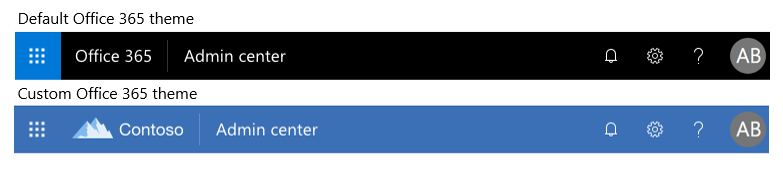

# Personalizar el tema de Office 365 para su organizaciónCustomize the Office 365 theme for your organization

Obtenga información sobre cómo personalizar el tema en el centro de administración de Microsoft 365.Learn how to customize your theme in the Microsoft 365 admin center. Como administrador de su suscripción a Office 365 para empresas, puede cambiar el tema predeterminado que aparece en la barra de navegación superior para todos los usuarios de la organización.As the admin of your Office 365 for business subscription, you can change the default theme that appears in the top navigation bar for everyone in the organization. Puede Agregar el logotipo de su compañía y cambiar los colores para que se ajusten al resto de la marca.You can add your company logo and change the colors to match the rest of your brand. Incluso puede Agregar un vínculo de destino para que los usuarios naveguen a cuando seleccionen su logotipo.You can even add a destination link for users to navigate to when they select your logo. Aquí puede ver el tema predeterminado y el resultado del tema personalizado en Office 365.You can see here the default theme and custom theme result in Office 365.
  

  
## Personalizar el tema en el centro de administraciónCustomize your theme in the admin center

1. En el centro de administración, vaya a \*\*\*\* \> configuración y, a **continuación, elija**la pestaña Perfil de la **organización** .In the admin center, go to the **Settings** \> **Settings**, and then choose the **Organization profile** tab.

2. En la pestaña Perfil de la **organización** , elija **temas personalizados**.On the **Organization profile** tab, choose **Custom themes**.

3. En el panel **temas de aduana** , cambie los elementos del tema que desee para su organización:On the **Customs themes** panel, change the theme elements you want for your organization:
    
  - **Usar una imagen de logotipo personalizada**: elija si desea usar una imagen de una dirección URL o cargar una imagen.**Use a custom logo image**: Choose whether to use an image from a URL or to upload an image. Si usa una dirección URL, asegúrese de que la dirección URL use HTTPS y de 200 x 30 píxeles de cualquier formato de cualquier tamaño.If you use a URL, please ensure that the URL uses HTTPS and is 200 x 30 pixels of any format of any size. Puede cargar un logotipo de menos de 10 KB de 200 x 30 píxeles en formato JPG, PNG, GIF o SVG.You may upload a logo under 10 KB that is 200 x 30 pixels in JPG, PNG, GIF, or SVG format.

    > [!NOTE]
    > Para que el logotipo aparezca en la aplicación móvil de SharePoint, use solo imágenes SVG.For the logo to appear in the SharePoint mobile app, use only SVG images. Las imágenes que se cargan en cualquier otro formato no se muestran en la aplicación.Images uploaded in any other format don’t display in the app. No se pueden hacer clic en los logotipos en la aplicación móvil de SharePoint.Logos are not clickable in the SharePoint Mobile app.
    
  - **Hacer que el logotipo haga clic**en: puede usar su logotipo en la barra de navegación como un vínculo a cualquier recurso de la empresa.**Make logo clickable**: You may use your logo in the navigation bar as a link to any company resource. Puede escribir la dirección URL del logotipo aquí, comenzando con http://o https://.You may enter the URL for the logo here, starting with http:// or https://. Esto es opcional.This is optional.
    
  - **Seleccionar imagen de fondo**: seleccione la imagen y cargue su propio archivo jpg, PNG o GIF con una resolución de 1366 x 50 píxeles, no superior a 15 KB.**Select background image**: Select the image and upload your own JPG, PNG, or GIF with a resolution of 1366 x 50 pixels, no larger than 15 KB. La imagen de fondo aparece en la barra de navegación superior de cada página.The background image appears in the top navigation bar on every page.
    
    > [!NOTE]
    > Es posible que las imágenes que contengan texto no se muestren del modo previsto. Los elementos predefinidos que se muestran a derecha e izquierda de la barra de navegación pueden variar según los servicios, y es posible que el texto quede oscurecido por esos elementos. Debido a la naturaleza dinámica de la barra de navegación, en este momento no podemos ofrecerle instrucciones para configurar el relleno de imagen de forma que ofrezca una experiencia unificada.Images that contain text may not display as expected. Built-in elements that appear on the right and left sides of the navigation bar can vary across services, and your text may be obscured by those elements. Due to the dynamic nature of the navigation bar, at this time we are unable to provide guidance for image padding that would result in a consistent experience. 
    
  - **Color**de la barra de navegación: Seleccione un color para usarlo en el fondo de la barra de navegación.**Navigation bar color**: Select a color to use for the background of the navigation bar. Se mostrará en la parte superior de todas las páginas.The appears at the top on every page.
    
  - **Texto e iconos**: seleccione un color para usarlo para el texto y los iconos de la barra de navegación superior.**Text and icons**: Select a color to use for the text and icons on the top navigation bar.
    
  - **Color de énfasis**: Seleccione un color para usarlo en el botón de barra de navegación color y acentos de página como botones y texto en ciertas aplicaciones.**Accent color**: Select a color to use for the navigation bar button hover color and page accents like buttons and text on certain applications.

   - **Impedir que los usuarios reemplacen el tema**: voltee este botón de alternancia para evitar que los usuarios elijan su propio tema desde nuestra selección de temas.**Prevent users from overriding theme**: Flip this toggle to prevent users from choosing their own theme from our theme selection. Esto no impide que los usuarios puedan establecer un tema de contraste alto.This does not prevent users from being able to set a high contrast theme.
      
  - **Mostrar el nombre de usuario**: elija si desea mostrar el nombre completo de un usuario en el punto de entrada al administrador de cuentas en la parte superior derecha de la página cuando el usuario haya iniciado sesión.**Show the user name**: Choose whether to show a user's full name at the entry point to the account manager in the top right of the page when the user is signed in. De forma predeterminada, los usuarios verán su foto o sus iniciales si no se ha cargado una foto.By default, users will see their photo or their initials if a photo hasn't been uploaded.
    
4. Seleccione **Guardar cambios**.Select **Save changes**.
    
Verá el nuevo tema en el centro de administración inmediatamente y después de un breve retraso, lo verá en todo Office 365, incluidas las páginas de Outlook y SharePoint.You'll see your new theme on the admin center right away and after a short delay, you'll see it throughout Office 365, including Outlook and SharePoint pages. Podrá quitar el icono o los colores personalizados en cualquier momento.You can remove your custom icon or custom colors at any time. Simplemente vuelva a la página tema y seleccione **quitar temas personalizados**.Just return to the theme page and select **Remove custom theming**.
  
## Procedimientos recomendadosBest Practices

Al elegir una **imagen de logotipo**, le recomendamos que use un tipo de archivo SVG, siempre que sea posible, de modo que el logotipo tendrá una apariencia de alta resolución en todas las pantallas y en todos los niveles de zoom.When choosing a **Logo image**, we recommend using an SVG file type, wherever possible, so that your logo will have a high resolution appearance on all screens and at all zoom levels.

Al elegir colores personalizados, elija un **color de fondo** de la barra de navegación que tenga una relación de contraste alto con la **imagen de logotipo** que ha seleccionado.When choosing custom colors, choose a **Nav bar background color** that has a high contrast ratio with the **Logo image** that you picked. Elija también un color de **texto e iconos** con una alta relación de contraste en el color de fondo de la **barra de navegación** para asegurarse de que todo el texto y los iconos se ven fácilmente.Also choose a **Text and icons** color with a high contrast ratio to the **Nav bar background color** to ensure that all text and icons are easily visible.

Al elegir colores personalizados, elija un **color de énfasis** que se muestre bien en un fondo blanco o claro.When choosing custom colors, pick an **Accent color** that shows up well on a white or light background. El **color de énfasis** se usa para colorear algunos botones y vínculos que se muestran en un fondo blanco o claro.The **Accent color** is used to color some links and buttons that show up on a white or light background. Por ejemplo, el **color de énfasis** se usa para colorear los elementos en la bandeja de entrada de un usuario y en su página de portal de Office.com.For example, the **Accent color** is used to color elements in a user's inbox and on their Office.com portal page. 
  
La relación de contraste recomendada entre el color de texto, icono o botón y el color de fondo es 4,5:1.The recommended contrast ratio between text, icon, or button color and background color is 4.5:1.

A continuación se muestra un diagrama de flujo simple que le ayuda a configurar rápidamente un tema personalizado de Office 365 visualmente atractivo para su organización:Here is a simple flow chart to help you quickly get set up with a visually appealing custom Office 365 theme for your organization:
  - Me gustaría usar una versión de color de nuestro logotipo.I would like to use a colorful version of our logo.
    - Se recomienda la siguiente configuración:We recommend the following settings:
      - **Imagen de logotipo**: el logotipo de color de la organización.**Logo image**: Your organization's colorful logo.
      - **Color**de la barra de navegación: color neutro.**Navigation bar color**: A neutral color. Se recomienda #FAF9F7 para un color claro y #252423 para un color oscuro.We recommend #FAF9F7 for a light color and #252423 for a dark color.
      - **Color de texto e icono**: color para contrastar el color de la **barra de navegación**.**Text and icon color**: A color to contrast the **Navigation bar color**. Se recomienda #FAF9F7 para un color claro y #252423 para un color oscuro.We recommend #FAF9F7 for a light color and #252423 for a dark color.
      - **Color de énfasis**: un color de marca oscuro.**Accent color**: A dark brand color. Con ciertas aplicaciones, este color debe estar visible en un fondo claro.With certain applications, this color must be visible on a light background.
  - Me gustaría usar una versión neutra de nuestro logotipo y representar el color en la barra de navegación.I would like to use a neutral version of our logo and represent color in the navigation bar.
    - Se recomienda la siguiente configuración:We recommend the following settings:
      - **Imagen de logotipo**: logotipo neutro de la organización.**Logo image**: Your organization's neutral logo.
      - **Color**de la barra de navegación: un color de marca que contrasta con el logotipo.**Navigation bar color**: A brand color that contrasts against your logo.
      - **Color del texto y el icono**: elija un color que contraste con el color de marca elegido para el color de la **barra de navegación**.**Text and icon color**: Choose a color that contrasts against the brand color you chose for the **Navigation bar color**. Se recomienda #252423 para un color oscuro y #FAF9F7 para un color claro.We recommend #252423 for a dark color and #FAF9F7 for a light color.
      - **Color de énfasis**: un color de marca oscuro.**Accent color**: A dark brand color. Con ciertas aplicaciones, este color debe estar visible en un fondo claro.With certain applications, this color must be visible on a light background.
  
## Artículos relacionadosRelated articles

[Agregar iconos personalizados a la página Mis aplicaciones y al iniciador de aplicacionesAdd custom tiles to the My apps page and app launcher](../manage/customize-the-app-launcher.md)
  
  

