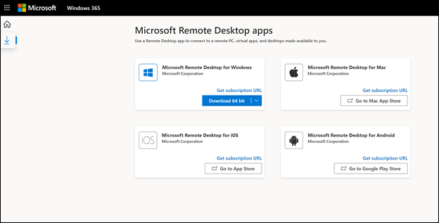

# Introducción a Windows 365 Empresa y equipos en la nube

Este artículo está pensado para las personas que planean comprar y configurar Windows 365 Empresa para su organización.
  
[Windows 365 Empresa](https://www.microsoft.com/windows-365/business) es una versión de Windows 365 diseñada específicamente para su uso en empresas más pequeñas (hasta 300 puestos). Proporciona a las organizaciones una forma sencilla y simplificada de proporcionar equipos en la nube a sus usuarios.  Con Windows equipos en la nube de 365, puede transmitir sus aplicaciones, datos, contenido, configuración y almacenamiento desde la nube de Microsoft.

> [!NOTE]  
> Antes de empezar, asegúrese de que la configuración del dispositivo de [Azure AD](/azure/active-directory/devices/device-management-azure-portal#configure-device-settings) para los usuarios pueda unir dispositivos a **Azure AD** está establecida en **Todos**.

   
## Requisitos previos
No hay requisitos previos para configurar Windows 365 Empresa.
## Comprar suscripciones

Hay dos maneras diferentes en las que puede comprar Windows 365 Business para sus usuarios:

- El [Windows de productos de 365](https://www.microsoft.com/windows-365/business/compare-plans-pricing)
- Centro de administración de Microsoft 365

Después de comprar una suscripción, puede usar el Centro de administración de Microsoft 365 para asignar licencias a los usuarios de su organización.
### Comprar suscripciones a través del Windows de productos de 365

Si aún no tiene una suscripción Microsoft 365, puede comprar sus suscripciones de Windows 365 Empresa en el sitio de productos Windows [365](https://www.microsoft.com/windows-365/business/compare-plans-pricing). Siga estos pasos para comprar una suscripción de Windows 365 Empresa a través de la página Windows productos de 365.

1. En la [Windows 365 Empresa,](https://www.microsoft.com/windows-365/business) seleccione **Ver planes y precios.**
2. En la página siguiente, seleccione la suscripción que desea comprar y, a continuación, **seleccione Comprar ahora**.
3. En la **página Gracias por elegir Windows 365 Empresa,** siga los pasos para configurar su cuenta.
4. En **el paso 5:** Detalles de confirmación, si está  listo para asignar licencias a los usuarios, seleccione Introducción para ir a la página principal de Windows 365 en https://windows365.microsoft.com .
5. En la Windows principal de 365, en la sección Acciones **rápidas,** seleccione Administrar su **organización**. Esto le lleva a la Centro de administración de Microsoft 365 donde puede asignar licencias a los usuarios.

### Comprar una suscripción a través del Centro de administración de Microsoft

Si ya tiene un inquilino de Microsoft 365 y es administrador global o de facturación, puede usar el Centro de administración de Microsoft 365 para comprar una suscripción de Windows 365 Empresa para su organización.

1. En el Centro de administración de Microsoft, vaya a la página **Facturación > servicios de compra.**
2. En la **página Servicios de** compra, busque Windows **365 Empresa**. Cuando lo encuentre, seleccione **Detalles**.
3. En la página **Windows 365 Empresa,** en la sección Opciones de **procesador/ram/Storage,** use el menú Seleccionar una suscripción para seleccionar una suscripción para los usuarios en función de sus necesidades de CPU, RAM y almacenamiento.  Consulta [Windows de tamaño de 365 Empresa](windows-365-business-sizing.md) para obtener instrucciones sobre cómo seleccionar la suscripción que mejor se adapte a las necesidades de los usuarios.
4. En la **página Desprotección,** escribe también el número de suscripciones que quieres comprar y la información de pago. A continuación, **seleccione Realizar pedido**.
5. The **You're all set!** página aparece confirmando la compra.

## Asignar licencias a los usuarios

Tanto si compró sus suscripciones a través del sitio de productos de Windows 365, como a  través de Centro de administración de Microsoft 365, puede asignar licencias a los usuarios a través de la página Facturación de la Centro de administración de Microsoft 365. 

Puede asignar diferentes tipos de Windows 365 Business a un usuario, en función de las necesidades empresariales de los usuarios. Consulte [Windows de tamaño de 365 Empresa](windows-365-business-sizing.md) para obtener instrucciones sobre qué tipo de licencia puede ser adecuado para los usuarios.

> [!IMPORTANT]
> La primera vez que se asigna una licencia Windows 365 en el inquilino, se crea automáticamente una cuenta del sistema denominada "CloudPCBPRT" en Azure Active Directory. No elimine esta cuenta. Si se elimina la cuenta del sistema, es posible que se producirá un error en la instalación. Esta cuenta del sistema garantiza un proceso de configuración sin problemas y no tiene capacidades de escritura ni acceso a su espacio empresarial más allá de las capacidades de servicio de ámbito de Windows 365 Empresa. Si elimina este usuario, presente un vale a través del Centro de soporte técnico.

## Introducción a los usuarios con el equipo en la nube

Una vez asignadas las licencias, haga saber a los usuarios que hay dos formas diferentes de acceder a sus equipos en la nube:

- A través de Windows principal de 365 (https://windows365.microsoft.com)
- Mediante el uso de un Escritorio remoto de Microsoft cliente

### Windows principal de 365

Los usuarios pueden navegar hasta **https://windows365.microsoft.com** obtener acceso a sus equipos en la nube.  

En su Windows principal de 365, los usuarios ven los equipos en la nube a los que tienen acceso en la sección Sus equipos **en** la nube.

Los usuarios pueden **seleccionar Abrir en el explorador** para abrir su equipo en la nube.

> [!NOTE]  
> Los dispositivos móviles no son compatibles actualmente.

#### Acciones del usuario

Mientras que en la Windows principal de 365, los usuarios pueden realizar acciones en sus equipos en la nube seleccionando el icono de engranaje en una tarjeta de pc en la nube.

- **Reiniciar:** reinicia el equipo en la nube.

- **Reset**: Reset hace lo siguiente:

    - Reinstala Windows 10.
    - Quita los archivos personales.
    - Quita los cambios realizados en la configuración.
    - Quita las aplicaciones.

    > [!IMPORTANT]  
    > Antes de restablecer el equipo en la nube, asegúrate de hacer una copia de seguridad de los archivos importantes que necesites conservar en un servicio de almacenamiento en la nube o en un almacenamiento externo. Al restablecer el equipo en la nube, se eliminarán estos archivos.

- **Rename:** cambia el nombre del equipo en la nube que se muestra al usuario en la Windows principal de 365.

- **Solución** de problemas: solucionar problemas e intentar solucionar cualquier problema que pueda evitar que un usuario se conecte a su equipo en la nube. En la tabla siguiente se describen los estados que pueden resultar de las comprobaciones.

    | Estado | Descripción |
    |:-----|:-----|
    |No se han detectado problemas |Ninguna de las comprobaciones que se han ejecutado ha detectado un problema con el equipo en la nube. |
    |Problemas resueltos |Se detectó un problema y se corrigió. |
    |No se puede conectar a pc en la nube. Estamos trabajando para solucionarlo, inténtelo de nuevo más tarde. |Un servicio de Microsoft necesario para la conectividad no está disponible. Intente conectarse de nuevo más tarde. |
    |No pudimos solucionar problemas con el equipo en la nube. Póngase en contacto con el administrador. |Se detectó un problema, pero no se pudo solucionar. Esto podría deberse a una actualización de Windows o a otro problema. Si este error persiste durante un período prolongado de tiempo, es posible que sea necesario restablecer el equipo en la nube. |

### Escritorio remoto

La Escritorio remoto de Microsoft permite a los usuarios acceder y controlar un equipo remoto, incluido un equipo en la nube. Windows 365 usuarios pueden descargar e instalar el cliente de Escritorio remoto que necesitan desde la Windows principal de 365.

#### Instalar la Escritorio remoto de Microsoft aplicación

Para configurar su cliente de Escritorio remoto, los usuarios siguen estos pasos:

1. En la **Windows principal de 365**, seleccione el icono **Escritorio remoto de Microsoft aplicaciones** (debajo del icono principal).
2. En la **página Escritorio remoto de Microsoft aplicaciones,** descarga e instala la aplicación de Escritorio remoto que necesitas.

   

Para obtener una lista de clientes por sistema operativo, vea [Clientes de Escritorio remoto](/windows-server/remote/remote-desktop-services/clients/remote-desktop-clients).

## Instalar aplicaciones.

Los usuarios pueden instalar aplicaciones en su equipo en la nube como lo harían normalmente en Windows descargándolos del sitio web de la aplicación o descargándolos desde el Microsoft Store.

Todos los Windows 365 Empresa tienen privilegios de administrador local en su equipo en la nube, por lo que deben tener los permisos necesarios para instalar aplicaciones en sus áreas de trabajo.

> [!IMPORTANT]
> Si un usuario intenta usar una licencia de Microsoft 365 Empresa Estándar en su equipo en la nube, puede que vea el siguiente error: "Problema de cuenta: los productos que encontramos en su cuenta no se pueden usar para activar Office en escenarios de equipo compartido". En este escenario, el usuario debe desinstalar la versión de Office instalado en su equipo en la nube e instalar una nueva copia de Office.com.

## Administración a través de Intune

Windows 365 Empresa no inscribe equipos en la nube en [Intune](/mem/intune/fundamentals/what-is-intune) como parte del proceso de aprovisionamiento. Si la organización y los usuarios tienen una licencia adecuada, los equipos en la nube se pueden inscribir en Intune con el mismo procedimiento para inscribir Windows 10 [equipos en Intune](/mem/intune/user-help/enroll-windows-10-device).

## No se admite el envío de mensajes de correo electrónico saliente con el puerto 25

No se admite el envío de mensajes de correo electrónico saliente directamente en el puerto 25 desde Windows 365 Business Cloud PC. La comunicación a través del puerto TCP/25 está bloqueada en la Windows de red de 365 Empresa por motivos de seguridad. Si el servicio de correo electrónico usa el Protocolo simple de transferencia de correo (SMTP) para la aplicación cliente de correo electrónico, puede usar su interfaz web, si está disponible. También puedes pedir ayuda a tu proveedor de servicios de correo electrónico para configurar su aplicación cliente de correo electrónico para que use SMTP seguro sobre seguridad de la capa de transporte (TLS), que usa un puerto diferente.

## Cómo obtener ayuda

Si necesita obtener ayuda al configurar Windows 365 Empresa en el Centro de administración de Microsoft 365, vea [Obtener ayuda o soporte técnico](/microsoft-365/business-video/get-help-support).

## Contenido relacionado

[Windows 365 Empresa](https://www.microsoft.com/windows-365/business)  
[Opciones de tamaño de Windows 365 Empresa](windows-365-business-sizing.md)  
[Windows 365 Business plan comparison](https://www.microsoft.com/windows-365/business/compare-plans-pricing)  
[Comparación de aplicaciones cliente de Escritorio remoto](/windows-server/remote/remote-desktop-services/clients/remote-desktop-app-compare) 
[Configurar Microsoft Teams en su pequeña empresa](/microsoftteams/deploy-small-business)
