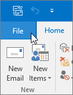
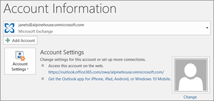

# Migrar el correo electrónico y los contactos a Office 365Migrate email and contacts to Office 365

Importe o copie correo electrónico de Gmail o de otro proveedor de correo electrónico a Office 365.Import or copy email from Gmail or another email provider to Office 365.
  
 **¿Quiere ayuda con esto?****Want help with this?**  [Póngase en contacto con el soporte técnico de Office 365 para empresas](../contact-support-for-business-products.md) .[Contact Office 365 for business support](../contact-support-for-business-products.md) . 
  
Para completar esta tarea, necesita usar una versión de Outlook instalada en el escritorio. Outlook se incluye en la mayoría de los [planes](https://go.microsoft.com/fwlink/p/?LinkId=723731) de Office 365.You need to use a version of Outlook that is installed on your desktop for this task. Outlook is included in most Office 365 [plans](https://go.microsoft.com/fwlink/p/?LinkId=723731).
  
### Importar desde GmailImport from Gmail

Siga estos pasos para importar el correo electrónico, los contactos y el calendario de Gmail a Outlook con Office 365:Follow these steps to import email, contacts, and calendar from Gmail into Outlook with Office 365:
  
- [Importar Gmail a OutlookImport Gmail to Outlook](https://support.office.com/article/20fdb8f2-fed8-4b14-baf0-bf04b9c44bf7.aspx)
    
- [Importar contactos a OutlookImport contacts to Outlook](https://support.office.com/article/bb796340-b58a-46c1-90c7-b549b8f3c5f8.aspx)
    
- [Importar un calendario de Google CalendarImport Google Calendar](https://support.office.com/article/098ed60c-936b-41fb-83d6-7e3786437330)
    
> [!VIDEO https://www.microsoft.com/videoplayer/embed/c1e45708-9a92-475b-910b-f5aa40614d92?autoplay=false]
  
### Importar desde Outlook (escritorio)Import from Outlook (desktop)

Siga estos pasos para exportar correo electrónico, contactos y calendarios de Outlook a un archivo .pst para importarlo posteriormente en Outlook con Office 365:Follow these steps to export email, contacts and calendars from Outlook to a .pst file, and then import that file to Outlook with Office 365:
  
1. [Exportar el correo electrónico, los contactos y el calendarioExport email, contacts, and calendar](https://support.office.com/article/14252b52-3075-4e9b-be4e-ff9ef1068f91)
    
2. [Importar el correo electrónico, los contactos y el calendarioImport mail, contacts, and calendar](https://support.office.com/article/431a8e9a-f99f-4d5f-ae48-ded54b3440ac)
    
Si solo quiere hacer esto con sus contactos, siga estos pasos:If you just want contacts, follow these steps:
  
1. [Exportar contactos desde OutlookExport contacts from Outlook](https://support.office.com/article/10f09abd-643c-4495-bb80-543714eca73f.aspx)
    
2. [Importar contactos a OutlookImport contacts to Outlook](https://support.office.com/article/bb796340-b58a-46c1-90c7-b549b8f3c5f8.aspx)
    
To start the process, open Outlook and choose **File** \> **Open &amp; Export** \> **Import/Export**.To start the process, open Outlook and choose **File** \> **Open &amp; Export** \> **Import/Export**.
  

  
## Ver otras cuentas de correo electrónico en OutlookSee other email accounts in Outlook

¿Solo quiere ver el correo electrónico de otro proveedor (como Gmail, Yahoo o Live.com) en Outlook? No tiene por qué realizar ninguna importación ni migración. Puede configurar Outlook o Outlook Web App para poder acceder a sus otras cuentas desde el mismo lugar que su buzón de Office 365 y enviar, recibir y leer correo electrónico enviado a dichas cuentas.Just want to see your email from another provider (like Gmail, Yahoo, or Live.com) in Outlook? No need to import or migrate. You can set up Outlook or Outlook Web App so you can access your other accounts from the same place as your Office 365 mailbox and send, receive, and read email sent to those accounts.
  
### Outlook (escritorio)Outlook (desktop)

Agregue una cuenta, como su cuenta privada de Gmail, a Outlook.Add an account, such as your private Gmail account, to Outlook.
  
- Abra Outlook y, a continuación, vaya a **Archivo** \> **Agregar cuenta**.Open Outlook, then go to **File** \> **Add account**.
    
¿Necesita instrucciones más detalladas? Vea [Agregar una cuenta](https://support.office.com/article/6e27792a-9267-4aa4-8bb6-c84ef146101b).Need more detailed steps? See [Add an account](https://support.office.com/article/6e27792a-9267-4aa4-8bb6-c84ef146101b).
  

  
## Varios buzones: los administradores pueden hacer una importación masiva de correo electrónico, contactos y calendarios en Office 365Multiple mailboxes: Admins can bulk import email, contacts, and calendars to Office 365

Según el sistema de correo electrónico de origen que use, podrá elegir entre varios métodos de migración masiva. Para decidir qué método es el más adecuado en su caso, vea [Formas de migrar varias cuentas de correo electrónico a Office 365](https://support.office.com/article/0a4913fe-60fb-498f-9155-a86516418842).Depending on your source email system, you can choose from several bulk migration methods. Read [Ways to migrate multiple email accounts to Office 365](https://support.office.com/article/0a4913fe-60fb-498f-9155-a86516418842) to decide which method works for you. 
  

