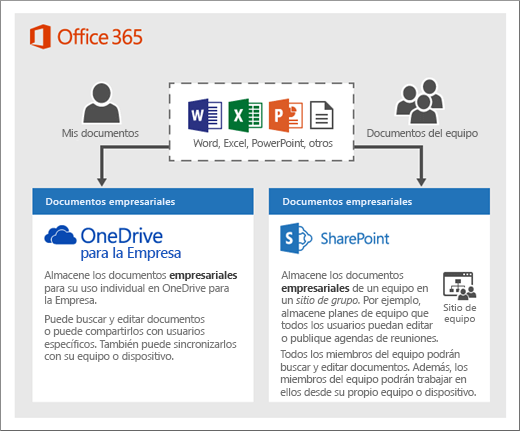
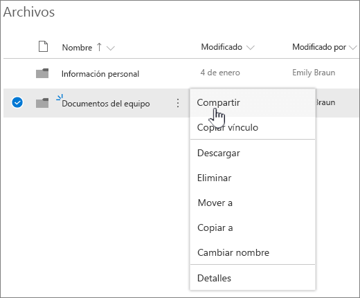
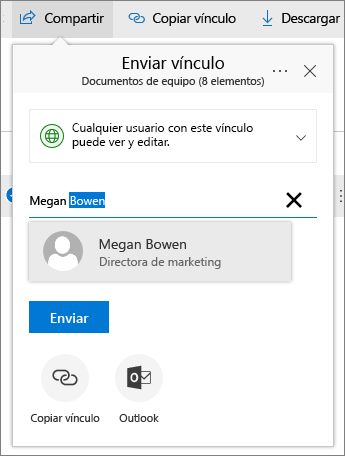
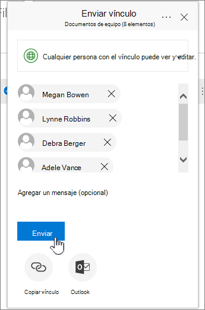
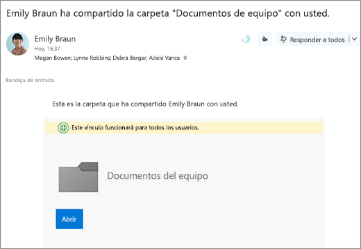
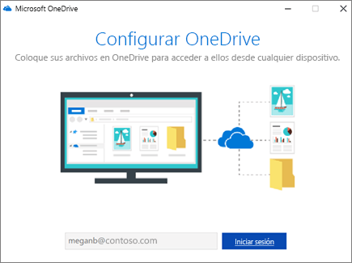
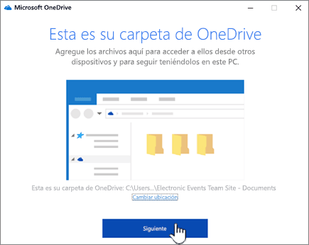
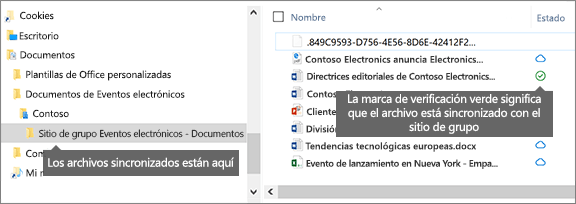

# Configurar el almacenamiento y el uso compartido de archivos en Microsoft 365

Una de las mejores formas de configurar el almacenamiento y el uso compartido de archivos para su empresa es usar OneDrive y un sitio de grupo juntos. Esto es ideal si tiene una pequeña empresa con pocos empleados.

Vea un breve vídeo sobre el almacenamiento de archivos en la nube de Microsoft 365.  

> [!VIDEO https://www.microsoft.com/videoplayer/embed/RE1FTHX] 

Si este vídeo le ha sido de ayuda, consulte la [serie completa de aprendizaje para las pequeñas empresas y las novedades de Microsoft 365](https://support.microsoft.com/office/6ab4bbcd-79cf-4000-a0bd-d42ce4d12816).

## "Almacenamiento y administración de documentos de 365 de Microsoft"

- OneDrive está diseñado para uso individual, con el uso compartido de archivos de forma ocasional.

- Un sitio de grupo está diseñado para compartir y colaborar en archivos con regularidad. Un sitio de grupo es ideal para almacenar archivos que tienen una propiedad compartida en la que varios usuarios poseen los archivos y pueden colaborar en ellos. Cree un equipo de Microsoft Teams para agregar un sitio de grupo. [Para obtener más información, vea crear un equipo en Microsoft Teams](https://support.microsoft.com/office/174adf5f-846b-4780-b765-de1a0a737e2b).

Los sitios de grupo y de OneDrive proporcionan acceso desde cualquier lugar para usted y para sus empleados.
  

  
Estas son algunas recomendaciones sobre lo que se debe almacenar en cada ubicación al usar OneDrive y los sitios de grupo juntos:
  
||||
|:-----|:-----|:-----|
|**Ubicación de almacenamiento**   |**Para qué sirve**   |**Qué almacenar aquí**   |
|**OneDrive**   |Almacenar contenido en OneDrive es similar a almacenar archivos en el equipo; nadie más puede acceder fácilmente a ellos.    Para obtener más información, vea [¿Qué es OneDrive para la empresa?](https://support.microsoft.com/office/187f90af-056f-47c0-9656-cc0ddca7fdc2)   |Archivos empresariales en los que otros miembros del equipo no necesitan colaborar ni obtener acceso de forma habitual.    |
|**Sitios de grupo de SharePoint**   |Quita. Cuando se crea un grupo de 365 de Microsoft (por ejemplo, en el centro de administración de Microsoft 365, en Outlook o al crear un equipo en Microsoft Teams), se crea un sitio de grupo de SharePoint para ese grupo. Del mismo modo, al crear un nuevo sitio de grupo de SharePoint desde la Página principal de SharePoint o desde el nuevo centro de administración de SharePoint, también se crea un grupo de Microsoft 365. Para obtener más información, vea [¿Qué es un sitio de grupo de SharePoint? y cómo](https://support.microsoft.com/office/75545757-36c3-46a7-beed-0aaa74f0401e) [crear un sitio de grupo en SharePoint Online](https://support.microsoft.com/office/ef10c1e7-15f3-42a3-98aa-b5972711777d).    |Archivos que tienen la propiedad compartida. Le recomendamos que separe los sitios de grupo por cada unidad de trabajo de su organización. Por ejemplo, para mantener el personal y los documentos financieros en privado para un equipo pequeño, cree un sitio de grupo independiente.    |

> [!NOTE]
> SharePoint también tiene otros tipos de sitios que puede usar para su empresa. Puede usar [sitios de comunicación](https://support.microsoft.com/office/7fb44b20-a72f-4d2c-9173-fc8f59ba50eb) en la intranet para publicar información para una amplia audiencia. Y puede usar [sitios de concentradores](https://support.microsoft.com/office/fe26ae84-14b7-45b6-a6d1-948b3966427f) para conectar los sitios de la intranet.
  
## Empezar a usar OneDrive y el sitio de grupo

### Los miembros del equipo pueden almacenar sus propios archivos en OneDrive

Cada persona de su empresa que tenga una licencia de Microsoft 365 asignada (y SharePoint Online seleccionada) obtiene almacenamiento en la nube de OneDrive. Pueden almacenar archivos relacionados con la empresa para obtener acceso desde cualquier dispositivo y solo están disponibles para ese usuario. Por ejemplo, podrían almacenar un proyecto de propuesta, sus notas de reuniones o el texto de una presentación que vayan a realizar.
  
Los empleados también pueden compartir archivos y carpetas de OneDrive. Si un empleado está ausente o abandona la compañía, otros usuarios pueden tener acceso a los archivos compartidos almacenados en OneDrive (uso compartido de la carpeta de equipo de OneDrive).
  
Esta es la forma en que cada persona de su equipo puede configurar OneDrive y compartir archivos.

1. Vaya al <a href="https://portal.office.com/ " target="_blank">portal de 365 de Microsoft</a>y inicie sesión con su nombre de usuario y contraseña.

2. En el iniciador de aplicaciones, seleccione **OneDrive**.

3. En OneDrive, los miembros del equipo pueden almacenar sus propios archivos relacionados con la empresa. Puede compartir archivos individuales o bien una carpeta completa. Elija un archivo o carpeta, haga clic con el botón secundario y, a continuación, elija **compartir**.

    
  
4. En la página **Enviar vínculo** , deje la selección predeterminada que **todos los usuarios con el vínculo puedan ver y editar**.

    Escriba los nombres o las direcciones de correo electrónico de los miembros del equipo que desea que tengan acceso a la carpeta y agregue un mensaje opcional.

    Si desea que se envíe su propia copia del correo electrónico, agregue su dirección de correo electrónico a la lista.

    
  
5. Cuando termine de escribir la persona con la que desea compartir, seleccione **Enviar**. El correo electrónico se envía inmediatamente a las personas a las que invites.

    
  
6. Así es como se ve el correo electrónico. 

    
  
### Cargar archivos en un sitio de grupo para colaboración en línea

Los sitios de grupo incluyen un espacio para almacenar archivos, denominado biblioteca de documentos.  
  
Estos son los pasos para agregar archivos:
  
1. En la Página principal del sitio de grupo, elija **documentos** en el menú de navegación de la parte izquierda. Esto le llevará a la **biblioteca de documentos**.
  
2. Mientras estás conectado a Microsoft 365, abre el **Explorador de archivos** de Windows desde la barra de tareas o desde otra ubicación. Busque los archivos que quiera subir al sitio de grupo.

3. Seleccione los archivos que desea cargar en el sitio de grupo y, a continuación, arrástrelos a la **biblioteca de documentos**.
  
4. Cuando termine, los archivos se almacenarán en el sitio de grupo y en el equipo.
  
5. Puede eliminar los archivos del equipo. En el paso siguiente, [sincronice los archivos en línea con su PC o Mac](#sync-online-files-with-your-pc-or-mac), creará una nueva ubicación para estos archivos en el equipo.

    Si tiene un gran número de archivos o archivos de gran tamaño que quiere subir al sitio de grupo, lea estas sugerencias sobre [cómo subir un gran número de archivos o archivos de gran tamaño a una biblioteca](https://support.microsoft.com/office/da549fb1-1fcb-4167-87d0-4693e93cb7a0#__toc384119242).

    Si necesita más espacio de almacenamiento, vea [Cambiar el espacio de almacenamiento de la suscripción](../../commerce/add-storage-space.md).

### Sincronizar archivos en línea con su PC o Mac

Ahora que tiene archivos en el sitio de grupo, puede configurarlos para que se sincronicen con su PC o Mac. De esta forma, puedes trabajar en los archivos desde tu PC o Mac en lugar de trabajar en Microsoft Edge, Chrome u otro explorador. También es útil tener una versión de sus archivos sincronizada en su equipo para las situaciones en las que no esté conectado a Internet pero necesite obtener un archivo.
  
Una vez que haya configurado los archivos para que se sincronicen con el equipo, cuando esté conectado a Internet, se sincronizarán automáticamente.
  
Siga estos pasos para sincronizar archivos en el sitio de grupo con el equipo de escritorio:
  
1. En la Página principal del sitio de grupo, elija **documentos** en el menú de navegación de la parte izquierda. Esto le llevará a la biblioteca de documentos.

    > [!TIP]
    > Al sincronizar archivos en el sitio de grupo, se sincronizan todas las bibliotecas de archivos en el sitio, no todo el sitio.
  
2. Elija **sincronizar** para sincronizar todos los archivos. O bien, vaya a la carpeta específica que desee sincronizar.

3. Si se le pide que cambie de aplicación, elija **sí**. OneDrive es el proceso que realiza la sincronización.
  
4. Si, a continuación, obtiene un mensaje de **configuración de OneDrive** , inicie sesión con su cuenta profesional o educativa.

    
  
5. Si todavía no ha sincronizado su OneDrive, es posible que vea **la pantalla esta es tu carpeta de onedrive** . Compruebe que la ruta de la **carpeta de OneDrive está aquí**. Elija **Cambiar ubicación** si desea usar una ruta de acceso diferente y, a continuación, seleccione **siguiente**.

    
  
6. Los archivos de los sitios de grupo aparecerán en el panel izquierdo del explorador de archivos, en el nombre de la organización. Los archivos en OneDrive aparecerán en "OneDrive- \<Name of Organization\> "

    
  
7. Para probar la sincronización, abra un archivo en la carpeta del equipo del equipo. Realice un cambio y, después, elija **Guardar**.

## Procedimientos recomendados para el almacenamiento y el uso compartido de archivos

Estas son algunas sugerencias para obtener el máximo provecho de OneDrive o de su sitio de grupo de SharePoint.
  
### Recomendaciones sobre almacenamiento de archivos y colaboración para otros tipos de pequeñas empresas

- **Proprietorships** : Use OneDrive para almacenar sus propios archivos y compartirlos con clientes en cada caso.

- **Copropiedades** : los propietarios usan OneDrive y comparten los archivos hacia delante y hacia atrás.

- **Empresas con clientes externos o asociados que necesitan acceso a los archivos** : cree un nuevo sitio de grupo para almacenar y compartir documentos destinados a un cliente específico. Configure el sitio para permitir el acceso solo a ese cliente. A continuación, no es necesario preocuparse de que un cliente obtenga acceso a la información destinada a otro cliente de forma accidental.

### Establecer que los archivos privados sigan siéndolo

Al almacenar un archivo en OneDrive, solo es accesible para usted, a menos que lo comparta con otros usuarios. Al compartir archivos, puede optar por crear un vínculo que se pueda reenviar o compartir solo con personas específicas. También puede crear carpetas independientes en OneDrive para diferentes fines, como fines públicos, personales o para proyectos individuales. Cada carpeta se puede compartir con otro usuario, con un grupo o con nadie.
  
Para obtener más información sobre el uso compartido, vea también [compartir archivos y carpetas con Microsoft 365](https://support.microsoft.com/office/72f26d6c-bf9e-432c-8b96-e3c2437f5b65).
  
### Realizar un seguimiento de la cantidad de espacio restante

Para ver cuánto espacio de almacenamiento dejó en OneDrive, consulte [administrar el almacenamiento de onedrive para la empresa](https://support.microsoft.com/office/31519161-059C-4764-B6F8-F5CD29F7FE68).
  
### ¿Qué archivos se pueden almacenar en OneDrive y en un sitio de grupo?

Aunque puede cargar casi todos los tipos de archivos, algunos nombres de archivo y caracteres de los nombres de archivo no están permitidos. Para obtener más información, consulte [caracteres de archivo no válidos y tipos de archivo en OneDrive para la empresa](https://support.microsoft.com/office/64883A5D-228E-48F5-B3D2-EB39E07630FA).
  
### Habilitación o deshabilitación de servicios de almacenamiento de terceros

Puede habilitar el almacenamiento de terceros para los usuarios en Microsoft 365 para que puedan almacenar y compartir documentos con servicios como Dropbox, además de OneDrive y sitios de grupo. Esta puede ser una excelente manera de proporcionar servicios que puede que sus usuarios ya usen o que prefieran usar para proyectos empresariales. Si no desea que los usuarios de su organización usen Office para abrir archivos en un servicio de terceros, siga estos pasos para desactivarlo.
  
> [!IMPORTANT]
> El almacenamiento de terceros está habilitado de forma predeterminada, por lo que debe realizar estos pasos inmediatamente si no desea que esté disponible para los usuarios.
  
1. Inicie sesión en el <a href="https://go.microsoft.com/fwlink/p/?linkid=2024339" target="_blank">centro de administración</a>.

2. Vaya a la página **configuración** de la \> <a href="https://go.microsoft.com/fwlink/p/?linkid=2053743" target="_blank">**organización**</a> .

3. En la pestaña **servicios** , seleccione **Office en la web**.

4. Active o desactive la casilla para activar o desactivar el almacenamiento de terceros y, a continuación, seleccione **Guardar cambios**.

## Pasos siguientes

- [Personalizar el sitio de grupo para el almacenamiento y el uso compartido de archivos](customize-team-site.md). En este tutorial paso a paso se explica cómo puede aprovechar una mayor capacidad de almacenamiento y las características de colaboración.

- **Configure las aplicaciones de Office en tabletas y teléfonos**. Debe hacer esto para poder **Editar** los archivos que se almacenan en OneDrive y en los sitios de grupo desde su tableta o teléfono. Si no instala las aplicaciones de Office para su tableta o teléfono, podrá ver los archivos pero no editarlos.

  - [Instalar y configurar Office en un dispositivo Android con Microsoft 365](https://support.microsoft.com/office/cafe9d6f-8b0c-4b03-b20a-12438a82a22d)

  - [Instalar y configurar Office en un iPhone o iPad con Microsoft 365](https://support.microsoft.com/office/9df6d10c-7281-4671-8666-6ca8e339b628)

  - [Configurar Office en Windows Phone con Microsoft 365](https://support.microsoft.com/office/2b7c1b51-a717-45d6-90c9-ee1c1c5ee0b7)
