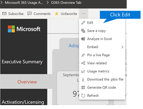
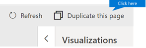
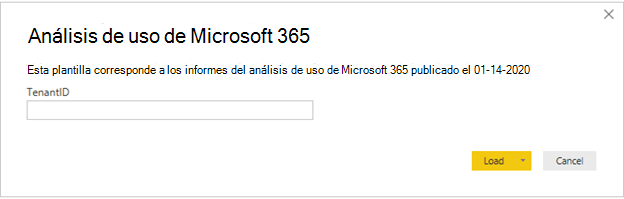

# Personalizar los informes en análisis de uso de Microsoft 365

::: moniker range="o365-21vianet"

> [!NOTE]
> El Centro de administración está cambiando. Si su experiencia no coincide con los detalles presentados aquí, consulte [Acerca del nuevo Centro de administración de Microsoft 365](https://docs.microsoft.com/microsoft-365/admin/microsoft-365-admin-center-preview?view=o365-21vianet&preserve-view=true).

::: moniker-end

El análisis de uso de Microsoft 365 proporciona un panel en Power BI que ofrece información sobre cómo los usuarios adoptan y usan Microsoft 365. El panel es tan solo un punto de inicio para interactuar con los datos de uso. Los informes se pueden ajustar para obtener información más personalizada.
  
También puede usar Power BI Desktop para personalizar aún más los informes al conectarlos a otros orígenes de datos para obtener información avanzada sobre su negocio.
  
## Personalizar informes en el explorador

En los dos ejemplos siguientes se muestra cómo modificar un objeto visual existente y cómo crear uno.
  
### Modificar un objeto visual existente

En este ejemplo se muestra cómo modificar la pestaña **Activación** en el **informe de activación y** licencias. 
  
1. En el **informe de activación y** licencias, seleccione la **pestaña** Activación.
    
2. Para entrar en el modo de edición, elija el botón **Editar** en la parte superior hasta el botón Más página en el botón de  BI. 
    
    
  
3. En la parte superior derecha, elija **Duplicar esta página.**
    
    
  
4. En la parte inferior derecha, elija cualquiera de los gráficos de barras que muestran el número de usuarios que se activan en función del sistema operativo, como Android, iOS, Mac, etc.
    
5. En el **área Visualizaciones** a la derecha, para quitar el recuento de **Mac** del elemento visual, seleccione la **X** junto a él.

        
    
### Crear un objeto visual

En el ejemplo siguiente se muestra cómo crear un objeto visual para realizar un seguimiento de nuevos usuarios de Yammer de forma mensual.
  
1. Vaya al informe **de uso del** producto con el panel de navegación izquierdo y seleccione la pestaña **Yammer.**
    
2. Cambie al modo de edición eligiendo El botón Más  **Editar**. 
    
3. En la parte inferior de la página, seleccione la  para crear una nueva página.
  
4. En el **área Visualizaciones** a la derecha, elija el gráfico de barras apiladas (fila superior, primero desde la izquierda). 

    
    
5. Seleccione la parte inferior derecha de esa visualización y arrástrela para que sea más grande.

6. En el **área Campos** a la derecha, expanda la **tabla** Calendario.

7. Arrastre **MonthName** al área de campos, directamente debajo del título **Ejes**, en el área **Visualizaciones**.
 
    
    
8. En el área **Campos** de la parte derecha, expanda la tabla **TenantProductUsage**.

9. Arrastre **FirstTimeUsers** al área de campos, directamente debajo del encabezado **Valor**.

10. Arrastre **Productos** hasta el área **Filtros**, directamente debajo del encabezado **Filtros de nivel de objeto visual**.

11. En el área **Tipo de filtro** que se muestre, active la casilla **Yammer**.

    
  
12. Justo debajo de la lista de visualizaciones, elija **el** icono Formato del icono formato  .

13. Expanda el título y cambie el valor de **Texto del título** a **Nuevos usuarios de Yammer por mes**.
    
14. Cambie el valor de **Tamaño del texto** a **12**.
    
15. Cambie el título de la nueva página editando el nombre de la página en la parte inferior derecha.

16.  Guarde el informe haciendo clic en **la vista de lectura** en la parte superior y, a continuación, **guarde**.
    
## Personalizar los informes en Power BI Desktop

Para la mayoría de los clientes, modificar los informes y los objetos visuales de gráficos en la web de Power BI será suficiente. Otros, en cambio, puede que necesiten combinar estos datos con otros orígenes de datos para obtener información contextual más avanzada para su propio negocio; en ese caso, pueden personalizar y crear informes adicionales con Power BI Desktop. Puede descargar [Power BI Desktop](https://go.microsoft.com/fwlink/p/?linkid=849797) de forma gratuita. 
  
### Usar las API de informes

Puede empezar conectándose directamente a las API de informes de ODATA de Microsoft 365 que se conectan a estos informes.
  
1. Vaya a **Obtener datos** \> **Otros** \> **Fuente de OData** \> **Conectar**.
    
2. En la ventana dirección URL, escriba "https:// <i></i> \<tenantid\> reports.office.com/pbi/v1.0/"
    
    **NOTA:** Las API de informes están en versión preliminar y están sujetas a cambios hasta que entren en producción. 
  
    
  
3. Escriba sus credenciales de administrador de Microsoft 365 (organización o escuela) para autenticarse en Microsoft 365 cuando se le solicite.
    
    Consulte las [preguntas más frecuentes](usage-analytics.md#faq) para obtener más información sobre quién puede acceder a los informes de la aplicación de plantilla de adopción de Microsoft 365. 
    
4. Cuando se autorice la conexión, verá la ventana Navegador, donde se muestran los conjuntos de datos a los que puede conectarse.
    
    Seleccione todo y elija **Cargar**.
    
    Se descargarán los datos en Power BI Desktop. Guarde el archivo y, después, ya podrá empezar a crear los informes que necesite.
    
    
  
### Usar la plantilla de análisis de uso de Microsoft 365

También puede usar el archivo de plantilla de Power BI que corresponde a los informes de análisis de uso de Microsoft 365 como punto de partida para conectarse a los datos. La ventaja de usar el archivo pbit es que ya tiene establecida la cadena de conexión. También puede aprovecharse de todas las medidas personalizadas creadas, además de los datos devueltos por el esquema base.
  
Puede descargar el archivo de plantilla de Power BI desde el Centro de descarga de Microsoft desde el [Centro de descarga.](https://download.microsoft.com/download/7/8/2/782ba8a7-8d89-4958-a315-dab04c3b620c/Microsoft%20365%20Usage%20Analytics.pbit) Después de descargar el archivo de plantilla de Power BI, siga estos pasos para empezar:
  
1. Abra el archivo pbit.
    
2. Escriba el valor del id. de espacio empresarial en el cuadro de diálogo.
    
    
  
3. Escriba sus credenciales de administrador para autenticarse en Microsoft 365 cuando se le solicite.
    
     para obtener más información sobre quién tiene permiso para acceder a los informes de análisis de uso de Microsoft 365. 
    
    Cuando reciba la autorización, los datos se actualizarán en el archivo de Power BI.
    
    La carga de datos puede tardar un tiempo; cuando se complete, puede guardar el archivo como .pbix y seguir personalizando los informes, o bien puede agregar un origen de datos adicional al informe.
    
4. Vea la documentación en [Introducción a Power BI](https://go.microsoft.com/fwlink/?linkid=849802) para conocer cómo crear informes, publicarlos en el servicio de Power BI y compartirlos con su organización. Para seguir estos pasos de personalización y uso compartido, puede que necesite licencias adicionales de Power BI. Para obtener más información, vea la [guía de licencia](https://go.microsoft.com/fwlink/p/?linkid=849803) de Power BI. 
    

