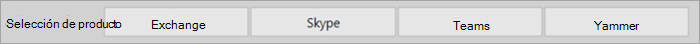
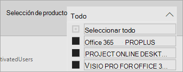
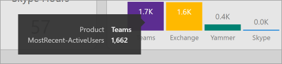

# Navegar y usar los informes en análisis de uso de Microsoft 365.

El panel proporciona información general rápida sobre las métricas de adopción y uso principal. Al seleccionar las métricas de nivel superior, puede obtener acceso a informes que proporcionan más detalles e información. Cada pestaña de informe contiene visualizaciones de datos específicas de un aspecto de uso y adopción para su organización. Los datos recopilados se explican en el título de cada informe y aparece un icono que contiene más información sobre las visualizaciones en la pestaña informe que está viendo.

Para empezar a usar los informes, aquí tiene algunas sugerencias:

- Use las pestañas de navegación a la izquierda o en una métrica relacionada en la página **Resumen** ejecutivo para navegar a cada informe de nivel superior.

    

- Use las pestañas de navegación en la parte superior de cada informe de nivel superior para navegar a diferentes informes dentro de ese nivel.

    

- Muchos informes contienen una segmentación de datos donde puede filtrar el producto, el atributo AAD o la actividad que desea ver. Pueden ser de selección única o de selección múltiple.

    

    

- Mantenga el mouse sobre puntos de datos para ver un globo que contiene detalles.

    

El usuario que haya instanciado la aplicación de plantilla tendrá la capacidad de personalizar el informe según sus necesidades. Para personalizar la aplicación de plantilla:

- Seleccione **Editar informe** en la parte superior del informe.

    

- Cree sus propios objetos visuales con los [conjuntos de datos](usage-analytics-data-model.md) subyacentes.

- Use Power BI Desktop para agregar sus propios orígenes de datos.

Para compartir los informes, solo tiene que seleccionar el botón compartir  en la parte superior de la página.

Para obtener información sobre cómo personalizar los informes, consulte [Customizing the reports in Microsoft 365 usage analytics](customize-reports.md).

Encontrará una gran cantidad de información adicional en la documentación de ayuda de Power BI:

- [Power BI conceptos básicos](/power-bi/service-basic-concepts)

    Obtenga información sobre el panel, los conjuntos de datos, los informes y otros Power BI de datos.

- [Introducción a Power BI](/power-bi/service-get-started?wt.mc_id=O365_Reports_PBI_contentpack)

    Obtenga más información sobre las funciones básicas de Power BI. Encuentre vínculos sobre cómo usar Power BI Desktop.

- [Compartir paneles e informes](/power-bi/service-share-dashboards)

    Obtenga información sobre cómo compartir informes con sus compañeros o personas fuera de su organización. También puede compartir el informe o una versión filtrada del informe.