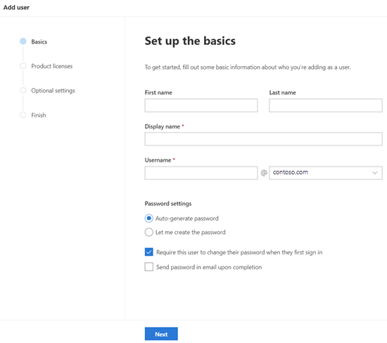
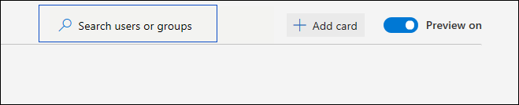
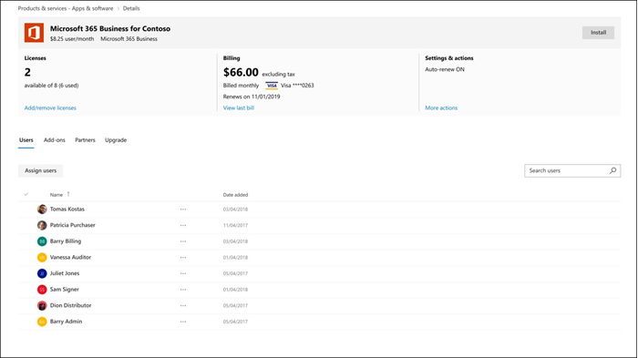

# Novedades en el centro de administración de 365 de MicrosoftWhat's new in the Microsoft 365 admin center

Estamos agregando de forma continuada nuevas características al [centro de administración de Microsoft 365](microsoft-365-admin-center-preview.md), solucionando los problemas que aprendemos y realizando cambios en función de sus comentarios.We're continuously adding new features to [the Microsoft 365 admin center](microsoft-365-admin-center-preview.md), fixing issues we learn about, and making changes based on your feedback. Eche un vistazo a la parte inferior para ver lo que está disponible hoy mismo.Take a look below to see what's available for you today. Algunas características se implementan a los clientes a velocidades diferentes.Some features get rolled out at different speeds to our customers. Si aún no ve una característica, [pruebe a agregarse a la versión dirigida](manage/release-options-in-office-365.md).If you aren't seeing a feature yet, [try adding yourself to targeted release](manage/release-options-in-office-365.md).

Y si está interesado en las novedades de otros centros de administración:And if you're interested in what's new in other admin centers:

- [Novedades en el centro de cumplimiento de Microsoft 365What's new in the Microsoft 365 compliance center](https://docs.microsoft.com/Office365/SecurityCompliance/whats-new)
- [Novedades en el centro de administración de SharePointWhat's new in the SharePoint admin center](https://docs.microsoft.com/sharepoint/what-s-new-in-admin-center)

## ¡ Enero 2020-feliz año nuevo!January 2020 - Happy New Year!

> [!NOTE]
> ¿Sabía que hay una de las novedades de la serie de vídeos de [Microsoft 365](https://go.microsoft.com/fwlink/p/?linkid=2118096) en YouTube?Did you know that there's a [What's New in Microsoft 365](https://go.microsoft.com/fwlink/p/?linkid=2118096) video series on YouTube? Se resaltan las características más recientes que se han implementado para los usuarios.It highlights the latest features that we've rolled out to users. Cada mes empezaremos a vincular al episodio más reciente en la sección [vídeos, cursos y documentos](#videos-training-and-docs) .Every month, we'll start linking to the latest episode in the [Videos, training, and docs](#videos-training-and-docs) section.     Este es el episodio de January's: [enero 2020-novedades en Microsoft 365](https://go.microsoft.com/fwlink/p/?linkid=2118096)Here's January's episode: [January 2020 - What's New in Microsoft 365](https://go.microsoft.com/fwlink/p/?linkid=2118096)

### Modo oscuroDark mode

La primera vez que se implementó el modo oscuro, solo estaba disponible en la Página principal.When we first rolled out dark mode, it was only available on the Home page. El modo oscuro ahora está fuera de la vista previa y se encuentra en la versión de destino en la mayoría de las páginas del centro de administración.Dark mode is now out of preview and is in Targeted release across most pages in the admin center.

1. En primer lugar, tendrá que activar la versión dirigida: vaya a **configuración** \> \*\*\*\* \> Settings **perfil** \> de la organización opciones de **versión**.First, you'll need to turn on Targeted Release: Go to **Settings** \> **Settings** \> **Organization profile** \> **Release preferences**. 
1. Y luego activa el modo oscuro, ve a la página **principal** y, a continuación, selecciona el botón **modo oscuro** .And then to turn on dark mode, go to the **Home** page, and then select the **Dark mode** button. (Se encuentra junto al campo de **búsqueda** y este artículo es el vínculo de **what's New** ).(It's next to the **Search** field and this article's **What's new** link.)
1. Para cualquier página que tenga el modo oscuro disponible, el botón se encuentra en la parte superior de la página, junto a la nueva opción de alternancia **del centro de administración** .For any page that has dark mode available, the button is at the top of the page, next to **The new admin center** toggle.

### La nueva administración de OfficeOffice What's New management

Los administradores quieren controlar el modo en que Microsoft comunica "What's New" a sus usuarios en las aplicaciones de Office y ahora tiene ese control.Admins want control over how Microsoft communicates "What's New" to their users in the Office apps - and you now have that control. Vaya a **configuración** \> **Office what's New Management Preview**.Go to **Settings** \> **Office What's New management Preview**. Seleccione una característica para ver sus detalles y, a continuación, seleccione el botón **ocultar a los usuarios** si no desea que los usuarios vean un mensaje "what's New" en particular.Select a feature to view its details, and then you can select the **Hide from users** button if you don't want your users to see a particular "what's new" message. Por ejemplo, es posible que su organización esté en espera de informar a los usuarios sobre una característica hasta que todos los usuarios de la organización reciban formación sobre ella.For example, your organization might be waiting to let users know about a feature until everyone in your org is trained on it.

Esta característica se presentó por primera vez en la versión preliminar en noviembre, pero ha habido algunas actualizaciones de características que debería conocer: [Office What's New Management Preview ya disponible](https://techcommunity.microsoft.com/t5/microsoft-365-blog/office-what-s-new-management-preview/ba-p/1020438)This feature was first released to preview in November, but there have been a few feature updates that you should know about: [Office What's New management preview updates now available](https://techcommunity.microsoft.com/t5/microsoft-365-blog/office-what-s-new-management-preview/ba-p/1020438)

### AsociadosPartners
Howdy, Partners!Howdy, Partners! (No se puede ayudar a mí mismo). También tenemos una actualización para usted este mes.(Couldn't help myself.) We've got an update for you this month, as well. Hay una nueva característica que permite a los partners dar a los clientes de CSP la opción de aceptar su acuerdo de cliente de Microsoft (MCA) en la sección **cuentas de facturación** del centro de administración.There's a new feature that allows Partners to give CSP customers the option to accept their Microsoft Customer Agreement (MCA) in the **Billing accounts** section of the admin center. En esta nueva experiencia:In this new experience:

1. El cliente recibe un correo electrónico de invitación con un vínculo para aceptar la relación de socio y MCA.The customer receives an invitation email with a link to accept the partner relationship and the MCA.
2. Una vez que el cliente inicia sesión, puede ver y aceptar los permisos de MCA y Partner-Right desde el centro de administración.After the customer signs in, they can view and accept the MCA and partner permissions - right from the admin center.

### Buzones de recursosResource mailboxes

La lista de buzones de recursos se ha actualizado con el nuevo estilo.The Resource mailboxes list has been updated to the new style. En el centro de administración de Microsoft 365, vaya a **recursos** \> **salones de & equipo**.In the Microsoft 365 admin center, go to **Resources** \> **Rooms & equipment**.

### Vídeos, formación y documentosVideos, training, and docs

Consulte el curso de administración de la pequeña empresa que publicamos en enero:Check out the small business admin training that we released in January:

- [Crear el sitio web de su empresaCreate your business website](https://support.office.com/article/3325d50e-d131-403c-a278-7f3296fe33a9)
- [Buscar respuestas y ayudaFind answers and help](https://support.office.com/article/7f681212-c649-4a3e-a43b-32b1d1e58988)
- [Obtener ayuda o soporte técnicoGet help or support](https://support.office.com/article/18948a4c-3eb1-4b30-b1bc-a4cc29eb7655)
- [Eliminar un usuarioDelete a user](https://support.office.com/article/6bcdad7b-732a-4260-997a-8c176bc3d9d6)
- [Elegir una suscripción de MicrosoftChoose a Microsoft subscription](https://support.office.com/article/b9f7c78e-430f-4117-89ec-2eeb1dced2ca)
- [Información general sobre la seguridad empresarial 365 de MicrosoftOverview of Microsoft 365 Business security](https://support.office.com/article/3274b159-a825-46d7-9421-7d6e209389d1)

## Noviembre y 2019 de diciembreNovember and December 2019

Estamos combinando las noticias de noviembre y diciembre porque, después de inflamarse, tenemos muy pocos anuncios que realizar.We're combining November's and December's news because after Ignite we had very few announcements to make. ¡ Vea el año nuevo!See you in the new year!

### Cambiar de tarjeta de crédito a pago de facturaChange from credit card to invoice payment

Hemos comenzado a implementar la capacidad de cambiar el método de pago de la tarjeta de crédito a una factura.We've starting to roll out the ability to change your payment method from credit card to an invoice. Vaya a productos de **facturación** \> **& servicios**, seleccione una suscripción y, a continuación, seleccione el vínculo **Editar** junto al pago con tarjeta de crédito.Go to **Billing**\> **Products & services**, select a subscription, and then select the **Edit** link next to the credit card payment.

¿Desea más información?Want to read more about it? [Cambiar de tarjeta de crédito o cuenta bancaria a facturaChange from credit card or bank account to invoice](../commerce/billing-and-payments/change-payment-method.md#change-from-credit-card-or-bank-account-to-invoice)

### Lector globalGlobal reader

Mencionamos el rol lector global en la [edición de octubre de 2019-inflamable](#october-2019---ignite-edition), pero, a medida que se implementa con mayor detalle, vamos a analizar algunos detalles:We mentioned the Global reader role in the [October 2019 - Ignite Edition](#october-2019---ignite-edition), but as it’s rolling out more broadly, let’s discuss some details:

- El rol lector global es el homólogo de solo lectura del rol de administrador global.The Global reader role is the read-only counterpart to the Global admin role. El lector global puede ver todo lo que el administrador global tiene permiso para hacer.The Global reader can see everything that the Global admin has permission to do.
- Con algunas excepciones, como algunas características de seguridad y cumplimiento, los lectores globales tienen acceso para ver todos los centros de administración de la nube de Microsoft que su organización tiene licencia de uso.With a few exceptions, like some compliance and security features, Global readers have access to view all of the Microsoft cloud admin centers that your org is licensed to use.
- Asigne el rol de lector global a los usuarios que lo necesiten para la planeación, las auditorías y las investigaciones.Assign the Global reader role to users who need it for planning, audits, and investigations.
- También puede combinar el rol lector global con otro rol que tenga menos permisos.You can also combine the global reader role with another role that has fewer permissions. Por ejemplo, un propietario de pequeña empresa puede tener asignados los roles de**lector global** de **Administrador** + de facturación para que puedan pagar las facturas y permanecer al tanto de los cambios en la organización en la nube.For example, a small business owner might be assigned the **Billing admin** + **Global reader** roles so that they can pay the bills and stay on top of changes to their cloud organization.
- Los lectores globales pueden ir a cualquier página del centro de administración de Microsoft 365.Global readers can go to any page in the Microsoft 365 admin center. Al abrir una página modificable, aparecerá una advertencia en la parte superior en la que se indica que no tienen permiso para guardar los cambios y que el botón Guardar se deshabilitará.When they open an editable page,  there will be a warning at the top telling them that they don't have permission to save changes, and the save button will be disabled.

Nos encantaría recibir sus comentarios sobre el rol lector global y los permisos basados en roles que le gustaría ver en el futuro.We’d love to get your feedback about the global reader role and any of the role-based permissions that you’d like to see in the future. [Proporcionar comentarios sobre permisos basados en rolesGive feedback for role-based permissions](https://office365.uservoice.com/forums/273493-office-365-admin/suggestions/10115430-have-a-consistent-experience-when-assigning-admin)

### Página nueva configuraciónNew Settings page

El **perfil**de la organización, la **seguridad & privacidad**y los **servicios & las páginas de complementos** se han combinado en una página con tres tabulaciones verticales.The **Organization profile**, **Security & privacy**, and **Services & add-ins** pages have all been combined into one page with 3 vertical tabs. Y la mejor parte: desde una sola ubicación, ahora puede buscar todas las opciones de configuración.And the best part -- from one single location, you can now search for all settings.

### Documentos de & de aprendizajeTraining & Docs

Esta sección es una nueva característica de este artículo, en la que empezaremos a vincular a la nueva formación y a la documentación que creemos que le resultará interesante.This section is a new feature of this article, where we'll start linking to new training and documentation that we think you will find interesting.

En noviembre, se publicaron algunas caminos de aprendizaje en el sitio web de [Microsoft](https://docs.microsoft.com/learn/) Learning para ayudar a los profesionales de ti a aprender y obtener formación sobre Microsoft 365.In November, we released quite a few learning paths to [Microsoft Learn](https://docs.microsoft.com/learn/) website to help IT pros learn about and get trained on Microsoft 365. Compruebe lo siguiente:Check them out:

- [Conceptos básicos de Microsoft 365Microsoft 365 fundamentals](https://docs.microsoft.com/learn/paths/m365-fundamentals/)
- [Ampliar las bases de OfficeExtend Office fundamentals](https://docs.microsoft.com/learn/paths/extend-office-fundamentals/)
- [Microsoft 365-modernizar la implementación de la empresa con Windows 10 y Office 365 ProPlusMicrosoft 365 - Modernize your enterprise deployment with Windows 10 and Office 365 ProPlus](https://docs.microsoft.com/learn/paths/m365-getmodern/)
- [Administrar la implementación empresarial con Microsoft 365Manage your enterprise deployment with Microsoft 365](https://docs.microsoft.com/learn/paths/manage-enterprise-deployment-m365/)
- [Actualizar Microsoft Office para ti a escalaUpgrade Microsoft Office for IT at scale](https://docs.microsoft.com/learn/paths/m365-office-for-it/)
- [Entrega de aplicaciones y escritorios remotos desde Azure con el escritorio virtual de WindowsDeliver remote desktops and apps from Azure with Windows Virtual Desktop ](https://docs.microsoft.com/learn/paths/m365-wvd/)
- [Modernice su trabajo con Microsoft 365 y Surface para la empresaModernize your workplace with Microsoft 365 and Surface for Business](https://docs.microsoft.com/learn/paths/modernize-workplace-with-m365-and-surface/)
- [Proteger la identidad y el acceso con Microsoft 365Protect identity and access with Microsoft 365](https://docs.microsoft.com/learn/paths/m365-identity/)
- [Proteger la información de la empresa con Microsoft 365Protect enterprise information with Microsoft 365](https://docs.microsoft.com/learn/paths/m365-information-protection/)
- [Administración de la seguridad con Microsoft 365Manage security with Microsoft 365](https://docs.microsoft.com/learn/paths/m365-security-management/)
- [Defensa contra amenazas con Microsoft 365 y Microsoft Threat ProtectionDefend against threats with Microsoft 365 and Microsoft threat protection](https://docs.microsoft.com/learn/paths/m365-security-threat-protection/)
- [Administrar la colaboración en equipo con Microsoft TeamsManage team collaboration with Microsoft Teams](https://docs.microsoft.com/learn/paths/m365-manage-team-collaboration/)
- [Colaborar con SharePoint en Microsoft 365Collaborate with SharePoint in Microsoft 365](https://docs.microsoft.com/learn/paths/m365-teams-sharepoint/)

## Edición de octubre de 2019-inflamationOctober 2019 - Ignite Edition

¡ Bienvenido a la edición de encendido de las novedades del centro de administración de Microsoft 365!Welcome to the Ignite Edition of the What's new in the Microsoft 365 admin center! Por supuesto, esta no es una lista completa de anuncios, pero estos son algunos aspectos destacados.Of course, this isn't a complete list of announcements, but here are a few highlights. Consulte también los blogs de encendido para obtener más información sobre las versiones:Also, check out the Ignite blogs for more great info about releases:

- [Administración: mejoras en la red, la productividad y la seguridad para Microsoft 365](https://techcommunity.microsoft.com/t5/Microsoft-365-Blog/ADMIN-Security-Productivity-and-Network-Enhancements-for/ba-p/964019).[ADMIN - Security, Productivity, and Network Enhancements for Microsoft 365](https://techcommunity.microsoft.com/t5/Microsoft-365-Blog/ADMIN-Security-Productivity-and-Network-Enhancements-for/ba-p/964019).
- [What's New in Microsoft Teams: encendido 2020](https://techcommunity.microsoft.com/t5/Microsoft-Teams-Blog/What-s-New-in-Microsoft-Teams-Ignite-2019/ba-p/937025).[What's New in Microsoft Teams - Ignite 2020](https://techcommunity.microsoft.com/t5/Microsoft-Teams-Blog/What-s-New-in-Microsoft-Teams-Ignite-2019/ba-p/937025).

### Control de acceso basado en funcionesRole-based access control 

Ha habido muchos cambios para roles en el centro de administración desde que empezamos a implementar en junio:There have been a lot of changes for Roles in the admin center since we started rolling out in June:

- **Comparar roles** : seleccione hasta 3 roles para comparar los permisos de cada uno de ellos.**Compare roles** - Select up to 3 roles to compare the permissions for each one. Esto le ayudará a encontrar el rol menos permisivo que se asignará a los usuarios.This will help you find the least permissive role to assign to users. Vaya a **roles**, use la casilla de verificación de selección múltiple en la primera columna para elegir hasta 3 roles y, después, seleccione **comparar roles**.Go to **Roles**, use the multi-select checkbox in the first column to choose up to 3 roles, and then select **Compare roles**.

    

- **Favoritos** : puede Agregar una estrella a sus roles favoritos o más usados, de modo que pueda encontrarlos fácilmente ordenando la columna o creando un filtro.**Favorites** - You can add a star to your favorite or most-used roles, so that you can easily find them by sorting the column or creating a filter.
- **Usuarios** > activos**administrar roles** : se ha actualizado para alinearse con los cambios en los roles.**Active users** > **Manage roles** - This has been updated to align with the changes in Roles. Al igual que con la lista roles, hemos definido el ámbito de la lista predeterminada de funciones para que sea más útil, pero puede ver todos los roles expandiendo **Mostrar todos por categoría**.As with the Roles list, we've scoped the default list of roles to the most useful, but you can see all roles by expanding **Show all by category**.
- **Rol de lector global** : ¡ le ha pedido!**Global reader role** - You asked for it! ¡ Lo consiguió!You got it! El rol [lector global](add-users/about-admin-roles.md#roles-available-in-the-microsoft-365-admin-center) .The [Global reader](add-users/about-admin-roles.md#roles-available-in-the-microsoft-365-admin-center) role!

### Informar sobre un problemaReport an issue

El estado del servicio se ha actualizado al nuevo estilo y si se ve afectado por un problema que no se muestra en el panel de estado del servicio, puede **informar de un problema** para que Microsoft lo sepa.Service health has been updated to the new style and if you are impacted by an issue that is not showing up on your Service health dashboard, you can **Report an issue** to let Microsoft know. Vaya al \*\*\*\* > **Estado del servicio**de mantenimiento.Go to **Health** > **Service health**.

### Suscripciones "viral""Viral" subscriptions

Como sabe, los usuarios pueden activar suscripciones gratuitas a una infinidad de productos, como Power BI y app Connect.As you know, users can turn on free subscriptions to a myriad of products like Power BI and App Connect. Ahora puede ver las "suscripciones virales" que han intentado sus usuarios.You can now see the "viral subscriptions" that your users have been trying. Vaya a productos de **facturación** > **& servicios**.Go to **Billing** > **Products & services**. Seleccione el filtro **tipo de cuenta** en la ficha suscripciones para ver las suscripciones compradas por el usuario.Select the **Account type** filter on the subscriptions tab to see the user-purchased subscriptions. Si es necesario, ahora tiene la posibilidad de quitar estas suscripciones de su cuenta.If needed, you now have the ability to remove these subscriptions from your account.

### Plantillas de usuarioUser templates

Las plantillas le permiten agregar fácilmente varios usuarios al guardar y reutilizar la configuración compartida para estos usuarios.Templates allow you to easily add many users by saving and reusing the shared settings for these users. Puede guardar valores para roles, licencias asignadas, información de contacto, ubicación, etc.You can save values for roles, licenses assigned, contact information, location, and more. Cuando use la plantilla para crear un nuevo usuario, se obtendrá automáticamente el valor guardado de esta configuración.When you use the template to create a new user, they will automatically get the saved value for these settings. Vaya a \*\*\*\* > usuarios**activos**y, a continuación, seleccione **plantillas de usuario** para probarlo.Go to **Users** > **Active users**, and then select **User templates** to try it out.

### Administración de "What's New" de Office (versión preliminar)Office "What's New" management (Preview)
Cuando se publica una característica importante de Office en una aplicación de Office, los usuarios obtendrán una tarjeta "What's New" para obtener información sobre la nueva característica.When an important ‎Office‎ feature is released to an Office app, users will get a "What's new" card to learn about the new feature. Si no desea que los usuarios vean la tarjeta, puede ocultarla.If you don't want users to see the card, you can hide it. También puede elegir cuándo desea que los usuarios vean la tarjeta mostrándola.You can also choose when you'd like users to see the card by showing it. Vaya a **configuración** > **Office ¿qué es la nueva administración** para desprotegerla?Go to **Settings** > **Office What's New management** to check it out.

### Cambio de dirección URL de SharePointSharePoint URL change
Técnicamente, no se trata de las noticias del centro de administración de Microsoft 365 para decirle, pero estamos tan entusiasmados que queríamos que nos aseguremos de que vea esta noticia:Technically, this isn't the Microsoft 365 admin center's news to tell, but we're so excited we wanted to make sure you see this news:
> [!IMPORTANT]
> Ahora puede obtener acceso al centro de administración de SharePoint con una dirección URL normal:https://admin.microsoft.com/SharePointYou can now get to the SharePoint admin center with a regular URL: https://admin.microsoft.com/SharePoint

Para obtener más información, consulte [what's New in the SharePoint admin Center](https://docs.microsoft.com/sharepoint/what-s-new-in-admin-center)For more info, see [What's new in the SharePoint admin center](https://docs.microsoft.com/sharepoint/what-s-new-in-admin-center)

## Septiembre de 2019September 2019

Estamos realizando un seguimiento de las fantásticas versiones de las características en el encendido de 2019, por lo que solo anunciamos algunas de las nuevas características que se publicaron en septiembre.We are ramping up for some exciting feature releases at Ignite 2019, so we're only announcing a few new features that were released in September. Pero esté atento al artículo del próximo mes, se publicará el primer día de inflamabilidad.But stay tuned for next month's article, it'll be published on the first day of Ignite!

### Corrección de comentarios destacados: la opción para convertir el buzón de correo del usuario eliminado en un buzón de correo compartido es reverso.Featured Feedback Fix – The option to convert the deleted user’s mailbox to a shared mailbox is back!

Hemos oído que sus comentarios son fuertes y claros, y hemos vuelto la capacidad de dar a otra persona acceso al buzón de correo de un usuario eliminado convirtiéndolo en un **buzón compartido**.We heard your feedback loud and clear and we brought back the ability to give someone else access to a deleted user’s mailbox by converting it to a **shared mailbox**. Al volver a agregar el Asistente para eliminar usuarios, podrá decidir qué hacer con los datos:Adding this back to the delete user wizard lets you decide what to do with the data:

- Email: conceder a otra persona acceso al buzón de correo del usuario eliminado convirtiéndolo en un buzón compartido.Email: Give someone else access to the deleted user's mailbox by converting it to a shared mailbox.
- Archivos: guardar los archivos de OneDrive y proporcionar acceso a otro usuario.Files: Save their OneDrive files and give someone else access.
- Permisos: quitar permisos si otros usuarios han tenido acceso a este buzón.Permissions: Remove permissions if others had access to this mailbox.
- Alias: quitar alias de correo electrónico para que estén disponibles para su uso por otro usuario inmediatamente.Aliases: Remove email aliases so they are available to use for another user right away.

### Configuración inicialInitial setup

Ha habido una actualización a otro de nuestros asistentes de instalación inicial: Microsoft 365 para empresas.There's been an update to another of our initial setup wizards: Microsoft 365 for business. Los pasos se han simplificado y hemos movido dos de las tareas de configuración a la página de configuración:The steps have been streamlined and we've moved two of the set up tasks into the Setup page:

- **Proteger equipos con Windows 10** : establezca directivas para proteger mejor sus dispositivos con Windows 10 de virus, malware y ataques de piratas informáticos.**Secure Windows 10 computers** - set up policies to better protect your Windows 10 devices from viruses, malware, and attacks by hackers.
- **Instalar Office automáticamente** : cuando se activa esta opción y los usuarios han conectado sus equipos a Microsoft 365 Business, sus equipos se actualizarán automáticamente a las últimas aplicaciones de Office y se mantendrán al día.**Automatically install Office** - When you turn this on and users have connected their PCs to Microsoft 365 Business, their computers will automatically update to the latest Office apps - and stay up to date.

## Agosto de 2019August 2019

### FacturaciónBilling

Tenemos algunas actualizaciones de facturación y suscripciones este mes:We've got some updates for billing and subscriptions this month:

- Suscripciones basadas en dispositivos: puede asignar o cancelar la asignación de licencias de **Office 365 ProPlus para educación (dispositivo)** a los dispositivos del centro de administración de Microsoft 365.Device-based subscriptions: You can assign or unassign **Office 365 ProPlus for Education (device)** licenses to devices in the Microsoft 365 admin center. **Office 365 ProPlus for Education (dispositivo)** es una licencia de complemento que le permitirá asignar una licencia a un dispositivo.**Office 365 ProPlus for Education (device)** is an add-on license that will lets you to assign a license to a device. Vaya a **facturación** > de**productos & servicios** para buscar y adquirir la licencia.Go to **Billing** > **Products & services** to find and purchase the license.
- Administración de licencias basada en el usuario: hemos actualizado la forma en que se asignan licencias a los**usuarios activos** de **los usuarios** > al nuevo estilo.User-based license management: We've updated how you assign licenses in **Users** > **Active users** to the new style. Para obtener más información, vea:For more information, see:
    - [Asignar licencias a usuariosAssign licenses to users](manage/assign-licenses-to-users.md)
    - [Cancelar asignación a licencias de usuariosUnassign licenses from users](manage/remove-licenses-from-users.md)

### Instalación de actualizaciones de la páginaSetup page updates

El programa de instalación ahora tiene categorías y secciones, incluida una sección **recomendada para usted** donde recomendamos de forma inteligente el siguiente paso para activar las características y configurar la organización.Setup now has categories and sections, including a **Recommended for you** section where we intelligently suggest your next step in turning on features and setting up your organization. También hemos agregado una nueva característica para configurar:We've also added a new feature to set up:

- **Protección contra amenazas avanzada de Office** : Si su organización tiene una licencia para usar ATP de Office y no la ha configurado o la ha activado todavía, verá esta página.**Office Advanced Threat Protection** - If your org is licensed to use Office ATP and you haven't configured it or turned it on yet, you'll see this page. Vaya al **programa de instalación** para probarlo.Go to **Setup** to try it out.

### Informar sobre un problemaReport an issue

Si se ve afectado por un problema que no se muestra en el panel de estado del servicio, el informe de una característica de problema le proporcionará una forma rápida y sencilla de que nos **informen** .If you are impacted by an issue that is not showing up on your Service health dashboard, the **Report an issue** feature will provide you with a quick and easy way to let us know. Vaya al \*\*\*\* > **Estado del servicio**de mantenimiento.Go to **Health** > **Service health**.

## Julio de 2019July 2019

### Centro de mensajesMessage center

El centro de mensajes se ha actualizado al nuevo diseño y parece asombroso.The Message center has been updated to the new design and it looks amazing! 

- Ahora puede ver **los mensajes por estado**.You can now view **Messages by status**. Solo tiene que seleccionar una de las pestañas: **todos los mensajes activos**, **importancia alta**, **mensajes no leídos**y **mensajes desechados**.Just select one of the tabs: **All active messages**, **High importance**, **Unread messages**, and **Dismissed messages**.
- También puede filtrar por privacidad de los **datos**de la categoría, **planear cambios**, **evitar o corregir problemas**y **mantenerse** a la vanguardia de las categorías de mensajes.You can also filter by category **Data privacy**, **Plan for change**, **Prevent or fix issues**, and **Stay informed** message categories.
- Seleccione un mensaje de la lista y tiene algunas opciones en la barra de comandos: **descartar**, **marcar como leído** o **marcar como no leído**o **compartir**.Select a message from the list and you have a few options in the command bar: **Dismiss**, **Mark as read** or **Mark as unread**, or **Share**. 
- Al abrir un mensaje, tiene incluso más opciones:And when you open a message, you have even more options:
    - Copie un vínculo del mensaje en el portapapeles para guardarlo para más tarde o para compartirlo con compañeros.Copy a link of the message to your clipboard to save it for later or to share it with colleagues. 
    -  Marcar los mensajes como **leídos** o no **leídos**.Mark messages as **Read** or **Unread**. 
    -  Enviar comentarios sobre un mensaje seleccionando **like** o **Unlike**, se abrirá un panel de comentarios en el que se le pedirá que proporcione comentarios específicos sobre lo que le gustó o que no le gusta este mensaje.Give feedback about a message by selecting **Like** or **Dislike**, a feedback pane opens asking you to provide specific feedback on what you liked or didn't like about this message.

### Inteligencia del panel de navegaciónNavigation pane intelligence

 Ahora, el panel de navegación recuerda sus últimas acciones y muestra el panel en el último estado en el que lo dejó.The navigation pane now remembers your last actions and shows you the pane in the last state that you left it in. También hará que los elementos que se usan con frecuencia sean visibles de forma predeterminada.It will also make frequently used items visible by default.

### Configuración inicial & la página de configuraciónInitial setup & the Setup page
Tenemos algunos cambios interesantes que le ayudarán a configurar la organización.We've got some exciting changes to help you get your organization set up. En primer lugar, vamos a analizar la diferencia entre la **configuración** y la **Página de configuración**.First off, let's discuss the difference between **setup** and the **Setup page**. El **programa de instalación** hace referencia al asistente de instalación inicial que usó para incorporarse a los servicios en línea de Microsoft.**Setup** refers to the initial setup wizard that you used to onboard to Microsoft's online services. Esto suele incluir tres pasos específicos: **conectar un dominio**, **Agregar usuarios**y **descargar las aplicaciones de Office**.That usually includes three specific steps: **Connect a domain**, **Add users**, and **Download the Office apps**. La **Página de configuración** es la página del centro de administración que ha recomendado configurar las tareas para asegurarse de que se saca el máximo partido a las suscripciones, como la activación de las características para las que ha comprado licencias.The **Setup page** is the page in the admin center that has recommended set up tasks to ensure that you're getting the most out of your subscriptions - like turning on features you've purchased licenses for.

- **Setup** -el Asistente de instalación inicial se ha actualizado para las suscripciones de **Office 365 para empresas** .**Setup** - The initial setup wizard has been updated for **Office 365 for Business** subscriptions. Este nuevo diseño ayudará a las nuevas organizaciones a pasar por el asistente con mayor rapidez y tendrá un éxito mayor.This new design will help new organizations get through the wizard faster and with greater success.
- **Página de instalación** : la página de **configuración** ayuda a finalizar la configuración y la protección de los servicios que vienen con las suscripciones.**Setup page** - The **Setup** page helps you finish setting up and securing the services that come with your subscriptions. También puede ver las recomendaciones que se han desechado en la página de **configuración** .You can also see any dismissed recommendations on the **Setup** page. Para ver si todavía está disponible para sus suscripciones, vaya a la**instalación**del **Centro** > de administración de 365 de Microsoft.To see if it's available for your subscriptions yet, go to the **Microsoft 365 admin center** > **Setup**.

### Suscripciones de & de facturaciónBilling & subscriptions

- Tipo de producto de **software** : ahora puede ver los productos de software adquiridos a través de un proveedor de servicios en la nube (CSP).**Software** product type - You can now view software products purchased through a Cloud Service Provider (CSP). Para ver las descargas y claves, vaya a productos de **facturación** > **&** > ficha**software** de servicios.To see your downloads and keys, go to **Billing** > **Products & services** > **Software** tab.
- Puede ver los productos y servicios de Azure modernos desde el centro de administración de Microsoft 365, ya haya adquiridolos de Microsoft o de un proveedor de terceros.You can view Modern Azure products and services from the Microsoft 365 admin center, whether you purchased them from Microsoft or a third-party provider. Ejemplos de productos modernos de Azure incluidos:Examples of Modern Azure products included:
    - Instancias virtuales reservadas de AzureAzure Reserved Virtual Instances
    - Planes de soporte de AzureAzure Support Plans
    - Ventajas de Azure Hybrid use (AHUB)Azure Hybrid Use Benefits (AHUB)
    - Administrar aplicacionesManage Applications
    - Servicios de dispositivosDevice Services
    - Suscripciones de AzureAzure Subscriptions

### Simplificación de la autenticación multifactorSimplify multi-factor authentication

Los administradores tienen acceso a información confidencial de la organización.Admins have access to sensitive information in your organization. Requerir que todos los administradores usen la autenticación multifactor al iniciar sesión.Require all admins to use multi-factor authentication when signing in. El asistente nuevo le ayudará a hacerlo con un solo paso.The new wizard helps you get it done with just one step. Para probarlo, vaya a **configuración** > **reforzar la seguridad de inicio de sesión**.To try it out, go to **Setup** > **Strengthen sign-in security**.

### UsuariosUsers

Las páginas **usuarios eliminados** e **invitado** se actualizaron al nuevo estilo.The **Deleted users** and **Guest users** pages were updated to the new style.

- **Usuarios invitados**: los usuarios invitados se agregan al invitarles a ver o compartir archivos desde SharePoint o OneDrive.**Guest users**: You add guest users by inviting them to view or share files from SharePoint or OneDrive. Puede ver a los usuarios invitados a los usuarios**invitados**de **los usuarios** > .You can view guest users from **Users** > **Guest users**.
- **Usuarios eliminados**: en la página **usuarios eliminados** actualizados, puede realizar todas las acciones que puede en el centro de administración anterior, pero ahora puede Agregar y quitar columnas.**Deleted users**: On the updated **Deleted users** page, you can do all the actions that you could in the older admin center, but now you add and remove columns. Y disponemos de muchas opciones de columna para elegir.And we have a lot of column options to choose from. De hecho, es la misma columna que puede elegir en la página **usuarios activos** .In fact, it's the same columns that you can choose on the **Active users** page.

## Junio de 2019June 2019

### Solicitud de comentarios destacados: modo oscuroFeatured feedback request - Dark mode

Ver el centro de administración en modo oscuro está en versión preliminar.Viewing the admin center in dark mode is in preview! Solo puede probarlo en la página **principal** en este momento.You can test it out on the **Home** page only right now. En la página **principal** , el botón **modo oscuro** se encuentra en la barra de comandos junto al vínculo **what's New** .On the **Home** page, the **Dark mode** button is in the command bar next to the **What's new** link.

### Administración de rolesRoles management

Al final de junio, empezamos a implementar una nueva forma de administrar los roles de administrador.At the end of June we started rolling out new way to manage admin roles. Cuando esté disponible para usted,\*\*\*\* **vaya a** > roles de roles.When it's available for you, go to **Roles** > **Roles**. Hasta entonces, eche un vistazo, ¡ es increíble!Until then, take a look - it's awesome!
    

Esta nueva experiencia hace que sea más fácil ver quién tiene permisos de administrador y asignar roles que concedan el nivel correcto de acceso a los administradores.This new experience makes it easier to see who has admin permissions and to assign roles that grant the right level of access to your admins. Además, agregamos más roles de Azure AD para que no pierda el tiempo dirigido a varios centros de administración.And we also added more roles from Azure AD so that you don't waste time going to multiple admin centers.
¿Qué más puede hacer aquí?What else can you do here?
- Exporte una lista de todos los administradores de la organización que tienen asignados roles de Azure Active Directory en Microsoft 365.Export a list of all admins in your org who are assigned Azure Active Directory roles in Microsoft 365.  
- Permite ver todos los administradores asignados a un rol específico, agregar o quitar administradores de una función específica, buscar roles por nombre y palabra clave y obtener más información sobre lo que cada rol permite hacer a un usuario.View all admins assigned to a specific role, add or remove admins from a specific role, search for roles by name and keyword, and learn more about what each role allows a user to do. 
- Buscar rápidamente una función específica y crear filtros.Quickly search for a specific role and create filters.

### Método de pagoPayment method
Hemos actualizado la forma en que paga las suscripciones.We've updated how you pay for your subscriptions. Vaya a **facturación** > **facturas &** > **métodos de pago**de pagos.Go to **Billing** > **Bills & payments** > **Payment methods**. Puede ver los métodos de pago en una vista de lista.You can see your payment methods in a list view. Seleccione cualquier elemento de la lista para quitarlo, editarlo y ver con facilidad la suscripción con la que está asociado el método de pago.Select any item in the list to remove it, edit it, and easily see which subscription that payment method is associated with.

## Mayo de 2019May 2019

### Corrección de mayúsculas y minúsculas de mayoMay's featured fix - Case sensitivity
Ahora, al buscar buzones de correo compartidos, contactos, recursos y permisos de buzón de correo, los términos de búsqueda no tienen que distinguir entre mayúsculas y minúsculas.Now when you search for shared mailboxes, contacts, resources, and mailbox permissions, your search terms don't have to be case-sensitive. 

**Administración de usuarios y grupos** Este mes hemos actualizado el **bloqueo de usuario**, la **contraseña de restablecimiento**, la vista de lista de **contactos** , la vista de lista de **grupos** y las páginas de detalles de **grupos** al nuevo estilo de centro de administración.**User and group management** This month, we updated **Block user**, **Reset password**, **Contacts** list view, **Groups** list view, and the **Groups** details pages to the new admin center style.
- Con la vista de lista de nuevos **grupos** , obtendrá datos más completos sobre los grupos y podrá personalizar la forma en que ve sus datos, y la lista de grupos recuerda cómo desea ver los datos.With the new **Groups** list view, you get richer data about your groups, and you can customize the way you see your data -- and the groups list remembers how you want to see your data. Por ejemplo, ahora puede filtrar por **grupos con Teams** para ver si los grupos forman parte de un equipo y puede Agregar la columna **Estado de Teams** .For example, you can now filter on **Groups with Teams** to see if your groups are part of a Team and you can add the **Teams status** column.
- La lista de grupos también aporta todas las mejoras que hemos realizado en la experiencia de lista en administración de usuarios, incluidas las acciones rápidas y la barra de comandos contextual.The groups list also brings with it all the improvements we made to the list experience in user management, including quick actions and the contextual command bar. 

**Recomendaciones****Recommendations** 
Es posible que vea una nueva recomendación emergente en el centro de administración: hemos agregado 4 nuevas.You might see a new recommendation pop-up in your admin center - we just added 4 new ones. Por supuesto, solo verá recomendaciones si creemos que beneficiará a su organización.Of course, you'll only see recommendations if we think it will benefit your organization. Pero no espere hasta que le muestren la recomendación: puede agregarla desde la biblioteca de tarjetas.But don't wait until we show you the recommendation - you can add it from the card library.
- **Expiración** de la contraseña: se recomienda que las contraseñas se configuran para que no **expiren nunca**.**Password expiry** - We recommend that passwords get set to **Never expire**. Y si su organización tiene una configuración diferente, es posible que solo vea esta recomendación.And if your org has a different setting, you might just see this recommendation. 
- **Demasiados administradores globales** : como tener demasiados administradores globales es una amenaza de seguridad, si tiene más de 4 administradores globales, verá esta recomendación.**Too many global admins** - Because having too many global admins is a security threat, if you have more than 4 global admins, you'll see this recommendation. Le sugerimos que proporcione a los usuarios solo el acceso que necesitan para realizar su trabajo.We suggest giving users only the access they need to get their job done.
- **Protección de dispositivos de Intune** : si las licencias incluyen Intune y se detecta que no ha terminado de configurar Intune o que se han inscrito en los dispositivos, le recomendamos que cree una directiva de Intune para proteger los archivos de su organización cuando los usuarios acceden a ellos desde sus dispositivos móviles.**Intune device protection** - If your licenses include Intune and we detect that you either haven't finished setting up Intune or enrolled your devices, we'll recommend that you create an Intune policy to protect your organization's files when users access them from their mobile devices.
- **Obtener actualizaciones de características mensuales de Office** -hemos recibido comentarios de nuestros clientes muy pequeños que, al obtener actualizaciones de características mensuales de Office, sus usuarios están más satisfechos.**Get monthly Office feature updates** - We've gotten feedback from our very small customers that when they get monthly Office feature updates, their users are  happier. Por lo tanto, si es un negocio muy pequeño y actualmente tiene las actualizaciones de las características de Office cada seis meses, verá esta recomendación.So, if you're a very small business and you're currently get your Office feature updates every six months, you'll see this recommendation.

**Configuración****Settings**  
Como en el caso de la configuración, ha habido muy pocos cambios.As for settings, there have been quite a few changes. Principalmente, solo tiene que actualizar la configuración existente al nuevo estilo del centro de administración.Mostly, just updating the existing settings to the new admin center style. Como estamos avanzando y agregando nuevas opciones de configuración que nunca ha visto antes, empezaremos a mencionarlos aquí.As we're moving forward and add new settings that you've never seen before, we'll start mentioning them here. Y tenemos una configuración completa para anunciar: **autenticación moderna**.And we've got one-whole setting to announce: **Modern authentication**. Sí, hay una nueva configuración para activar la **autenticación moderna**.Yes, there is a new setting to turn on **Modern authentication**! Para desprotegerla, vaya a **configuración** > de los**servicios &** > **autenticación moderna**de complementos.To check it out, go to **Settings** > **Services & add-ins** > **Modern authentication**.

## Abril de 2019April 2019

Las cosas tienen un buen aspecto para el centro de administración.Things are looking great for the admin center. Hemos sido leyendo sus comentarios y sugerencias, respondiendo a la mayoría de ellos y, en realidad, tenemos todo lo que tiene que decir como corazón.We've been reading your feedback and suggestions, answering most of them, and really taking all you have to say to heart. Por supuesto, todavía estamos trabajando para asegurarse de que todo está a la paridad con el centro de administración antiguo.Of course, we're still doing the work to make sure everything is up to parity with the old admin center. Recuerde que, como se implementan las nuevas características, es posible que no las obtenga de inmediato.And please remember - as we roll out new features, you might not get it right away.

### Característica destacada: agregar usuariosFeatured feature - Add users

Para abril, estamos presentando el Asistente para **Agregar usuarios** que le guiará por el... espere... Agregar usuarios.For April, we're featuring the **Add user** wizard that walks you through...wait for it...adding users. Se trata de un paso paso a paso para agregar información básica del usuario como el correo electrónico y el nombre para mostrar, la asignación de una licencia y un rol, la adición de la información de contacto y la revisión de la cuenta del usuario antes de confirmarla.It's a step-by-step to add the user's basic info like email and display name, assigning a license and a role, adding their contact information, and then reviewing the user's account before you commit. **¿Por qué hemos realizado este cambio?****Why did we make this change?** Hemos leído sus comentarios que no me gustaron en el desplazamiento casi infinito para agregar usuarios en la experiencia anterior.We heard your feedback that you didn't like the nearly infinite scroll to add users in the previous experience.
    

Hay dos formas en las que puede desproteger:There are two ways you can check it out:  

1. En la página **principal** , seleccione **Agregar usuario** de la tarjeta de **Administración de usuarios** .From the **Home** page, select **Add user** from the **User management** card. El asistente se abrirá a la derecha, de modo que no tendrá que navegar desde cualquier trabajo que esté haciendo en la página **principal** .The wizard opens right there, so you don't have to navigate from any work you're doing on the **Home** page.
2. Vaya a \*\*\*\* > usuarios**activos**y, a continuación, seleccione **Agregar usuario** en la barra de comandos.Go to **Users** > **Active users**, and then select **Add user** from the command bar.
  
Hemos realizado algunos cambios más en la **Administración de usuarios**, esta es una lista rápida:We've made a few more changes to **user management**, here's a quick list:
- El panel **administrar roles** se ha actualizado al nuevo estilo y es accesible.The **Manage roles** pane has been updated to the new style and is accessible. También se han actualizado los paneles **bloquear usuario** y **eliminar usuario** para el nuevo estilo.We've also updated the **Block user** and **Delete user** panes to the new style.
- La ubicación de **Administración de licencias de producto** cambia en la barra de comandos.**Manage product licenses** changed position in the command bar.
- Ahora es más fácil cambiar la foto de un usuario.Changing a user's photo is now easier. En **usuarios activos** , seleccione un usuario y, a continuación, **cambie la foto** debajo de su imagen.In **Active users** select a user, and then **Change photo** under their picture.

### Pero espere.But wait! Hay más...There's more...
- Hay un nuevo banner de configuración en la página **principal** que verá si no ha terminado los pasos de configuración, como agregar un dominio, agregar usuarios y descargar las aplicaciones de Office.There's a new setup banner on the **Home** page that you'll see if you haven't finished the set up steps, like adding a domain, adding users, and downloading the Office apps.
- La lista de **grupos** y el panel de detalles se han actualizado con el nuevo estilo.The **Group** list and details pane have been updated to the new style. Vaya a **grupos** > **grupos para ver** los cambios.Go to **Groups** > **Groups** to view the changes. 
    - Hablando de grupos, también hemos agregado una pestaña de **Microsoft Teams** al panel de detalles de grupos, donde puede convertir cualquier grupo de Office 365 en un equipo.Speaking of groups, we've also added a **Microsoft Teams** tab to the groups details pane where you can turn any Office 365 group into a Team. Para "teamify" un grupo seleccione cualquier grupo de Office 365 de la lista, seleccione la pestaña **Microsoft Teams** y, a continuación, **crear equipo**.To "teamify" a group select any Office 365 group from the list, select the **Microsoft Teams** tab, and then **Create Team**. Si el grupo ya es un equipo, recibirá un vínculo para administrarlo desde el **centro de administración de Teams**.If the group is already a Team, you'll get a link to manage it from the **Teams admin center**.
    - Por último, puede Agregar el **Estado de Teams** a la lista de **grupos** .Finally, you can add the **Teams status** to the **groups** list. En el encabezado de columna, seleccione **elegir columnas** > **Estado** > del equipo-**Guardar**.On the column header, select **Choose columns** > **Teams status** > **Save**.
- **Nuevos roles de administrador limitados** : hemos realizado algunos nuevos roles de administrador para que pueda proporcionar a los usuarios solo el acceso que necesitan.**New limited admin roles** - We've release some new admin roles so that you can give users only the access they need.
    -  **Administrador de Kaizala**: los usuarios de este rol tienen permiso para realizar todas las tareas de administración dentro de Microsoft Kaizala, incluidos crear y administrar usuarios en Kaizala, administrar Kaizala grupos, administrar tarjetas de acción y conectores y crear solicitudes de servicio.**Kaizala admin**: Users in this role have permission to perform all management tasks within Microsoft Kaizala, including create and manage users in Kaizala directory, manage Kaizala groups, manage action cards and connectors, and create service requests.
    - **Administración de búsqueda**: los usuarios de este rol tienen acceso total a todas las características de administración de Microsoft Search en el centro de administración de Microsoft 365.**Search admin**: Users in this role have full access to all Microsoft Search management features in the Microsoft 365 admin center. Los administradores de búsqueda pueden delegar los roles de administrador de búsqueda y editor de búsqueda a los usuarios, así como crear y administrar contenido, como marcadores, preguntas&un elemento y ubicaciones.Search admins can delegate the Search admin and Search editor roles to users, and create and manage content, like bookmarks, Q&A items, and locations. Además, estos usuarios pueden ver el centro de mensajes, supervisar el estado del servicio y crear solicitudes de servicio.Additionally, these users can view the Message center, monitor service health, and create service requests.
    - **Editor de búsqueda**: los usuarios de este rol pueden crear, administrar y eliminar contenido para Microsoft Search en el centro de administración de Microsoft 365, incluidos marcadores, Q&A elementos y ubicaciones.**Search editor**: Users in this role can create, manage, and delete content for Microsoft Search in the Microsoft 365 admin center, including bookmarks, Q&A items, and locations.
- Hay un Bonanza de **facturación** que cambia este mes...There's a bonanza of **Billing** changes this month...
    - Ahora puede actualizar el CVV para tarjetas de crédito existentes sin tener que eliminarla y agregarla de nuevo.You can now update the CVV for existing credit cards without having to delete it and add it again. Puede actualizar el CVV yendo a métodos de \*\*\*\* > **pago**de facturas.You can update the CVV by going to **Bills** > **Payment methods**.
    - Hemos hecho que sea más fácil encontrar sus **facturas** y comprender los problemas de facturación que pueda tener en su cuenta.We've made it easier to locate your **Invoices** and understand any billing issues your account may be having. Y ahora puede ver sus facturas en el explorador Web en lugar de tener que descargar el PDF.And now you can see your Bills in the web browser instead of having to download the PDF. Vaya a **facturas** > **.**Go to **Bills** > **Invoices**.
    - En la página **productos & Services** , ahora agregamos la información de la suscripción si tiene varias suscripciones del mismo tipo.On the **Products & services** page, we now aggregate your subscription information if you've got multiple subscriptions of the same type.

## Marzo de 2019-hemos lanzado oficialmente el centro de administración.March 2019 - We've officially released the admin center!

Bueno, si perdió las noticias emocionantes, hemos puesto oficialmente el nuevo y mejorado centro de administración de 365 de Microsoft.Well, if you missed the exciting news, we've officially release the new and improved Microsoft 365 admin center! Esta es la entrada de blog donde la anunciamos: [el nuevo centro de administración de Microsoft 365 actualmente está disponible](https://techcommunity.microsoft.com/t5/Microsoft-365-Blog/The-new-Microsoft-365-admin-center-available-today/ba-p/377870).Here's the blog post where we announced it: [The new Microsoft 365 admin center available today](https://techcommunity.microsoft.com/t5/Microsoft-365-Blog/The-new-Microsoft-365-admin-center-available-today/ba-p/377870). Para marzo, usaremos la entrada de blog para que revise las características publicadas, además, también puede leer la publicación de las características que se publican en un futuro próximo, que no se permiten en el contenido principal.For March, we'll rely on the blog post for you to check out the features released - plus, you can also read the post for the features that are getting released in the near future, which we're not allowed to do in core content.
    
Tenemos un cambio en la **facturación & área de suscripciones** que nos gustaría mencionar.We do have one change to the **Billing & subscriptions** area that we'd like to mention. Me digo que y'all no pensó que se haya terminado con la mejora, ¿verdad?I mean, y'all didn't think we were done with improving it, did you? Porque no lo estamos.Because we're not! De hecho, este mes hemos agregado la capacidad de administrar sus relaciones con los socios para**las cuentas**de facturación de **facturación** > .In fact, this month we added added the ability to manage your partner relationships to **Billing** > **Billing accounts**. Desde aquí, puede revisar las relaciones con los socios entre asesores, CSP y revendedores indirectos.From here you can review your partner relationships across Advisor, CSP, and Indirect resellers. También puede aceptar nuevas solicitudes de relación de asociados, incluidos los permisos de administrador delegados.You can also accept new partner relationship requests, including delegated admin permissions.

Como siempre, sus comentarios son importantes para nosotros, así que háganos venir.As always, your feedback is important to us, so keep it coming! En cualquier página del centro de administración, puede enviar comentarios seleccionando **Enviar comentarios** en la parte inferior derecha, junto a **¿necesita ayuda?**On any page in the admin center, you can give feedback by selecting **Give feedback** in the bottom-right, next to **Need help?**

## 2019 de febrero-edición de suscripciones de & de facturaciónFebruary 2019 - Billing & Subscriptions Edition

Este mes nos centraremos en todas las mejoras que hemos realizado en las áreas affectionately denominadas "Billing and subscriptions".This month, we're going to focus on all the improvements we've made to the areas affectionately referred to as "Billing and subscriptions". En el pasado, probablemente no hará referencia a esas cosas affectionately, pero creemos que ahora...In the past, you probably didn't refer to those things affectionately, but we think you will now...

- **Métodos de pago** : hemos leído sus comentarios sobre cómo la actualización del método de pago era difícil y hemos realizado muchos cambios.**Payment methods** - We heard your feedback that updating your payment method was difficult and we've made a lot of changes around it. Vaya a \*\*\*\* > **métodos de pago**de facturación.Go to **Billing** > **Payment methods**. Puede ver fácilmente los métodos de pago, como la tarjeta de Visa y la suscripción con la que está asociado.You can easily see your payment methods, like your Visa card, and which subscription it is associated with. En la lista de métodos de pago, seleccione el menú **más** (3 pequeños puntos junto a la fecha de expiración) y, a continuación, seleccione **Ver suscripciones**.In your list of payment methods, select the **More** menu (3 little dots next to the expiration date), and then select **View subscriptions**. También puede editar y eliminar los métodos de pago desde el menú **más** .You can also edit and delete your payment methods using the **More** menu.
- **Cuenta de facturación** -versión dirigida los clientes verán la nueva página cuenta de facturación en primer lugar y, a continuación, la entregaremos a todo el mundo.**Billing account** - Targeted release customers will see the new Billing account page first and then we'll roll it out to world-wide. Cuando esté disponible para usted, vaya a la \*\*\*\* > **cuenta de facturación**de facturación.When it's available for you, go to **Billing** > **Billing account**. ¿Qué puede hacer en la página nueva cuenta de facturación?What can you do on the new billing account page? Me alegro de que me pregunte:I'm glad you asked:
  - Actualice la dirección y otra información de contacto en el perfil de la organización directamente desde esta página.Update the address and other contact information in your organizational profile directly from this page. No tiene que ir a **configuración** > del perfil de la**organización**, a menos que desee.You don't have to go to **Settings** > **Organization profile**, unless you want to.
  - Además, estamos facilitando la vida para los clientes directos o de licencias por volumen, por lo que puede aceptar y revisar los contratos de clientes desde **cuentas de facturación**.And we're making life easier for Direct or Volume licensing customers, you can accept and review customer agreements from **Billing accounts**. También puede conectarse con otras organizaciones que le permiten vincular el organizaciones de forma conjunta para compartir licencias y recursos.You can also connect with other orgs allowing you to link the orgs together to share licenses and resources.
- También hemos realizado algunas mejoras más pequeñas y correcciones de errores:We've also done a few smaller enhancements and bug fixes:
  - Reactivar una suscripción con un pago de facturaReactivate a subscription with an Invoice payment
  - Editar la dirección de uso del servicio para las suscripcionesEdit the service usage address for your subscriptions
  - En la página de detalles del inventario, hemos agregado algunas mejoras en las notificaciones, le vinculamos a la página real en la que puede realizar el trabajo y hay más acciones en la tarjeta de detalles de inventario.And on the Inventory details page, we've added some notification enhancements, we link you to the actual page where you can do the work, and there are more actions on the inventory details card. Ir a \*\*\*\* > **facturas** > de facturación**Ver detalles** en cualquier factura.Go to **Billing** > **Bills** > **View details** on any invoice.

## ¡ Enero 2019-feliz año nuevo!January 2019 - Happy New Year!

- Todavía agregando **complementos & de servicios** : hemos actualizado más **Opciones > de los servicios & páginas de complementos** .Still adding in **Services & add-ins** - We've updated more of the **Settings > Services & add-ins** pages. Pruebe los informes o aplicaciones integradas para ver la última.Try Integrated Apps or Reports to see the latest.
- **¿Busca mejoras?****Searching for improvements?** No mire más allá del cuadro de **búsqueda** en la barra de comandos.Look no further than the **Search** box in the command bar. Se ha actualizado para que pueda buscar tareas.It's been updated to let you search for tasks. Por ejemplo, pruebe con "Restablecer contraseña" o "agregar un usuario".For example, try "password reset" or "add a user".

### Corrección de comentarios destacados: licencias y aplicacionesFeatured Feedback Fix - Licenses and apps

Las **licencias y aplicaciones** se volverán a combinar en el panel de detalles del usuario en función de sus comentarios.We re-combined **Licenses and apps** in the user details pane based on your feedback. Inicialmente separó las dos características para proporcionar espacio para los detalles de todas las licencias y todas las posibilidades de la aplicación.We initially separated the two features to provide space for the details of all license and all app possibilities. Hemos oído que, al separar las licencias y aplicaciones en dos paneles se ha agregado confusión.We heard from you that separating licenses and apps into two panes added confusion. Hemos escuchado las licencias y las aplicaciones en una pestaña. Ahora puede asegurarse de que una aplicación esté desactivada en todas las licencias asignadas a un usuario en un panel.We listened, and brought licenses and apps back together into one tab. Now you can make sure that an app is turned off in all licenses assigned to a user in one pane. Leche y cookies.Milk and cookies. Licencias y aplicaciones.Licenses and apps. Ahora lo obtenemos.We get it now.

Desproteger: **los usuarios > usuarios activos > editar** o **Agregar licencias y aplicaciones de > de usuario**.Check it out: **Users > Active users > Edit** or **Add user > Licenses and Apps**.

## Diciembre de 2018December 2018

- **Servicios & complementos** : en octubre, se actualizaron los servicios de **configuración** \> **& complementos** con nuestro nuevo estilo de diseño, pero todas las páginas de configuración estaban todavía en el estilo clásico.**Services & add-ins** - In October we updated **Settings** \> **Services & add-ins** with our new design style, but all of the settings pages were still in the classic style. Este mes, hemos empezado a actualizar la configuración real al nuevo diseño.This month, we've started updating the actual settings to the new design. Consulte las **reservas** para ver el nuevo aspecto.Check out **Bookings** to see the new look.
- **Administración de usuarios** : administrar nombre de usuario, alias, dirección de correo electrónico principal.**User management** - Manage username, alias, primary email address.
- Hemos agregado dos tarjetas caseras a la biblioteca.We've added two Home cards to the library. Puede leer sus descripciones completas en la biblioteca.You can read their full descriptions in the library.
  - **Inscripción de dispositivos de Intune****Intune Device enrollment**
  - **Dominios****Domains**
- **Recomendaciones** : puede que vea una nueva recomendación emergente en el centro de administración.**Recommendations** - You might see a new recommendation pop-up in your admin center. Por supuesto, solo verá recomendaciones si creemos que beneficiará a su organización.Of course, you'll only see recommendations if we think it will benefit your organization. Pero no espere hasta que le muestren la recomendación: puede agregarla desde la biblioteca de tarjetas.But don't wait until we show you the recommendation - you can add it from the card library.
  - **Proteger información confidencial** : se recomienda crear una directiva de prevención de pérdida de datos (DLP) para detectar cuándo los elementos que contienen información confidencial se comparten con personas de fuera de la organización.**Protect sensitive info** - We recommend creating a data loss prevention (DLP) policy to detect when items containing sensitive info are shared with people outside your organization.

## Noviembre de 2018November 2018

- ¡ El cuadro de búsqueda está atrás!The Search box is back! Y la hemos movido ligeramente.And we moved it slightly. Sigue en la parte superior de la Página principal, pero ahora está en el lado derecho de la página cerca del botón **Agregar tarjeta** .It's still at the top of the Home page, but it's now on the right-side of the page near the **Add card** button.   

- Hemos agregado tarjetas para el panel.We've added cards for the dashboard. Solo tiene que ir al centro de administración y seleccionar **Agregar tarjeta** para ver las nuevas tarjetas:Just go to the admin center and select **Add card** to see the new cards:
  - **Informe de usuarios activos de office 365** : supervise el uso de los servicios de Office 365 que ha comprado.**Office 365 Active users report** - Monitor the usage of the Office 365 services you've purchased.
  - **Software de office 365** : Instale o implemente el software de Office 365 ProPlus y compruebe cuántos usuarios con licencia lo han activado.**Office 365 software** - Install or deploy Office 365 ProPlus software and see how many licensed users have activated it.
  - **Azure Active Directory** : ofrece acceso rápido a tareas comunes de Azure ad, como restablecimientos de contraseñas de autoservicio, personalización de inicio de sesión y adición de aplicaciones.**Azure Active Directory** - Gives you quick access to common Azure AD tasks like self-serve password resets, customizing sign-in, and adding apps.
- Se ha agregado la tarea rápida **exportar usuarios** a la barra de comandos en la página usuarios activos.The **Export users** quick task has been added to command bar on the Active users page. 
- Los servicios de compra tienen mejoras adicionales para noviembre.Purchase services has additional enhancements for November. ¡ Y todos son buenos!And they are ALL good! Para empezar, vaya a facturación > servicios de compra.To get there, go to Billing > Purchase services.  
  > 1.  En la parte superior de la página, puede dinamizar los planes empresariales y educativos.At the top of the page, you can pivot between Business and Education plans. Esto le ayudará a encontrar lo que está buscando.That will help you find what you're looking for.
  > 2.  Hemos agregado un cuadro de búsqueda para que no tenga que desplazarse indefinidamente para encontrar lo que está buscando.We added a search box so you don't have to scroll endlessly to find what you're looking for.
  > 3.  Por último, hemos ordenado lógicamente los planes que puede comprar en secciones que puede expandir y contraer.Finally, we logically sorted the plans you can purchase into sections that you can expand and collapse. ¿No necesita comprar ninguno de los **servicios y las aplicaciones de Office**?Don't need purchase any of the **Office apps and services**? Contraiga esa sección y céntrese en los planes 365 de Microsoft.Collapse that section and focus on Microsoft 365 plans.

## Octubre de 2018October 2018

- Hay una nueva forma de comprar suscripciones en el centro de administración de Microsoft 365.There's a new way to buy subscriptions in the Microsoft 365 admin center. Vaya a **servicios de compra** para ver la experiencia de compra completamente rediseñada que facilita la búsqueda, la comparación de planes y otras nuevas características que le ayudarán a adquirir una suscripción más fácilmente.Go to **Purchase services** to see the completely redesigned shopping experience that makes it easy to search, compare plans, and other great new features that helps make purchasing a subscription easier.  

- La página **servicios y** complementos se ha actualizado con la nueva apariencia, pero todo lo demás funciona exactamente igual.The **Services and add-ins** page has been updated to the new look and feel, but everything else works exactly the same. Por supuesto, debe desproteger la barra de comandos para ver lo que se puede hacer, como filtrar y cambiar la lista a la vista compacta.Of course, you should check out the command bar to see what new things you can do, like filtering and changing the list to compact view. En el panel de navegación, vaya a **configuración** \> **Complementos de &amp; servicios** para desprotegerlo.In the navigation pane, go to **Settings** \> **Services &amp; add-ins** to check it out.  

## Septiembre de 2018September 2018

- **Mejoras** en el hogar La Página principal se ha rehecho completamente y no podemos esperar a que usted la pruebe y vea lo que piensa.**Home improvements** The Home page has been completely re-done and we can't wait for you to try it out and see what you think. Esta es la Página principal personal y no afectará a las páginas principales de otros administradores de la organización.This is your personal Home page and you won't affect the Home pages of other admins in your organization.  

  - Puede Agregar, quitar y mover tarjetas de la Página principal alrededor de la Página principal.You can add, remove, and move home page cards around the Home page. Seleccione **+ Agregar tarjeta** en la esquina superior derecha para ver las tarjetas que están disponibles en la biblioteca de tarjetas y arrástrelas en cualquier lugar de la Página principal.Select **+ Add card** in the top right corner to see which cards are available in the card library, and then drag them anywhere on the Home page. ¿No le gusta el descargado?Don't like where it landed? Arrástrelo hasta el lugar donde desee.Drag it to where you want it. Ni siquiera tiene que guardar nada más.You don't even have to save any more.

  - Lleve la organización al siguiente nivel agrupando las tarjetas en secciones.Take organization to the next level by grouping cards into sections. Hemos creado dos secciones predeterminadas para usted: **conceptos básicos** , **dispositivos y actualizaciones.**We've created two default sections for you: **Basics** and **Devices and updates.** Muy pronto, podrá agregar, quitar y cambiar el nombre de las secciones para diseñar una página principal que funcione para usted.Very soon, you'll be able to add, remove, and rename sections to design a Home page that works for you.

  - La mayoría de las tarjetas son informativas y ejecutables, lo que significa que se le proporcionará información Just-in-Time para ayudarle a realizar sus tareas diarias de manera más rápida e inteligente.Most of the cards are informative and actionable, which means that you'll be provided with just-in-time information to help you do your daily tasks faster and smarter.

  - El panel de navegación se ha reorganizado y puede personalizarlo para sus tareas rápidas.The navigation pane has been re-organized and you can customize it for your quick tasks. Simplemente seleccione **Editar** en la parte inferior del panel de navegación para iniciar la personalización.Just select **Edit** from the bottom of the navigation pane to start customizing.  

- **Facturación** Probablemente verá algunos de los cambios más importantes en el centro de administración de Microsoft 365 en la sección facturación.**Billing** You'll probably notice some of the biggest changes to the Microsoft 365 admin center in the Billing section. Puede administrar las suscripciones y las aplicaciones que haya comprado a Microsoft o a otro proveedor, incluidas las nuevas experiencias para la administración del inventario, el historial de pedidos, los métodos de pago y la facturación.You can manage subscriptions and apps you've bought from Microsoft or another vendor, including new experiences for inventory management, order history, payment methods, and invoicing.

  - La administración de la suscripción se ha rediseñado para proporcionar una nueva experiencia de administración de inventario para más tipos de productos, como aplicaciones, software y complementos. Ahora se denomina **servicios de &amp; productos** para que refleje mejor el soporte para los nuevos tipos de productos que se agregan.Subscription management has been redesigned to give you a new inventory management experience for more product types including apps, software, and add-ins. It's now called **Products &amp; services** to better reflect the support for new product types being added. Ahora puede elegir una vista de la tarjeta o de la tabla de los productos y servicios, y puede buscar y filtrar para encontrar rápidamente lo que está buscando.You can now choose to have a card or table view of the products and services, and you can search and filter to quickly find what you're looking for.  

  - Ahora es más fácil que nunca asignar una licencia de producto a los usuarios.It's now easier than ever to assign a product license to your users. Seleccione el producto adquirido y, a continuación, asigne el producto.Select your purchased product and then you can assign the product. También puede ver a qué usuarios se les ha asignado ya un producto en particular.You can also see which users have already been assigned a particular product.  

  - Los **planes de cambio** ahora se denominan \* \* upgrades \* \* y, por último, las actualizaciones de suscripción se realizan en segundo plano, por lo que no es necesario ver la actualización completada.**Switch plans** is now called \*\* Upgrades \*\* and finally the subscription upgrades happen behind the scenes so you don't have to watch the upgrade complete. Por último, ya no hay limitación de licencia para las actualizaciones.Lastly, there is no longer a license limitation on upgrades.

- **Administración de usuarios** Hemos realizado muchos cambios en la administración de usuarios para ayudarle a realizar su trabajo más rápido.**User management** We've made a lot of changes to user management to help you get your work done faster. Hemos actualizado la página \* \* usuarios activos \* \* y el panel de detalles del usuario.We've updated the \*\* Active users \*\* page and the user's details pane. Estos son algunos de los cambios más impresionantes:Here's some of the more awesome changes:

  - Hay un nuevo diseño y un nuevo diseño para la página **usuarios activos** .There's a new design and new layout to the **Active users** page. ¿No le gusta la forma en que se ve la lista?Don't like the way the list looks? Seleccione **cambiar vista** (junto a **filtro**) y puede cambiar la lista de lista **normal** a **compactar lista**.Select **Change view** (next to **Filter**) and you can change the list from **Normal list** to **Compact list**. La lista compacta es especialmente útil si tiene muchos usuarios en la organización.Compact list is especially helpful if you've got a lot of users in your organization.  

  - La barra de comandos (donde **Buscar** vidas) es dinámica y la lista de acciones cambiará según el número de usuarios que haya seleccionado: no hay usuarios, un usuario o varios usuarios.The command bar (where **Search** lives) is dynamic and the list of actions will change depending on the number of users you've selected: no users, one user, or multiple users. También verá cuántos usuarios seleccionó junto a **Buscar**.You'll also see how many users you have selected next to **Search**.  

  - Puede realizar tareas rápidas, como restablecer las contraseñas de uno o varios usuarios directamente desde la vista de lista.You can perform quick tasks like resetting passwords for single or multiple users directly from the list view.

  - Los detalles y la configuración del usuario ahora están organizados por las siguientes pestañas: **cuenta**, **dispositivos**, **licencias**, **aplicaciones**, **correo**y **OneDrive**.The User's details and settings are now organized by the following tabs: **Account**, **Devices**, **Licenses**, **Apps**, **Mail**, and **OneDrive**. Anteriormente, muchos de estos valores se ubicaban en varias pantallas.Previously, many of these settings were located across multiple screens.   
