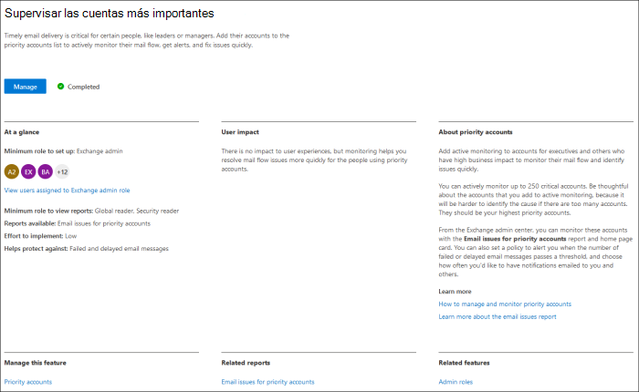

# Novedades del Centro de administración de Microsoft 365What's new in the Microsoft 365 admin center

::: moniker range="o365-21vianet"

> [!NOTE]
> Es posible que parte de la información de este artículo no se aplique a Office 365 operado por 21Vianet.Some of the information in this article might not apply to Office 365 operated by 21Vianet.

::: moniker-end

Estamos agregando continuamente nuevas características al Centro de administración de [Microsoft 365,](microsoft-365-admin-center-preview.md)solucionando problemas que aprendemos y realizando cambios en función de sus comentarios.We're continuously adding new features to [the Microsoft 365 admin center](microsoft-365-admin-center-preview.md), fixing issues we learn about, and making changes based on your feedback. Echa un vistazo a continuación para ver lo que está disponible para ti hoy.Take a look below to see what's available for you today. Algunas características se implantan a diferentes velocidades para nuestros clientes.Some features get rolled out at different speeds to our customers. Si aún no ve una característica, intente agregarse a [la versión dirigida](manage/release-options-in-office-365.md).If you aren't seeing a feature yet, [try adding yourself to targeted release](manage/release-options-in-office-365.md).

Y si quiere saber las novedades de otros servicios en la nube de Microsoft:And if you'd like to know what's new with other Microsoft cloud services:

- [Novedades de Azure Active DirectoryWhat's new in Azure Active Directory](https://docs.microsoft.com/azure/active-directory/fundamentals/whats-new)
- [Novedades del Centro de administración de ExchangeWhat's new in the Exchange admin center](https://docs.microsoft.com/Exchange/whats-new)
- [Novedades de Microsoft IntuneWhat's new in Microsoft Intune](https://docs.microsoft.com/mem/intune/fundamentals/whats-new)
- [Novedades del Centro de cumplimiento de Microsoft 365What's new in the Microsoft 365 compliance center](https://docs.microsoft.com/Office365/SecurityCompliance/whats-new)
- [Novedades de Microsoft 365 DefenderWhat's new in Microsoft 365 Defender](https://docs.microsoft.com/microsoft-365/security/mtp/whats-new)
- [Novedades del Centro de administración de SharePointWhat's new in the SharePoint admin center](https://docs.microsoft.com/sharepoint/what-s-new-in-admin-center)
- [Actualizaciones de OfficeOffice updates](https://docs.microsoft.com/OfficeUpdates/)

## Ignite 2021 (marzo)Ignite 2021 (March)

Bienvenido a Microsoft Ignite.Welcome to Microsoft Ignite. Esperamos que haya podido asistir a algunas de nuestras sesiones: [Microsoft Ignite 2021](https://myignite.microsoft.com/sessions).We hope you were able to attend some of one of our sessions: [Microsoft Ignite 2021](https://myignite.microsoft.com/sessions). Estas son algunas de las cosas de las que hablamos en Ignite.Here's a few of the things we talked about at Ignite.
> [!NOTE]
> No todas las características estarán disponibles para todos de inmediato.Not all features are going to be available to everyone right away. Si no ve las nuevas características, únase [a Targeted Release](manage/release-options-in-office-365.md).If you aren't seeing the new features, [join Targeted Release](manage/release-options-in-office-365.md).

### Centro de mensajesMessage center

Hemos renovado el Centro de mensajes para ayudarle a descubrir mensajes relevantes y agregó una experiencia de lectura más flexible.We’ve revamped the Message center to help you discover relevant messages and added a more flexible reading experience. Hemos agregado una nueva columna **De** servicio para ayudarle a examinar el servicio al que se aplica un mensaje y filtrar los mensajes por servicio y otros metadatos.We've added a new **Service** column to help you scan which Service a message applies to and filter messages by Service and other metadata. Puede marcar un mensaje como favorito para realizar un seguimiento, elegir qué columnas aparecen en la lista de mensajes y navegar entre los mensajes con los botones atrás y siguiente.You can favorite a message to mark it for follow up, choose which columns appear in the message list, and navigate between messages with the back and next buttons. También hemos mejorado el proceso para facilitar la información sobre las publicaciones del Centro de mensajes.We've also improved the process to make it easier to give feedback on Message center posts.

:::image type="content" source="../media/message-center.png" alt-text="Captura de pantalla: página principal del centro de mensajes que muestra la bandeja de entrada y los mensajes":::

Para obtener más información sobre las nuevas características, consulte [Administrar mensajes en el Centro de mensajes.](manage/manage-messages.md)To learn more about the new features, check out [Manage messages in Message center](manage/manage-messages.md).

## Ignite 2020 (agosto & septiembre)Ignite 2020 (August & September)

Bienvenido a Microsoft Ignite: nuestro primer Ignite solo en línea.Welcome to Microsoft Ignite - our first online-only Ignite. Esperamos verlo en una de nuestras sesiones: Catálogo de sesiones de [Microsoft Ignite 2020](https://myignite.microsoft.com/sessions).We hope to see you in one of our sessions: [Microsoft Ignite 2020 Session Catalog](https://myignite.microsoft.com/sessions). Estas son algunas de las cosas de las que hablaremos en Ignite.Here's just a few of the things we'll be talking about at Ignite.
> [!NOTE]
> No todas las características estarán disponibles para todos de inmediato.Not all features are going to be available to everyone right away. Si no ve las nuevas características, únase [a Targeted Release](manage/release-options-in-office-365.md).If you aren't seeing the new features, [join Targeted Release](manage/release-options-in-office-365.md).

### Administración multiinquilinoMulti-tenant management

Hemos desarrollado un conjunto de características para administradores multiinquilino como usted para que el trabajo se haga de forma más rápida y eficiente.We've developed a set of features for multi-tenant admins like you to get your job done faster and more efficiently. Para obtener más información, vea [Administrar varios inquilinos.](multi-tenant/manage.md)For more information, see [Manage multiple tenants](multi-tenant/manage.md).

- **Sus inquilinos:** cambie rápidamente entre los inquilinos que administra.**Your tenants**: Quickly switch between the tenants you manage.
- Todos los **inquilinos:** una nueva página en la que puede ver rápidamente el estado de todos los servicios de los inquilinos, las solicitudes de servicio abiertas, los productos y la facturación, las tareas de configuración recomendadas y el número de usuarios de ese inquilino.**All tenants**: A new page where you can quickly see the health of all your tenants' services, any open service requests, your products and billing, recommended setup tasks, and the number of users in that tenant.
- **Configuración:** la página de instalación multiinquilino le ofrece una vista de lista de la página de instalación, pero organizada para muchos inquilinos.**Setup**: The multi-tenant Setup page gives you a list view of the Setup page, but organized for many tenants. Puede ver qué características no están activadas, qué tareas se completan para todos los inquilinos, tareas que los inquilinos aún necesitan completar.You can see which features aren't turned on, which tasks are complete for all tenants, tasks that tenants still need to complete. Esta vista le ayudará a realizar un seguimiento de la adopción de características y a asegurarse de que las tareas de configuración de seguridad recomendadas siempre se realizan.This view will help you keep track of feature adoption and to make sure the recommended security setup tasks are always done.
- **Estado del** servicio: la vista estado del servicio muestra si algún incidente o aviso está afectando a los inquilinos.**Service health**: The service health view shows you if any incidents or advisories are affecting the tenants. Incluso le dirá cuántos de los inquilinos administrados se ven afectados.It will even tell you how many of your managed tenants are affected. Solo tienes que seleccionar un incidente para obtener más información en la pestaña información general y, a continuación, cambiar a la pestaña Inquilinos afectados para explorar en profundidad y admitir ese espacio empresarial.Just select an incident to get more information on the overview tab, then switch over to the Tenants affected tab to drill down and support that tenant.
- **Las migraciones de buzones** entre inquilinos es un nuevo servicio, ahora en versión preliminar pública, que permite mover buzones entre inquilinos sin necesidad de incorporar buzones de correo fuera de la cuenta y, a continuación, incorporar.**Cross-tenant mailbox migrations** is a new service, now in public preview, that lets you move mailboxes between tenants without the need to offboard and then onboard mailboxes. 
- **Uso compartido de dominios entre** inquilinos: pronto, puede unirse a una vista previa privada para las funcionalidades que le permiten compartir un dominio entre varios inquilinos.**Cross-tenant domain sharing**: Soon, you can join a private preview for capabilities that allow you to share a domain across multiple tenants. Por ejemplo, si Contoso adquiere Wingtip Toys, Contoso puede compartir el dominio con Wingtip Toys para que los usuarios de ambos inquilinos puedan usar "contoso.com" como sus direcciones de correo electrónico.For example, if Contoso acquires Wingtip Toys, Contoso can share the domain with Wingtip Toys so that people in both tenants can use "contoso.com" as their email addresses.

### Supervisar las cuentas más importantesMonitor your most important accounts

Puede supervisar y realizar un seguimiento de los mensajes de correo electrónico con errores o retrasos enviados a los usuarios que tienen un alto impacto empresarial, como su director general.You can monitor and track failed or delayed email messages sent to your users who have a high business impact, like your CEO. Para realizar un seguimiento de las cuentas de prioridad, agregue usuarios a la lista de cuentas de prioridad en el Centro de administración de Microsoft 365.You track priority accounts by adding users to your priority accounts list in the Microsoft 365 admin center. Agregue ejecutivos, líderes, administradores u otros usuarios que tengan acceso a información confidencial o de alta prioridad.Add executives, leaders, managers, or other users who have access to sensitive or high priority information.

Las cuentas de prioridad solo están disponibles para las organizaciones que cumplen los dos requisitos siguientes:Priority accounts are only available to organizations that meet both of the following requirements:

- Office 365 E3 o Microsoft 365 E3, o Office 365 E5 o Microsoft 365 E5.Office 365 E3 or Microsoft 365 E3, or Office 365 E5 or Microsoft 365 E5.
- Al menos 10 000 licencias y al menos 50 usuarios activos mensuales de Exchange Online.At least 10,000 licenses and at least 50 monthly active Exchange Online users.

Hay dos formas de empezar:There are two ways to get started:

- Vaya a **Usuarios** y, a continuación, en el menú "Más acciones", seleccione Administrar cuentas **de** prioridad para agregar usuarios a la lista.Go to **Users**, and then in the "more actions" menu select **Manage priority accounts** to add users to the list.
- Vaya a **Configuración**, busque la tarea de configuración **Supervisar las cuentas más importantes** y, a continuación, seleccione **Introducción.**Go to **Setup**, find the setup task **Monitor your most important accounts**, and then select **Get started**.

Para obtener más información sobre las cuentas de prioridad, consulta [Supervisión de cuentas de prioridad](https://docs.microsoft.com/microsoft-365/admin/setup/priority-accounts).For more info on priority accounts, check out [Monitoring priority accounts](https://docs.microsoft.com/microsoft-365/admin/setup/priority-accounts).

### Buscar más rápido y obtener mejores resultados desde cualquier páginaSearch faster and get better results from any page

We've started rolling out a new Search experience for the admin center, and we can't wait for you to try it out. Alt+S to search from any page.](../media/MAC-WN-GlobalSearch.png)

- El cuadro De búsqueda se movió al área de encabezado donde dice "Centro de administración de Microsoft 365", por lo que ahora busca desde cualquier página, no solo en la página principal.The Search box moved to the header area where it says "Microsoft 365 admin center" so you now search from any page, not just the Home page. Incluso tenemos un acceso directo: **Alt+S**.We've even got a shortcut: **Alt+S**.
- La búsqueda es más inteligente y le dará mejores resultados, incluso más rápido.Search is smarter and will give you better results, even faster. Pruebe a escribir "2fa" para empezar.Try typing "2fa" to get started.
- Los resultados de la búsqueda se organizan según el tipo de elemento o acción que puede realizar.Search results are organized by the type of item or action you can take.
  - **Usuarios:** seleccione el nombre del usuario y puede editarlo allí mismo.**Users**: Select the user's name and you can edit that user right there. Si selecciona el menú "más acciones" junto a su nombre, puede restablecer su contraseña.If you select the "more actions" menu next to their name, you can reset their password. Puede buscar por nombre para mostrar, apellido, nombre, nombre de usuario o dirección de correo electrónico principal y alias de correo electrónico.You can search by display name, last name, first name, username or primary email address, and email aliases. Pero para obtener una coincidencia exacta, busque por dirección de correo electrónico principal o nombre de usuario.But to get an exact match, search by primary email address or username.
  - **Grupos:** edite el grupo desde cualquier página, agregue miembros y asigne propietarios.**Groups**: Edit the group from any page, add members, assign owners.
  - **Acciones:** de forma similar a cómo puede buscar un usuario y, a continuación, restablecer su contraseña, también puede buscar "restablecer contraseña" desde cualquier página y, a continuación, restablecer una o más contraseñas para los usuarios.**Actions**: Similar to how you can search for a user and then reset their password, you can also search "reset password" from any page and then reset one or more passwords for users.
  - **Navegación:** los resultados en Navegación pueden ayudarle a llegar rápidamente a una página en el Centro de administración.**Navigation**: Results under Navigation can quickly help you get to a page in the admin center quickly. Por ejemplo, la búsqueda de "roles" le llevará a la página Roles para los roles de Azure AD.For example, searching "roles" will take you to the Roles page for Azure AD roles.
  - **Configuración:** busque cualquier configuración relacionada con su organización, los servicios a los que se suscriba y la configuración de seguridad y privacidad.**Settings**: Search for any setting related to your organization, the services you subscribe to, and security and privacy settings. 
  - **Dominios:** puede encontrar vínculos rápidos a los dominios y, a continuación, el vínculo le llevará a la página Información general y estado de ese dominio.**Domains**: You can find quick links to your domains, and then the link will take you to that domain's Overview and health page.
  - **Documentación:** si no podemos encontrar un resultado para usted, trataremos de encontrar documentación que le ayude.**Documentation**: If we can't find a result for you, we'll try to find some documentation to help. La lista de artículos seleccionados tarda un poco más en encontrar una coincidencia, así que espere un segundo para que la búsqueda encuentre los resultados.It takes a little longer for the curated list of articles to find a match, so wait a second to let Search find the results. 
  - **Comentarios:**¿No encontró lo que estaba buscando?**Feedback**: Didn't find what you were looking for? Envíenos comentarios desde La búsqueda.Send us feedback from Search. Agregaremos la funcionalidad de búsqueda para más páginas y más características en el Centro de administración.We will add searching functionality for more pages and more features across the admin center.

### Aplicación móvil de administración de Microsoft 365Microsoft 365 admin mobile app

La aplicación móvil de administración de [Microsoft 365,](https://www.microsoft.com/microsoft-365/business/manage-office-365-admin-app)que se incluye con la suscripción, te permite administrar Microsoft 365 desde tu dispositivo móvil para que puedas alejarte de tu escritorio para realizar tareas diarias.The [Microsoft 365 admin mobile app](https://www.microsoft.com/microsoft-365/business/manage-office-365-admin-app), which is included with your subscription, lets you manage Microsoft 365 from your mobile device so you can get away from your desk to do every day tasks. De hecho, hay más de 90 características en la aplicación y solo agregamos algunas más:In fact, there are over 90 features in the app--and we just added a few more:

- Compatibilidad con las directivas de administración de aplicaciones móviles y acceso condicional de **Microsoft Intune:** ahora puede usar su dispositivo personal para administrar Microsoft 365, incluso si su organización ha activado las directivas de administración de aplicaciones móviles y acceso condicional de Intune.**Support for Microsoft Intune's Mobile Application Management and Conditional Access policies**: You can now use your personal device to manage Microsoft 365 even if your org has turned on Intune's Mobile Application Management and conditional access policies.
- **Notificaciones del centro de mensajes:** active las notificaciones del centro de mensajes en Notificaciones de configuración si desea recibir una alerta sobre las nuevas publicaciones  >   del centro de mensajes.**Message center notifications**: Turn on message center notifications at **Settings** > **Notifications** if you wish to be alerted about new message center posts. A través de las notificaciones, queremos asegurarnos de que se mantenga informado sobre información y eventos importantes en todo el espacio empresarial.Through notifications, we want to ensure you stay informed about important information and events across your tenant.
- **Alertas de** facturación: también puedes activar las notificaciones de facturación en Notificaciones de configuración si quieres recibir notificaciones de facturación en el dispositivo si una suscripción está a punto de  >   expirar.**Billing alerts**: You can also turn on billing notifications at **Settings** > **Notifications** if you want to get billing notifications on your device if a subscription is about to expire.
- **Modo oscuro:** bienvenido al lado oscuro de la aplicación móvil.**Dark mode**: Welcome to the dark side of the mobile app. Esta era una de nuestras características más solicitadas.This was one of our most requested features. Ve a **Temas**  >  **de configuración** para activarlo.Go to **Settings** > **Themes** to turn it on.
- **Notificar un problema:** ahora puedes informar de un problema en la aplicación o ver los problemas notificados por otros administradores.**Report an issue**: You can now report an issue in the app or view issues reported by other admins. Visite **Estado del servicio** para comprobarlo.Visit **Service health** to check it out.

### Recomendaciones de uso para pequeñas y medianas empresasUsage recommendations for small and medium businesses

Las pequeñas y medianas empresas  podrían recibir una recomendación en la página principal si algunas de las personas de la organización no usan activamente aplicaciones de Teams, OneDrive u Office.Small and medium businesses might get a recommendation on the **Home** page if some of the people in the org aren't actively using Teams, OneDrive, or Office apps. Cuando veas la recomendación, puedes enviar rápidamente un correo electrónico de aprendizaje de Microsoft a los usuarios inactivos para ayudarles a empezar con la aplicación y para asegurarte de que obtienes el valor completo de tus suscripciones.When you view the recommendation, you can quickly email Microsoft training to inactive users to help them get started with the app and to make sure you are getting the full value from your subscriptions.

### Colección de trabajo remotoRemote work collection

En octubre, agregaremos una colección de trabajo remoto para ayudar a los propietarios de pequeñas empresas y a su personal a estar en línea y trabajar de forma remota.In October, we'll be adding a remote work collection to help small business owners and their staff get online and working remotely.  **La configuración de elementos básicos del** trabajo remoto es una lista curada de todas las características que Microsoft recomienda para habilitar de forma segura el trabajo remoto y colaborar eficazmente.**Remote work essentials** setup is a curated list of all features Microsoft recommends to securely enable remote work and to collaborate effectively. En un par de semanas, puede probarlo en **Setup**  >  **Remote work essentials**.In a couple of weeks, you can try it out in **Setup** > **Remote work essentials**.

Para obtener más información acerca de cómo permitir de forma segura el trabajo remoto y una dirección web práctica que sea fácil de recordar y compartir, vaya a [aka.ms/remote-business](https://aka.ms/remote-business).For more information about how to securely allow remote work and a handy web address that's easy to remember and share, go to [aka.ms/remote-business](https://aka.ms/remote-business).

### ¿Necesita ayuda? mover a más centros de administraciónNeed help? moving to more admin centers

Estamos analizando y actualizando continuamente el contenido y las herramientas para mantenerse al día con los cambios en el producto.We're continuously looking at and updating the content and tools to keep up with changes in the product. Ahora tenemos muchas más herramientas de diagnóstico de autoservicio para ayudarle a resolver problemas de forma rápida y eficaz.We now have many more self-serve diagnostic tools to help you resolve issues quickly and efficiently. Estos son algunos de los que se agregaron recientemente:Here are a few that were recently added:

- Cambiar la directiva de limitación del servicio web de ExchangeChange your Exchange Web Service throttling policy
- Comprobar el estado del aprovisionamiento y validación de Teams para usuarios específicosChecking status of Teams provisioning and validation to specific users
- Corregir problemas de instalación de DKIMFix DKIM setup issues
- Diagnosticar errores de inscripción de usuarios de IntuneDiagnose Intune user enrollment errors

Y estamos implementando la nueva y mejorada experiencia de soporte técnico que ya ves en el Centro de administración de Microsoft 365 en algunos de los otros centros de administración.And we are rolling out the new and improved support experience you already see in the Microsoft 365 admin center to some of the other admin centers. El Centro de administración de Teams y los Centros de administración de seguridad y cumplimiento ya tienen esta nueva experiencia.Teams Admin Center and Security and Compliance Admin Centers already have this new experience. Y pronto, **el Centro de administración de Exchange,** el Centro de administración de **SharePoint** y **Office.com** se actualizarán junto con esta nueva experiencia de ayuda para administradores.And soon, **Exchange admin center**, **SharePoint admin center**, and **Office.com** will be updated along with this new help experience for admins.

### Administrar cambios con Microsoft PlannerManage changes with Microsoft Planner

In May, we announced that you'll soon be able to sync Message center posts to Microsoft Planner and now it's available for everyone to use.In May, we announced that you'll soon be able to sync Message center posts to Microsoft Planner and now it's available for everyone to use.  Ahora puede crear tareas a partir de mensajes, asignarlas y realizar un seguimiento de ellas hasta su finalización.You can now create tasks from messages, assign them, and track them to completion. La primera vez, **seleccionas La sincronización de Planner** tendrás que conectarte al plan adecuado.The first time, you select **Planner syncing** you'll need to connect to the appropriate plan.

Para obtener más información, consulte este artículo y vídeo para ver cómo funciona: Realizar un seguimiento de las [publicaciones](https://docs.microsoft.com/Office365/Planner/track-message-center-tasks-planner) del centro de mensajes en PlannerTo learn more about it, check out this article and video to see how it works: [Track your message center posts in Planner](https://docs.microsoft.com/Office365/Planner/track-message-center-tasks-planner)

### Documentación, aprendizaje y vídeosDocumentation, Training, and Videos

- Nuevo y justo a tiempo para Microsoft Ignite:[El concentrador virtual](https://adoption.microsoft.com/virtual-hub/).Brand new and just in time for Microsoft Ignite--[The Virtual Hub](https://adoption.microsoft.com/virtual-hub/). Profundizar en el aprendizaje técnico para profesionales y desarrolladores de TI.Deep dive into technical training for IT pros and developers. Encuentre rápidamente alrededor de 20 vídeos nuevos como parte de #SIDETRACKED, el nombre de la pista de administración de Ignite este año.Quickly find around 20 new videos as part of #SIDETRACKED, the name of the Ignite admin track this year.
- Novedades de la serie de vídeos de [Microsoft 365:](https://www.youtube.com/watch?v=OVjb2lGJ4GU&t=2s) este mes, tratamos las nuevas características disponibles en whiteboard para Teams y en la web, cómo automatizar el aprovisionamiento de usuarios en Azure AD, nuevos desencadenadores y acciones de Power Automate en Teams, etc.[What's new with Microsoft 365](https://www.youtube.com/watch?v=OVjb2lGJ4GU&t=2s) video series: This month, we cover new features available in Whiteboard for Teams and on the web, how to automate user provisioning to Azure AD, new Power Automate triggers and actions in Teams, and more. Y permanece atento para el mes que viene, donde tendremos un resumen de todas las cosas geniales que suceden en Ignite.And stay tuned for next month, where we'll have a recap of all the great things happening at Ignite!
- Hicimos un rediseño de la [página de documentación de Microsoft 365](https://docs.microsoft.com/microsoft-365) que se centra en las soluciones en primer lugar.We did a redesign of the [Microsoft 365 documentation](https://docs.microsoft.com/microsoft-365) page that focuses on solutions first. Destacaremos las nuevas soluciones a medida que estén disponibles en esta página, así que no te des cuenta.We'll highlight new solutions as they become available on this page, so keep an eye out.

## Julio de 2020July 2020

### Prepararse para Ignite 2020Getting ready for Ignite 2020

A medida que avanzamos en la temporada de Ignite en Microsoft, no estamos lanzando tantas características para que podamos hablar mucho durante nuestras sesiones.As we're moving into Ignite season at Microsoft, we're not releasing as many features so that we have a lot to talk about during our sessions.

La siguiente actualización de este artículo será el día de apertura de nuestro primer Ignite solo en línea.The next update to this article will be on opening day of our first online-only Ignite. Y este año, es gratuito asistir.And this year, it is free to attend! Descrátese, inscriba: [Microsoft Ignite 2020](https://www.microsoft.com/ignite).Check it out, get signed up: [Microsoft Ignite 2020](https://www.microsoft.com/ignite).

### Sus productosYour products

Se ha realizado mucho trabajo en la administración de suscripciones para que la página sea más rápida de cargar, más rápida para encontrar lo que está buscando y para cumplir con los estándares de accesibilidad web ( directrices de[WCAG 2.1](http://www.w3.org/TR/WCAG21/)).There has been a lot of work done in the subscriptions management to make the page faster to load, faster to find what you're looking for, and to meet the web accessibility standards ([WCAG 2.1 guidelines](http://www.w3.org/TR/WCAG21/)).

- **Rediseño de** la tabla: la tabla se ha rediseñado para que pueda agrupar suscripciones similares.**Table redesign**: The table was redesigned so that you can group similar subscriptions. Vaya a  >  **Facturación de sus productos**.Go to **Billing** > **Your products**.
- **Detalles del** producto: para obtener más detalles que nunca sobre sus suscripciones, seleccione el producto en la lista.**Product details**: Get more details than ever about your subscriptions by selecting the product in the list.
- **Hacerlo todo desde aquí:** y no tiene que ir a saltar por varias páginas para administrar un producto.**Do it all from here**: And you don't have to go to jump around several pages to manage one product. Por ejemplo, si necesita cancelar una suscripción, el panel se abrirá para realizar la acción allí.For example, if you need to cancel a subscription, the panel will open to do the action right there.

### DominiosDomains

La administración de dominios puede ser complicada y hemos lanzado una nueva característica para que sea más fácil.Domain management can be complicated, and we've released a new feature to make that easier. Ve a Configuración > dominios y, a continuación, selecciona un dominio para obtener más información sobre el dominio y el estado del dominio.Go to Settings > Domains and then select a domain to get more information about your domain and the domain's health.

:::image type="content" source="../media/MAC-WN-DomainDNS.PNG" alt-text="Página de detalles de dominios para contoso.com":::

### Documentos, aprendizaje y vídeos (julio de 2020)Docs, training, and videos (July 2020)

Novedades de la serie de vídeos de [Microsoft 365:](https://youtu.be/m1Nu8WJgCDY) este mes, tratamos la nueva experiencia de Yammer para web y móvil, cómo integrar la aplicación Yammer Communities para Microsoft Teams, nuevos paquetes de directivas para admitir a los trabajadores y administradores de Firstline, y mucho más.[What's new with Microsoft 365](https://youtu.be/m1Nu8WJgCDY) video series: This month, we cover the new Yammer experience for web and mobile, how to integrate the Yammer Communities app for Microsoft Teams, new policy packages to support Firstline Workers and managers, and more.

## Junio de 2020June 2020

### Mantenerse al día con la nueva administración de OfficeKeeping up with Office What's New management

Hace unos meses, agregamos una configuración que le permite administrar los mensajes nuevos que se muestran en las aplicaciones de Office de [un usuario.](#office-whats-new-management)A few months ago, we added a setting that lets you manage the [What's New messages that show up in a user's Office apps](#office-whats-new-management). Este mes, hemos publicado una nueva tarjeta de página principal  que le ayudará a actuar rápidamente y realizar un seguimiento de los mensajes novedades que desea que se muestran a los usuarios de su organización.This month, we released a new Home page card that will help you act quickly and keep track of the **What's New** messages that you want shown to the users in your organization.

### Documentos, aprendizaje y vídeos (junio)Docs, training, and videos (June)

- [Introducción a TeamsGetting started with Teams](https://support.microsoft.com/office/184f1aba-2f91-43f0-86e1-9fae607e24f6)

## Mayo de 2020May 2020

### Nuevo canal de actualización para OfficeNew update channel for Office

El 12 de mayo, anunciamos la disponibilidad de un nuevo canal de actualización para Office: Monthly Enterprise Channel.On May 12, we announced the availability of a new update channel for Office:  Monthly Enterprise Channel. Este canal de actualización proporciona a los usuarios nuevas características de Office una vez al mes, el segundo martes del mes.This update channel provides your users with new Office features once a month, on the second Tuesday of the month.

Si permite que los usuarios instalen Office automáticamente desde el portal, puede seleccionar Canal empresarial mensual para ellos.If you allow your users to self-install Office from the portal, you can select Monthly Enterprise Channel for them. Para ello, inicie sesión en el Centro de administración de Microsoft 365 y vaya **a Mostrar** todas las configuraciones de la organización Servicios de descarga  >   >    >    >  **de software de Office.**To do this, sign in to the Microsoft 365 admin center and go to **Show all** >**Settings** > **Org settings** > **Services** > **Office software download settings**. Si selecciona Una **vez al mes (Canal** de empresa mensual), cualquier nueva instalación automática de Office se configurará para usar el Canal de empresa mensual.If you select **Once a month (Monthly Enterprise Channel)**, then any new self-installs of Office will be configured to use Monthly Enterprise Channel.

Junto con la versión de Monthly Enterprise Channel, también estamos revisando los nombres de los canales de actualización existentes.In conjunction with the release of Monthly Enterprise Channel, we’re also revising the names of the existing update channels. Por ejemplo, el canal mensual se cambia a Canal actual.For example, Monthly Channel is being renamed to Current Channel. Los nuevos nombres tienen efecto el 9 de junio de 2020.The new names take effect on June 9, 2020.

Para obtener más información, vea [Changes to update channels for Microsoft 365 Apps](https://docs.microsoft.com/DeployOffice/update-channels-changes).For more information, see [Changes to update channels for Microsoft 365 Apps](https://docs.microsoft.com/DeployOffice/update-channels-changes).

### Nuevos roles de administradorNew admin roles

Hemos agregado algunos nuevos roles de administrador de Azure Active Directory al Centro de administración de Microsoft 365.We've added some new Azure Active Directory admin roles to the Microsoft 365 admin center.

- El rol de administrador de identidad híbrida permite a los usuarios administrar servicios de autenticación y aprovisionamiento en la nube.Hybrid identity admin role gives users permission to manage cloud provisioning and authentication services.
- El rol de administrador de red permite a los usuarios administrar ubicaciones de red y revisar los conocimientos de red para el software de Microsoft 365 como aplicaciones de servicio.Network admin role lets users manage network locations and review network insights for Microsoft 365 Software as a Service apps.
- El rol de administrador de impresoras concede permiso para administrar todos los aspectos de las impresoras y las conexiones de impresora.Printer admin role grants permission to manage all aspects of printers and printer connections.
- El técnico de impresora es un subconjunto de la función de administrador de impresora donde los usuarios pueden registrar y anular el registro de impresoras, y actualizar el estado de la impresora.Printer technician is a subset of the Printer admin role where those users can register and unregister printers, and update printer status.
Para obtener más información acerca de estos roles, vea [Acerca de los roles de administrador](https://docs.microsoft.com/microsoft-365/admin/add-users/about-admin-roles).To find out more about these roles, see [About admin roles](https://docs.microsoft.com/microsoft-365/admin/add-users/about-admin-roles).

### Exportar lista de gruposExport groups list

Hemos escuchado a muchos administradores que necesitan compartir información sobre grupos y su uso a personas que no tienen acceso a los centros de administración.We've heard from a lot of admins that they need to share information about groups and their usage to people who don't have access to the admin centers. Ahora puede exportar la lista Grupos a un archivo CSV con fines de auditoría, lo que significa que puede lanzar ese script de PowerShell antiguo.You can now export the Groups list to a CSV file for auditing purposes, which means you can throw out that old PowerShell script. Para probarlo, vaya a **Grupos** grupos y, a continuación,  >  seleccione **Exportar grupos** en la barra de comandos.To try it out, go to **Groups** > **Groups**, and then select **Export groups** from the command bar.

### Centro de soluciones y arquitectura de Microsoft 365Microsoft 365 solution and architecture center

Justo este mes, lanzamos un nuevo sitio en el centro de soluciones y arquitectura de [https://docs.microsoft.com](https://docs.microsoft.com) [Microsoft 365,](https://docs.microsoft.com/microsoft-365/solutions/solution-architecture-center)que reúne las instrucciones técnicas que necesita para comprender, planear e implementar soluciones integradas de Microsoft 365 para una colaboración segura y compatible.Just this month, we released a new site on [https://docs.microsoft.com](https://docs.microsoft.com) called the [Microsoft 365 solution and architecture center](https://docs.microsoft.com/microsoft-365/solutions/solution-architecture-center), which brings together the technical guidance you need to understand, plan, and implement integrated Microsoft 365 solutions for secure and compliant collaboration. En este centro, encontrará:In this center, you'll find:

- Guía de soluciones fundamentalesFoundational solution guidance
- Soluciones de carga de trabajo y instrucciones para escenariosWorkload solutions and scenario guidance
- Ilustraciones de arquitectura y soluciones (los pósteres!!!)Solution and architecture illustrations (The posters!!!)
- Instrucciones específicas del sectorIndustry specific guidance
- Entidades de seguridad de diseño de arquitectura empresarialEnterprise architecture design principals

### Documentos, aprendizaje y vídeos (mayo)Docs, training, and videos (May)

- Novedades de la serie de vídeos de **Microsoft 365:** este mes, tratamos la nueva experiencia de soporte técnico en los Centros de administración y seguridad y cumplimiento de Teams, la integración de Planner con el Centro de mensajes y el nuevo diseño de vídeo 3x3 en Microsoft Teams.**What's new in Microsoft 365 video series**: This month, we cover the new support experience in the Teams admin and Security and Compliance Centers, Planner integration with the Message Center, and the new 3x3 video layout in Microsoft Teams. 
- La página del centro de ayuda del Centro de administración de [Microsoft 365](https://docs.microsoft.com/microsoft-365/admin/) se actualizó para ayudarle a encontrar lo que necesita más rápidamente.The [Microsoft 365 admin center help](https://docs.microsoft.com/microsoft-365/admin/) hub page was updated to help you find what you need more quickly. Y si ves esa página ahora mismo, hemos agregado una tarjeta para informarle de actualizaciones y cambios importantes.And if you go look at that page right now, we've added a card to inform you of important updates and changes.

## Abril de 2020April 2020

### Administración de roles de IntuneIntune roles management

[Abril de 2020April 2020](#april-2020)

Bueno, lo hicimos.Well, we did it! Hemos dado el segundo paso hacia una experiencia de roles unificados y ahora puede administrar roles de Intune en el Centro de administración de Microsoft 365.We've taken the second step towards a unified roles experience and you can now manage Intune roles in the Microsoft 365 admin center. También puede aprovechar características como la capacidad de buscar roles y ver permisos de roles.You can also leverage features such as the ability to search for roles and view role permissions. Esto significa que no necesita dos herramientas independientes para administrar roles para Microsoft 365 e Intune.This means you don’t need two separate tools to manage roles for Microsoft 365 and Intune. Cuando inicie sesión en el Centro de administración de Microsoft 365, verá que hay dos ejes dinámicos en la página Roles, uno para Azure AD y otro para Intune.When you sign into the Microsoft 365 admin center, you’ll see that there are two pivots on the Roles page, one for Azure AD and one for Intune.

### Sincronizar publicaciones del Centro de mensajes con PlannerSync Message Center posts to Planner

A partir de mayo, los administradores que estén en la versión dirigida empezarán a ver el botón "Sincronización de Planner" en el centro de mensajes.Starting in May, admins who are in Targeted release will start seeing the "Planner syncing" button in the message center. Ahora puede realizar un seguimiento de los mensajes que necesitan acción, seleccionar el tipo de mensajes que desea realizar un seguimiento, asignar mensajes para realizar un seguimiento como tareas y etiquetar los mensajes para su atención posterior.You can now track messages that need action, select the type of messages you'd like to track, assign messages to track as tasks, and tag messages for later attention.

[Unirse a la versión dirigida](manage/release-options-in-office-365.md) para empezar.[Join Targeted Release](manage/release-options-in-office-365.md) to get started!

### "¿Necesita ayuda?""Need help?" iniciado en el Centro de administración de Teams & de seguridad y cumplimientolaunched in Teams admin center & Security and Compliance centers

El Centro de administración de Teams, el Centro de seguridad y el Centro de cumplimiento ahora usan el mismo "¿Necesita ayuda?"The Teams admin center, Security center, and Compliance center are now using the same "Need help?" característica que usa el Centro de administración de Microsoft 365 para buscar ayuda y ponerse en contacto con el soporte técnico.feature that the Microsoft 365 admin center uses for finding help and contacting support. Hemos recibido una gran cantidad de comentarios de los administradores que deseabas el mismo nivel de ayuda y soporte técnico y estamos encantados de traerlo a ti.We've received a lot of feedback from admins that you wanted the same level of help and support and we're happy to bring that to you. Pruébalo y danos tus comentarios.Try it out and give us your feedback!

#### ¿Necesita chat?Need chat?

Nuestros agentes de soporte técnico han estado trabajando desde casa mientras siguen tomando casos de clientes y limitaciones en el ancho de banda de Internet mientras trabajan desde casa pueden afectar a la calidad de las llamadas de los clientes.Our support agents have been working from home while still taking customer cases and limitations on internet bandwidth while working from home can impact customer call quality. Para seguir recibiendo soporte técnico, hemos iniciado la opción de soporte de chat en directo para clientes comerciales en el Centro de administración de Microsoft 365.In order to continue supporting you, we have launched live chat support option for commercial customers in the Microsoft 365 admin center.

Al crear una solicitud de servicio, ahora verás el chat como una opción, además del teléfono y el correo electrónico.While creating a service request, you'll now see chat as an option, in addition to phone and email. Seleccione chat como canal preferido de comunicación y cree la solicitud.Select chat as a preferred channel of communication and create the request. Una vez que hayas creado la solicitud, puedes iniciar el chat cuando estés listo para chatear con agentes de Microsoft.Once you've created the  request, you can start the chat when you are ready to chat with Microsoft agents.

### Actualizaciones de TeamsTeams updates

Con el mayor uso de Teams, hemos agregado algunas características para ayudarle a administrarlas.With the increased usage of Teams, we've added a few features to help you manage them.

- Una nueva tarjeta de recomendación en la página principal del centro de administración muestra qué usuarios no han usado Teams activamente durante 30 días.A new recommendation card on the admin center Home page shows which users have not actively used Teams for 30 days. Puede enviar a esos usuarios un correo electrónico de aprendizaje para que puedan empezar a usar Teams.You can send those users a training email to get them started using Teams.
- Reunir a los usuarios  con **teams:** vaya a Configuración para ver una nueva página que le ayudará a activar Teams para usuarios con licencia y permitir el acceso de invitados, para que pueda trabajar con clientes externos en Teams.**Bring people together with teams**: Go to **Setup** to see a new page to help you turn on Teams for licensed users and allow guest access, so you can work with external customers in Teams.
- Una tarjeta de Microsoft Teams ahora está anclada de forma predeterminada a la página principal.A Microsoft Teams card is now pinned by default to your Home page. Muestra si Teams está activado y si se permite el acceso de invitados.It shows whether Teams is turned on, and if guest access is allowed. También le permite comprobar el estado de configuración de los usuarios de Teams recién con licencia y comprobar si los problemas de red pueden afectar a los usuarios de Teams.It also allows you to check the setup status for newly licensed Teams users, and check if network issues might be impacting Teams users.
- Por último, Teams es ahora un paso en el flujo de configuración inicial si adquirió una licencia que incluye Teams.Finally, Teams is now a step in the initial set up flow if you purchased a license that includes Teams.

### Puntuación de productividadProductivity score

La puntuación de productividad proporciona información sobre cómo los usuarios usan los servicios en la nube de Microsoft y las experiencias tecnológicas que los admiten.Productivity Score gives insights about how people use Microsoft cloud services and the technology experiences that support them. La puntuación refleja el rendimiento de la organización con respecto a las medidas de experiencia de los empleados y la tecnología y compara la puntuación con organizaciones como la tuyo.The score reflects your organization’s performance against employee and technology experience measures and compares your score with organizations like yours. Este mes, presentamos los nuevos conceptos siguientes a la experiencia de vista previa:This month, we are introducing the following new concepts to the preview experience:

- Vista de tendencias de información principal en las páginas de detalles de la página principal y la categoría :Endpoint Analytics y las categorías de conectividad de red agregadas a la experiencia de tecnologíaTrend view of primary insights on home page and category detail pages -Endpoint Analytics and Network Connectivity categories added to Technology Experience
- Información relevante de la experiencia tecnológica que se muestra en categorías de experiencia de empleadosRelevant Technology Experience insight shown in Employee Experience categories
- Nueva categoría comunicaciones como parte de la experiencia de los empleadosNew Communications category as part of Employee Experience
- Detalles de usuario con metadatos de la organización en categorías de experiencia de empleadoUser details with organizational metadata in Employee Experience categories

Si quieres obtener más información, consulta el blog: Medir y mejorar la experiencia de [Microsoft 365 con puntuación de productividad de Microsoft](https://techcommunity.microsoft.com/t5/microsoft-365-blog/measure-and-improve-the-microsoft-365-experience-with-microsoft/ba-p/1348618).If you'd like to learn more, check out the blog: [Measure and improve the Microsoft 365 experience with Microsoft Productivity Score](https://techcommunity.microsoft.com/t5/microsoft-365-blog/measure-and-improve-the-microsoft-365-experience-with-microsoft/ba-p/1348618). La puntuación de productividad se encuentra actualmente en versión preliminar privada.Productivity score is currently in private preview. [Únase a la vista previa privada de la puntuación de](https://aka.ms/productivityscorepreview) productividad para empezar.[Join the Productivity score private preview](https://aka.ms/productivityscorepreview) to get started.

### Actualizaciones de gruposGroups updates

Tenemos dos actualizaciones para grupos este mes:We've got two updates for Groups this month:

- Ahora puede editar direcciones de correo electrónico para grupos de Office 365 (también conocidos como grupos en Outlook y pronto se conocerán como grupos de Microsoft 365).You can now edit email addresses for Office 365 groups (Also known as Groups in Outlook, and soon to be known as Microsoft 365 groups).
- Hemos escuchado sus comentarios y hemos agregado mensajes de error más claros para saber por qué no puede convertir un grupo en un equipo de Microsoft.We've heard your feedback and we've added clearer error messaging for why you can't convert a group to a Microsoft Team.

### Documentos, vídeos y aprendizaje (abril)Docs, videos, and training (April)

Novedades de la serie de vídeos de **Microsoft 365:** este mes, tratamos sugerencias y recursos para ayudar a las pequeñas empresas a realizar la transición al trabajo remoto, incluida la implementación de Microsoft Teams, los recursos de formación en el trabajo remoto para mantenerse conectados con clientes y partners, y el nuevo plan de Microsoft 365 Business Voice.**What's new in Microsoft 365 video series**: This month, we cover tips and resources to help small businesses transition to remote work including how to roll out Microsoft Teams, remote work training resources to stay connected with clients and partners, and the new Microsoft 365 Business Voice plan. [Novedades de Microsoft 365What's New in Microsoft 365](https://go.microsoft.com/fwlink/p/?linkid=2118096)

#### Para los usuariosFor your users

- [Programar una reuniónSchedule a meeting](https://support.microsoft.com/office/c61b4f61-ee62-4a06-8bf7-0a1cd302700a)
- [Unirse a una reunión de TeamsJoin a Teams meeting](https://support.microsoft.com/office/078e9868-f1aa-4414-8bb9-ee88e9236ee4)
- [Crear un equipo de toda la organizaciónCreate an org-wide team](https://support.microsoft.com/office/037bb27a-bcc9-48fe-8d72-44d9482420a3)
- [Crear un equipo con invitadosCreate a Team with guests](https://support.microsoft.com/office/11fbb083-52ee-434d-8c6e-63711fdafac7)
- [Unirse a un equipo como invitadoJoin a Team as a guest](https://support.microsoft.com/office/928d1eef-61e2-49ec-b754-c2fe86b34824)
- [Crear una dirección de correo electrónico del grupoCreate a group email address](https://support.microsoft.com/office/ded875f9-a9de-437f-b559-2ae4f235bb2b)

#### Para administradores y propietarios de empresasFor admins and business owners

- [Capacitar a su pequeña empresa con trabajo remotoEmpower your small business with remote work](https://support.microsoft.com/office/9b91a85a-39b4-40a6-a590-0f9bea0ba8e6)
- [Ejecutar una pequeña empresa remotaRunning a remote small business](https://support.microsoft.com/office/9ac1a0f1-789b-4143-b954-5821d5d89298)
- [Registrarse en Microsoft Business BasicSign up for Microsoft Business Basic](https://support.microsoft.com/office/9ac1a0f1-789b-4143-b954-5821d5d89298)
- [Configuración del inicio de sesión en dos factoresSetting up two-factor sign-in](https://support.microsoft.com/office/9ac1a0f1-789b-4143-b954-5821d5d89298)

## Marzo de 2020March 2020

### Corrección de comentarios destacados: mejorar la confiabilidad de "agregar usuario" para licenciasFeatured Feedback Fix: Improve "add user" reliability for licensing

Recibimos una gran cantidad de comentarios de los administradores sobre lo difícil que es asignar licencias al agregar usuarios.We received a lot of feedback from admins about the how hard it is to assign licenses when adding users. Hemos realizado la primera actualización de esta corrección y hemos migrado a un servicio en segundo plano más confiable para procesar esas solicitudes.We've made the first update to this fix and we've migrated to a more reliable behind-the-scenes service to process those requests. Y si algo sale mal, ahora tendrás un mensaje de error que te permite intentarlo de nuevo.And if something goes wrong, you'll now get an error message that lets you to try again.

### Tarjeta de página principal de Microsoft TeamsMicrosoft Teams home page card

Con el uptick en el uso de Teams, algunas organizaciones recibirán una tarjeta de panel anclada que hace que Teams sea más reconocible.With the uptick in Teams usage, some orgs will get a pinned dashboard card that makes turning Teams on more discoverable. La tarjeta también tiene vínculos a cursos y documentos para ayudar a su organización a realizar la transición al trabajo remoto.The card also has links to training and docs to help your org transition to remote work. Solo tienes que ir a la **página** principal para ver la nueva tarjeta.Just go to the **Home** page to see the new card.

### Personalizar el tema de la aplicación móvil de SharePoint de la organizaciónCustomize your organization's SharePoint mobile app theme

Con el Centro de administración de Microsoft 365, ahora puede personalizar el tema de su organización en la aplicación móvil de SharePoint para iOS y la aplicación móvil de SharePoint para Android.Using the Microsoft 365 admin center, you can now customize your organization's theme in SharePoint mobile app for iOS and SharePoint mobile app for Android. Esta característica proporciona convenientemente una experiencia de aplicación de intranet móvil que puede coincidir con su SharePoint Online para los empleados en cualquier lugar.This feature conveniently provides a mobile intranet app experience that can match your SharePoint Online for employees on the go. La personalización del tema incluye la imagen del logotipo, el color de la barra de navegación, los colores de texto e icono y los colores de énfal, lo que facilita el reconocimiento.Theme customization includes your logo image, navigation bar color, text and icon colors, and accent colors, making for easy recognition.

### Mejoras en el asistente "Agregar un grupo"Improvements to the "Add a group" wizard

Cuando los administradores crearon un nuevo grupo y lo hicieron un equipo al mismo tiempo, podrían asignar propietarios que no tengan una licencia que incluya Teams.When admins created a new group - and made it a Team at they same time, they could assign owners who don't have a license that includes Teams. Y eso creó algunos dolores de cabeza.And that created some headaches. Hemos actualizado el flujo del asistente para comprobar que los propietarios tienen una licencia de Teams y si no tienen la opción de convertir el grupo en un equipo está deshabilitado.We've updated the wizard flow to verify that owners have a Teams license and if they don't the option to turn the group into a Team is disabled.

### Ofertas de Microsoft 365 para pequeñas y medianas empresasMicrosoft 365 offerings for small and medium businesses

Sabemos que este es un anuncio para el mes que viene, pero queremos asegurarnos de que está preparado.We know that this is an announcement for next month, but we want to make sure you're prepared.

A partir del 21 de abril, realizaremos cambios relacionados con nuestras suscripciones de Office 365 para pequeñas y medianas empresas y con Office 365 ProPlus.Starting on April 21, we're making changes related to our Office 365 subscriptions for small and medium businesses – and to Office 365 ProPlus. Estos productos ahora usarán la marca Microsoft 365.These products will now use the Microsoft 365 brand.

Los nuevos nombres de producto entraron en vigor el 21 de abril de 2020.The new product names go into effect on April 21, 2020. Solo se trata de un cambio en el nombre del producto y no hay cambios en los precios ni en las características en este momento.This is a change to the product name only, and there are no pricing or feature changes at this time.

|Nombre actualCurrent name |Nuevo nombreNew name  |
|---------|---------|
|Office 365 Empresa EssentialsOffice 365 Business Essentials     |   Microsoft 365 Empresa BásicoMicrosoft 365 Business Basic      |
|Office 365 Empresa PremiumOffice 365 Business Premium     |    Microsoft 365 Empresa EstándarMicrosoft 365 Business Standard     |
|Microsoft 365 EmpresaMicrosoft 365 Business     |    Microsoft 365 Empresa PremiumMicrosoft 365 Business Premium     |
|Office 365 EmpresaOffice 365 Business     |    Aplicaciones de Microsoft 365 para negociosMicrosoft 365 Apps for business       |
|Office 365 ProPlusOffice 365 ProPlus    |   Aplicaciones de Microsoft 365 para empresasMicrosoft 365 apps for enterprise      |

### Vídeos, aprendizaje y documentosVideos, training, and docs

Novedades de la serie web de [Microsoft 365:](https://go.microsoft.com/fwlink/p/?linkid=2118096)En el episodio de este mes, destacamos el aniversario de 3 años de Microsoft Teams y abarcamos nuevas características, como la mejora de la calidad de audio en las reuniones en línea, las comunicaciones dirigidas para los jefes de línea con la aplicación Shifts, la interoperabilidad de los consumidores de Teams y Skype, y mucho más.[What's New in Microsoft 365 web series](https://go.microsoft.com/fwlink/p/?linkid=2118096): In this month's episode, we highlight the 3-year anniversary of Microsoft Teams and cover new features including improved audio quality in online meetings, Targeted Communications for firstline managers with the Shifts app, Teams and Skype consumer interoperability, and more.

## Febrero de 2020February 2020

### Corrección de comentarios destacados: conmutador multi-organizaciónFeatured Feedback Fix: Multi-organization switcher

Recibimos una gran cantidad de comentarios de partners y administradores sobre los desafíos de administrar varias organizaciones en la nube de Microsoft.We received a lot of feedback from partners and admins about the challenges of managing multiple Microsoft cloud orgs. Una de nuestras primeras características de administración multi-org es el conmutador de **organización,** que te permite cambiar entre las organizaciones que administras en solo 2 clics.One of our first multi-org management features is the **Organization switcher**, which lets you change between the orgs that you manage in just 2 clicks.
> [!TIP]
> No tiene que hacer nada para que el conmutador de organización aparezca siempre que sea el partner de registro de al menos una organización.You don't have to do anything to make the organization switcher appear as long as you are the Partner of record for at least one organization.

1. En el Centro de administración de Microsoft 365, seleccione el nombre de la organización.In the Microsoft 365 admin center, select the org name.

2. En el conmutador de organización, seleccione la organización que desea administrar.In the organization switcher, select the org you want to manage.

Eso es literalmente!!!That's literally it!!!

### GruposGroups

Un par de cambios en el área de grupos este mes:A couple of changes in the groups area this month:

- **Ordenar por nombre de grupo:** puede ordenar la lista de grupos alfabéticamente, seleccionando la columna **Nombre de** grupo.**Sort by group name**: You can sort the groups list alphabetically, by selecting the **Group name** column.
- **Restaurar grupos eliminados de Microsoft 365:** ya no tiene que ir al Centro de administración de Exchange para restaurar los grupos eliminados de Microsoft 365.**Restore deleted Microsoft 365 groups**: You don't have to go to the Exchange admin center anymore to restore  deleted Microsoft 365 groups. Vaya a **Microsoft 365 Admin Center** \> **Groups** \> **Deleted groups** \> (select a group from the list) \> **Restore group**.Go to **Microsoft 365 admin center** \> **Groups** \> **Deleted groups** \> (select a group from the list) \> **Restore group**. Restaurará el grupo a  la lista Grupos y restaurará el correo electrónico, las conversaciones, el bloc de notas, los archivos y el calendario del grupo.It'll restore the group back to the **Groups** list and restore the group's email, conversations, notebook, files, and calendar.

### Vídeos, aprendizaje y documentos (febrero)Videos, training, and docs (February)

- Novedades de la serie de vídeos de **Microsoft 365:** este mes, nos centramos en las capacidades de búsqueda personalizadas para SharePoint Online, la característica de administración "Novedades" de Office que le permite mostrar u ocultar características específicas de los usuarios finales a través del panel de ayuda desde la aplicación, las actualizaciones de seguridad y cumplimiento más recientes de Yammer y mucho más.**What's new in Microsoft 365 video series**: This month, we're focused on custom search capabilities for SharePoint Online, the Office "What's New" management feature that lets you show or hide specific features from end-users via the in-app help pane, the latest security and compliance updates in Yammer, and more. Este es el último episodio: [Novedades de Microsoft 365](https://go.microsoft.com/fwlink/p/?linkid=2118096)Here's the latest episode: [What's New in Microsoft 365](https://go.microsoft.com/fwlink/p/?linkid=2118096)

- **Movimiento de documentos:** combinamos los artículos web de administración de Office 365 con el contenido de Microsoft 365 y es posible que haya observado la nueva dirección URL.**Docs move**: We combined the Office 365 admin web articles with the Microsoft 365 content and you might've noticed the new URL. Por ejemplo, este artículo solía hospedarse en: **docs.microsoft.com/Office365/Admin/whats-new-in-preview**, pero la dirección URL es ahora: **docs.microsoft.com/microsoft-365/admin/whats-new-in-preview**.For example, this article used to be hosted at: **docs.microsoft.com/Office365/Admin/whats-new-in-preview**, but the URL is now: **docs.microsoft.com/microsoft-365/admin/whats-new-in-preview**. Si has marcado páginas, debes actualizar los vínculos; sin embargo, los vínculos de contenido se redirigirán al nuevo repositorio de contenido.If you've bookmarked pages, you should update your links; however, content links will be redirected to the new content repo.

## Enero de 2020: Año nuevo felizJanuary 2020 - Happy New Year

> [!NOTE]
> ¿Sabías que hay una serie de vídeos novedades de [Microsoft 365](https://go.microsoft.com/fwlink/p/?linkid=2118096) en YouTube?Did you know that there's a [What's New in Microsoft 365](https://go.microsoft.com/fwlink/p/?linkid=2118096) video series on YouTube? Destaca las características más recientes que hemos lanzado a los usuarios.It highlights the latest features that we've rolled out to users. Cada mes, empezaremos a vincular al último episodio de la sección [Vídeos, aprendizaje y documentos.](#videos-training-and-docs)Every month, we'll start linking to the latest episode in the [Videos, training, and docs](#videos-training-and-docs) section.     Este es el último episodio: [Novedades de Microsoft 365](https://go.microsoft.com/fwlink/p/?linkid=2118096)Here's the latest episode: [What's New in Microsoft 365](https://go.microsoft.com/fwlink/p/?linkid=2118096)

### Modo oscuroDark mode

Cuando se lanzó por primera vez el modo oscuro, solo estaba disponible en la página principal.When we first rolled out dark mode, it was only available on the Home page. El modo oscuro ya no está disponible en versión preliminar y se encuentra en versión dirigida en la mayoría de las páginas del Centro de administración.Dark mode is now out of preview and is in Targeted release across most pages in the admin center.

1. En primer lugar, tendrás que activar La  versión dirigida: Ve a Configuración Configuración \>  \> **Preferencias de** versión del perfil \> **de la organización.**First, you'll need to turn on Targeted Release: Go to **Settings** \> **Settings** \> **Organization profile** \> **Release preferences**.
1. Y luego, para activar el modo oscuro, vaya a la **página Inicio** y, a continuación, seleccione el **botón Modo** oscuro.And then to turn on dark mode, go to the **Home** page, and then select the **Dark mode** button. (Está junto al campo **Búsqueda** y el vínculo **Novedades de este** artículo).(It's next to the **Search** field and this article's **What's new** link.)
1. Para cualquier página que tenga disponible el modo oscuro, el botón se encuentra en la parte superior de la página, junto a La nueva **alternancia del centro de administración.**For any page that has dark mode available, the button is at the top of the page, next to **The new admin center** toggle.

### Administración de Novedades de OfficeOffice What's New management

Los administradores quieren controlar cómo Microsoft comunica "Novedades" a sus usuarios en las aplicaciones de Office y ahora tiene ese control.Admins want control over how Microsoft communicates "What's New" to their users in the Office apps - and you now have that control. Vaya  a \> **Configuración de Office Novedades de la vista previa de administración.**Go to **Settings** \> **Office What's New management Preview**. Seleccione una característica para ver sus detalles  y, a continuación, puede seleccionar el botón Ocultar a los usuarios si no desea que los usuarios vean un mensaje concreto de "novedades".Select a feature to view its details, and then you can select the **Hide from users** button if you don't want your users to see a particular "what's new" message. Por ejemplo, es posible que la organización esté esperando a que los usuarios sepan acerca de una característica hasta que todos los miembros de la organización se forme en ella.For example, your organization might be waiting to let users know about a feature until everyone in your org is trained on it.

Esta característica se publicó por primera vez en versión preliminar en noviembre, pero ha habido algunas actualizaciones de características que debe conocer: Actualizaciones de vista previa de office Novedades de administración ahora [disponibles](https://techcommunity.microsoft.com/t5/microsoft-365-blog/office-what-s-new-management-preview/ba-p/1020438)This feature was first released to preview in November, but there have been a few feature updates that you should know about: [Office What's New management preview updates now available](https://techcommunity.microsoft.com/t5/microsoft-365-blog/office-what-s-new-management-preview/ba-p/1020438)

### AsociadosPartners

Howdy, Partners!Howdy, Partners! (No se pudo ayudar a mí mismo). También tenemos una actualización este mes.(Couldn't help myself.) We've got an update for you this month, as well. Hay una nueva característica que permite a los partners ofrecer a los clientes csp la opción de aceptar su Contrato de cliente de Microsoft (MCA) en la sección **Cuentas** de facturación del centro de administración.There's a new feature that allows Partners to give CSP customers the option to accept their Microsoft Customer Agreement (MCA) in the **Billing accounts** section of the admin center. En esta nueva experiencia:In this new experience:

1. El cliente recibe un correo electrónico de invitación con un vínculo para aceptar la relación de socio y el MCA.The customer receives an invitation email with a link to accept the partner relationship and the MCA.
2. Después de que el cliente inicia sesión, puede ver y aceptar los permisos MCA y partner, directamente desde el Centro de administración.After the customer signs in, they can view and accept the MCA and partner permissions - right from the admin center.

### Buzones de recursosResource mailboxes

La lista Buzones de recursos se ha actualizado al nuevo estilo.The Resource mailboxes list has been updated to the new style. En el Centro de administración de Microsoft 365, vaya a **Salas** \> **de recursos & equipo**.In the Microsoft 365 admin center, go to **Resources** \> **Rooms & equipment**.

### Vídeos, aprendizaje y documentos (enero)Videos, training, and docs (January)

Consulte la formación de administración de pequeñas empresas que lanzamos en enero:Check out the small business admin training that we released in January:

- [Crear su sitio web empresarialCreate your business website](https://support.microsoft.com/office/3325d50e-d131-403c-a278-7f3296fe33a9)
- [Encontrar respuestas y ayudaFind answers and help](https://support.microsoft.com/office/7f681212-c649-4a3e-a43b-32b1d1e58988)
- [Obtener ayuda o soporte técnicoGet help or support](https://support.microsoft.com/office/18948a4c-3eb1-4b30-b1bc-a4cc29eb7655)
- [Eliminar un usuarioDelete a user](https://support.microsoft.com/office/6bcdad7b-732a-4260-997a-8c176bc3d9d6)
- [Elegir una suscripción de MicrosoftChoose a Microsoft subscription](https://support.microsoft.com/office/b9f7c78e-430f-4117-89ec-2eeb1dced2ca)
- [Información general sobre Microsoft 365 para seguridad empresarialOverview of Microsoft 365 for business security](https://support.microsoft.com/office/3274b159-a825-46d7-9421-7d6e209389d1)
