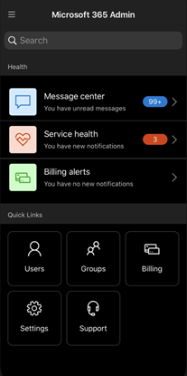
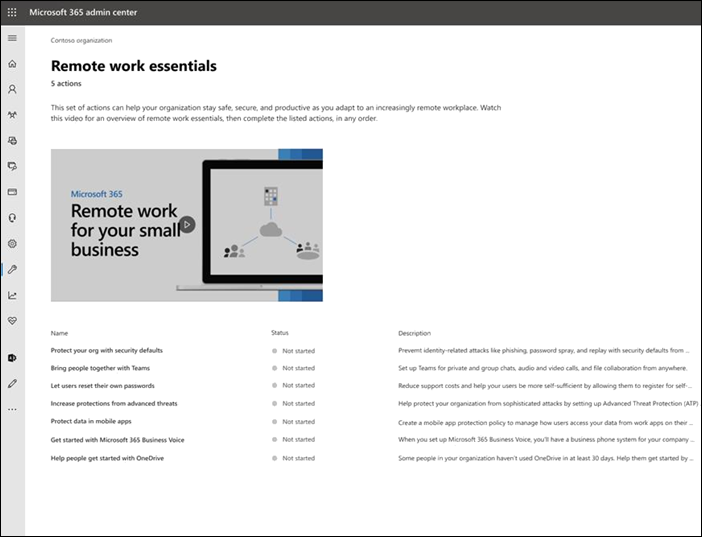

# Novedades de la Centro de administración de Microsoft 365

::: moniker range="o365-21vianet"

> [!NOTE]
> Es posible que parte de la información de este artículo no se aplique a Office 365 operados por 21Vianet.

::: moniker-end

Estamos agregando continuamente nuevas características a [la Centro de administración de Microsoft 365](Información general de la Centro de administración de Microsoft 365](admin-overview/admin-center-overview.md), solucionamos problemas que aprendemos y realizamos cambios en función de sus comentarios. Eche un vistazo a continuación para ver lo que está disponible para usted hoy. Algunas características se implantan a diferentes velocidades para nuestros clientes. Si aún no ve una característica, [intente agregarse a la versión de destino](manage/release-options-in-office-365.md).

Y si desea saber las novedades de otros servicios en la nube de Microsoft:

- [Novedades de Azure Active Directory](/azure/active-directory/fundamentals/whats-new)
- [Novedades del centro de administración de Exchange](/Exchange/whats-new)
- [Novedades de Microsoft Intune](/mem/intune/fundamentals/whats-new)
- [Novedades del portal de cumplimiento de Microsoft Purview](/Office365/SecurityCompliance/whats-new)
- [Novedades de Microsoft 365 Defender](../security/mtp/whats-new.md)
- [Novedades del centro de administración de SharePoint](/sharepoint/what-s-new-in-admin-center)
- [Actualizaciones de Office](/OfficeUpdates/)
- [Comprobación del estado de la versión de Windows](/windows/deployment/update/check-release-health)

## Marzo de 2022

### disponibilidad general de Microsoft 365 Lighthouse

Las pequeñas y medianas empresas suelen confiar en asociados de TI de confianza para administrar sus entornos de TI. Facilitamos a los asociados proteger a los clientes a escala con la disponibilidad general de [Microsoft 365 Lighthouse](https://aka.ms/March1SMBPartnerBlog), un portal de administración multiinquilino para proveedores de servicios administrados (MSP). Microsoft 365 Lighthouse proporciona una experiencia completa a los clientes al capacitar a sus asociados para identificar y actuar rápidamente sobre amenazas, inicios de sesión anómalos y alertas de cumplimiento de dispositivos para mantenerlos seguros.

:::image type="content" source="../media/lighthouse.png" alt-text="Captura de pantalla: panel de Microsoft 365 Lighthouse":::

Microsoft 365 Lighthouse solo es un servicio de asociados de TI y está disponible para los asociados que están inscritos en el programa Proveedor de soluciones en la nube (CSP) y administran clientes que tienen hasta 1000 usuarios con licencia con Microsoft 365 Empresa Premium, Microsoft 365 E3 o suscripciones de Microsoft Defender para Empresas (en versión preliminar). Si es un asociado de TI inscrito en CSP de Microsoft, Microsoft 365 Lighthouse está disponible sin costo para su organización y está diseñado para ayudar a su negocio a escalar y crecer. Consulte la [biblioteca de ayuda de Microsoft 365 Lighthouse](../lighthouse/m365-lighthouse-overview.md) para obtener más información.

Para empezar a usar Microsoft 365 Lighthouse, consulte [Registro para Microsoft 365 Lighthouse](../lighthouse/m365-lighthouse-sign-up.md). Para obtener más información sobre Microsoft 365 Lighthouse, Defender para empresas y Microsoft 365 Empresa Premium, [únase a nosotros en nuestra serie de seminarios web de asociados](https://aka.ms/M365MDBSeries).

## Febrero de 2022

### Conclusiones de encuestas de puntuación de promotor neto (NPS)

Ahora puede ver los datos e información de las encuestas de NPS de los usuarios en el Centro de administración de Microsoft 365. Con esta nueva característica, puede obtener información útil de las respuestas de encuestas NPS de los usuarios finales y lograr una mayor satisfacción de los usuarios finales abordando cualquier problema y preocupación.

En el centro de administración, vaya a **HealthProduct** >  feedback Insights (**Información** >  de **la encuesta deNPS).**

:::image type="content" source="../media/feedback-whatsnew.png" alt-text="Captura de pantalla: Mostrar la página Comentarios en el Centro de administración de Microsoft 365":::

Hemos identificado los temas comunes de los comentarios de los usuarios. A continuación, usamos técnicas de modelos de aprendizaje automático para entrenar los conjuntos de datos y organizar automáticamente los comentarios en temas principales.

Hay nueve temas disponibles. Busque más temas en futuras actualizaciones.

:::image type="content" source="../media/feedback-nine-topics.png" alt-text="Captura de pantalla: Se muestran los 9 nuevos temas de comentarios":::

El panel de información de la encuesta NPS también contiene estos tres nuevos informes y tablas dinámicas:

- Volumen de tendencias de NPS mensual de NPS durante los últimos 12 meses
- Capaz de identificar pasivos, promotores y detractores
- Volumen NPS por plataforma y aplicación

Para proporcionarle una mejor experiencia con el panel de información de encuestas de NPS:

- Anime a los usuarios finales a enviar comentarios
- Confirmación de que las directivas de encuestas en el producto están habilitadas
- Mejora del diagnóstico al activar Informe de errores de Windows

Obtenga más información en [comentarios e información de NPS del producto de Microsoft para su organización](manage/manage-feedback-product-insights.md).  

> [!NOTE]
> Si está interesado en unirse a nuestras sesiones de diseño, envíenos un correo electrónico a: prosight@microsoft.com

### Centro de administración de Microsoft 365 entrenamiento en vídeo

Hemos actualizado nuestro Centro de administración de Microsoft 365 entrenamiento en vídeo. Vaya a la página [Biblioteca de vídeos de aprendizaje del administrador](admin-video-library.yml) para obtener información sobre cómo configurar y administrar Microsoft 365 para su empresa.

:::image type="content" source="../media/admin-library-vid-training.png" alt-text="Captura de pantalla: Mostrar la biblioteca de entrenamiento de vídeo del centro de administración":::

## Julio de 2021

### Centro de administración de Microsoft 365 búsqueda

Ahora puede buscar identificadores de incidentes en el <a href="https://go.microsoft.com/fwlink/p/?linkid=2091030" target="_blank">Centro de administración de Microsoft 365</a>. Puede obtener información sobre los incidentes actuales a través de redes sociales, publicaciones del sector o de otros administradores. Ahora puede ir al Centro de administración para buscar más detalles sobre el incidente y comprender el impacto en su organización. Solo tiene que buscar el identificador de incidente en el centro de administración.

:::image type="content" source="../media/incident-id.png" alt-text="Captura de pantalla: Búsqueda del identificador de incidente en el centro de administración":::

### Información de incidencias de soporte técnico para organizaciones Premier

Hemos agregado 2 gráficos denominados Tendencia del **volumen** y **Tendencia del volumen por producto** para proporcionarle información visual sobre el volumen de soporte técnico.

El gráfico de alineación de la pestaña **Tendencia de volumen** resalta la tendencia si los casos de soporte técnico aumentan o disminuyen para su organización mes a mes. Puede mantener el puntero sobre el gráfico para comprobar el número de casos de soporte técnico creados en cada mes.

:::image type="content" source="../media/SuppInsight-voltrnd.PNG" alt-text="Captura de pantalla: Graph que resalta la tendencia si los casos de soporte técnico aumentan o disminuyen para su organización mes a mes":::

El gráfico **Tendencia de volumen por producto** muestra los tres productos principales de cada mes con los casos de soporte técnico más altos. Hemos habilitado el filtrado en la tabla y ahora puede filtrar los resultados por **Producto**, **Gravedad** y **Fecha**.

:::image type="content" source="../media/SuppInsight-voltrndproduct.PNG" alt-text="Captura de pantalla: Graph muestra los tres productos principales de cada mes con los casos de soporte técnico más altos":::

También hemos agregado 2 campos nuevos, **Gravedad** y **Fecha cerrada** en la tabla **Ver solicitud de servicio** para proporcionarle más información sobre los vales.

:::image type="content" source="../media/SuppInsight-date-sev.PNG" alt-text="Captura de pantalla: tabla que muestra la ordenación de vales de soporte técnico por gravedad y fecha.":::

Para consultar estas actualizaciones en <a href="https://go.microsoft.com/fwlink/p/?linkid=2166757" target="_blank">Centro de administración de Microsoft 365</a>, vaya a **Solicitudes del servicio SupportView**  >  en el panel de navegación izquierdo.

## Junio de 2021

### Centro de administración de Microsoft 365 búsqueda

Hemos agregado un par de nuevas categorías a la funcionalidad de búsqueda.

- Ahora puede buscar Microsoft 365 roles de administrador en búsqueda global y ver y administrar rápidamente las asignaciones de roles desde cualquier página. Por ejemplo, busque **Intune administrador**.

- Ahora puede encontrar experiencias de configuración simplificadas a través de búsqueda global. Esto puede ayudarle a usted y a su equipo a empezar a usar rápidamente nuevas características. Por ejemplo, busque **establecer la contraseña para que nunca expire**.

Para obtener más información sobre la búsqueda en el centro de administración, consulte [Buscar en el Centro de administración de Microsoft 365](manage/search-in-the-mac.md).

## Mayo de 2021

### Aplicación móvil de administración

### Realizar un seguimiento de las actualizaciones de vales de soporte técnico mediante la aplicación móvil Admin

Para todas las solicitudes de servicio creadas en el inquilino, ahora puede realizar un seguimiento del estado del vale, ver los detalles del vale y proporcionar o solicitar información adicional agregando notas & datos adjuntos.

:::image type="content" source="../media/Keep-track-support-ticket-updates2.PNG" alt-text="Captura de pantalla: Seguimiento de las actualizaciones de vales de soporte técnico":::

### Manténgase al tanto de todas las actualizaciones principales de la aplicación y su suscripción de Microsoft 365

- Manténgase al tanto de todas las actualizaciones principales de la suscripción Microsoft 365 a través de notificaciones push del Centro de mensajes (ahora habilitadas de forma predeterminada).

- Realice un seguimiento de las características más recientes disponibles en la aplicación mediante la sección **Novedades** . Vaya a **Configuración** > **¿Qué hay de nuevo?**

:::image type="content" source="../media/Stay-on-top-of-updates.PNG" alt-text="Captura de pantalla: Seguimiento de las principales actualizaciones y características":::

## Abril de 2021

### Aplicación móvil de administración

### Administración de licencias y facturas desde la aplicación móvil admin

- Ahora puede ver todas las licencias disponibles y asignadas para las suscripciones. También puede asignar o anular la asignación de licencias a los usuarios y agregar o quitar licencias.
- Ahora puede ver facturas detalladas en la aplicación.
- Estas actualizaciones están disponibles en dispositivos [Android](https://go.microsoft.com/fwlink/p/?linkid=2159786) e [iOS](https://go.microsoft.com/fwlink/p/?linkid=2159787) .

:::image type="content" source="../media/assign-license-mobile-app2.png" alt-text="Captura de pantalla: Página de asignación de licencias de la aplicación móvil de administración":::
:::image type="content" source="../media/license-screen-mobile-app2.png" alt-text="Captura de pantalla: Pantalla de aplicación móvil de administración con usuarios y sus licencias":::
:::image type="content" source="../media/invoice-summary-mobile-app.png" alt-text="Captura de pantalla: Página de resumen de factura de la aplicación móvil de administración":::

### Se ha actualizado la fuente del Centro de mensajes en la aplicación móvil Admin

- Ahora tiene una experiencia de lectura más flexible de la fuente del Centro de mensajes. Ahora tiene la capacidad de filtrar los mensajes en función del servicio o las etiquetas y marcar los mensajes como favoritos. También se han agregado acciones masivas para marcar mensajes como leídos, no leídos o archivados.
- Estas actualizaciones están disponibles en dispositivos [Android](https://go.microsoft.com/fwlink/p/?linkid=2159786) e [iOS](https://go.microsoft.com/fwlink/p/?linkid=2159787) .

:::image type="content" source="../media/mc-feed-mobile-app.png" alt-text="Captura de pantalla: Página de fuente del Centro de mensajes de la aplicación móvil de administración":::

## Ignite 2021 (marzo)

Bienvenido a Microsoft Ignite. Esperamos que haya podido asistir a algunas de nuestras sesiones: [Microsoft Ignite 2021](https://myignite.microsoft.com/sessions). Estas son algunas de las cosas de las que hablamos en Ignite.
> [!NOTE]
> No todas las características estarán disponibles para todos de inmediato. Si no ve las nuevas características, [únase a Versión dirigida](manage/release-options-in-office-365.md).

### Centro de mensajes

Hemos renovado el Centro de mensajes para ayudarle a detectar los mensajes pertinentes y hemos agregado una experiencia de lectura más flexible. Hemos agregado una nueva columna **Servicio** para ayudarle a examinar a qué servicio se aplica un mensaje y filtrar los mensajes por servicio y otros metadatos. Puede marcar como favorito un mensaje para marcarlo como seguimiento, elegir qué columnas aparecen en la lista de mensajes y navegar entre los mensajes con los botones atrás y siguiente. También hemos mejorado el proceso para que sea más fácil enviar comentarios sobre las publicaciones del Centro de mensajes.

:::image type="content" source="../media/message-center.png" alt-text="Captura de pantalla: Página principal del Centro de mensajes que muestra la bandeja de entrada y los mensajes":::

Para obtener más información sobre las nuevas características, consulte [Centro de](manage/message-center.md) mensajes.

### Novedades

Hemos realizado mejoras en la visualización de las características "Novedades" de los usuarios en las aplicaciones de Office. Ahora puede ver el contenido enriquecido en el panel Novedades que los usuarios pueden ver. También puede obtener más información sobre la característica antes de decidir que los usuarios conozcan la característica. Para obtener más información, consulta [Administrar qué características Office aparecen en Novedades](manage/show-hide-new-features.md).

:::image type="content" source="../media/power-bi-whats-new2.png" alt-text="Captura de pantalla: Office página novedades de las aplicaciones que muestran mejoras en Power BI":::

## Ignite 2020 (agosto & septiembre)

Bienvenido a Microsoft Ignite: nuestro primer Ignite solo en línea. Esperamos verlo en una de nuestras sesiones: Catálogo de sesiones [de Microsoft Ignite 2020](https://myignite.microsoft.com/sessions). Estas son solo algunas de las cosas de las que hablaremos en Ignite.
> [!NOTE]
> No todas las características estarán disponibles para todos de inmediato. Si no ve las nuevas características, [únase a Versión dirigida](manage/release-options-in-office-365.md).

### Administración multiinquilino

Hemos desarrollado un conjunto de características para administradores multiinquilino como usted para que su trabajo se realice de forma más rápida y eficaz. Para obtener más información, consulte [Administración de varios inquilinos](multi-tenant/manage.md).

- **Sus inquilinos**: cambie rápidamente entre los inquilinos que administra.
- **Todos los inquilinos**: página nueva en la que puede ver rápidamente el estado de todos los servicios de los inquilinos, las solicitudes de servicio abiertas, los productos y la facturación, las tareas de configuración recomendadas y el número de usuarios de ese inquilino.
- **Programa de instalación**: la página configuración multiinquilino proporciona una vista de lista de la página Configuración, pero organizada para muchos inquilinos. Puede ver qué características no están activadas, qué tareas se completan para todos los inquilinos, tareas que los inquilinos todavía deben completar. Esta vista le ayudará a realizar un seguimiento de la adopción de características y a asegurarse de que las tareas de configuración de seguridad recomendadas siempre se realizan.
- **Estado del servicio**: la vista estado del servicio muestra si algún incidente o aviso afecta a los inquilinos. Incluso le indicará cuántos de los inquilinos administrados se ven afectados. Solo tiene que seleccionar un incidente para obtener más información en la pestaña Información general y, a continuación, cambiar a la pestaña Inquilinos afectados para explorar en profundidad y admitir ese inquilino.
- **Las migraciones de buzones entre inquilinos** son un nuevo servicio, ahora en versión preliminar pública, que permite mover buzones entre inquilinos sin necesidad de desconectar y, a continuación, incorporar buzones. 
- **Uso compartido de dominios entre inquilinos**: pronto puede unirse a una versión preliminar privada para obtener funcionalidades que le permitan compartir un dominio entre varios inquilinos. Por ejemplo, si Contoso adquiere Wingtip Toys, Contoso puede compartir el dominio con Wingtip Toys para que los usuarios de ambos inquilinos puedan usar "contoso.com" como direcciones de correo electrónico.

### Supervisión de las cuentas más importantes

Puede supervisar y realizar un seguimiento de los mensajes de correo electrónico con errores o diferidos enviados a los usuarios que tienen un alto impacto empresarial, como el director general. Para realizar un seguimiento de las cuentas de prioridad, agregue usuarios a la lista de cuentas de prioridad en el <a href="https://go.microsoft.com/fwlink/p/?linkid=2024339" target="_blank">Centro de administración de Microsoft 365</a>. Agregue ejecutivos, líderes, administradores u otros usuarios que tengan acceso a información confidencial o de alta prioridad.

Las cuentas de prioridad solo están disponibles para las organizaciones que cumplen los dos requisitos siguientes:

- Office 365 E3 o Microsoft 365 E3, o Office 365 E5 o Microsoft 365 E5.
- Al menos 10 000 licencias y al menos 50 usuarios activos mensualmente Exchange Online.

Hay dos maneras de empezar:

- Vaya a **Usuarios** y, a continuación, en el menú tres puntos (más acciones), seleccione **Administrar cuentas de prioridad** para agregar usuarios a la lista.
- Vaya a **Configuración**, busque la tarea **de configuración Supervisión de las cuentas más importantes** y, a continuación, seleccione **Comenzar**.

Para obtener más información sobre las cuentas prioritarias, consulte [Supervisión de cuentas de prioridad](./setup/priority-accounts.md).

### Buscar más rápido y obtener mejores resultados de cualquier página

Hemos empezado a implementar una nueva experiencia de búsqueda para el centro de administración y no podemos esperar a que la pruebes. 

- El cuadro Buscar se ha movido al área de encabezado donde dice "Centro de administración de Microsoft 365" para que ahora busque desde cualquier página, no solo desde la página principal. Incluso tenemos un acceso directo: **Alt+S**.
- La búsqueda es más inteligente y le dará mejores resultados, incluso más rápido. Pruebe a escribir "2fa" para empezar.
- Los resultados de la búsqueda se organizan según el tipo de elemento o acción que puede realizar.
  - **Usuarios**: seleccione el nombre del usuario y puede editarlo allí mismo. Si selecciona el menú de tres puntos (más acciones) junto a su nombre, puede restablecer su contraseña. Puede buscar por nombre para mostrar, apellidos, nombre, nombre de usuario o dirección de correo electrónico principal y alias de correo electrónico. Pero para obtener una coincidencia exacta, busque por dirección de correo electrónico principal o nombre de usuario.
  - **Grupos**: edite el grupo desde cualquier página, agregue miembros y asigne propietarios.
  - **Acciones**: de forma similar a cómo puede buscar un usuario y, a continuación, restablecer su contraseña, también puede buscar "restablecer contraseña" desde cualquier página y, a continuación, restablecer una o varias contraseñas para los usuarios.
  - **Navegación**: los resultados en Navegación pueden ayudarle a llegar rápidamente a una página en el centro de administración. Por ejemplo, la búsqueda de "roles" le llevará a la página Roles para Azure AD roles.
  - **Configuración**: busque cualquier configuración relacionada con su organización, los servicios a los que se suscribe y la configuración de seguridad y privacidad. 
  - **Dominios**: puede encontrar vínculos rápidos a los dominios y, a continuación, el vínculo le llevará a la página Información general y estado de ese dominio.
  - **Documentación**: si no podemos encontrar un resultado para usted, intentaremos encontrar documentación que le ayude. La lista de artículos seleccionados tarda un poco más en encontrar una coincidencia, así que espere un segundo para que Search encuentre los resultados. 
  - **Comentarios**: ¿No encontró lo que estaba buscando? Envíenos comentarios desde La búsqueda. Agregaremos la funcionalidad de búsqueda para más páginas y más características en el centro de administración.

### Microsoft 365 aplicación móvil de administración

La [aplicación móvil Microsoft 365 admin](https://www.microsoft.com/microsoft-365/business/manage-office-365-admin-app), que se incluye con su suscripción, le permite administrar Microsoft 365 desde el dispositivo móvil para que pueda alejarse de su escritorio para realizar tareas diarias. De hecho, hay más de 90 características en la aplicación y acabamos de agregar algunas más:

- **Compatibilidad con las directivas de administración de aplicaciones móviles y acceso condicional de Microsoft Intune**: ahora puede usar su dispositivo personal para administrar Microsoft 365 incluso si su organización ha activado las directivas de acceso condicional y administración de aplicaciones móviles de Intune.
- **Notificaciones del centro** de mensajes: active las notificaciones del centro de mensajes en **Configuración** >  **Notifications** si desea recibir alertas sobre las nuevas publicaciones del centro de mensajes. A través de las notificaciones, queremos asegurarnos de que se mantiene informado sobre información importante y eventos en todo el inquilino.
- **Alertas de facturación**: también puede activar las notificaciones de facturación en **Configuración** >  **Notifications** si desea obtener notificaciones de facturación en el dispositivo si una suscripción está a punto de expirar.
- **Modo oscuro**: bienvenido al lado oscuro de la aplicación móvil. Esta era una de nuestras características más solicitadas. Vaya a **Configuración** >  **Themes** para activarlo.
- **Notificar un problema**: ahora puede notificar un problema en la aplicación o ver los problemas notificados por otros administradores. Visite **Estado del servicio** para comprobarlo.

### Recomendaciones de uso para pequeñas y medianas empresas

Las pequeñas y medianas empresas pueden obtener una recomendación en la página **inicio** si algunas de las personas de la organización no usan activamente aplicaciones de Teams, OneDrive o Office. Cuando vea la recomendación, puede enviar rápidamente un correo electrónico de entrenamiento de Microsoft a los usuarios inactivos para ayudarles a empezar a trabajar con la aplicación y asegurarse de que obtiene el valor completo de las suscripciones.

### Colección de trabajo remoto

En octubre, agregaremos una colección de trabajo remota para ayudar a los propietarios de pequeñas empresas y a su personal a conectarse y trabajar de forma remota.  **La configuración de elementos esenciales del trabajo remoto** es una lista de todas las características que Microsoft recomienda para habilitar de forma segura el trabajo remoto y colaborar de forma eficaz. En un par de semanas, puede probarlo en **SetupRemote work essentials (Aspectos básicos del trabajo de SetupRemote** > ).

Para obtener más información sobre cómo permitir de forma segura el trabajo remoto y una dirección web práctica fácil de recordar y compartir, vaya a [aka.ms/remote-business](https://aka.ms/remote-business).

### ¿Necesita ayuda? pasar a más centros de administración

Estamos examinando y actualizando continuamente el contenido y las herramientas para mantenerse al día con los cambios en el producto. Ahora tenemos muchas más herramientas de diagnóstico de autoservicio para ayudarle a resolver problemas de forma rápida y eficaz. Estos son algunos que se agregaron recientemente:

- Cambiar la directiva de limitación del servicio web de Exchange
- Comprobación del estado del aprovisionamiento y validación de Teams a usuarios específicos
- Corrección de problemas de instalación de DKIM
- Diagnóstico Intune errores de inscripción de usuarios

Y estamos implementando la nueva y mejorada experiencia de soporte técnico que ya ve en la <a href="https://go.microsoft.com/fwlink/p/?linkid=2166757" target="_blank">Centro de administración de Microsoft 365</a> a algunos de los otros centros de administración. Teams centro de administración y los centros de administración de seguridad y cumplimiento ya tienen esta nueva experiencia. Y pronto, **Exchange centro de administración**, **SharePoint centro de administración** y **Office.com** se actualizarán junto con esta nueva experiencia de ayuda para administradores.

### Administración de cambios con Microsoft Planner

En mayo, anunciamos que pronto podrá sincronizar las publicaciones del Centro de mensajes con Microsoft Planner y ahora está disponible para todos los usuarios.  Ahora puede crear tareas a partir de mensajes, asignarlas y realizar un seguimiento de ellas hasta su finalización. La primera vez, seleccione **La sincronización de Planner** deberá conectarse al plan adecuado.

Para más información, consulte este artículo y vídeo para ver cómo funciona: [Seguimiento de las publicaciones del centro de mensajes en Planner](/Office365/Planner/track-message-center-tasks-planner)

### Documentación, entrenamiento y vídeos

- Nuevo y justo a tiempo para Microsoft Ignite: [El centro virtual](https://adoption.microsoft.com/virtual-hub/). Profundización en la formación técnica para profesionales y desarrolladores de TI. Encuentre rápidamente alrededor de 20 vídeos nuevos como parte de #SIDETRACKED, el nombre de la pista de administración de Ignite este año.
- [Novedades de Microsoft 365](https://www.youtube.com/watch?v=OVjb2lGJ4GU&t=2s) serie de vídeos: este mes se tratan las nuevas características disponibles en Whiteboard para Teams y en la web, cómo automatizar el aprovisionamiento de usuarios para Azure AD, nuevos desencadenadores de Power Automate y acciones en Teams, etc. Y manténgase atento para el próximo mes, donde tendremos un resumen de todas las grandes cosas que suceden en Ignite!
- Hemos rediseñado la página de [documentación de Microsoft 365](/microsoft-365) que se centra primero en las soluciones. Destacaremos las nuevas soluciones a medida que estén disponibles en esta página, por lo que debe estar atento.

## Julio de 2020

### Preparación para Ignite 2020

A medida que vamos a pasar a la temporada de Ignite en Microsoft, no publicamos tantas características para que tengamos mucho de qué hablar durante nuestras sesiones.

La siguiente actualización de este artículo será el día de apertura de nuestro primer Ignite solo en línea. ¡Y este año, es gratis asistir! Compruébalo, regístrese: [Microsoft Ignite 2020](https://www.microsoft.com/ignite).

### Sus productos

Se ha realizado mucho trabajo en la administración de suscripciones para que la página sea más rápida de cargar, más rápido para encontrar lo que está buscando y para cumplir los estándares de accesibilidad web ([directrices WCAG 2.1](http://www.w3.org/TR/WCAG21/)).

- **Rediseño de tabla**: la tabla se ha rediseñado para que pueda agrupar suscripciones similares. Vaya a **Facturación** >  **Sus productos**.
- **Detalles del producto**: para obtener más detalles que nunca sobre las suscripciones, seleccione el producto en la lista.
- **Hágalo todo desde aquí**: Y no tiene que ir a saltar varias páginas para administrar un producto. Por ejemplo, si necesita cancelar una suscripción, el panel se abrirá para realizar la acción allí.

### Dominios

La administración de dominios puede ser complicada y hemos publicado una nueva característica para que sea más fácil. Vaya a dominios Configuración > y, a continuación, seleccione un dominio para obtener más información sobre el dominio y el estado del dominio.

:::image type="content" source="../media/MAC-WN-DomainDNS.PNG" alt-text="Página de detalles de dominios para contoso.com.":::

### Documentos, aprendizaje y vídeos (julio de 2020)

[Novedades de Microsoft 365](https://youtu.be/m1Nu8WJgCDY) serie de vídeos: este mes, se trata la nueva experiencia de Yammer para web y móvil, cómo integrar la aplicación Yammer Communities para Microsoft Teams, nuevos paquetes de directivas para admitir firstline workers y administradores, etc.

## Junio de 2020

### Mantenerse al día con Office administración de novedades

Hace unos meses, agregamos una configuración que le permite administrar los mensajes novedades que aparecen en las aplicaciones de Office de un usuario. Este mes, publicamos una nueva tarjeta de página principal que le ayudará a actuar rápidamente y a realizar un seguimiento de los mensajes **novedades** que desea mostrar a los usuarios de su organización.

### Documentos, aprendizaje y vídeos (junio)

- [Introducción a Teams](https://support.microsoft.com/office/6723dc43-dbc0-46e6-af49-8a2d1c5cb937)

## Mayo de 2020

### Nuevo canal de actualización para Office

El 12 de mayo anunciamos la disponibilidad de un nuevo canal de actualización para Office: Monthly Enterprise Channel. Este canal de actualización proporciona a los usuarios nuevas características de Office una vez al mes, el segundo martes del mes.

Si permite que los usuarios instalen automáticamente Office desde el portal, puede seleccionar Canal de Enterprise mensual para ellos. Para ello, inicie sesión en el Centro de administración de Microsoft 365 y vaya a **Mostrar todo** > **Configuración** >  **Configuración deOrgServicios** >  >  **Office configuración de descarga de software**. Si selecciona **Una vez al mes (canal de Enterprise mensual),** las nuevas autoinstalaciones de Office se configurarán para usar el canal de Enterprise mensual.

Junto con el lanzamiento de Monthly Enterprise Channel, también estamos revisando los nombres de los canales de actualización existentes. Por ejemplo, se cambia el nombre del canal mensual a Canal actual. Los nuevos nombres surten efecto el 9 de junio de 2020.

Para más información, consulte [Cambios en canales de actualización para las Aplicaciones de Microsoft 365](/DeployOffice/update-channels-changes).

### Nuevos roles de administrador

Hemos agregado algunos roles de administrador de Azure Active Directory nuevos a la <a href="https://go.microsoft.com/fwlink/p/?linkid=2024339" target="_blank">Centro de administración de Microsoft 365</a>.

- El rol de administrador de identidad híbrida proporciona a los usuarios permiso para administrar los servicios de aprovisionamiento y autenticación en la nube.
- El rol de administrador de red permite a los usuarios administrar ubicaciones de red y revisar información de red para Microsoft 365 aplicación software como servicio.
- El rol de administrador de impresoras concede permiso para administrar todos los aspectos de las impresoras y las conexiones de impresora.
- El técnico de impresora es un subconjunto del rol de administrador de impresoras en el que esos usuarios pueden registrar y anular el registro de impresoras y actualizar el estado de la impresora.
Para obtener más información sobre estos roles, consulte [Acerca de los roles de administrador](./add-users/about-admin-roles.md).

### Exportar lista de grupos

Hemos oído de muchos administradores que necesitan compartir información sobre los grupos y su uso con personas que no tienen acceso a los centros de administración. Ahora puede exportar la lista Grupos a un archivo CSV con fines de auditoría, lo que significa que puede lanzar ese script de PowerShell antiguo. Para probarlo, vaya a **GruposGrupos** >  y seleccione **Exportar grupos** en la barra de comandos.

### Centro de soluciones y arquitectura de Microsoft 365

Justo este mes, publicamos un nuevo sitio en docs.microsoft.com denominado [centro de arquitectura y solución Microsoft 365](../solutions/index.yml), que reúne las instrucciones técnicas que necesita para comprender, planear e implementar soluciones de Microsoft 365 integradas para una colaboración segura y compatible. En este centro, encontrará lo siguiente:

- Guía básica de la solución
- Soluciones de carga de trabajo e instrucciones de escenarios
- Ilustraciones de solución y arquitectura (los pósteres!!!)
- Guía específica del sector
- Enterprise entidades de seguridad de diseño de arquitectura

### Documentos, entrenamiento y vídeos (mayo)

- **Novedades de Microsoft 365 serie de vídeos**: este mes, se trata la nueva experiencia de soporte técnico en los centros de administración y seguridad y cumplimiento de Teams, la integración de Planner con el Centro de mensajes y el nuevo diseño de vídeo 3x3 en Microsoft Teams. 
- Se actualizó la página del centro de [ayuda Centro de administración de Microsoft 365](./index.yml) para ayudarle a encontrar lo que necesita más rápidamente. Y si ves esa página en este momento, hemos agregado una tarjeta para informarte de actualizaciones y cambios importantes.
