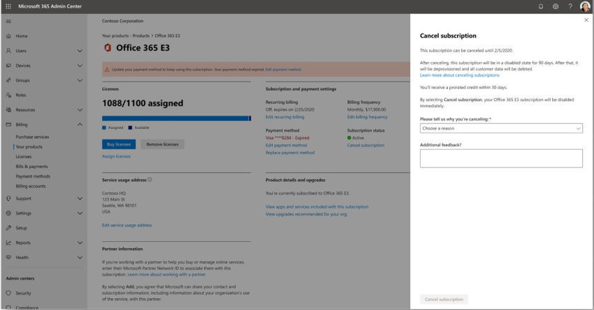
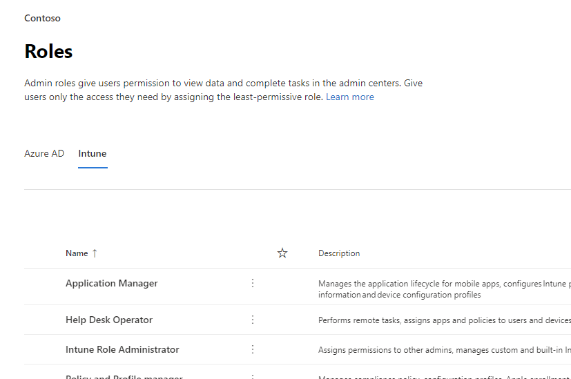

# Novedades del Centro de administración de Microsoft 365What's new in the Microsoft 365 admin center

::: moniker range="o365-21vianet"

> [!NOTE]
> Es posible que parte de la información de este artículo no se aplique a Office 365 operado por 21Vianet.Some of the information in this article might not apply to Office 365 operated by 21Vianet.

::: moniker-end

We're continuously adding new features to [the Microsoft 365 admin center,](microsoft-365-admin-center-preview.md)fixing issues we learn about, and making changes based on your feedback.We're continuously adding new features to [the Microsoft 365 admin center](microsoft-365-admin-center-preview.md), fixing issues we learn about, and making changes based on your feedback. Echa un vistazo a continuación para ver lo que está disponible para ti en la actualidad.Take a look below to see what's available for you today. Algunas características se implantan a distintas velocidades para nuestros clientes.Some features get rolled out at different speeds to our customers. Si aún no ve una característica, pruebe a agregarse a [la versión dirigida.](manage/release-options-in-office-365.md)If you aren't seeing a feature yet, [try adding yourself to targeted release](manage/release-options-in-office-365.md).

Y si quieres saber las novedades de otros servicios en la nube de Microsoft:And if you'd like to know what's new with other Microsoft cloud services:

- [Novedades de Azure Active DirectoryWhat's new in Azure Active Directory](https://docs.microsoft.com/azure/active-directory/fundamentals/whats-new)
- [Novedades del Centro de administración de ExchangeWhat's new in the Exchange admin center](https://docs.microsoft.com/Exchange/whats-new)
- [Novedades de Microsoft IntuneWhat's new in Microsoft Intune](https://docs.microsoft.com/mem/intune/fundamentals/whats-new)
- [Novedades del Centro de cumplimiento de Microsoft 365What's new in the Microsoft 365 compliance center](https://docs.microsoft.com/Office365/SecurityCompliance/whats-new)
- [Novedades de Microsoft 365 DefenderWhat's new in Microsoft 365 Defender](https://docs.microsoft.com/microsoft-365/security/mtp/whats-new)
- [Novedades del Centro de administración de SharePointWhat's new in the SharePoint admin center](https://docs.microsoft.com/sharepoint/what-s-new-in-admin-center)
- [Actualizaciones de OfficeOffice updates](https://docs.microsoft.com/OfficeUpdates/)

## Ignite 2020 (agosto & septiembre)Ignite 2020 (August & September)

Bienvenido a Microsoft Ignite: nuestro primer Ignite solo en línea.Welcome to Microsoft Ignite - our first online-only Ignite. Esperamos verlo en una de nuestras sesiones: Catálogo de sesiones de [Microsoft Ignite 2020](https://myignite.microsoft.com/sessions).We hope to see you in one of our sessions: [Microsoft Ignite 2020 Session Catalog](https://myignite.microsoft.com/sessions). Estas son solo algunas de las cosas de las que hablaremos en Ignite.Here's just a few of the things we'll be talking about at Ignite. 
> [!NOTE]
> No todas las características estarán disponibles para todos los usuarios inmediatamente.Not all features are going to be available to everyone right away. Si no ve las nuevas características, únase [a la versión dirigida.](manage/release-options-in-office-365.md)If you aren't seeing the new features, [join Targeted Release](manage/release-options-in-office-365.md).

### Administración multiinquilinoMulti-tenant management

Hemos desarrollado un conjunto de características para administradores multiinquilino, como usted, para que el trabajo se haga de forma más rápida y eficaz.We've developed a set of features for multi-tenant admins like you to get your job done faster and more efficiently. Para obtener más información, vea [Administrar varios inquilinos.](multi-tenant/manage.md)For more information, see [Manage multiple tenants](multi-tenant/manage.md).

- **Sus inquilinos:** cambie rápidamente entre los inquilinos que administra.**Your tenants**: Quickly switch between the tenants you manage.
- Todos los **inquilinos:** una nueva página donde puede ver rápidamente el estado de todos los servicios de sus inquilinos, las solicitudes de servicio abiertas, los productos y la facturación, las tareas de configuración recomendadas y el número de usuarios de ese inquilino.**All tenants**: A new page where you can quickly see the health of all your tenants' services, any open service requests, your products and billing, recommended setup tasks, and the number of users in that tenant.
- **Configuración:** la página de instalación multiinquilino le ofrece una vista de lista de la página de instalación, pero organizada para muchos inquilinos.**Setup**: The multi-tenant Setup page gives you a list view of the Setup page, but organized for many tenants. Puede ver qué características no están activadas, qué tareas se completan para todos los inquilinos, tareas que los inquilinos aún necesitan completar.You can see which features aren't turned on, which tasks are complete for all tenants, tasks that tenants still need to complete. Esta vista le ayudará a realizar un seguimiento de la adopción de características y a asegurarse de que siempre se realizan las tareas de configuración de seguridad recomendadas.This view will help you keep track of feature adoption and to make sure the recommended security setup tasks are always done.
- **Estado del** servicio: la vista de estado del servicio muestra si algún incidente o aviso está afectando a los inquilinos.**Service health**: The service health view shows you if any incidents or advisories are affecting the tenants. Incluso le dirá cuántos de los inquilinos administrados se ven afectados.It will even tell you how many of your managed tenants are affected. Solo tiene que seleccionar un incidente para obtener más información en la pestaña información general y, a continuación, cambiar a la pestaña Inquilinos afectados para explorar en profundidad y dar soporte técnico a ese inquilino.Just select an incident to get more information on the overview tab, then switch over to the Tenants affected tab to drill down and support that tenant.
- **Las migraciones de buzones** entre inquilinos son un nuevo servicio, ahora en versión preliminar pública, que le permite mover buzones entre inquilinos sin necesidad de quitar y, a continuación, incorporar buzones.**Cross-tenant mailbox migrations** is a new service, now in public preview, that lets you move mailboxes between tenants without the need to offboard and then onboard mailboxes. 
- **Uso compartido de dominios entre** inquilinos: pronto, puede unirse a una vista previa privada de las funcionalidades que le permiten compartir un dominio entre varios inquilinos.**Cross-tenant domain sharing**: Soon, you can join a private preview for capabilities that allow you to share a domain across multiple tenants. Por ejemplo, si Contoso adquiere Wingtip Toys, Contoso puede compartir el dominio con Wingtip Toys para que los usuarios de ambos inquilinos puedan usar "contoso.com" como direcciones de correo electrónico.For example, if Contoso acquires Wingtip Toys, Contoso can share the domain with Wingtip Toys so that people in both tenants can use "contoso.com" as their email addresses.

### Supervisar las cuentas más importantesMonitor your most important accounts

Puede supervisar y realizar un seguimiento de los mensajes de correo electrónico con errores o retrasos enviados a los usuarios que tienen un alto impacto empresarial, como su director general.You can monitor and track failed or delayed email messages sent to your users who have a high business impact, like your CEO. Puede realizar un seguimiento de las cuentas de prioridad agregando usuarios a la lista de cuentas de prioridad en el Centro de administración de Microsoft 365.You track priority accounts by adding users to your priority accounts list in the Microsoft 365 admin center. Agregue ejecutivos, líderes, administradores u otros usuarios que tengan acceso a información confidencial o de prioridad alta.Add executives, leaders, managers, or other users who have access to sensitive or high priority information.

Las cuentas de prioridad solo están disponibles para las organizaciones que cumplen los dos requisitos siguientes:Priority accounts are only available to organizations that meet both of the following requirements:

- Office 365 E3, Microsoft 365 E3, Office 365 E5 o Microsoft 365 E5.Office 365 E3 or Microsoft 365 E3, or Office 365 E5 or Microsoft 365 E5.
- Al menos 10 000 licencias y al menos 50 usuarios activos mensuales de Exchange Online.At least 10,000 licenses and at least 50 monthly active Exchange Online users.

Hay dos formas de empezar:There are two ways to get started:

- Vaya a **Usuarios** y, a continuación, en el menú "Más acciones",  seleccione Administrar cuentas de prioridad para agregar usuarios a la lista.Go to **Users**, and then in the "more actions" menu select **Manage priority accounts** to add users to the list.
- Vaya a **Instalación,** busque la tarea de instalación **Supervisar las cuentas más** importantes y, a continuación, seleccione **Introducción.**Go to **Setup**, find the setup task **Monitor your most important accounts**, and then select **Get started**.

Para obtener más información sobre las cuentas de prioridad, consulte [Supervisión de cuentas de prioridad.](https://docs.microsoft.com/microsoft-365/admin/setup/priority-accounts)For more info on priority accounts, check out [Monitoring priority accounts](https://docs.microsoft.com/microsoft-365/admin/setup/priority-accounts).

### Buscar más rápido y obtener mejores resultados desde cualquier páginaSearch faster and get better results from any page

We've started rolling out a new Search experience for the admin center, and we can't wait for you to try it out. Alt+S to search from any page.](../media/MAC-WN-GlobalSearch.png)

- El cuadro de búsqueda se movió al área de encabezado donde dice "Centro de administración de Microsoft 365" para que ahora busque desde cualquier página, no solo la página principal.The Search box moved to the header area where it says "Microsoft 365 admin center" so you now search from any page, not just the Home page. Incluso tenemos un acceso directo: **Alt+S**.We've even got a shortcut: **Alt+S**.
- La búsqueda es más inteligente y le dará mejores resultados, incluso más rápido.Search is smarter and will give you better results, even faster. Pruebe a escribir "2fa" para empezar.Try typing "2fa" to get started.
- Los resultados de la búsqueda se organizan por el tipo de elemento o acción que puede realizar.Search results are organized by the type of item or action you can take.
  - **Usuarios:** seleccione el nombre del usuario y puede editarlo directamente.**Users**: Select the user's name and you can edit that user right there. Si selecciona el menú "más acciones" junto a su nombre, puede restablecer su contraseña.If you select the "more actions" menu next to their name, you can reset their password. Puede buscar por nombre para mostrar, apellidos, nombre, nombre de usuario o dirección de correo electrónico principal y alias de correo electrónico.You can search by display name, last name, first name, username or primary email address, and email aliases. Pero para obtener una coincidencia exacta, busque por dirección de correo electrónico principal o nombre de usuario.But to get an exact match, search by primary email address or username.
  - **Grupos:** edite el grupo desde cualquier página, agregue miembros y asigne propietarios.**Groups**: Edit the group from any page, add members, assign owners.
  - **Acciones:** de forma similar a cómo puede buscar un usuario y, a continuación, restablecer su contraseña, también puede buscar "restablecer contraseña" desde cualquier página y, a continuación, restablecer una o más contraseñas para los usuarios.**Actions**: Similar to how you can search for a user and then reset their password, you can also search "reset password" from any page and then reset one or more passwords for users.
  - **Navegación:** los resultados en Navegación pueden ayudarle rápidamente a acceder a una página en el centro de administración rápidamente.**Navigation**: Results under Navigation can quickly help you get to a page in the admin center quickly. Por ejemplo, la búsqueda de "roles" le llevará a la página Roles para los roles de Azure AD.For example, searching "roles" will take you to the Roles page for Azure AD roles.
  - **Configuración:** busque cualquier configuración relacionada con su organización, los servicios a los que se suscriba y la configuración de seguridad y privacidad.**Settings**: Search for any setting related to your organization, the services you subscribe to, and security and privacy settings. 
  - **Dominios:** puede encontrar vínculos rápidos a sus dominios y, a continuación, el vínculo le llevará a la página Información general y estado de ese dominio.**Domains**: You can find quick links to your domains, and then the link will take you to that domain's Overview and health page.
  - **Documentación:** si no podemos encontrar un resultado para usted, intentaremos encontrar documentación para ayudarle.**Documentation**: If we can't find a result for you, we'll try to find some documentation to help. La lista de artículos seleccionados tarda un poco más en encontrar una coincidencia, así que espere un segundo para que la búsqueda encuentre los resultados.It takes a little longer for the curated list of articles to find a match, so wait a second to let Search find the results. 
  - **Comentarios:**¿No encontró lo que estaba buscando?**Feedback**: Didn't find what you were looking for? Envíenos sus comentarios desde La búsqueda.Send us feedback from Search. Agregaremos la funcionalidad de búsqueda para más páginas y más características en el centro de administración.We will add searching functionality for more pages and more features across the admin center.

### Aplicación móvil de administración de Microsoft 365Microsoft 365 admin mobile app

La aplicación móvil de administración de [Microsoft 365,](https://www.microsoft.com/microsoft-365/business/manage-office-365-admin-app)que se incluye con su suscripción, le permite administrar Microsoft 365 desde su dispositivo móvil para que pueda salir de su escritorio para realizar tareas diarias.The [Microsoft 365 admin mobile app](https://www.microsoft.com/microsoft-365/business/manage-office-365-admin-app), which is included with your subscription, lets you manage Microsoft 365 from your mobile device so you can get away from your desk to do every day tasks. De hecho, hay más de 90 características en la aplicación y solo agregamos algunas más:In fact, there are over 90 features in the app--and we just added a few more:

- Compatibilidad con las directivas de administración de aplicaciones móviles y acceso condicional de **Microsoft Intune:** ahora puede usar su dispositivo personal para administrar Microsoft 365 incluso si su organización ha activado la administración de aplicaciones móviles y las directivas de acceso condicional de Intune.**Support for Microsoft Intune's Mobile Application Management and Conditional Access policies**: You can now use your personal device to manage Microsoft 365 even if your org has turned on Intune's Mobile Application Management and conditional access policies.
- **Notificaciones del centro de mensajes:** active las notificaciones del centro de mensajes en notificaciones de configuración si desea recibir una alerta sobre las nuevas publicaciones  >   del centro de mensajes.**Message center notifications**: Turn on message center notifications at **Settings** > **Notifications** if you wish to be alerted about new message center posts. A través de las notificaciones, queremos asegurarnos de que está informado sobre información y eventos importantes en todo el espacio empresarial.Through notifications, we want to ensure you stay informed about important information and events across your tenant.
- **Alertas de** facturación: también puedes activar las notificaciones de facturación en notificaciones de configuración si quieres recibir notificaciones de facturación en el dispositivo si una suscripción está a punto  >   de expirar.**Billing alerts**: You can also turn on billing notifications at **Settings** > **Notifications** if you want to get billing notifications on your device if a subscription is about to expire.
- **Modo oscuro:** bienvenido al lado oscuro de la aplicación móvil.**Dark mode**: Welcome to the dark side of the mobile app. Esta era una de las características más solicitadas.This was one of our most requested features. Ve a **Temas**  >  **de configuración** para activarlo.Go to **Settings** > **Themes** to turn it on.
- **Notificar un problema:** ahora puedes informar de un problema en la aplicación o ver los problemas notificados por otros administradores.**Report an issue**: You can now report an issue in the app or view issues reported by other admins. Visite **el estado del** servicio para comprobarlo.Visit **Service health** to check it out.

### Recomendaciones de uso para pequeñas y medianas empresasUsage recommendations for small and medium businesses

Es posible que las pequeñas  y medianas empresas reciban una recomendación en la página principal si algunas de las personas de la organización no usan activamente teams, OneDrive u aplicaciones de Office.Small and medium businesses might get a recommendation on the **Home** page if some of the people in the org aren't actively using Teams, OneDrive, or Office apps. Cuando vea la recomendación, puede enviar rápidamente un correo electrónico de aprendizaje de Microsoft a los usuarios inactivos para ayudarles a empezar a usar la aplicación y asegurarse de que obtiene todo el valor de las suscripciones.When you view the recommendation, you can quickly email Microsoft training to inactive users to help them get started with the app and to make sure you are getting the full value from your subscriptions.

### Colección de trabajo remotoRemote work collection

En octubre, agregaremos una colección de trabajo remoto para ayudar a los propietarios de pequeñas empresas y a su personal a entrar en línea y trabajar de forma remota.In October, we'll be adding a remote work collection to help small business owners and their staff get online and working remotely.  **La configuración de elementos básicos del** trabajo remoto es una lista protegida de todas las características que Microsoft recomienda para habilitar de forma segura el trabajo remoto y colaborar de forma eficaz.**Remote work essentials** setup is a curated list of all features Microsoft recommends to securely enable remote work and to collaborate effectively. En un par de semanas, puede probarlo en Setup  >  **Remote work essentials**.In a couple of weeks, you can try it out in **Setup** > **Remote work essentials**.

Para obtener más información acerca de cómo permitir de forma segura el trabajo remoto y una dirección web práctica que sea fácil de recordar y compartir, vaya a [aka.ms/remote-business](https://aka.ms/remote-business).For more information about how to securely allow remote work and a handy web address that's easy to remember and share, go to [aka.ms/remote-business](https://aka.ms/remote-business).

### ¿Necesita ayuda? mover a más centros de administraciónNeed help? moving to more admin centers

Estamos observando y actualizando continuamente el contenido y las herramientas para mantenerse al día con los cambios en el producto.We're continuously looking at and updating the content and tools to keep up with changes in the product. Ahora tenemos muchas más herramientas de diagnóstico de autoservicio para ayudarle a resolver problemas de forma rápida y eficaz.We now have many more self-serve diagnostic tools to help you resolve issues quickly and efficiently. Estas son algunas de las que se agregaron recientemente:Here are a few that were recently added:

- Cambiar la directiva de limitación del servicio web de ExchangeChange your Exchange Web Service throttling policy
- Comprobación del estado de aprovisionamiento y validación de Teams para usuarios específicosChecking status of Teams provisioning and validation to specific users
- Corregir problemas de configuración de DKIMFix DKIM setup issues
- Diagnosticar errores de inscripción de usuarios de IntuneDiagnose Intune user enrollment errors

Y estamos implementando la nueva y mejorada experiencia de soporte técnico que ya ve en el Centro de administración de Microsoft 365 para algunos de los otros centros de administración.And we are rolling out the new and improved support experience you already see in the Microsoft 365 admin center to some of the other admin centers. El Centro de administración de Teams y los Centros de administración de seguridad y cumplimiento ya tienen esta nueva experiencia.Teams Admin Center and Security and Compliance Admin Centers already have this new experience. Y pronto, **el Centro de administración de Exchange,** el Centro de administración de **SharePoint** y **Office.com** se actualizarán junto con esta nueva experiencia de ayuda para administradores.And soon, **Exchange admin center**, **SharePoint admin center**, and **Office.com** will be updated along with this new help experience for admins.

### Administrar cambios con Microsoft PlannerManage changes with Microsoft Planner

En mayo, anunciamos que pronto podrá sincronizar las publicaciones del Centro de mensajes con Microsoft Planner y ahora está disponible para que todos puedan usarlas.In May, we announced that you'll soon be able to sync Message center posts to Microsoft Planner and now it's available for everyone to use.  Ahora puede crear tareas a partir de mensajes, asignarlas y realizar un seguimiento de ellas hasta su finalización.You can now create tasks from messages, assign them, and track them to completion. La primera vez que seleccione **la sincronización de Planner,** tendrá que conectarse al plan adecuado.The first time, you select **Planner syncing** you'll need to connect to the appropriate plan.

Para obtener más información, consulte este artículo y vídeo para ver cómo funciona: Realizar un seguimiento de las publicaciones del centro de [mensajes en Planner](https://docs.microsoft.com/Office365/Planner/track-message-center-tasks-planner)To learn more about it, check out this article and video to see how it works: [Track your message center posts in Planner](https://docs.microsoft.com/Office365/Planner/track-message-center-tasks-planner)

### Documentación, aprendizaje y vídeosDocumentation, Training, and Videos

- Totalmente nuevo y justo a tiempo para Microsoft Ignite:[El concentrador virtual.](https://adoption.microsoft.com/virtual-hub/)Brand new and just in time for Microsoft Ignite--[The Virtual Hub](https://adoption.microsoft.com/virtual-hub/). Profundizar en el aprendizaje técnico para profesionales de TI y desarrolladores.Deep dive into technical training for IT pros and developers. Busque rápidamente unos 20 vídeos nuevos como parte de #SIDETRACKED, el nombre de la pista de administración de Ignite este año.Quickly find around 20 new videos as part of #SIDETRACKED, the name of the Ignite admin track this year.
- Novedades de la serie de vídeos de [Microsoft 365:](https://www.youtube.com/watch?v=OVjb2lGJ4GU&t=2s) este mes, tratamos las nuevas características disponibles en whiteboard para Teams y en la web, cómo automatizar el aprovisionamiento de usuarios en Azure AD, nuevos desencadenadores y acciones de Power Automate en Teams, etc.[What's new with Microsoft 365](https://www.youtube.com/watch?v=OVjb2lGJ4GU&t=2s) video series: This month, we cover new features available in Whiteboard for Teams and on the web, how to automate user provisioning to Azure AD, new Power Automate triggers and actions in Teams, and more. Y manténgase atento para el mes que viene, donde tendremos un resumen de todas las cosas excelentes que están sucediendo en Ignite.And stay tuned for next month, where we'll have a recap of all the great things happening at Ignite!
- Hemos rediseñado la página de [documentación de Microsoft 365](https://docs.microsoft.com/microsoft-365) que se centra en las soluciones en primer lugar.We did a redesign of the [Microsoft 365 documentation](https://docs.microsoft.com/microsoft-365) page that focuses on solutions first. Resaltaremos las nuevas soluciones a medida que estén disponibles en esta página, así que tenga un vistazo.We'll highlight new solutions as they become available on this page, so keep an eye out.

## Julio de 2020July 2020

### Prepararse para Ignite 2020Getting ready for Ignite 2020

A medida que nos estamos trasladando a la estación de Ignite en Microsoft, no estamos lanzando tantas características para que podamos hablar mucho durante nuestras sesiones.As we're moving into Ignite season at Microsoft, we're not releasing as many features so that we have a lot to talk about during our sessions.

La próxima actualización de este artículo será el día de apertura de nuestro primer Ignite solo en línea.The next update to this article will be on opening day of our first online-only Ignite. Y este año, es gratuito asistir.And this year, it is free to attend! Check it out, get signed up: [Microsoft Ignite 2020](https://www.microsoft.com/ignite).Check it out, get signed up: [Microsoft Ignite 2020](https://www.microsoft.com/ignite).

### Sus productosYour products

Se ha realizado mucho trabajo en la administración de suscripciones para que la página sea más rápida de cargar, más rápida para encontrar lo que está buscando y para cumplir con los estándares de accesibilidad web (directrices[WCAG 2.1).](http://www.w3.org/TR/WCAG21/)There has been a lot of work done in the subscriptions management to make the page faster to load, faster to find what you're looking for, and to meet the web accessibility standards ([WCAG 2.1 guidelines](http://www.w3.org/TR/WCAG21/)).

- **Rediseño de** la tabla: se ha rediseñado la tabla para que puedas agrupar suscripciones similares.**Table redesign**: The table was redesigned so that you can group similar subscriptions. Vaya a  >  **Facturación de sus productos.**Go to **Billing** > **Your products**.
- **Detalles del** producto: obtén más detalles que nunca sobre tus suscripciones seleccionando el producto en la lista.**Product details**: Get more details than ever about your subscriptions by selecting the product in the list.
- **Haga todo desde aquí:** y no tiene que ir a saltar por varias páginas para administrar un producto.**Do it all from here**: And you don't have to go to jump around several pages to manage one product. Por ejemplo, si necesita cancelar una suscripción, el panel se abrirá para realizar la acción justo allí.For example, if you need to cancel a subscription, the panel will open to do the action right there.

### DominiosDomains

La administración de dominios puede ser complicada y hemos lanzado una nueva característica para que sea más fácil.Domain management can be complicated, and we've released a new feature to make that easier. Vaya a Configuración > Dominios y, a continuación, seleccione un dominio para obtener más información sobre su dominio y el estado del dominio.Go to Settings > Domains and then select a domain to get more information about your domain and the domain's health.

:::image type="content" source="../media/MAC-WN-DomainDNS.PNG" alt-text="Página de detalles de dominios para contoso.com":::

### Documentos, cursos y vídeos (julio de 2020)Docs, training, and videos (July 2020)

Novedades de la serie de vídeos de [Microsoft 365:](https://youtu.be/m1Nu8WJgCDY) este mes, tratamos la nueva experiencia de Yammer para web y móvil, cómo integrar la aplicación Comunidades de Yammer para Microsoft Teams, nuevos paquetes de directivas para dar soporte a firstline workers y administradores, y mucho más.[What's new with Microsoft 365](https://youtu.be/m1Nu8WJgCDY) video series: This month, we cover the new Yammer experience for web and mobile, how to integrate the Yammer Communities app for Microsoft Teams, new policy packages to support Firstline Workers and managers, and more.

## Junio de 2020June 2020

### Mantenerse al día con la administración de novedades de OfficeKeeping up with Office What's New management

Hace unos meses, agregamos una configuración que le permite administrar los mensajes novedades que se muestran en las aplicaciones [de Office de un usuario.](#office-whats-new-management)A few months ago, we added a setting that lets you manage the [What's New messages that show up in a user's Office apps](#office-whats-new-management). Este mes, hemos publicado una nueva tarjeta de página principal  que le ayudará a actuar rápidamente y realizar un seguimiento de los mensajes novedades que desea que se muestran a los usuarios de su organización.This month, we released a new Home page card that will help you act quickly and keep track of the **What's New** messages that you want shown to the users in your organization.

### Documentos, cursos y vídeos (junio)Docs, training, and videos (June)

- [Introducción a TeamsGetting started with Teams](https://support.microsoft.com/office/184f1aba-2f91-43f0-86e1-9fae607e24f6)

## Mayo de 2020May 2020

### Nuevo canal de actualización para OfficeNew update channel for Office

El 12 de mayo anunciamos la disponibilidad de un nuevo canal de actualización para Office: Canal empresarial mensual.On May 12, we announced the availability of a new update channel for Office:  Monthly Enterprise Channel. Este canal de actualización proporciona a los usuarios nuevas características de Office una vez al mes, el segundo martes del mes.This update channel provides your users with new Office features once a month, on the second Tuesday of the month.

Si permite que los usuarios instalen Office automáticamente desde el portal, puede seleccionar canal empresarial mensual para ellos.If you allow your users to self-install Office from the portal, you can select Monthly Enterprise Channel for them. Para ello, inicie sesión en el Centro de administración de Microsoft 365 y vaya **a** Mostrar todas las opciones de descarga de software de Office de los Servicios de configuración  >   >    >    >  **de la organización.**To do this, sign in to the Microsoft 365 admin center and go to **Show all** >**Settings** > **Org settings** > **Services** > **Office software download settings**. Si selecciona Una **vez al mes (Canal** empresarial mensual), todas las nuevas autoconsecciones de Office se configurarán para usar el Canal empresarial mensual.If you select **Once a month (Monthly Enterprise Channel)**, then any new self-installs of Office will be configured to use Monthly Enterprise Channel.

Junto con el lanzamiento del Canal empresarial mensual, también estamos revisando los nombres de los canales de actualización existentes.In conjunction with the release of Monthly Enterprise Channel, we’re also revising the names of the existing update channels. Por ejemplo, se cambia el nombre del canal mensual a Canal actual.For example, Monthly Channel is being renamed to Current Channel. Los nuevos nombres tienen efecto el 9 de junio de 2020.The new names take effect on June 9, 2020.

Para obtener más información, vea [Cambios para actualizar canales de Aplicaciones de Microsoft 365.](https://docs.microsoft.com/DeployOffice/update-channels-changes)For more information, see [Changes to update channels for Microsoft 365 Apps](https://docs.microsoft.com/DeployOffice/update-channels-changes).

### Nuevos roles de administradorNew admin roles

Hemos agregado algunos nuevos roles de administrador de Azure Active Directory al Centro de administración de Microsoft 365.We've added some new Azure Active Directory admin roles to the Microsoft 365 admin center.

- El rol de administrador de identidad híbrida concede permiso a los usuarios para administrar los servicios de autenticación y aprovisionamiento en la nube.Hybrid identity admin role gives users permission to manage cloud provisioning and authentication services.
- El rol de administrador de red permite a los usuarios administrar ubicaciones de red y revisar las perspectivas de red para las aplicaciones de software como servicio de Microsoft 365.Network admin role lets users manage network locations and review network insights for Microsoft 365 Software as a Service apps.
- El rol de administrador de impresoras concede permiso para administrar todos los aspectos de las impresoras y las conexiones de impresora.Printer admin role grants permission to manage all aspects of printers and printer connections.
- El técnico de impresora es un subconjunto del rol de administrador de impresoras en el que los usuarios pueden registrar y anular el registro de impresoras, y actualizar el estado de la impresora.Printer technician is a subset of the Printer admin role where those users can register and unregister printers, and update printer status.
Para obtener más información sobre estos roles, consulte [Acerca de los roles de administrador.](https://docs.microsoft.com/microsoft-365/admin/add-users/about-admin-roles)To find out more about these roles, see [About admin roles](https://docs.microsoft.com/microsoft-365/admin/add-users/about-admin-roles).

### Exportar lista de gruposExport groups list

Hemos escuchado a muchos administradores que necesitan compartir información sobre grupos y su uso a personas que no tienen acceso a los centros de administración.We've heard from a lot of admins that they need to share information about groups and their usage to people who don't have access to the admin centers. Ahora puede exportar la lista de grupos a un archivo CSV con fines de auditoría, lo que significa que puede lanzar ese script de PowerShell antiguo.You can now export the Groups list to a CSV file for auditing purposes, which means you can throw out that old PowerShell script. Para probarlo, vaya a **Grupos**  >  **y,** a continuación, **seleccione Exportar grupos** desde la barra de comandos.To try it out, go to **Groups** > **Groups**, and then select **Export groups** from the command bar.

### Centro de soluciones y arquitectura de Microsoft 365Microsoft 365 solution and architecture center

Este mes, hemos lanzado un nuevo sitio llamado Centro de arquitectura y soluciones de [https://docs.microsoft.com](https://docs.microsoft.com) [Microsoft 365,](https://docs.microsoft.com/microsoft-365/solutions/solution-architecture-center)que reúne las instrucciones técnicas que necesita para comprender, planear e implementar soluciones integradas de Microsoft 365 para una colaboración segura y compatible.Just this month, we released a new site on [https://docs.microsoft.com](https://docs.microsoft.com) called the [Microsoft 365 solution and architecture center](https://docs.microsoft.com/microsoft-365/solutions/solution-architecture-center), which brings together the technical guidance you need to understand, plan, and implement integrated Microsoft 365 solutions for secure and compliant collaboration. En este centro, encontrarás:In this center, you'll find:

- Guía de soluciones fundamentalesFoundational solution guidance
- Guía de escenarios y soluciones de carga de trabajoWorkload solutions and scenario guidance
- Ilustraciones de arquitectura y soluciones (los pósteres!!!)Solution and architecture illustrations (The posters!!!)
- Guía específica del sectorIndustry specific guidance
- Entidades de seguridad de diseño de arquitectura empresarialEnterprise architecture design principals

### Documentos, cursos y vídeos (mayo)Docs, training, and videos (May)

- Novedades de la serie de vídeos de **Microsoft 365:** este mes, tratamos la nueva experiencia de soporte técnico en los Centros de seguridad y cumplimiento de Teams, la integración de Planner con el Centro de mensajes y el nuevo diseño de vídeo 3x3 en Microsoft Teams.**What's new in Microsoft 365 video series**: This month, we cover the new support experience in the Teams admin and Security and Compliance Centers, Planner integration with the Message Center, and the new 3x3 video layout in Microsoft Teams. 
- La página del centro de ayuda del Centro de administración de [Microsoft 365](https://docs.microsoft.com/microsoft-365/admin/) se actualizó para ayudarle a encontrar lo que necesita más rápidamente.The [Microsoft 365 admin center help](https://docs.microsoft.com/microsoft-365/admin/) hub page was updated to help you find what you need more quickly. Y si ves esa página en este momento, hemos agregado una tarjeta para informarte de cambios y actualizaciones importantes.And if you go look at that page right now, we've added a card to inform you of important updates and changes.

## Abril de 2020April 2020

### Administración de roles de IntuneIntune roles management

[Abril de 2020April 2020](#april-2020)

Bueno, lo hicimos.Well, we did it! Hemos dado el segundo paso hacia una experiencia de roles unificados y ahora puede administrar los roles de Intune en el Centro de administración de Microsoft 365.We've taken the second step towards a unified roles experience and you can now manage Intune roles in the Microsoft 365 admin center. También puede aprovechar características como la capacidad de buscar roles y ver permisos de roles.You can also leverage features such as the ability to search for roles and view role permissions. Esto significa que no necesita dos herramientas independientes para administrar roles para Microsoft 365 e Intune.This means you don’t need two separate tools to manage roles for Microsoft 365 and Intune. Al iniciar sesión en el Centro de administración de Microsoft 365, verá que hay dos tablas dinámicas en la página Roles, una para Azure AD y otra para Intune.When you sign into the Microsoft 365 admin center, you’ll see that there are two pivots on the Roles page, one for Azure AD and one for Intune.

### Sincronizar publicaciones del Centro de mensajes con PlannerSync Message Center posts to Planner

A partir de mayo, los administradores que estén en la versión dirigida empezarán a ver el botón "Sincronización de Planner" en el centro de mensajes.Starting in May, admins who are in Targeted release will start seeing the "Planner syncing" button in the message center. Ahora puede realizar un seguimiento de los mensajes que necesitan acción, seleccionar el tipo de mensajes que le gustaría realizar un seguimiento, asignar mensajes para realizar un seguimiento como tareas y etiquetar mensajes para su atención posterior.You can now track messages that need action, select the type of messages you'd like to track, assign messages to track as tasks, and tag messages for later attention.

[Unirse a la versión dirigida](manage/release-options-in-office-365.md) para empezar.[Join Targeted Release](manage/release-options-in-office-365.md) to get started!

### "¿Necesita ayuda?""Need help?" iniciado en el Centro de administración de Teams & de seguridad y cumplimientolaunched in Teams admin center & Security and Compliance centers

El Centro de administración de Teams, el Centro de seguridad y el Centro de cumplimiento ahora usan el mismo "¿Necesita ayuda?"The Teams admin center, Security center, and Compliance center are now using the same "Need help?" que el Centro de administración de Microsoft 365 usa para buscar ayuda y ponerse en contacto con el soporte técnico.feature that the Microsoft 365 admin center uses for finding help and contacting support. Hemos recibido una gran cantidad de comentarios de los administradores que deseabas el mismo nivel de ayuda y soporte técnico y estamos encantados de llevarte esto.We've received a lot of feedback from admins that you wanted the same level of help and support and we're happy to bring that to you. Pruébalo y danos tus comentarios.Try it out and give us your feedback!

#### ¿Necesita chat?Need chat?

Nuestros agentes de soporte técnico han estado trabajando desde casa a la vez que siguen teniendo casos de clientes y limitaciones en el ancho de banda de Internet mientras trabajan desde casa pueden afectar a la calidad de las llamadas de los clientes.Our support agents have been working from home while still taking customer cases and limitations on internet bandwidth while working from home can impact customer call quality. Para seguir recibiendo soporte técnico, hemos lanzado la opción de soporte de chat en directo para clientes comerciales en el Centro de administración de Microsoft 365.In order to continue supporting you, we have launched live chat support option for commercial customers in the Microsoft 365 admin center.

Al crear una solicitud de servicio, ahora verá el chat como una opción, además del teléfono y el correo electrónico.While creating a service request, you'll now see chat as an option, in addition to phone and email. Seleccione el chat como un canal de comunicación preferido y cree la solicitud.Select chat as a preferred channel of communication and create the request. Una vez que haya creado la solicitud, puede iniciar el chat cuando esté listo para chatear con los agentes de Microsoft.Once you've created the  request, you can start the chat when you are ready to chat with Microsoft agents.

### Actualizaciones de TeamsTeams updates

Con el aumento del uso de Teams, hemos agregado algunas características que le ayudarán a administrarlas.With the increased usage of Teams, we've added a few features to help you manage them.

- Una nueva tarjeta de recomendación en la página principal del centro de administración muestra qué usuarios no han usado Activamente Teams durante 30 días.A new recommendation card on the admin center Home page shows which users have not actively used Teams for 30 days. Puede enviar a esos usuarios un correo electrónico de aprendizaje para que puedan empezar a usar Teams.You can send those users a training email to get them started using Teams.
- Reunir a los usuarios  con **equipos:** vaya a configuración para ver una nueva página que le ayudará a activar Teams para usuarios con licencia y permitir el acceso de invitados, para que pueda trabajar con clientes externos en Teams.**Bring people together with teams**: Go to **Setup** to see a new page to help you turn on Teams for licensed users and allow guest access, so you can work with external customers in Teams.
- Una tarjeta de Microsoft Teams ahora está anclada de forma predeterminada a la página principal.A Microsoft Teams card is now pinned by default to your Home page. Muestra si Teams está activado y si se permite el acceso de invitado.It shows whether Teams is turned on, and if guest access is allowed. También le permite comprobar el estado de configuración de los usuarios de Teams recién con licencia y comprobar si los problemas de red pueden afectar a los usuarios de Teams.It also allows you to check the setup status for newly licensed Teams users, and check if network issues might be impacting Teams users.
- Por último, Teams es ahora un paso en el flujo de configuración inicial si compró una licencia que incluye Teams.Finally, Teams is now a step in the initial set up flow if you purchased a license that includes Teams.

### Puntuación de productividadProductivity score

La puntuación de productividad ofrece información sobre cómo los usuarios usan los servicios en la nube de Microsoft y las experiencias de tecnología que los admiten.Productivity Score gives insights about how people use Microsoft cloud services and the technology experiences that support them. La puntuación refleja el rendimiento de su organización frente a las medidas de experiencia de empleados y tecnología y compara su puntuación con organizaciones como la de su organización.The score reflects your organization’s performance against employee and technology experience measures and compares your score with organizations like yours. Este mes presentamos los siguientes conceptos nuevos para la experiencia de vista previa:This month, we are introducing the following new concepts to the preview experience:

- Vista de tendencias de información principal sobre las páginas principales y de detalles de categorías: Endpoint Analytics y las categorías de conectividad de red agregadas a la experiencia de tecnologíaTrend view of primary insights on home page and category detail pages -Endpoint Analytics and Network Connectivity categories added to Technology Experience
- Información relevante sobre la experiencia tecnológica que se muestra en las categorías de experiencia del empleadoRelevant Technology Experience insight shown in Employee Experience categories
- Nueva categoría de comunicaciones como parte de la experiencia del empleadoNew Communications category as part of Employee Experience
- Detalles de usuario con metadatos de la organización en categorías de experiencia de empleadoUser details with organizational metadata in Employee Experience categories

Si quiere obtener más información, consulte el blog: Medir y mejorar la experiencia de [Microsoft 365](https://techcommunity.microsoft.com/t5/microsoft-365-blog/measure-and-improve-the-microsoft-365-experience-with-microsoft/ba-p/1348618)con la puntuación de productividad de Microsoft.If you'd like to learn more, check out the blog: [Measure and improve the Microsoft 365 experience with Microsoft Productivity Score](https://techcommunity.microsoft.com/t5/microsoft-365-blog/measure-and-improve-the-microsoft-365-experience-with-microsoft/ba-p/1348618). La puntuación de productividad se encuentra actualmente en versión preliminar privada.Productivity score is currently in private preview. [Únase a la vista previa privada de la puntuación de](https://aka.ms/productivityscorepreview) productividad para empezar.[Join the Productivity score private preview](https://aka.ms/productivityscorepreview) to get started.

### Actualizaciones de gruposGroups updates

Tenemos dos actualizaciones para Grupos este mes:We've got two updates for Groups this month:

- Ahora puede editar direcciones de correo electrónico para grupos de Office 365 (también conocidos como grupos en Outlook y pronto se conocerán como grupos de Microsoft 365).You can now edit email addresses for Office 365 groups (Also known as Groups in Outlook, and soon to be known as Microsoft 365 groups).
- Hemos escuchado sus comentarios y hemos agregado mensajes de error más claros para saber por qué no puede convertir un grupo en un equipo de Microsoft.We've heard your feedback and we've added clearer error messaging for why you can't convert a group to a Microsoft Team.

### Documentos, vídeos y aprendizaje (abril)Docs, videos, and training (April)

Novedades de la serie de vídeos de **Microsoft 365:** este mes, tratamos sugerencias y recursos para ayudar a las pequeñas empresas a realizar la transición al trabajo remoto, incluido cómo implantar Microsoft Teams, recursos de aprendizaje de trabajo remoto para mantenerse conectados con clientes y partners, y el nuevo plan de Microsoft 365 Business Voice.**What's new in Microsoft 365 video series**: This month, we cover tips and resources to help small businesses transition to remote work including how to roll out Microsoft Teams, remote work training resources to stay connected with clients and partners, and the new Microsoft 365 Business Voice plan. [Novedades de Microsoft 365What's New in Microsoft 365](https://go.microsoft.com/fwlink/p/?linkid=2118096)

#### Para los usuariosFor your users

- [Programar una reuniónSchedule a meeting](https://support.microsoft.com/office/c61b4f61-ee62-4a06-8bf7-0a1cd302700a)
- [Unirse a una reunión de TeamsJoin a Teams meeting](https://support.microsoft.com/office/078e9868-f1aa-4414-8bb9-ee88e9236ee4)
- [Crear un equipo de toda la organizaciónCreate an org-wide team](https://support.microsoft.com/office/037bb27a-bcc9-48fe-8d72-44d9482420a3)
- [Crear un equipo con invitadosCreate a Team with guests](https://support.microsoft.com/office/11fbb083-52ee-434d-8c6e-63711fdafac7)
- [Unirse a un equipo como invitadoJoin a Team as a guest](https://support.microsoft.com/office/928d1eef-61e2-49ec-b754-c2fe86b34824)
- [Crear una dirección de correo electrónico del grupoCreate a group email address](https://support.microsoft.com/office/ded875f9-a9de-437f-b559-2ae4f235bb2b)

#### Para administradores y propietarios de empresasFor admins and business owners

- [Dar poder a su pequeña empresa con el trabajo remotoEmpower your small business with remote work](https://support.microsoft.com/office/9b91a85a-39b4-40a6-a590-0f9bea0ba8e6)
- [Ejecutar una pequeña empresa remotaRunning a remote small business](https://support.microsoft.com/office/9ac1a0f1-789b-4143-b954-5821d5d89298)
- [Registrarse en Microsoft Business BasicSign up for Microsoft Business Basic](https://support.microsoft.com/office/9ac1a0f1-789b-4143-b954-5821d5d89298)
- [Configuración del inicio de sesión en dos factoresSetting up two-factor sign-in](https://support.microsoft.com/office/9ac1a0f1-789b-4143-b954-5821d5d89298)

## Marzo de 2020March 2020

### Corrección de comentarios destacados: mejorar la confiabilidad de "agregar usuario" para licenciasFeatured Feedback Fix: Improve "add user" reliability for licensing

Recibimos una gran cantidad de comentarios de los administradores sobre lo difícil que es asignar licencias al agregar usuarios.We received a lot of feedback from admins about the how hard it is to assign licenses when adding users. Hemos realizado la primera actualización de esta corrección y hemos migrado a un servicio en segundo plano más confiable para procesar esas solicitudes.We've made the first update to this fix and we've migrated to a more reliable behind-the-scenes service to process those requests. Y si algo va mal, ahora verá un mensaje de error que le permite intentarlo de nuevo.And if something goes wrong, you'll now get an error message that lets you to try again.

### Tarjeta de página principal de Microsoft TeamsMicrosoft Teams home page card

Con el uptick en el uso de Teams, algunas organizaciones recibirán una tarjeta de panel anclada que hace que la activación de Teams sea más reconocible.With the uptick in Teams usage, some orgs will get a pinned dashboard card that makes turning Teams on more discoverable. La tarjeta también tiene vínculos a cursos de aprendizaje y documentos para ayudar a su organización a realizar la transición al trabajo remoto.The card also has links to training and docs to help your org transition to remote work. Solo tiene que ir a **la página** principal para ver la nueva tarjeta.Just go to the **Home** page to see the new card.

### Personalizar el tema de la aplicación móvil de SharePoint de su organizaciónCustomize your organization's SharePoint mobile app theme

Con el Centro de administración de Microsoft 365, ahora puede personalizar el tema de su organización en la aplicación móvil de SharePoint para iOS y la aplicación móvil de SharePoint para Android.Using the Microsoft 365 admin center, you can now customize your organization's theme in SharePoint mobile app for iOS and SharePoint mobile app for Android. Esta característica proporciona cómodamente una experiencia de aplicación de intranet móvil que puede coincidir con SharePoint Online para los empleados en cualquier lugar.This feature conveniently provides a mobile intranet app experience that can match your SharePoint Online for employees on the go. La personalización del tema incluye la imagen del logotipo, el color de la barra de navegación, los colores de texto e icono y los colores de énfeño, lo que facilita el reconocimiento.Theme customization includes your logo image, navigation bar color, text and icon colors, and accent colors, making for easy recognition.

### Mejoras en el asistente "Agregar un grupo"Improvements to the "Add a group" wizard

Cuando los administradores crearon un nuevo grupo y lo hicieron un equipo al mismo tiempo, podían asignar propietarios que no tienen una licencia que incluya Teams.When admins created a new group - and made it a Team at they same time, they could assign owners who don't have a license that includes Teams. Y eso creó algunos quebrabras de cabeza.And that created some headaches. Hemos actualizado el flujo del asistente para comprobar que los propietarios tienen una licencia de Teams y si no tienen la opción de convertir el grupo en un equipo está deshabilitado.We've updated the wizard flow to verify that owners have a Teams license and if they don't the option to turn the group into a Team is disabled.

### Ofertas de Microsoft 365 para pequeñas y medianas empresasMicrosoft 365 offerings for small and medium businesses

Sabemos que se trata de un anuncio para el próximo mes, pero queremos asegurarnos de que está preparado.We know that this is an announcement for next month, but we want to make sure you're prepared.

A partir del 21 de abril, estamos realizando cambios relacionados con nuestras suscripciones de Office 365 para pequeñas y medianas empresas y con Office 365 ProPlus.Starting on April 21, we're making changes related to our Office 365 subscriptions for small and medium businesses – and to Office 365 ProPlus. Estos productos ahora usarán la marca Microsoft 365.These products will now use the Microsoft 365 brand.

Los nuevos nombres de producto entrarán en vigor el 21 de abril de 2020.The new product names go into effect on April 21, 2020. Este es un cambio solo en el nombre del producto y no hay ningún cambio de precios o características en este momento.This is a change to the product name only, and there are no pricing or feature changes at this time.

|Nombre actualCurrent name |Nuevo nombreNew name  |
|---------|---------|
|Office 365 Empresa EssentialsOffice 365 Business Essentials     |   Microsoft 365 Empresa BásicoMicrosoft 365 Business Basic      |
|Office 365 Empresa PremiumOffice 365 Business Premium     |    Microsoft 365 Empresa EstándarMicrosoft 365 Business Standard     |
|Microsoft 365 EmpresaMicrosoft 365 Business     |    Microsoft 365 Empresa PremiumMicrosoft 365 Business Premium     |
|Office 365 EmpresaOffice 365 Business     |    Aplicaciones de Microsoft 365 para negociosMicrosoft 365 Apps for business       |
|Office 365 ProPlusOffice 365 ProPlus    |   Aplicaciones de Microsoft 365 para empresasMicrosoft 365 apps for enterprise      |

### Vídeos, cursos y documentosVideos, training, and docs

Novedades de la serie web de [Microsoft 365:](https://go.microsoft.com/fwlink/p/?linkid=2118096)en el episodio de este mes, destacamos el aniversario de 3 años de Microsoft Teams y abarcamos nuevas características, como la calidad de audio mejorada en las reuniones en línea, las comunicaciones dirigidas para los administradores de primera línea con la aplicación Turnos, la interoperabilidad de los consumidores de Teams y Skype, y mucho más.[What's New in Microsoft 365 web series](https://go.microsoft.com/fwlink/p/?linkid=2118096): In this month's episode, we highlight the 3-year anniversary of Microsoft Teams and cover new features including improved audio quality in online meetings, Targeted Communications for firstline managers with the Shifts app, Teams and Skype consumer interoperability, and more.

## Febrero de 2020February 2020

### Corrección de comentarios destacados: conmutador de varias organizacionesFeatured Feedback Fix: Multi-organization switcher

Recibimos una gran cantidad de comentarios de partners y administradores sobre los desafíos de administrar varias organizaciones en la nube de Microsoft.We received a lot of feedback from partners and admins about the challenges of managing multiple Microsoft cloud orgs. Una de nuestras primeras características de administración multi org es el conmutador de **organización,** que le permite cambiar entre las organizaciones que administra en tan solo 2 clics.One of our first multi-org management features is the **Organization switcher**, which lets you change between the orgs that you manage in just 2 clicks.
> [!TIP]
> No tiene que hacer nada para que el conmutador de organización aparezca siempre que sea el partner de registro de al menos una organización.You don't have to do anything to make the organization switcher appear as long as you are the Partner of record for at least one organization.

1. En el Centro de administración de Microsoft 365, seleccione el nombre de la organización.In the Microsoft 365 admin center, select the org name.

2. En el conmutador de organización, seleccione la organización que desea administrar.In the organization switcher, select the org you want to manage.

Eso es literalmente!!!That's literally it!!!

### GruposGroups

Un par de cambios en el área de grupos este mes:A couple of changes in the groups area this month:

- **Ordenar por nombre de grupo:** puede ordenar la lista de grupos alfabéticamente, seleccionando la columna **Nombre de** grupo.**Sort by group name**: You can sort the groups list alphabetically, by selecting the **Group name** column.
- **Restaurar grupos de Microsoft 365** eliminados: ya no tiene que ir al Centro de administración de Exchange para restaurar los grupos de Microsoft 365 eliminados.**Restore deleted Microsoft 365 groups**: You don't have to go to the Exchange admin center anymore to restore  deleted Microsoft 365 groups. Vaya a Grupos eliminados del Centro de administración de **Microsoft 365** \>  \>  \> (seleccione un grupo de la lista) \> **Restaurar grupo.**Go to **Microsoft 365 admin center** \> **Groups** \> **Deleted groups** \> (select a group from the list) \> **Restore group**. Restaurará el grupo a  la lista de grupos y restaurará el correo electrónico, las conversaciones, el bloc de notas, los archivos y el calendario del grupo.It'll restore the group back to the **Groups** list and restore the group's email, conversations, notebook, files, and calendar.

### Vídeos, cursos y documentos (febrero)Videos, training, and docs (February)

- Novedades de la serie de vídeos de **Microsoft 365:** este mes, nos centramos en las capacidades de búsqueda personalizadas para SharePoint Online, la característica de administración "Novedades" de Office que le permite mostrar u ocultar características específicas de los usuarios finales a través del panel de ayuda desde la aplicación, las últimas actualizaciones de seguridad y cumplimiento de Yammer y mucho más.**What's new in Microsoft 365 video series**: This month, we're focused on custom search capabilities for SharePoint Online, the Office "What's New" management feature that lets you show or hide specific features from end-users via the in-app help pane, the latest security and compliance updates in Yammer, and more. Este es el último episodio: [Novedades de Microsoft 365](https://go.microsoft.com/fwlink/p/?linkid=2118096)Here's the latest episode: [What's New in Microsoft 365](https://go.microsoft.com/fwlink/p/?linkid=2118096)

- **Movimiento de documentos:** combinamos los artículos web de administración de Office 365 con el contenido de Microsoft 365 y es posible que haya observado la nueva dirección URL.**Docs move**: We combined the Office 365 admin web articles with the Microsoft 365 content and you might've noticed the new URL. Por ejemplo, este artículo se solía hospedar en: **docs.microsoft.com/Office365/Admin/whats-new-in-preview**, pero la dirección URL es ahora: **docs.microsoft.com/microsoft-365/admin/whats-new-in-preview**.For example, this article used to be hosted at: **docs.microsoft.com/Office365/Admin/whats-new-in-preview**, but the URL is now: **docs.microsoft.com/microsoft-365/admin/whats-new-in-preview**. Si ha marcado páginas, debe actualizar los vínculos; sin embargo, los vínculos de contenido se redirigirán al nuevo repositorio de contenido.If you've bookmarked pages, you should update your links; however, content links will be redirected to the new content repo.

## Enero de 2020: Año nuevo felizJanuary 2020 - Happy New Year

> [!NOTE]
> ¿Sabe que hay una serie de vídeos de [Novedades de Microsoft 365](https://go.microsoft.com/fwlink/p/?linkid=2118096) en YouTube?Did you know that there's a [What's New in Microsoft 365](https://go.microsoft.com/fwlink/p/?linkid=2118096) video series on YouTube? Resalta las características más recientes que hemos lanzado a los usuarios.It highlights the latest features that we've rolled out to users. Cada mes, empezaremos a vincular al último episodio de la sección [Vídeos, aprendizaje y documentos.](#videos-training-and-docs)Every month, we'll start linking to the latest episode in the [Videos, training, and docs](#videos-training-and-docs) section.     Este es el último episodio: [Novedades de Microsoft 365](https://go.microsoft.com/fwlink/p/?linkid=2118096)Here's the latest episode: [What's New in Microsoft 365](https://go.microsoft.com/fwlink/p/?linkid=2118096)

### Modo oscuroDark mode

Cuando se lanzó el modo oscuro por primera vez, solo estaba disponible en la página principal.When we first rolled out dark mode, it was only available on the Home page. El modo oscuro ya no está en versión preliminar y se encuentra en la versión dirigida en la mayoría de las páginas del centro de administración.Dark mode is now out of preview and is in Targeted release across most pages in the admin center.

1. En primer lugar, tendrá que activar La versión dirigida: Vaya **a** Configuración configuración preferencias de versión de \>  \> **perfil de** \> **organización.**First, you'll need to turn on Targeted Release: Go to **Settings** \> **Settings** \> **Organization profile** \> **Release preferences**.
1. Y, a continuación, para activar el modo oscuro, ve a **la** página principal y, a continuación, selecciona el **botón Modo** oscuro.And then to turn on dark mode, go to the **Home** page, and then select the **Dark mode** button. (Está junto al campo **De** búsqueda y este artículo **es** el vínculo Novedades).(It's next to the **Search** field and this article's **What's new** link.)
1. Para cualquier página que tenga el modo oscuro disponible, el botón está en la parte superior de la página, junto al nuevo botón de alternancia **del centro de administración.**For any page that has dark mode available, the button is at the top of the page, next to **The new admin center** toggle.

### Administración de novedades de OfficeOffice What's New management

Los administradores quieren controlar cómo Microsoft comunica "Novedades" a sus usuarios en las aplicaciones de Office y ahora tiene ese control.Admins want control over how Microsoft communicates "What's New" to their users in the Office apps - and you now have that control. Vaya a **Configuración** \> **de Office Novedades de la vista previa de administración.**Go to **Settings** \> **Office What's New management Preview**. Seleccione una característica para ver sus detalles  y, a continuación, puede seleccionar el botón Ocultar a los usuarios si no desea que los usuarios vean un mensaje "novedades" determinado.Select a feature to view its details, and then you can select the **Hide from users** button if you don't want your users to see a particular "what's new" message. Por ejemplo, es posible que su organización esté esperando que los usuarios conozcan una característica hasta que todos los miembros de su organización se entren en ella.For example, your organization might be waiting to let users know about a feature until everyone in your org is trained on it.

Esta característica se publicó por primera vez en versión preliminar en noviembre, pero ha habido algunas actualizaciones de características que debería conocer: las actualizaciones de vista previa de administración de [Novedades](https://techcommunity.microsoft.com/t5/microsoft-365-blog/office-what-s-new-management-preview/ba-p/1020438) de Office ahora están disponiblesThis feature was first released to preview in November, but there have been a few feature updates that you should know about: [Office What's New management preview updates now available](https://techcommunity.microsoft.com/t5/microsoft-365-blog/office-what-s-new-management-preview/ba-p/1020438)

### AsociadosPartners

Howdy, Partners!Howdy, Partners! (No se pudo ayudar a mí mismo). We've got an update for you this month, as well.(Couldn't help myself.) We've got an update for you this month, as well. Hay una nueva característica que permite a los partners ofrecer a los clientes de  CSP la opción de aceptar su Contrato de cliente de Microsoft (MCA) en la sección Cuentas de facturación del centro de administración.There's a new feature that allows Partners to give CSP customers the option to accept their Microsoft Customer Agreement (MCA) in the **Billing accounts** section of the admin center. En esta nueva experiencia:In this new experience:

1. El cliente recibe un correo electrónico de invitación con un vínculo para aceptar la relación de partner y el MCA.The customer receives an invitation email with a link to accept the partner relationship and the MCA.
2. Después de que el cliente inicia sesión, puede ver y aceptar los permisos de MCA y partner, directamente desde el centro de administración.After the customer signs in, they can view and accept the MCA and partner permissions - right from the admin center.

### Buzones de recursosResource mailboxes

La lista de buzones de recursos se ha actualizado al nuevo estilo.The Resource mailboxes list has been updated to the new style. En el Centro de administración de Microsoft 365, vaya **a** Salas \> **de & equipo.**In the Microsoft 365 admin center, go to **Resources** \> **Rooms & equipment**.

### Vídeos, cursos y documentos (enero)Videos, training, and docs (January)

Echa un vistazo a la formación para administradores de pequeñas empresas que lanzamos en enero:Check out the small business admin training that we released in January:

- [Crear un sitio web empresarialCreate your business website](https://support.microsoft.com/office/3325d50e-d131-403c-a278-7f3296fe33a9)
- [Encontrar respuestas y ayudaFind answers and help](https://support.microsoft.com/office/7f681212-c649-4a3e-a43b-32b1d1e58988)
- [Obtener ayuda o soporte técnicoGet help or support](https://support.microsoft.com/office/18948a4c-3eb1-4b30-b1bc-a4cc29eb7655)
- [Eliminar un usuarioDelete a user](https://support.microsoft.com/office/6bcdad7b-732a-4260-997a-8c176bc3d9d6)
- [Elegir una suscripción de MicrosoftChoose a Microsoft subscription](https://support.microsoft.com/office/b9f7c78e-430f-4117-89ec-2eeb1dced2ca)
- [Información general sobre la seguridad de Microsoft 365 para empresasOverview of Microsoft 365 for business security](https://support.microsoft.com/office/3274b159-a825-46d7-9421-7d6e209389d1)

## Noviembre y diciembre de 2019November and December 2019

Estamos combinando las noticias de noviembre y de diciembre porque después de Ignite tuvimos muy pocos anuncios que hacer.We're combining November's and December's news because after Ignite we had very few announcements to make. Nos vemos en el año nuevo.See you in the new year!

### Cambiar de tarjeta de crédito a pago facturadoChange from credit card to invoice payment

Hemos empezado a implantar la capacidad de cambiar el método de pago de tarjeta de crédito a factura.We've starting to roll out the ability to change your payment method from credit card to an invoice. Vaya  a \> **Facturación de sus productos,**  seleccione una suscripción y, a continuación, seleccione el vínculo Editar junto al pago con tarjeta de crédito.Go to **Billing**\> **Your products**, select a subscription, and then select the **Edit** link next to the credit card payment.

¿Desea obtener más información sobre esto?Want to read more about it? [Cambiar de tarjeta de crédito o cuenta bancaria a facturaChange from credit card or bank account to invoice](../commerce/billing-and-payments/change-payment-method.md)

### Lector globalGlobal reader

Mencionamos el rol de lector global en la edición octubre [de 2019 - Ignite,](#october-2019---ignite-edition)pero a medida que se está implementando de forma más amplia, vamos a analizar algunos detalles:We mentioned the Global reader role in the [October 2019 - Ignite Edition](#october-2019---ignite-edition), but as it's rolling out more broadly, let's discuss some details:

- El rol lector global es el equivalente de solo lectura del rol de administrador global.The Global reader role is the read-only counterpart to the Global admin role. El lector global puede ver todo lo que el administrador global tiene permiso para hacer.The Global reader can see everything that the Global admin has permission to do.
- Con algunas excepciones, como algunas características de cumplimiento y seguridad, los lectores globales tienen acceso para ver todos los centros de administración en la nube de Microsoft que su organización tiene licencia para usar.With a few exceptions, like some compliance and security features, Global readers have access to view all of the Microsoft cloud admin centers that your org is licensed to use.
- Asigne el rol de lector global a los usuarios que lo necesiten para la planeación, las auditorías y las investigaciones.Assign the Global reader role to users who need it for planning, audits, and investigations.
- También puede combinar el rol de lector global con otro rol que tenga menos permisos.You can also combine the global reader role with another role that has fewer permissions. Por ejemplo, un propietario de pequeña empresa podría tener asignados los roles de lector global de administrador de facturación para que puedan pagar las facturas y mantenerse al día de los cambios en  +   su organización en la nube.For example, a small business owner might be assigned the **Billing admin** + **Global reader** roles so that they can pay the bills and stay on top of changes to their cloud organization.
- Los lectores globales pueden ir a cualquier página en el Centro de administración de Microsoft 365.Global readers can go to any page in the Microsoft 365 admin center. Cuando abran una página editable, habrá una advertencia en la parte superior que le avisará de que no tienen permiso para guardar los cambios y se deshabilitará el botón Guardar.When they open an editable page,  there will be a warning at the top telling them that they don't have permission to save changes, and the save button will be disabled.

Nos encantaría recibir sus comentarios sobre el rol de lector global y cualquiera de los permisos basados en roles que le gustaría ver en el futuro.We'd love to get your feedback about the global reader role and any of the role-based permissions that you'd like to see in the future. [Enviar comentarios sobre permisos basados en rolesGive feedback for role-based permissions](https://office365.uservoice.com/forums/273493-office-365-admin/suggestions/10115430-have-a-consistent-experience-when-assigning-admin)

### Página Nueva configuraciónNew Settings page

El **perfil de** organización, la seguridad **&** privacidad y las páginas de complementos de **&** servicios se han combinado en una sola página con 3 pestañas verticales.The **Organization profile**, **Security & privacy**, and **Services & add-ins** pages have all been combined into one page with 3 vertical tabs. Y la mejor parte: desde una sola ubicación, ahora puede buscar todas las opciones de configuración.And the best part -- from one single location, you can now search for all settings.

### Documentación & aprendizajeTraining & Docs

Esta sección es una nueva característica de este artículo, donde empezaremos a vincular a nueva formación y documentación que creemos que le interesará.This section is a new feature of this article, where we'll start linking to new training and documentation that we think you will find interesting.

En noviembre, lanzamos algunas rutas de aprendizaje en el sitio web de [Microsoft Learn](https://docs.microsoft.com/learn/) para ayudar a los profesionales de TI a obtener información sobre Microsoft 365 y recibir formación sobre él.In November, we released quite a few learning paths to [Microsoft Learn](https://docs.microsoft.com/learn/) website to help IT pros learn about and get trained on Microsoft 365. Descádalos:Check them out:

- [Aspectos básicos de Microsoft 365Microsoft 365 fundamentals](https://docs.microsoft.com/learn/paths/m365-fundamentals/)
- [Ampliar los aspectos básicos de OfficeExtend Office fundamentals](https://docs.microsoft.com/learn/paths/extend-office-fundamentals/)
- [Microsoft 365: modernizar la implementación empresarial con Windows 10 y Aplicaciones de Microsoft 365 para empresasMicrosoft 365 - Modernize your enterprise deployment with Windows 10 and Microsoft 365 Apps for enterprise](https://docs.microsoft.com/learn/paths/m365-getmodern/)
- [Administre el despliegue de su empresa con Microsoft 365Manage your enterprise deployment with Microsoft 365](https://docs.microsoft.com/learn/paths/manage-enterprise-deployment-m365/)
- [Actualice Microsoft Office para la TI a escalaUpgrade Microsoft Office for IT at scale](https://docs.microsoft.com/learn/paths/m365-office-for-it/)
- [Entregar aplicaciones y escritorios remotos desde Azure con Windows Virtual Desktop Deliver remote desktops and apps from Azure with Windows Virtual Desktop ](https://docs.microsoft.com/learn/paths/m365-wvd/)
- [Modernice su área de trabajo con Microsoft 365 y Surface para la EmpresaModernize your workplace with Microsoft 365 and Surface for Business](https://docs.microsoft.com/learn/paths/modernize-workplace-with-m365-and-surface/)
- [Proteger la identidad y el acceso con Microsoft 365Protect identity and access with Microsoft 365](https://docs.microsoft.com/learn/paths/m365-identity/)
- [Proteger la información de la empresa con Microsoft 365Protect enterprise information with Microsoft 365](https://docs.microsoft.com/learn/paths/m365-information-protection/)
- [Administrar la seguridad con Microsoft 365Manage security with Microsoft 365](https://docs.microsoft.com/learn/paths/m365-security-management/)
- [Defenderse contra amenazas con Microsoft 365 DefenderDefend against threats with Microsoft 365 Defender](https://docs.microsoft.com/learn/paths/m365-security-threat-protection/)
- [Administración de la colaboración en grupo con Microsoft TeamsManage team collaboration with Microsoft Teams](https://docs.microsoft.com/learn/paths/m365-manage-team-collaboration/)
- [Colaborar con SharePoint en Microsoft 365Collaborate with SharePoint in Microsoft 365](https://docs.microsoft.com/learn/paths/m365-teams-sharepoint/)

## Octubre de 2019 - Ignite EditionOctober 2019 - Ignite Edition

Bienvenido a la edición Ignite de las novedades del Centro de administración de Microsoft 365.Welcome to the Ignite Edition of the What's new in the Microsoft 365 admin center! Por supuesto, no se trata de una lista completa de anuncios, pero estos son algunos aspectos destacados.Of course, this isn't a complete list of announcements, but here are a few highlights. Además, echa un vistazo a los blogs de Ignite para obtener más información sobre las versiones:Also, check out the Ignite blogs for more great info about releases:

- [ADMIN: mejoras de seguridad, productividad y red para Microsoft 365.](https://techcommunity.microsoft.com/t5/Microsoft-365-Blog/ADMIN-Security-Productivity-and-Network-Enhancements-for/ba-p/964019)[ADMIN - Security, Productivity, and Network Enhancements for Microsoft 365](https://techcommunity.microsoft.com/t5/Microsoft-365-Blog/ADMIN-Security-Productivity-and-Network-Enhancements-for/ba-p/964019).
- [Novedades de Microsoft Teams - Ignite 2020](https://techcommunity.microsoft.com/t5/Microsoft-Teams-Blog/What-s-New-in-Microsoft-Teams-Ignite-2019/ba-p/937025).[What's New in Microsoft Teams - Ignite 2020](https://techcommunity.microsoft.com/t5/Microsoft-Teams-Blog/What-s-New-in-Microsoft-Teams-Ignite-2019/ba-p/937025).

### Control de acceso basado en funcionesRole-based access control

Ha habido una gran cantidad de cambios para roles en el centro de administración desde que empezamos a implementar en junio:There have been a lot of changes for Roles in the admin center since we started rolling out in June:

- **Comparar roles:** seleccione hasta 3 roles para comparar los permisos de cada uno.**Compare roles** - Select up to 3 roles to compare the permissions for each one. Esto le ayudará a encontrar el rol menos permisivo que asignar a los usuarios.This will help you find the least permissive role to assign to users. Vaya a **Roles**, use la casilla de selección múltiple en la primera columna para elegir hasta 3 roles y, a continuación, **seleccione Comparar roles.**Go to **Roles**, use the multi-select checkbox in the first column to choose up to 3 roles, and then select **Compare roles**.

    

- Favoritos: puedes agregar una estrella a tus roles favoritos o más **usados,** para que puedas encontrarlos fácilmente ordenando la columna o creando un filtro.**Favorites** - You can add a star to your favorite or most-used roles, so that you can easily find them by sorting the column or creating a filter.
- **Usuarios activos**  >  **Administrar roles:** se ha actualizado para que se alinee con los cambios en Roles.**Active users** > **Manage roles** - This has been updated to align with the changes in Roles. Al igual que con la lista roles, hemos limitado la lista predeterminada de roles a la más útil, pero puede ver todos los roles expandiendo **Mostrar todo por categoría.**As with the Roles list, we've scoped the default list of roles to the most useful, but you can see all roles by expanding **Show all by category**.
- **Rol de lector global:** lo ha solicitado.**Global reader role** - You asked for it! ¡Lo tienes!You got it! El [rol de lector](add-users/about-admin-roles.md) Global.The [Global reader](add-users/about-admin-roles.md) role!

### Informar de un problemaReport an issue

El estado del servicio se ha actualizado al nuevo estilo y, si se ve afectado  por un problema que no aparece en el panel de estado del servicio, puede informar de un problema para informar a Microsoft.Service health has been updated to the new style and if you are impacted by an issue that is not showing up on your Service health dashboard, you can **Report an issue** to let Microsoft know. Vaya al **estado del** servicio  >  **de mantenimiento.**Go to **Health** > **Service health**.

### Suscripciones "Desc"."Viral" subscriptions

Como ya sabe, los usuarios pueden activar suscripciones gratuitas para una gran cantidad de productos como Power BI y App Connect.As you know, users can turn on free subscriptions to a myriad of products like Power BI and App Connect. Ahora puede ver las "suscripciones de suscripción" que los usuarios han estado intentando.You can now see the "viral subscriptions" that your users have been trying. Vaya a  >  **Facturación de sus productos.**Go to **Billing** > **Your products**. Selecciona el **filtro de tipo de** cuenta en la pestaña suscripciones para ver las suscripciones compradas por el usuario.Select the **Account type** filter on the subscriptions tab to see the user-purchased subscriptions. Si es necesario, ahora tienes la capacidad de quitar estas suscripciones de tu cuenta.If needed, you now have the ability to remove these subscriptions from your account.

### Plantillas de usuarioUser templates

Las plantillas le permiten agregar fácilmente muchos usuarios guardando y reutilizando la configuración compartida para estos usuarios.Templates allow you to easily add many users by saving and reusing the shared settings for these users. Puede guardar valores para roles, licencias asignadas, información de contacto, ubicación y mucho más.You can save values for roles, licenses assigned, contact information, location, and more. Cuando se usa la plantilla para crear un nuevo usuario, se obtiene automáticamente el valor guardado para esta configuración.When you use the template to create a new user, they will automatically get the saved value for these settings. Vaya a **Usuarios**  >  **activos y,** a continuación, seleccione **Plantillas de usuario** para probarlo.Go to **Users** > **Active users**, and then select **User templates** to try it out.

### Administración de "Novedades" de Office (versión preliminar)Office "What's New" management (Preview)

Cuando se lanza una característica importante de Office en una aplicación de Office, los usuarios recibirán una tarjeta "Novedades" para obtener información sobre la nueva característica.When an important ‎Office‎ feature is released to an Office app, users will get a "What's new" card to learn about the new feature. Si no desea que los usuarios vean la tarjeta, puede ocultarla.If you don't want users to see the card, you can hide it. También puedes elegir cuándo quieres que los usuarios vean la tarjeta mostrándole.You can also choose when you'd like users to see the card by showing it. Vaya a **Configuración**  >  **de la administración de Novedades de Office** para comprobarlo.Go to **Settings** > **Office What's New management** to check it out.

### Cambio de dirección URL de SharePointSharePoint URL change

Técnicamente, esta no es la novedad del Centro de administración de Microsoft 365, pero estamos tan contentos de que quisimos asegurarnos de que ves estas noticias:Technically, this isn't the Microsoft 365 admin center's news to tell, but we're so excited we wanted to make sure you see this news:
> [!IMPORTANT]
> Ahora puede acceder al Centro de administración de SharePoint con una dirección URL normal: [https://admin.microsoft.com/SharePoint](https://admin.microsoft.com/SharePoint)You can now get to YOUR SharePoint admin center with a regular URL: [https://admin.microsoft.com/SharePoint](https://admin.microsoft.com/SharePoint)

Para obtener más información, vea [Las novedades en el Centro de administración de SharePoint.](https://docs.microsoft.com/sharepoint/what-s-new-in-admin-center)For more info, see [What's new in the SharePoint admin center](https://docs.microsoft.com/sharepoint/what-s-new-in-admin-center).

## Septiembre de 2019September 2019

We are ramping up for some exciting feature releases at Ignite 2019, so we're only announcing a few new features that were released in September.We are ramping up for some exciting feature releases at Ignite 2019, so we're only announcing a few new features that were released in September. Pero manténgase atento al artículo del mes que viene, se publicará el primer día de Ignite.But stay tuned for next month's article, it'll be published on the first day of Ignite!

### Corrección de comentarios destacados: se ha vuelto a la opción de convertir el buzón del usuario eliminado en un buzón compartidoFeatured Feedback Fix – The option to convert the deleted user's mailbox to a shared mailbox is back

Hemos escuchado sus comentarios en voz alta y clara y hemos vuelto a ofrecer a otra persona acceso al buzón de un usuario eliminado al convertirlo en un **buzón compartido.**We heard your feedback loud and clear and we brought back the ability to give someone else access to a deleted user's mailbox by converting it to a **shared mailbox**. Agregar esto de nuevo al asistente para eliminar usuarios le permite decidir qué hacer con los datos:Adding this back to the delete user wizard lets you decide what to do with the data:

- Correo electrónico: para que otra persona obtenga acceso al buzón del usuario eliminado, conviéndolo en un buzón compartido.Email: Give someone else access to the deleted user's mailbox by converting it to a shared mailbox.
- Archivos: guarde sus archivos de OneDrive y dé acceso a otra persona.Files: Save their OneDrive files and give someone else access.
- Permisos: quite los permisos si otros usuarios tenían acceso a este buzón.Permissions: Remove permissions if others had access to this mailbox.
- Alias: quite los alias de correo electrónico para que estén disponibles para su uso inmediato para otro usuario.Aliases: Remove email aliases so they are available to use for another user right away.

### Configuración inicialInitial setup

Ha habido una actualización de otro de nuestros asistentes de configuración inicial: Microsoft 365 para empresas.There's been an update to another of our initial setup wizards: Microsoft 365 for business. Los pasos se han simplificado y hemos movido dos de las tareas de configuración a la página de instalación:The steps have been streamlined and we've moved two of the set up tasks into the Setup page:

- **Proteger equipos con Windows 10:** configura directivas para proteger mejor tus dispositivos Windows 10 de virus, malware y ataques de hackers.**Secure Windows 10 computers** - set up policies to better protect your Windows 10 devices from viruses, malware, and attacks by hackers.
- **Instalar Office** automáticamente: cuando active esto y los usuarios conecten sus equipos a Microsoft 365 Empresa, sus equipos se actualizarán automáticamente a las aplicaciones de Office más recientes y se mantendrán actualizados.**Automatically install Office** - When you turn this on and users have connected their PCs to Microsoft 365 Business, their computers will automatically update to the latest Office apps - and stay up to date.

## Agosto de 2019August 2019

### FacturaciónBilling

Este mes tenemos algunas actualizaciones de facturación y suscripciones:We've got some updates for billing and subscriptions this month:

- Suscripciones basadas en dispositivos: puede asignar o desasignir licencias de Aplicaciones de **Microsoft 365** para educación (dispositivo) a dispositivos en el Centro de administración de Microsoft 365.Device-based subscriptions: You can assign or unassign **Microsoft 365 Apps for Education (device)** licenses to devices in the Microsoft 365 admin center. **Aplicaciones de Microsoft 365** para educación (dispositivo) es una licencia de complemento que le permitirá asignar una licencia a un dispositivo.**Microsoft 365 Apps for Education (device)** is an add-on license that will lets you to assign a license to a device. Vaya a  >  **Facturación de sus productos** para buscar y comprar la licencia.Go to **Billing** > **Your products** to find and purchase the license.
- Administración de licencias basadas en usuarios: hemos actualizado cómo asignar licencias en Usuarios  >  **activos a** un nuevo estilo.User-based license management: We've updated how you assign licenses in **Users** > **Active users** to the new style. Para obtener más información, vea:For more information, see:
  - [Asignar licencias a usuariosAssign licenses to users](manage/assign-licenses-to-users.md)
  - [Cancelar asignación a licencias de usuariosUnassign licenses from users](manage/remove-licenses-from-users.md)

### Actualizaciones de la página de instalaciónSetup page updates

El programa de instalación ahora  tiene categorías y secciones, incluida una sección Recomendada para usted en la que sugerimos de forma inteligente el siguiente paso para activar las características y configurar la organización.Setup now has categories and sections, including a **Recommended for you** section where we intelligently suggest your next step in turning on features and setting up your organization. También hemos agregado una nueva característica para configurar:We've also added a new feature to set up:

- **Microsoft Defender para Office 365:** si su organización tiene licencia para usar Microsoft Defender para Office 365 y aún no la ha configurado o activado, verá esta página.**Microsoft Defender for Office 365** - If your org is licensed to use Microsoft Defender for Office 365 and you haven't configured it or turned it on yet, you'll see this page. Vaya al **programa de** instalación para probarlo.Go to **Setup** to try it out.

### Notificar un problema (agosto)Report an issue (August)

Si se ve afectado por un problema que no aparece  en el panel de estado del servicio, la característica Informar de un problema le proporcionará una forma rápida y sencilla de informarnos.If you are impacted by an issue that is not showing up on your Service health dashboard, the **Report an issue** feature will provide you with a quick and easy way to let us know. Vaya al **estado del** servicio  >  **de mantenimiento.**Go to **Health** > **Service health**.

## Julio de 2019July 2019

### Centro de mensajesMessage center

El Centro de mensajes se ha actualizado al nuevo diseño y tiene un aspecto increíble.The Message center has been updated to the new design and it looks amazing!

- Ahora puede ver mensajes **por estado.**You can now view **Messages by status**. Solo tiene que seleccionar una de las pestañas: **Todos los mensajes** activos , **De** importancia alta , **Mensajes no** leídos y **Mensajes descartados.**Just select one of the tabs: **All active messages**, **High importance**, **Unread messages**, and **Dismissed messages**.
- También puede filtrar por categoría Privacidad de **datos**, **Planear** el cambio, Evitar o **corregir problemas** y Mantener **informadas** las categorías de mensajes.You can also filter by category **Data privacy**, **Plan for change**, **Prevent or fix issues**, and **Stay informed** message categories.
- Seleccione un mensaje de la lista y tiene algunas opciones en la barra de comandos: **Descartar** **,** Marcar como leído o Marcar como **no** leído o **Compartir.**Select a message from the list and you have a few options in the command bar: **Dismiss**, **Mark as read** or **Mark as unread**, or **Share**.
- Y cuando abre un mensaje, tiene aún más opciones:And when you open a message, you have even more options:
  - Copie un vínculo del mensaje en el Portapapeles para guardarlo más tarde o para compartirlo con sus compañeros.Copy a link of the message to your clipboard to save it for later or to share it with colleagues.
  - Marcar mensajes como **leídos** **o no leídos.**Mark messages as **Read** or **Unread**.
  - Envía comentarios sobre un  mensaje seleccionando Me gusta o No me gusta **,** se abre un panel de comentarios que te pide que proporciones comentarios específicos sobre lo que te gusta o no te gusta sobre este mensaje.Give feedback about a message by selecting **Like** or **Dislike**, a feedback pane opens asking you to provide specific feedback on what you liked or didn't like about this message.

### Inteligencia del panel de navegaciónNavigation pane intelligence

 El panel de navegación ahora recuerda las últimas acciones y muestra el panel en el último estado en el que lo dejó.The navigation pane now remembers your last actions and shows you the pane in the last state that you left it in. También hará que los elementos usados con frecuencia sean visibles de forma predeterminada.It will also make frequently used items visible by default.

### Configuración inicial & página de instalaciónInitial setup & the Setup page

Tenemos algunos cambios interesantes que le ayudarán a configurar su organización.We've got some exciting changes to help you get your organization set up. En primer lugar, vamos a analizar la diferencia entre **el programa de instalación** y la página de **instalación.**First off, let's discuss the difference between **setup** and the **Setup page**. **El** programa de instalación hace referencia al asistente de configuración inicial que usó para incorporarse a los servicios en línea de Microsoft.**Setup** refers to the initial setup wizard that you used to onboard to Microsoft's online services. Normalmente, esto incluye tres pasos específicos: **Conectar un dominio,** **Agregar usuarios** y Descargar las aplicaciones de **Office.**That usually includes three specific steps: **Connect a domain**, **Add users**, and **Download the Office apps**. La **página** de instalación es la página del centro de administración que ha recomendado configurar tareas para asegurarse de que está sacar el máximo partido a sus suscripciones, como activar las características para las que ha comprado licencias.The **Setup page** is the page in the admin center that has recommended set up tasks to ensure that you're getting the most out of your subscriptions - like turning on features you've purchased licenses for.

- **Instalación:** se ha actualizado el asistente de configuración inicial para las suscripciones de **Microsoft 365 para** empresas.**Setup** - The initial setup wizard has been updated for **Microsoft 365 for business** subscriptions. Este nuevo diseño ayudará a las nuevas organizaciones a pasar por el asistente con mayor rapidez y éxito.This new design will help new organizations get through the wizard faster and with greater success.
- **Página de instalación:** la **página de** instalación le ayuda a terminar de configurar y proteger los servicios que vienen con las suscripciones.**Setup page** - The **Setup** page helps you finish setting up and securing the services that come with your subscriptions. También puede ver las recomendaciones descartadas en la **página de** instalación.You can also see any dismissed recommendations on the **Setup** page. Para ver si está disponible para sus suscripciones todavía, vaya a la configuración del Centro de administración de **Microsoft 365.**  >  To see if it's available for your subscriptions yet, go to the **Microsoft 365 admin center** > **Setup**.

### Facturación & suscripcionesBilling & subscriptions

- **Tipo** de producto de software: ahora puedes ver los productos de software comprados a través de un proveedor de servicios en la nube (CSP).**Software** product type - You can now view software products purchased through a Cloud Service Provider (CSP). Para ver las descargas y las claves, vaya a **Facturación**  >  **de la pestaña** Software  >  **de** sus productos.To see your downloads and keys, go to **Billing** > **Your products** > **Software** tab.
- Puede ver los productos y servicios modernos de Azure desde el Centro de administración de Microsoft 365, independientemente de si los compró a Microsoft o a un proveedor de terceros.You can view Modern Azure products and services from the Microsoft 365 admin center, whether you purchased them from Microsoft or a third-party provider. Ejemplos de productos modernos de Azure incluidos:Examples of Modern Azure products included:
  - Instancias virtuales reservadas de AzureAzure Reserved Virtual Instances
  - Planes de soporte técnico de AzureAzure Support Plans
  - Ventajas de uso híbrido de Azure (AHUB)Azure Hybrid Use Benefits (AHUB)
  - Administrar aplicacionesManage Applications
  - Servicios de dispositivosDevice Services
  - Suscripciones de AzureAzure Subscriptions

### Simplificar la autenticación multifactorSimplify multi-factor authentication

Los administradores tienen acceso a información confidencial de su organización.Admins have access to sensitive information in your organization. Requerir que todos los administradores usen la autenticación multifactor al iniciar sesión.Require all admins to use multi-factor authentication when signing in. El nuevo asistente le ayuda a hacerlo con un solo paso.The new wizard helps you get it done with just one step. To try it out, go to **Setup**  >  **Strengthen sign-in security**.To try it out, go to **Setup** > **Strengthen sign-in security**.

### UsuariosUsers

Las **páginas Usuarios eliminados** **y Usuarios invitados** se actualizaron al nuevo estilo.The **Deleted users** and **Guest users** pages were updated to the new style.

- **Usuarios invitados:** puede agregar usuarios invitados invitándolos a ver o compartir archivos desde SharePoint o OneDrive.**Guest users**: You add guest users by inviting them to view or share files from SharePoint or OneDrive. Puede ver usuarios invitados de **usuarios**  >  **invitados.**You can view guest users from **Users** > **Guest users**.
- **Usuarios eliminados:**  en la página usuarios eliminados actualizada, puede realizar todas las acciones que pudiera en el centro de administración anterior, pero ahora agrega y quita columnas.**Deleted users**: On the updated **Deleted users** page, you can do all the actions that you could in the older admin center, but now you add and remove columns. Y tenemos muchas opciones de columna entre las que elegir.And we have a lot of column options to choose from. De hecho, son las mismas columnas que puede elegir en la **página Usuarios activos.**In fact, it's the same columns that you can choose on the **Active users** page.

## Junio de 2019June 2019

### Solicitud de comentarios destacados: modo oscuroFeatured feedback request - Dark mode

Ver el centro de administración en modo oscuro está en versión preliminar.Viewing the admin center in dark mode is in preview! Solo puede probarlo en la **página** principal en este momento.You can test it out on the **Home** page only right now. En la **página** principal, el **botón Modo** oscuro está en la barra de comandos junto al **vínculo** Novedades.On the **Home** page, the **Dark mode** button is in the command bar next to the **What's new** link.

### Administración de rolesRoles management

A finales de junio empezamos a implementar una nueva forma de administrar roles de administrador.At the end of June we started rolling out new way to manage admin roles. Cuando esté disponible, vaya a   >  **Roles.**When it's available for you, go to **Roles** > **Roles**. Hasta entonces, echa un vistazo: ¡es fantástico!Until then, take a look - it's awesome!
    

Esta nueva experiencia facilita ver quién tiene permisos de administrador y asignar roles que conceden el nivel correcto de acceso a los administradores.This new experience makes it easier to see who has admin permissions and to assign roles that grant the right level of access to your admins. Y también hemos agregado más roles de Azure AD para que no pierdas tiempo yendo a varios centros de administración.And we also added more roles from Azure AD so that you don't waste time going to multiple admin centers.
¿Qué más puede hacer aquí?What else can you do here?

- Exporte una lista de todos los administradores de su organización que tienen asignados roles de Azure Active Directory en Microsoft 365.Export a list of all admins in your org who are assigned Azure Active Directory roles in Microsoft 365.  
- Ver todos los administradores asignados a un rol específico, agregar o quitar administradores de un rol específico, buscar roles por nombre y palabra clave, y obtener más información sobre lo que cada rol permite a un usuario hacer.View all admins assigned to a specific role, add or remove admins from a specific role, search for roles by name and keyword, and learn more about what each role allows a user to do.
- Busque rápidamente un rol específico y cree filtros.Quickly search for a specific role and create filters.

### Método de pagoPayment method

Hemos actualizado cómo pagas las suscripciones.We've updated how you pay for your subscriptions. Vaya a **Facturación**  >  **de facturación & métodos de pago** de  >  **pagos.**Go to **Billing** > **Bills & payments** > **Payment methods**. Puede ver los métodos de pago en una vista de lista.You can see your payment methods in a list view. Seleccione cualquier elemento de la lista para quitarlo, editarlo y ver fácilmente a qué suscripción está asociada el método de pago.Select any item in the list to remove it, edit it, and easily see which subscription that payment method is associated with.

## Mayo de 2019May 2019

### Corrección de mayo: confidencialidad de mayúsculas y minúsculasMay's featured fix - Case sensitivity

Ahora, cuando busca buzones compartidos, contactos, recursos y permisos de buzón, los términos de búsqueda no tienen que distinguen mayúsculas de minúsculas.Now when you search for shared mailboxes, contacts, resources, and mailbox permissions, your search terms don't have to be case-sensitive.

**Administración de usuarios y grupos** Este mes, actualizamos **Bloquear** **usuario,** Restablecer **contraseña,** Vista  de lista de **contactos,** Vista de lista de grupos y las páginas de detalles grupos al nuevo estilo del centro de administración.**User and group management** This month, we updated **Block user**, **Reset password**, **Contacts** list view, **Groups** list view, and the **Groups** details pages to the new admin center style.

- Con la nueva **vista** de lista grupos, obtiene datos más completos sobre los grupos y puede personalizar la forma en que ve los datos, y la lista de grupos recuerda cómo desea ver los datos.With the new **Groups** list view, you get richer data about your groups, and you can customize the way you see your data -- and the groups list remembers how you want to see your data. Por ejemplo, ahora puede filtrar por Grupos con **Teams** para ver si los grupos forman parte de un equipo y puede agregar la columna de estado **de Teams.**For example, you can now filter on **Groups with Teams** to see if your groups are part of a Team and you can add the **Teams status** column.
- La lista de grupos también incluye todas las mejoras realizadas en la experiencia de lista en la administración de usuarios, incluidas las acciones rápidas y la barra de comandos contextual.The groups list also brings with it all the improvements we made to the list experience in user management, including quick actions and the contextual command bar.

**Recomendaciones****Recommendations** 
You might see a new recommendation pop-up in your admin center - we just added 4 new ones.You might see a new recommendation pop-up in your admin center - we just added 4 new ones. Por supuesto, solo verá recomendaciones si creemos que beneficiará a su organización.Of course, you'll only see recommendations if we think it will benefit your organization. Pero no esperes hasta que te mostramos la recomendación: puedes agregarla desde la biblioteca de tarjetas.But don't wait until we show you the recommendation - you can add it from the card library.

- **Expiración de contraseña:** se recomienda que las contraseñas se establezcan en **No expirar nunca.****Password expiry** - We recommend that passwords get set to **Never expire**. Y si su organización tiene una configuración diferente, es posible que solo vea esta recomendación.And if your org has a different setting, you might just see this recommendation.
- **Demasiados** administradores globales: dado que tener demasiados administradores globales es una amenaza para la seguridad, si tiene más de 4 administradores globales, verá esta recomendación.**Too many global admins** - Because having too many global admins is a security threat, if you have more than 4 global admins, you'll see this recommendation. Se recomienda dar a los usuarios solo el acceso que necesitan para realizar su trabajo.We suggest giving users only the access they need to get their job done.
- **Protección** de dispositivos Intune: si las licencias incluyen Intune y detectamos que no has terminado de configurar Intune o has inscrito los dispositivos, te recomendamos que crees una directiva de Intune para proteger los archivos de la organización cuando los usuarios accedan a ellos desde sus dispositivos móviles.**Intune device protection** - If your licenses include Intune and we detect that you either haven't finished setting up Intune or enrolled your devices, we'll recommend that you create an Intune policy to protect your organization's files when users access them from their mobile devices.
- **Obtener actualizaciones mensuales** de características de Office: hemos recibido comentarios de nuestros clientes muy pequeños que cuando obtienen actualizaciones mensuales de características de Office, sus usuarios son agradables.**Get monthly Office feature updates** - We've gotten feedback from our very small customers that when they get monthly Office feature updates, their users are  happier. Por lo tanto, si es una empresa muy pequeña y actualmente recibe las actualizaciones de características de Office cada seis meses, verá esta recomendación.So, if you're a very small business and you're currently get your Office feature updates every six months, you'll see this recommendation.

**Configuración****Settings**  
En cuanto a la configuración, se han realizado algunos cambios.As for settings, there have been quite a few changes. Principalmente, solo se actualiza la configuración existente al nuevo estilo del centro de administración.Mostly, just updating the existing settings to the new admin center style. A medida que avanzamos y agregamos nuevas opciones de configuración que nunca antes habías visto, empezaremos a mencionarlas aquí.As we're moving forward and add new settings that you've never seen before, we'll start mentioning them here. Y tenemos una configuración completa para anunciar: **autenticación moderna.**And we've got one-whole setting to announce: **Modern authentication**. Sí, hay una nueva configuración para activar la **autenticación moderna.**Yes, there is a new setting to turn on **Modern authentication**! To check it out, go to **Settings**  >  **Services & add-ins**  >  **Modern authentication**.To check it out, go to **Settings** > **Services & add-ins** > **Modern authentication**.

## Abril de 2019April 2019

Las cosas están muy bien para el centro de administración.Things are looking great for the admin center. Hemos estado leyendo sus comentarios y sugerencias, respondiendo a la mayoría de ellos y realmente teniendo todo lo que tiene que decir al corazón.We've been reading your feedback and suggestions, answering most of them, and really taking all you have to say to heart. Por supuesto, todavía estamos haciendo el trabajo para asegurarnos de que todo esté en función de la paridad con el antiguo centro de administración.Of course, we're still doing the work to make sure everything is up to parity with the old admin center. Recuerde que, a medida que se lanzan nuevas características, es posible que no la obtenga de inmediato.And please remember - as we roll out new features, you might not get it right away.

### Característica característica: agregar usuariosFeatured feature - Add users

Para Abril, presentamos el **Asistente** para agregar usuarios que te guiará a través de... espere por él... agregar usuarios.For April, we're featuring the **Add user** wizard that walks you through...wait for it...adding users. Es paso a paso agregar la información básica del usuario, como el correo electrónico y el nombre para mostrar, asignando una licencia y un rol, agregando su información de contacto y, a continuación, revisando la cuenta del usuario antes de confirmarlo.It's a step-by-step to add the user's basic info like email and display name, assigning a license and a role, adding their contact information, and then reviewing the user's account before you commit. **¿Por qué hemos hecho este cambio?****Why did we make this change?** Hemos escuchado sus comentarios que no le gusta el desplazamiento casi infinito para agregar usuarios en la experiencia anterior.We heard your feedback that you didn't like the nearly infinite scroll to add users in the previous experience.
    

Hay dos formas de comprobarlo:There are two ways you can check it out:  

1. En la **página principal,** seleccione **Agregar usuario en** la tarjeta de administración **de** usuarios.From the **Home** page, select **Add user** from the **User management** card. El asistente se abre aquí mismo, por lo que no tienes que navegar desde ningún trabajo que estés realizando en la **página** principal.The wizard opens right there, so you don't have to navigate from any work you're doing on the **Home** page.
2. Vaya a **Usuarios**  >  **activos y,** a continuación, **seleccione Agregar usuario** en la barra de comandos.Go to **Users** > **Active users**, and then select **Add user** from the command bar.
  

Hemos realizado algunos cambios más en la administración de **usuarios,** esta es una lista rápida:We've made a few more changes to **user management**, here's a quick list:

- El **panel Administrar roles** se ha actualizado al nuevo estilo y es accesible.The **Manage roles** pane has been updated to the new style and is accessible. También hemos actualizado los paneles  **Bloquear usuario** y Eliminar usuario al nuevo estilo.We've also updated the **Block user** and **Delete user** panes to the new style.
- **Administrar la posición cambiada de** licencias de producto en la barra de comandos.**Manage product licenses** changed position in the command bar.
- Ahora es más fácil cambiar la foto de un usuario.Changing a user's photo is now easier. En **Active, los** usuarios seleccionan un usuario y, a continuación, **cambian la foto** debajo de su imagen.In **Active users** select a user, and then **Change photo** under their picture.

### Pero espera.But wait! Hay másThere's more

- Hay un nuevo banner de  configuración en la página principal que verá si no ha terminado los pasos de configuración, como agregar un dominio, agregar usuarios y descargar las aplicaciones de Office.There's a new setup banner on the **Home** page that you'll see if you haven't finished the set up steps, like adding a domain, adding users, and downloading the Office apps.
- La **lista** de grupos y el panel de detalles se han actualizado al nuevo estilo.The **Group** list and details pane have been updated to the new style. Vaya a **Grupos**  >  **para** ver los cambios.Go to **Groups** > **Groups** to view the changes.
  - Hablando de grupos, también hemos agregado una pestaña de **Microsoft Teams** al panel de detalles de grupos, donde puede convertir cualquier grupo de Microsoft 365 en un equipo.Speaking of groups, we've also added a **Microsoft Teams** tab to the groups details pane where you can turn any Microsoft 365 group into a Team. Para "agrupar" un grupo seleccione cualquier grupo de Microsoft 365 de la lista, seleccione la pestaña **Microsoft Teams** y, a continuación, **cree un equipo.**To "teamify" a group select any Microsoft 365 group from the list, select the **Microsoft Teams** tab, and then **Create Team**. Si el grupo ya es un equipo, verá un vínculo para administrarlo desde el Centro **de administración de Teams.**If the group is already a Team, you'll get a link to manage it from the **Teams admin center**.
  - Por último, puede agregar el estado **de Teams** a la **lista de** grupos.Finally, you can add the **Teams status** to the **groups** list. En el encabezado de columna, seleccione **Elegir columnas Estado** de  >  **Teams**  >  **Guardar**.On the column header, select **Choose columns** > **Teams status** > **Save**.
- **Nuevos roles de administrador limitados:** hemos liberado algunos roles de administrador nuevos para que pueda dar a los usuarios solo el acceso que necesitan.**New limited admin roles** - We've release some new admin roles so that you can give users only the access they need.
  - **Administrador de Kaizala:** los usuarios de este rol tienen permiso para realizar todas las tareas de administración dentro de Microsoft Kaizala, como crear y administrar usuarios en el directorio de Kaizala, administrar grupos de Kaizala, administrar tarjetas de acción y conectores y crear solicitudes de servicio.**Kaizala admin**: Users in this role have permission to perform all management tasks within Microsoft Kaizala, including create and manage users in Kaizala directory, manage Kaizala groups, manage action cards and connectors, and create service requests.
  - **Administrador de búsqueda:** los usuarios de este rol tienen acceso completo a todas las características de administración de Búsqueda de Microsoft en el Centro de administración de Microsoft 365.**Search admin**: Users in this role have full access to all Microsoft Search management features in the Microsoft 365 admin center. Los administradores de búsqueda pueden delegar los roles de administrador de búsqueda y editor de búsqueda a los usuarios, y crear y administrar contenido, como marcadores, preguntas&Elementos A y ubicaciones.Search admins can delegate the Search admin and Search editor roles to users, and create and manage content, like bookmarks, Q&A items, and locations. Además, estos usuarios pueden ver el centro de mensajes, supervisar el estado del servicio y crear solicitudes de servicio.Additionally, these users can view the Message center, monitor service health, and create service requests.
  - **Editor de** búsqueda: los usuarios de este rol pueden crear, administrar y eliminar contenido para Microsoft Search en el Centro de administración de Microsoft 365, incluidos marcadores, preguntas&Elementos A y ubicaciones.**Search editor**: Users in this role can create, manage, and delete content for Microsoft Search in the Microsoft 365 admin center, including bookmarks, Q&A items, and locations.
- Hay una buena cantidad de **cambios** en la facturación este mes...There's a bonanza of **Billing** changes this month...
  - Ahora puede actualizar el CVV de las tarjetas de crédito existentes sin tener que eliminarlo y agregarlo de nuevo.You can now update the CVV for existing credit cards without having to delete it and add it again. Puede actualizar el CVV yendo a **métodos de**  >  **pago de facturas.**You can update the CVV by going to **Bills** > **Payment methods**.
    - Hemos hecho que sea más fácil localizar sus **facturas** y comprender los problemas de facturación que pueda tener su cuenta.We've made it easier to locate your **Invoices** and understand any billing issues your account may be having. Y ahora puede ver sus facturas en el explorador web en lugar de tener que descargar el PDF.And now you can see your Bills in the web browser instead of having to download the PDF. Vaya a  >  **Facturas facturas.**Go to **Bills** > **Invoices**.
    - En la **página Sus productos,** ahora agregamos la información de la suscripción si tiene varias suscripciones del mismo tipo.On the **Your products** page, we now aggregate your subscription information if you've got multiple subscriptions of the same type.

## Marzo de 2019: Hemos publicado oficialmente el Centro de administraciónMarch 2019 - We've officially released the admin center

Bueno, si se perdió las noticias interesantes, hemos lanzado oficialmente el nuevo y mejorado Centro de administración de Microsoft 365.Well, if you missed the exciting news, we've officially release the new and improved Microsoft 365 admin center! Esta es la entrada de blog donde lo anunciamos: el nuevo Centro de administración de [Microsoft 365 disponible hoy.](https://techcommunity.microsoft.com/t5/Microsoft-365-Blog/The-new-Microsoft-365-admin-center-available-today/ba-p/377870)Here's the blog post where we announced it: [The new Microsoft 365 admin center available today](https://techcommunity.microsoft.com/t5/Microsoft-365-Blog/The-new-Microsoft-365-admin-center-available-today/ba-p/377870). Para marzo, nos basaremos en la entrada de blog para que vea las características publicadas; además, también puede leer la publicación de las características que se van a publicar próximamente, lo cual no podemos hacer en el contenido principal.For March, we'll rely on the blog post for you to check out the features released - plus, you can also read the post for the features that are getting released in the near future, which we're not allowed to do in core content.
    
Tenemos un cambio en el área de suscripciones de **&** facturación que nos gustaría mencionar.We do have one change to the **Billing & subscriptions** area that we'd like to mention. Es decir, no pensaron que hemos terminado de mejorarlo, ¿verdad?I mean, y'all didn't think we were done with improving it, did you? ¡Porque no lo estamos haciendo!Because we're not! De hecho, este mes hemos agregado la capacidad de administrar las relaciones de partners a las cuentas **de**  >  **facturación de facturación.**In fact, this month we added added the ability to manage your partner relationships to **Billing** > **Billing accounts**. Desde aquí, puedes revisar las relaciones de partners entre el Asesor, CSP y los revendedores indirectos.From here you can review your partner relationships across Advisor, CSP, and Indirect resellers. También puede aceptar nuevas solicitudes de relación de asociados, incluidos los permisos de administrador delegado.You can also accept new partner relationship requests, including delegated admin permissions.

Como siempre, tus comentarios son importantes para nosotros, así que tenlo en cuenta.As always, your feedback is important to us, so keep it coming! En cualquier página del centro de administración,  puedes enviar comentarios seleccionando Enviar comentarios en la parte inferior derecha, junto **a ¿Necesitas ayuda?**On any page in the admin center, you can give feedback by selecting **Give feedback** in the bottom-right, next to **Need help?**

## Febrero de 2019: Facturación & Subscriptions EditionFebruary 2019 - Billing & Subscriptions Edition

Este mes, nos centraremos en todas las mejoras que hemos realizado en las áreas conocidas como "Facturación y suscripciones".This month, we're going to focus on all the improvements we've made to the areas affectionately referred to as "Billing and subscriptions". En el pasado, probablemente no se refiría a esas cosas, pero creemos que lo hará ahora...In the past, you probably didn't refer to those things affectionately, but we think you will now...

- **Métodos de** pago: hemos escuchado sus comentarios que la actualización de su método de pago era difícil y hemos realizado una gran cantidad de cambios en torno a él.**Payment methods** - We heard your feedback that updating your payment method was difficult and we've made a lot of changes around it. Vaya a **Métodos de**  >  **pago de facturación.**Go to **Billing** > **Payment methods**. Puede ver fácilmente los métodos de pago, como su tarjeta Visa, y con qué suscripción está asociada.You can easily see your payment methods, like your Visa card, and which subscription it is associated with. En la lista de métodos de pago, selecciona el menú Más (3 pequeños puntos junto a la fecha de expiración) y, a continuación, **selecciona Ver suscripciones.** In your list of payment methods, select the **More** menu (3 little dots next to the expiration date), and then select **View subscriptions**. También puedes editar y eliminar los métodos de pago mediante el **menú** Más.You can also edit and delete your payment methods using the **More** menu.
- **Cuenta de facturación:** los clientes de la versión dirigida verán primero la nueva página de la cuenta de facturación y, a continuación, la publicaremos en todo el mundo.**Billing account** - Targeted release customers will see the new Billing account page first and then we'll roll it out to world-wide. Cuando esté disponible para usted, vaya a la cuenta **de**  >  **facturación de facturación.**When it's available for you, go to **Billing** > **Billing account**. ¿Qué puede hacer en la página de la nueva cuenta de facturación?What can you do on the new billing account page? Me complace que hayas pedido:I'm glad you asked:
  - Actualice la dirección y otra información de contacto del perfil de la organización directamente desde esta página.Update the address and other contact information in your organizational profile directly from this page. No tiene que ir al perfil **de** la organización de  >  **configuración,** a menos que lo desee.You don't have to go to **Settings** > **Organization profile**, unless you want to.
  - Y estamos haciendo que la vida sea más fácil para los clientes de licencias directas o por volumen, puedes aceptar y revisar los contratos de clientes desde cuentas **de facturación.**And we're making life easier for Direct or Volume licensing customers, you can accept and review customer agreements from **Billing accounts**. También puede conectarse con otras organizaciones, lo que le permite vincular las organizaciones para compartir licencias y recursos.You can also connect with other orgs allowing you to link the orgs together to share licenses and resources.
- También hemos realizado algunas mejoras más pequeñas y correcciones de errores:We've also done a few smaller enhancements and bug fixes:
  - Reactivar una suscripción con un pago de facturaReactivate a subscription with an Invoice payment
  - Editar la dirección de uso del servicio para las suscripcionesEdit the service usage address for your subscriptions
  - Y en la página Detalles del inventario, hemos agregado algunas mejoras de notificación, te vinculamos a la página real donde puedes realizar el trabajo y hay más acciones en la tarjeta de detalles del inventario.And on the Inventory details page, we've added some notification enhancements, we link you to the actual page where you can do the work, and there are more actions on the inventory details card. Vaya a Los **detalles de la**  >  **vista**  >  **Facturación** de facturación en cualquier factura.Go to **Billing** > **Bills** > **View details** on any invoice.

## Enero de 2019: Año nuevo felizJanuary 2019 - Happy New Year

- Aún agregando **servicios &** complementos: hemos actualizado más de las páginas De configuración **> servicios & complementos.**Still adding in **Services & add-ins** - We've updated more of the **Settings > Services & add-ins** pages. Pruebe los informes o aplicaciones integradas para ver la versión más reciente.Try Integrated Apps or Reports to see the latest.
- **¿Está buscando mejoras?****Searching for improvements?** No busque más que el **cuadro de** búsqueda en la barra de comandos.Look no further than the **Search** box in the command bar. Se ha actualizado para que le permita buscar tareas.It's been updated to let you search for tasks. Por ejemplo, pruebe "restablecimiento de contraseña" o "agregar un usuario".For example, try "password reset" or "add a user".

### Corrección de comentarios destacados: licencias y aplicacionesFeatured Feedback Fix - Licenses and apps

Re combinamos licencias **y aplicaciones en** el panel de detalles del usuario en función de sus comentarios.We re-combined **Licenses and apps** in the user details pane based on your feedback. Inicialmente separamos las dos características para proporcionar espacio para los detalles de todas las posibilidades de licencia y todas las aplicaciones.We initially separated the two features to provide space for the details of all license and all app possibilities. Nos hemos enterado de que separar licencias y aplicaciones en dos paneles agregó confusión.We heard from you that separating licenses and apps into two panes added confusion. Escuchamos y hemos vuelto a unir licencias y aplicaciones en una sola pestaña. Ahora puedes asegurarte de que una aplicación está desactivada en todas las licencias asignadas a un usuario en un panel.We listened, and brought licenses and apps back together into one tab. Now you can make sure that an app is turned off in all licenses assigned to a user in one pane. Resalte y cookies.Milk and cookies. Licencias y aplicaciones.Licenses and apps. Lo tenemos ahora.We get it now.

Descódalo: **los usuarios > usuarios activos** > editar o agregar aplicaciones y licencias de **>** usuarioCheck it out: **Users > Active users > Edit** or **Add user > Licenses and Apps**
