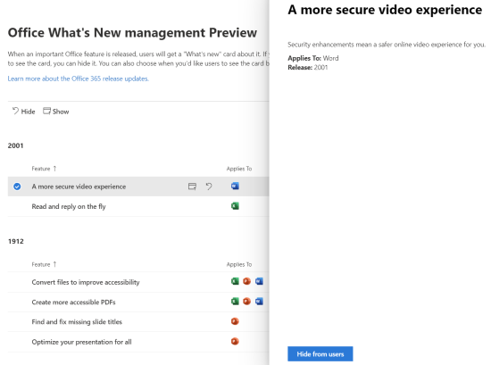
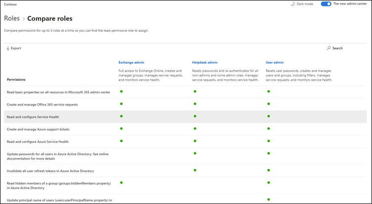

# Novedades en el centro de administración de 365 de MicrosoftWhat's new in the Microsoft 365 admin center

::: moniker range="o365-21vianet"

> [!NOTE]
> Es posible que parte de la información de este artículo no se aplique a Office 365 operado por 21Vianet.Some of the information in this article may not apply to Office 365 operated by 21Vianet.

::: moniker-end

Estamos agregando de forma continuada nuevas características al [centro de administración de Microsoft 365](microsoft-365-admin-center-preview.md), solucionando los problemas que aprendemos y realizando cambios en función de sus comentarios.We're continuously adding new features to [the Microsoft 365 admin center](microsoft-365-admin-center-preview.md), fixing issues we learn about, and making changes based on your feedback. Eche un vistazo a la parte inferior para ver lo que está disponible hoy mismo.Take a look below to see what's available for you today. Algunas características se implementan a los clientes a velocidades diferentes.Some features get rolled out at different speeds to our customers. Si aún no ve una característica, [pruebe a agregarse a la versión dirigida](manage/release-options-in-office-365.md).If you aren't seeing a feature yet, [try adding yourself to targeted release](manage/release-options-in-office-365.md).

> [!IMPORTANT]
> **Retiro del centro de administración de "Classic" a partir de marzo****"Classic" admin center retirement starting in March**  
Al iniciar sesión en el centro de administración de 365 de Microsoft, ahora va al nuevo centro de administración cada vez.When you sign in to the Microsoft 365 admin center, you'll now go to the new admin center every time. Y, en marzo, empezamos a deshabilitar la capacidad de volver al centro de administración clásico.And in March, we started disabling the ability to switch back to the classic admin center. Por ahora, puede cambiar de nuevo, pero a medida que el nuevo centro de administración se refiere a la paridad (y lo supera), desactivamos el conmutador para todas las organizaciones.For now, you can still switch back, but as the new admin center comes to parity (and exceeds it) we will turn off the switch for all organizations.    *Última actualización: 11 de mayo de 2020**Last updated: May 11, 2020*

Y si quiere conocer las novedades de otros servicios en la nube de Microsoft:And if you'd like to know what's new with other Microsoft cloud services:

- [Novedades de Azure Active DirectoryWhat's new in Azure Active Directory](https://docs.microsoft.com/azure/active-directory/fundamentals/whats-new)
- [Novedades en el centro de administración de ExchangeWhat's new in the Exchange admin center](https://docs.microsoft.com/Exchange/whats-new)
- [Novedades de Microsoft IntuneWhat's new in Microsoft Intune](https://docs.microsoft.com/mem/intune/fundamentals/whats-new)
- [Novedades en el centro de cumplimiento de Microsoft 365What's new in the Microsoft 365 compliance center](https://docs.microsoft.com/Office365/SecurityCompliance/whats-new)
- [Novedades de Protección contra amenazas de MicrosoftWhat's new in Microsoft Threat Protection](https://docs.microsoft.com/microsoft-365/security/mtp/whats-new)
- [Novedades en el centro de administración de SharePointWhat's new in the SharePoint admin center](https://docs.microsoft.com/sharepoint/what-s-new-in-admin-center)
- [Actualizaciones de OfficeOffice updates](https://docs.microsoft.com/OfficeUpdates/)

## Mayo de 2020May 2020

### Nuevo canal de actualización para OfficeNew update channel for Office

El 12 de mayo, anunciamos la disponibilidad de un nuevo canal de actualización para Office: canal de empresa mensual.On May 12, we announced the availability of a new update channel for Office:  Monthly Enterprise Channel. Este canal de actualización proporciona a los usuarios nuevas características de Office una vez al mes, el 2º martes del mes.This update channel provides your users with new Office features once a month, on the 2nd Tuesday of the month.

Si permite que los usuarios instalen Office automáticamente desde el portal, puede seleccionar el canal de empresa mensual para ellos.If you allow your users to self-install Office from the portal, you can select Monthly Enterprise Channel for them. Para ello, inicie sesión en el centro de administración de Microsoft 365 y vaya a **Mostrar todas las**opciones de configuración de la organización de los servicios configuración de  > **Settings**  >  **Org settings**  >  **Services**  >  **descarga de software de Office**.To do this, sign in to the Microsoft 365 admin center and go to **Show all** >**Settings** > **Org settings** > **Services** > **Office software download settings**. Si selecciona una **vez al mes (el canal de empresa mensual)**, cualquier instalación nueva de Office se configurará para usar el canal de empresa mensual.If you select **Once a month (Monthly Enterprise Channel)**, then any new self-installs of Office will be configured to use Monthly Enterprise Channel.

En combinación con la versión del canal de empresa mensual, también se revisan los nombres de los canales de actualización existentes.In conjunction with the release of Monthly Enterprise Channel, we’re also revising the names of the existing update channels. Por ejemplo, se cambia el nombre del canal mensual al canal actual.For example, Monthly Channel is being renamed to Current Channel. Los nuevos nombres entrarán en vigor el 9 de junio de 2020.The new names take effect on June 9, 2020.

Para obtener más información, consulte [cambios en los canales de actualización de las aplicaciones de Microsoft 365](https://docs.microsoft.com/DeployOffice/update-channels-changes).For more information, see [Changes to update channels for Microsoft 365 Apps](https://docs.microsoft.com/DeployOffice/update-channels-changes).

### Nuevos roles de administradorNew admin roles

Hemos agregado algunos nuevos roles de administrador de Azure Active Directory al centro de administración de Microsoft 365.We've added some new Azure Active Directory admin roles to the Microsoft 365 admin center.

- El rol de administrador de identidades híbridas concede permisos a los usuarios para administrar el aprovisionamiento de la nube y los servicios de autenticación.Hybrid identity admin role gives users permission to manage cloud provisioning and authentication services.
- El rol de administrador de red permite a los usuarios administrar ubicaciones de red y revisar información sobre la red para el software de Microsoft 365 como aplicaciones de servicio.Network admin role lets users manage network locations and review network insights for Microsoft 365 Software as a Service apps.
- El rol administrador de impresoras concede permiso para administrar todos los aspectos de las impresoras y las conexiones de impresora.Printer admin role grants permission to manage all aspects of printers and printer connections.
- El técnico de la impresora es un subconjunto del rol de administrador de la impresora donde estos usuarios pueden registrar y anular el registro de impresoras, y actualizar el estado de la impresora.Printer technician is a subset of the Printer admin role where those users can register and unregister printers, and update printer status.
Para obtener más información acerca de estos roles, consulte [About admin roles](https://docs.microsoft.com/microsoft-365/admin/add-users/about-admin-roles).To find out more about these roles, see [About admin roles](https://docs.microsoft.com/microsoft-365/admin/add-users/about-admin-roles).

### Exportar lista de gruposExport groups list

Hemos oído de muchos administradores que necesitan compartir información sobre los grupos y su uso a personas que no tienen acceso a los centros de administración.We've heard from a lot of admins that they need to share information about groups and their usage to people who don't have access to the admin centers. Ahora puede exportar la lista de grupos a un archivo CSV con fines de auditoría, lo que significa que puede desechar el script de PowerShell antiguo.You can now export the Groups list to a CSV file for auditing purposes, which means you can throw out that old PowerShell script. Para probarlo, **vaya a grupos**  >  **Groups**de grupos y, a continuación, seleccione **exportar grupos** en la barra de comandos.To try it out, go to **Groups** > **Groups**, and then select **Export groups** from the command bar.

### Centro de soluciones y arquitectura de Microsoft 365Microsoft 365 solution and architecture center

Este mes hemos lanzado un nuevo sitio [https://docs.microsoft.com](https://docs.microsoft.com) denominado [Microsoft 365 Solution and Architecture Center](https://docs.microsoft.com/microsoft-365/solutions/solution-architecture-center), que reúne la orientación técnica que necesita para comprender, planear e implementar soluciones integradas de Microsoft 365 para colaboración segura y conforme.Just this month, we released a new site on [https://docs.microsoft.com](https://docs.microsoft.com) called the [Microsoft 365 solution and architecture center](https://docs.microsoft.com/microsoft-365/solutions/solution-architecture-center), which brings together the technical guidance you need to understand, plan, and implement integrated Microsoft 365 solutions for secure and compliant collaboration. En este centro, encontrarás:In this center, you'll find:

- Guía de la solución básicaFoundational solution guidance
- Soluciones de carga de trabajo y guía del escenarioWorkload solutions and scenario guidance
- Ilustraciones de soluciones y arquitecturas (los pósteres!!!)Solution and architecture illustrations (The posters!!!)
- Instrucciones específicas del sectorIndustry specific guidance
- Entidades de diseño de arquitectura empresarialEnterprise architecture design principals

### Documentos, cursos y vídeosDocs, training, and videos

- **What's New in Microsoft 365 video series**: este mes, se describe la nueva experiencia de soporte en los centros de administración de seguridad y cumplimiento de Teams, la integración de Planner con el centro de mensajes y el nuevo diseño de vídeo 3X3 en Microsoft Teams.**What's new in Microsoft 365 video series**: This month, we cover the new support experience in the Teams admin and Security and Compliance Centers, Planner integration with the Message Center, and the new 3x3 video layout in Microsoft Teams. [Novedades de Microsoft 365What's New in Microsoft 365](https://go.microsoft.com/fwlink/p/?linkid=2118096)
- La página central de [ayuda del centro de administración de Microsoft 365](https://docs.microsoft.com/microsoft-365/admin/) se actualizó para ayudarle a encontrar lo que necesita con mayor rapidez.The [Microsoft 365 admin center help](https://docs.microsoft.com/microsoft-365/admin/) hub page was updated to help you find what you need more quickly. Además, si echa el vistazo a esa página ahora, hemos agregado una tarjeta para informarle de las actualizaciones y los cambios importantes.And if you go look at that page right now, we've added a card to inform you of important updates and changes.

## Abril de 2020April 2020

### Administración de roles de IntuneIntune roles management

[Abril de 2020April 2020](#april-2020)

Bueno, lo hicimos.Well, we did it! Hemos asumido el segundo paso hacia una experiencia de roles unificada y ahora puede administrar los roles de Intune en el centro de administración de Microsoft 365.We've taken the second step towards a unified roles experience and you can now manage Intune roles in the Microsoft 365 admin center. También puede aprovechar características como la capacidad de buscar roles y ver permisos de roles.You can also leverage features such as the ability to search for roles and view role permissions. Esto significa que no necesita dos herramientas independientes para administrar funciones para Microsoft 365 e Intune.This means you don’t need two separate tools to manage roles for Microsoft 365 and Intune. Al iniciar sesión en el centro de administración de 365 de Microsoft, verá que hay dos elementos dinámicos en la página roles, uno para Azure AD y otro para Intune.When you sign into the Microsoft 365 admin center, you’ll see that there are two pivots on the Roles page, one for Azure AD and one for Intune.

:::image type="content" source="../media/MAC-WN-IntuneRoles.png" alt-text="Página roles con la función dinámica de Intune seleccionada":::

### Sincronizar las publicaciones del centro de mensajes con PlannerSync Message Center posts to Planner

A partir de mayo, los administradores que estén en versión de destino empezarán a ver el botón "sincronización de Planner" en el centro de mensajes.Starting in May, admins who are in Targeted release will start seeing the "Planner syncing" button in the message center. Ahora puede realizar un seguimiento de los mensajes que necesiten acción, seleccionar el tipo de mensajes a los que desea realizar un seguimiento, asignar mensajes para realizar un seguimiento de las tareas y etiquetar los mensajes para una atención posterior.You can now track messages that need action, select the type of messages you'd like to track, assign messages to track as tasks, and tag messages for later attention.

[Unirse a la versión dirigida](manage/release-options-in-office-365.md) para empezar.[Join Targeted Release](manage/release-options-in-office-365.md) to get started!

### "¿Necesita ayuda?""Need help?" Iniciado en el centro de administración de Microsoft Teams & centros de seguridad y cumplimientolaunched in Teams admin center & Security and Compliance centers

El centro de administración de Microsoft Teams, el centro de seguridad y el centro de cumplimiento ahora usan la misma sección "¿necesita ayuda?".The Teams admin center, Security center, and Compliance center are now using the same "Need help?" característica que usa el centro de administración de Microsoft 365 para buscar ayuda y ponerse en contacto con el soporte técnico.feature that the Microsoft 365 admin center uses for finding help and contacting support. Hemos recibido muchos comentarios de los administradores a los que quería el mismo nivel de ayuda y soporte técnico, y nos alegramos de llevarle el mismo.We've received a lot of feedback from admins that you wanted the same level of help and support and we're happy to bring that to you. Pruébelo y envíenos sus comentarios.Try it out and give us your feedback!

#### ¿Necesita chat?Need chat?

Nuestros agentes de soporte técnico han estado trabajando desde casa mientras se siguen teniendo en cuenta los casos de clientes y limitaciones en el ancho de banda de Internet mientras trabajan desde casa pueden afectar a la calidad de las llamadas de los clientes.Our support agents have been working from home while still taking customer cases and limitations on internet bandwidth while working from home can impact customer call quality. Para seguir teniendo la asistencia, hemos lanzado la opción de soporte de chat en vivo para los clientes comerciales en el centro de administración de Microsoft 365.In order to continue supporting you, we have launched live chat support option for commercial customers in the Microsoft 365 admin center.

Al crear una solicitud de servicio, ahora verá chat como una opción, además del teléfono y el correo electrónico.While creating a service request, you'll now see chat as an option, in addition to phone and email. Seleccione chat como el canal de comunicación preferido y cree la solicitud.Select chat as a preferred channel of communication and create the request. Una vez que haya creado la solicitud, puede iniciar el chat cuando esté listo para chatear con los agentes de Microsoft.Once you've created the  request, you can start the chat when you are ready to chat with Microsoft agents.

### Actualizaciones de Microsoft TeamsTeams updates

Con el mayor uso de Teams, hemos agregado algunas características para ayudarle a administrarlas.With the increased usage of Teams, we've added a few features to help you manage them.

- Una nueva tarjeta de recomendación en la Página principal del centro de administración muestra los usuarios que no han usado activamente Teams durante 30 días.A new recommendation card on the admin center Home page shows which users have not actively used Teams for 30 days. Puede enviar a dichos usuarios un correo electrónico de aprendizaje para que los usuarios empiecen a usar Microsoft Teams.You can send those users a training email to get them started using Teams.
- **Incorpore a los usuarios con Microsoft Teams**: vaya a **configuración** para ver una página nueva que le ayude a activar Microsoft Teams para los usuarios con licencia y permitir el acceso de invitado, de modo que pueda trabajar con clientes externos en Microsoft Teams.**Bring people together with teams**: Go to **Setup** to see a new page to help you turn on Teams for licensed users and allow guest access, so you can work with external customers in Teams.
- Una tarjeta de Microsoft Teams está ahora anclada a la Página principal de forma predeterminada.A Microsoft Teams card is now pinned by default to your Home page. Muestra si Teams está activado y si se permite el acceso de invitado.It shows whether Teams is turned on, and if guest access is allowed. También le permite comprobar el estado de configuración de los usuarios de Microsoft Teams recién licenciados y comprobar si los problemas de red pueden afectar a los usuarios de Teams.It also allows you to check the setup status for newly licensed Teams users, and check if network issues might be impacting Teams users.
- Por último, Teams es ahora un paso en el flujo de configuración inicial si ha adquirido una licencia que incluye a teams.Finally, Teams is now a step in the initial set up flow if you purchased a license that includes Teams.

### Puntuación de productividadProductivity score

La puntuación de productividad ofrece información sobre cómo los usuarios usan los servicios en la nube de Microsoft y las experiencias tecnológicas que los admiten.Productivity Score gives insights about how people use Microsoft cloud services and the technology experiences that support them. La puntuación refleja el rendimiento de su organización con respecto a las medidas de experiencia de empleado y tecnología, y compara su puntuación con organizaciones como la suya.The score reflects your organization’s performance against employee and technology experience measures and compares your score with organizations like yours. Este mes, presentamos los siguientes conceptos nuevos a la experiencia de vista previa:This month, we are introducing the following new concepts to the preview experience:

- Vista de tendencia de la información principal de las páginas de página principal y de detalles de categorías-análisis de extremos y categorías de conectividad de red agregados a la experiencia tecnológicaTrend view of primary insights on home page and category detail pages -Endpoint Analytics and Network Connectivity categories added to Technology Experience
- Información relevante sobre la experiencia tecnológica que se muestra en las categorías de experiencia de empleadosRelevant Technology Experience insight shown in Employee Experience categories
- Nueva categoría de comunicaciones como parte de la experiencia de los empleadosNew Communications category as part of Employee Experience
- Detalles del usuario con metadatos de la organización en categorías de experiencia del empleadoUser details with organizational metadata in Employee Experience categories

Si quiere obtener más información, consulte el blog: [medir y mejorar la experiencia de microsoft 365 con la puntuación de productividad de Microsoft](https://techcommunity.microsoft.com/t5/microsoft-365-blog/measure-and-improve-the-microsoft-365-experience-with-microsoft/ba-p/1348618).If you'd like to learn more, check out the blog: [Measure and improve the Microsoft 365 experience with Microsoft Productivity Score](https://techcommunity.microsoft.com/t5/microsoft-365-blog/measure-and-improve-the-microsoft-365-experience-with-microsoft/ba-p/1348618). La puntuación de productividad está actualmente en versión preliminar privada.Productivity score is currently in private preview. [Únase a la vista previa privada de la puntuación de productividad](https://aka.ms/productivityscorepreview) para empezar.[Join the Productivity score private preview](https://aka.ms/productivityscorepreview) to get started.

### Actualizaciones de gruposGroups updates

Tenemos dos actualizaciones para los grupos este mes:We've got two updates for Groups this month:

- Ahora puede editar las direcciones de correo electrónico de los grupos de Office 365 (también conocidos como grupos en Outlook, y en cuanto se conoce como grupos de Microsoft 365).You can now edit email addresses for Office 365 groups (Also known as Groups in Outlook, and soon to be known as Microsoft 365 groups).
- Hemos oído sus comentarios y hemos agregado mensajes de error más claros por los motivos por los que no puede convertir un grupo en un equipo de Microsoft.We've heard your feedback and we've added clearer error messaging for why you can't convert a group to a Microsoft Team.

### Documentos, vídeos y formación (abril)Docs, videos, and training (April)

**Novedades de la serie de vídeos de 365 de Microsoft**: este mes, se incluyen sugerencias y recursos para ayudar a las pequeñas empresas a realizar la transición a un trabajo remoto, incluida la implementación de Microsoft Teams, los recursos de aprendizaje de trabajo remoto para estar conectados a clientes y socios, y el nuevo plan de voz empresarial de Microsoft 365.**What's new in Microsoft 365 video series**: This month, we cover tips and resources to help small businesses transition to remote work including how to roll out Microsoft Teams, remote work training resources to stay connected with clients and partners, and the new Microsoft 365 Business Voice plan. [Novedades de Microsoft 365What's New in Microsoft 365](https://go.microsoft.com/fwlink/p/?linkid=2118096)

#### Para los usuariosFor your users

- [Programar una reuniónSchedule a meeting](https://support.microsoft.com/office/c61b4f61-ee62-4a06-8bf7-0a1cd302700a)
- [Unirse a una reunión de Microsoft TeamsJoin a Teams meeting](https://support.microsoft.com/office/078e9868-f1aa-4414-8bb9-ee88e9236ee4)
- [Crear un equipo de toda la organizaciónCreate an org-wide team](https://support.microsoft.com/office/037bb27a-bcc9-48fe-8d72-44d9482420a3)
- [Crear un equipo con invitadosCreate a Team with guests](https://support.microsoft.com/office/11fbb083-52ee-434d-8c6e-63711fdafac7)
- [Unirse a un equipo como invitadoJoin a Team as a guest](https://support.microsoft.com/office/928d1eef-61e2-49ec-b754-c2fe86b34824)
- [Crear una dirección de correo electrónico de grupoCreate a group email address](https://support.microsoft.com/office/ded875f9-a9de-437f-b559-2ae4f235bb2b)

#### Para administradores y propietarios de empresasFor admins and business owners

- [Permita que su pequeña empresa tenga trabajo remotoEmpower your small business with remote work](https://support.microsoft.com/office/9b91a85a-39b4-40a6-a590-0f9bea0ba8e6)
- [Ejecución de una pequeña empresa remotaRunning a remote small business](https://support.microsoft.com/office/9ac1a0f1-789b-4143-b954-5821d5d89298)
- [Registrarse en Microsoft Business BasicSign up for Microsoft Business Basic](https://support.microsoft.com/office/9ac1a0f1-789b-4143-b954-5821d5d89298)
- [Configurar el inicio de sesión en dos fasesSetting up two-factor sign-in](https://support.microsoft.com/office/9ac1a0f1-789b-4143-b954-5821d5d89298)

## Marzo de 2020March 2020

### Revisión de comentarios destacados: mejorar la confiabilidad del "Agregar usuario" para las licenciasFeatured Feedback Fix: Improve "add user" reliability for licensing

Hemos recibido muchos comentarios de los administradores sobre el grado de dificultad para asignar licencias al agregar usuarios.We received a lot of feedback from admins about the how hard it is to assign licenses when adding users. Hemos realizado la primera actualización de esta corrección y hemos migrado a un servicio de segundo plano más confiable para procesar esas solicitudes.We've made the first update to this fix and we've migrated to a more reliable behind-the-scenes service to process those requests. Y si algo va mal, ahora recibirá un mensaje de error que le permitirá volver a intentarlo.And if something goes wrong, you'll now get an error message that lets you to try again.

:::image type="content" source="../media/MAC-WN-ImprovedLicensing.png" alt-text="Página de confirmación de adición de usuario con el error.":::

### Tarjeta de página principal de Microsoft TeamsMicrosoft Teams home page card

Con el valor de arriba en el uso de Teams, algunos organizaciones recibirán una tarjeta de panel anclada que permite que los equipos de escritorio sean más detectables.With the uptick in Teams usage, some orgs will get a pinned dashboard card that makes turning Teams on more discoverable. La tarjeta también tiene vínculos a formación y documentos para ayudar a su organización a realizar la transición al trabajo remoto.The card also has links to training and docs to help your org transition to remote work. Solo tiene que ir a la página **principal** para ver la tarjeta nueva.Just go to the **Home** page to see the new card.

:::image type="content" source="../media/MAC-WN-TeamsCard.PNG" alt-text="Tarjeta de página principal de Microsoft Teams":::

### Personalizar el tema de la aplicación móvil de SharePoint de la organizaciónCustomize your organization's SharePoint mobile app theme

Con el centro de administración de 365 de Microsoft, ahora puede personalizar el tema de su organización en aplicación móvil de SharePoint para iOS y aplicación móvil de SharePoint para Android.Using the Microsoft 365 admin center, you can now customize your organization's theme in SharePoint mobile app for iOS and SharePoint mobile app for Android. Esta característica proporciona convenientemente una experiencia de la aplicación de intranet móvil que puede coincidir con SharePoint Online para los empleados en marcha.This feature conveniently provides a mobile intranet app experience that can match your SharePoint Online for employees on the go. La personalización del tema incluye la imagen del logotipo, el color de la barra de navegación, los colores del texto y el icono y los colores de énfasis, lo que facilita el reconocimiento.Theme customization includes your logo image, navigation bar color, text and icon colors, and accent colors, making for easy recognition.

:::image type="content" source="../media/MAC-WN-CustThemeSP.png" alt-text="Diagrama asignar la configuración del centro de administración a la aplicación móvil.":::

### Mejoras en el asistente "agregar un grupo"Improvements to the "Add a group" wizard

Cuando los administradores crearon un nuevo grupo y lo convierten en un equipo al mismo tiempo, podrían asignar a los propietarios que no tienen una licencia que incluya a teams.When admins created a new group - and made it a Team at they same time, they could assign owners who don't have a license that includes Teams. Y eso ha creado algunos problemas.And that created some headaches. Hemos actualizado el flujo del Asistente para comprobar que los propietarios tienen una licencia de Teams y si no la opción para convertir el grupo en un equipo está deshabilitada.We've updated the wizard flow to verify that owners have a Teams license and if they don't the option to turn the group into a Team is disabled.

### Ofertas de Microsoft 365 para pequeñas y medianas empresasMicrosoft 365 offerings for small and medium businesses

Sabemos que se trata de un anuncio para el próximo mes, pero queremos asegurarnos de que está preparado.We know that this is an announcement for next month, but we want to make sure you're prepared.

A partir del 21 de abril, estamos realizando cambios relacionados con nuestras suscripciones de Office 365 para pequeñas y medianas empresas, y con Office 365 ProPlus.Starting on April 21, we're making changes related to our Office 365 subscriptions for small and medium businesses – and to Office 365 ProPlus. Estos productos usarán ahora la marca 365 de Microsoft.These products will now use the Microsoft 365 brand.

Los nombres de producto nuevos entrarán en vigor el 21 de abril de 2020.The new product names go into effect on April 21, 2020. Este es un cambio en el nombre del producto solamente y no hay cambios en los precios o las características en este momento.This is a change to the product name only, and there are no pricing or feature changes at this time.

|Nombre actualCurrent name |Nuevo nombreNew name  |
|---------|---------|
|Office 365 Empresa EssentialsOffice 365 Business Essentials     |   Microsoft 365 Empresa BásicoMicrosoft 365 Business Basic      |
|Office 365 Empresa PremiumOffice 365 Business Premium     |    Microsoft 365 Empresa EstándarMicrosoft 365 Business Standard     |
|Microsoft 365 EmpresaMicrosoft 365 Business     |    Microsoft 365 Empresa PremiumMicrosoft 365 Business Premium     |
|Office 365 EmpresaOffice 365 Business     |    Aplicaciones de Microsoft 365 para negociosMicrosoft 365 Apps for business       |
|Office 365 ProPlusOffice 365 ProPlus    |   Microsoft 365 apps for EnterpriseMicrosoft 365 apps for enterprise      |

### Vídeos, formación y documentosVideos, training, and docs

Novedades [de la serie web de microsoft 365](https://go.microsoft.com/fwlink/p/?linkid=2118096): en el episodio de este mes, destacamos el aniversario de 3 años de Microsoft Teams y cubren nuevas características que incluyen una mejor calidad de audio en las reuniones en línea, las comunicaciones dirigidas a los administradores de Firstline con la aplicación de turnos, la interoperabilidad de clientes de Microsoft Teams y Skype y mucho más.[What's New in Microsoft 365 web series](https://go.microsoft.com/fwlink/p/?linkid=2118096): In this month's episode, we highlight the 3-year anniversary of Microsoft Teams and cover new features including improved audio quality in online meetings, Targeted Communications for firstline managers with the Shifts app, Teams and Skype consumer interoperability, and more.

## Febrero de 2020February 2020

### Corrección de comentarios destacados: conmutador de varias organizacionesFeatured Feedback Fix: Multi-organization switcher

Hemos recibido muchos comentarios de socios y administradores sobre los retos de administrar varios organizaciones en la nube de Microsoft.We received a lot of feedback from partners and admins about the challenges of managing multiple Microsoft cloud orgs. Una de las primeras características de administración multiempresa es el **conmutador**de la organización, que permite cambiar entre los organizaciones que se administran en solo 2 clics.One of our first multi-org management features is the **Organization switcher**, which lets you change between the orgs that you manage in just 2 clicks.
> [!TIP]
> No tiene que hacer nada para que el conmutador de la organización aparezca siempre que sea el socio de registro de al menos una organización.You don't have to do anything to make the organization switcher appear as long as you are the Partner of record for at least one organization.

1. En el centro de administración de Microsoft 365, seleccione el nombre de la organización.In the Microsoft 365 admin center, select the org name.

2. En el conmutador de la organización, seleccione el organigrama que desea administrar.In the organization switcher, select the org you want to manage.

Esto es literalmente!!!That's literally it!!!

### GruposGroups

Un par de cambios en el área grupos este mes:A couple of changes in the groups area this month:

- **Ordenar por nombre de grupo**: puede ordenar la lista grupos alfabéticamente, seleccionando la columna **nombre del grupo** .**Sort by group name**: You can sort the groups list alphabetically, by selecting the **Group name** column.
- **Restaurar los grupos de microsoft 365 eliminados**: ya no es necesario ir al centro de administración de Exchange para restaurar los grupos de Microsoft 365 eliminados.**Restore deleted Microsoft 365 groups**: You don't have to go to the Exchange admin center anymore to restore  deleted Microsoft 365 groups. Vaya a **Microsoft 365 administración del centro de administración** \> **grupos** \> **eliminados** \> (seleccione un grupo de la lista) \> **grupo de restauración**.Go to **Microsoft 365 admin center** \> **Groups** \> **Deleted groups** \> (select a group from the list) \> **Restore group**. Volverá a restaurar el grupo en la lista de **grupos** y restaurará el correo electrónico, las conversaciones, el Bloc de notas, los archivos y el calendario del grupo.It'll restore the group back to the **Groups** list and restore the group's email, conversations, notebook, files, and calendar.

### Vídeos, aprendizaje y documentos (febrero)Videos, training, and docs (February)

- **What's New in Microsoft 365 video series**: este mes, nos centramos en las capacidades de búsqueda personalizadas de SharePoint Online, la característica de administración de "what's New" de Office que permite mostrar u ocultar características específicas de los usuarios finales a través del panel de ayuda en la aplicación, las últimas actualizaciones de seguridad y cumplimiento de Yammer, entre otras.**What's new in Microsoft 365 video series**: This month, we're focused on custom search capabilities for SharePoint Online, the Office "What's New" management feature that lets you show or hide specific features from end-users via the in-app help pane, the latest security and compliance updates in Yammer, and more. Este es el último episodio: [novedades de Microsoft 365](https://go.microsoft.com/fwlink/p/?linkid=2118096)Here's the latest episode: [What's New in Microsoft 365](https://go.microsoft.com/fwlink/p/?linkid=2118096)

- **Movimiento de documentos**: hemos combinado los artículos web de administración de Office 365 con el contenido de Microsoft 365 y es posible que haya observado la nueva dirección URL.**Docs move**: We combined the Office 365 admin web articles with the Microsoft 365 content and you might've noticed the new URL. Por ejemplo, este artículo solía estar hospedado en: **docs.Microsoft.com/Office365/admin/Whats-New-in-Preview**, pero la dirección URL ahora es: **docs.Microsoft.com/Microsoft-365/admin/Whats-New-in-Preview**.For example, this article used to be hosted at: **docs.microsoft.com/Office365/Admin/whats-new-in-preview**, but the URL is now: **docs.microsoft.com/microsoft-365/admin/whats-new-in-preview**. Si tiene páginas con marcadores, debe actualizar los vínculos; sin embargo, los vínculos de contenido se redirigirán al repositorio de contenido nuevo.If you've bookmarked pages, you should update your links; however, content links will be redirected to the new content repo.

## Enero 2020-feliz año nuevoJanuary 2020 - Happy New Year

> [!NOTE]
> ¿Sabía que hay una de las novedades de la serie de vídeos de [Microsoft 365](https://go.microsoft.com/fwlink/p/?linkid=2118096) en YouTube?Did you know that there's a [What's New in Microsoft 365](https://go.microsoft.com/fwlink/p/?linkid=2118096) video series on YouTube? Se resaltan las características más recientes que se han implementado para los usuarios.It highlights the latest features that we've rolled out to users. Cada mes empezaremos a vincular al episodio más reciente en la sección [vídeos, cursos y documentos](#videos-training-and-docs) .Every month, we'll start linking to the latest episode in the [Videos, training, and docs](#videos-training-and-docs) section.     Este es el último episodio: [novedades de Microsoft 365](https://go.microsoft.com/fwlink/p/?linkid=2118096)Here's the latest episode: [What's New in Microsoft 365](https://go.microsoft.com/fwlink/p/?linkid=2118096)

### Modo oscuroDark mode

La primera vez que se implementó el modo oscuro, solo estaba disponible en la Página principal.When we first rolled out dark mode, it was only available on the Home page. El modo oscuro ahora está fuera de la vista previa y se encuentra en la versión de destino en la mayoría de las páginas del centro de administración.Dark mode is now out of preview and is in Targeted release across most pages in the admin center.

1. En primer lugar, tendrá que activar la versión dirigida: vaya a **configuración** Settings Perfil de la organización opciones de \> **Settings** \> **Organization profile** \> **versión**.First, you'll need to turn on Targeted Release: Go to **Settings** \> **Settings** \> **Organization profile** \> **Release preferences**.
1. Y luego activa el modo oscuro, ve a la página **principal** y, a continuación, selecciona el botón **modo oscuro** .And then to turn on dark mode, go to the **Home** page, and then select the **Dark mode** button. (Se encuentra junto al campo de **búsqueda** y este artículo es el vínculo de **what's New** ).(It's next to the **Search** field and this article's **What's new** link.)
1. Para cualquier página que tenga el modo oscuro disponible, el botón se encuentra en la parte superior de la página, junto a la nueva opción de alternancia **del centro de administración** .For any page that has dark mode available, the button is at the top of the page, next to **The new admin center** toggle.

### La nueva administración de OfficeOffice What's New management

Los administradores quieren controlar el modo en que Microsoft comunica "What's New" a sus usuarios en las aplicaciones de Office y ahora tiene ese control.Admins want control over how Microsoft communicates "What's New" to their users in the Office apps - and you now have that control. Vaya a **configuración** \> **Office what's New Management Preview**.Go to **Settings** \> **Office What's New management Preview**. Seleccione una característica para ver sus detalles y, a continuación, seleccione el botón **ocultar a los usuarios** si no desea que los usuarios vean un mensaje "what's New" en particular.Select a feature to view its details, and then you can select the **Hide from users** button if you don't want your users to see a particular "what's new" message. Por ejemplo, es posible que su organización esté en espera de informar a los usuarios sobre una característica hasta que todos los usuarios de la organización reciban formación sobre ella.For example, your organization might be waiting to let users know about a feature until everyone in your org is trained on it.

Esta característica se presentó por primera vez en la versión preliminar en noviembre, pero ha habido algunas actualizaciones de características que debería conocer: [Office What's New Management Preview ya disponible](https://techcommunity.microsoft.com/t5/microsoft-365-blog/office-what-s-new-management-preview/ba-p/1020438)This feature was first released to preview in November, but there have been a few feature updates that you should know about: [Office What's New management preview updates now available](https://techcommunity.microsoft.com/t5/microsoft-365-blog/office-what-s-new-management-preview/ba-p/1020438)

### AsociadosPartners

Howdy, Partners!Howdy, Partners! (No se puede ayudar a mí mismo). También tenemos una actualización para usted este mes.(Couldn't help myself.) We've got an update for you this month, as well. Hay una nueva característica que permite a los partners dar a los clientes de CSP la opción de aceptar su acuerdo de cliente de Microsoft (MCA) en la sección **cuentas de facturación** del centro de administración.There's a new feature that allows Partners to give CSP customers the option to accept their Microsoft Customer Agreement (MCA) in the **Billing accounts** section of the admin center. En esta nueva experiencia:In this new experience:

1. El cliente recibe un correo electrónico de invitación con un vínculo para aceptar la relación de socio y MCA.The customer receives an invitation email with a link to accept the partner relationship and the MCA.
2. Una vez que el cliente inicia sesión, puede ver y aceptar los permisos de MCA y Partner-Right desde el centro de administración.After the customer signs in, they can view and accept the MCA and partner permissions - right from the admin center.

### Buzones de recursosResource mailboxes

La lista de buzones de recursos se ha actualizado con el nuevo estilo.The Resource mailboxes list has been updated to the new style. En el centro de administración de Microsoft 365, vaya a **recursos** \> **salones de & equipo**.In the Microsoft 365 admin center, go to **Resources** \> **Rooms & equipment**.

### Vídeos, cursos y documentos (enero)Videos, training, and docs (January)

Consulte el curso de administración de la pequeña empresa que publicamos en enero:Check out the small business admin training that we released in January:

- [Crear el sitio web de su empresaCreate your business website](https://support.microsoft.com/office/3325d50e-d131-403c-a278-7f3296fe33a9)
- [Buscar respuestas y ayudaFind answers and help](https://support.microsoft.com/office/7f681212-c649-4a3e-a43b-32b1d1e58988)
- [Obtener ayuda o soporte técnicoGet help or support](https://support.microsoft.com/office/18948a4c-3eb1-4b30-b1bc-a4cc29eb7655)
- [Eliminar un usuarioDelete a user](https://support.microsoft.com/office/6bcdad7b-732a-4260-997a-8c176bc3d9d6)
- [Elegir una suscripción de MicrosoftChoose a Microsoft subscription](https://support.microsoft.com/office/b9f7c78e-430f-4117-89ec-2eeb1dced2ca)
- [Información general de Microsoft 365 para la seguridad de la empresaOverview of Microsoft 365 for business security](https://support.microsoft.com/office/3274b159-a825-46d7-9421-7d6e209389d1)

## Noviembre y 2019 de diciembreNovember and December 2019

Estamos combinando las noticias de noviembre y diciembre porque, después de inflamarse, tenemos muy pocos anuncios que realizar.We're combining November's and December's news because after Ignite we had very few announcements to make. ¡ Vea el año nuevo!See you in the new year!

### Cambiar de tarjeta de crédito a pago de facturaChange from credit card to invoice payment

Hemos comenzado a implementar la capacidad de cambiar el método de pago de la tarjeta de crédito a una factura.We've starting to roll out the ability to change your payment method from credit card to an invoice. Vaya a **facturación** \> **de los productos**, seleccione una suscripción y, a continuación, seleccione el vínculo **Editar** junto al pago con tarjeta de crédito.Go to **Billing**\> **Your products**, select a subscription, and then select the **Edit** link next to the credit card payment.

¿Desea más información?Want to read more about it? [Cambiar de tarjeta de crédito o cuenta bancaria a facturaChange from credit card or bank account to invoice](../commerce/billing-and-payments/change-payment-method.md)

### Lector globalGlobal reader

Mencionamos el rol lector global en la [edición de octubre de 2019-inflamable](#october-2019---ignite-edition), pero, a medida que se implementa con mayor detalle, vamos a analizar algunos detalles:We mentioned the Global reader role in the [October 2019 - Ignite Edition](#october-2019---ignite-edition), but as it's rolling out more broadly, let's discuss some details:

- El rol lector global es el homólogo de solo lectura del rol de administrador global.The Global reader role is the read-only counterpart to the Global admin role. El lector global puede ver todo lo que el administrador global tiene permiso para hacer.The Global reader can see everything that the Global admin has permission to do.
- Con algunas excepciones, como algunas características de seguridad y cumplimiento, los lectores globales tienen acceso para ver todos los centros de administración de la nube de Microsoft que su organización tiene licencia de uso.With a few exceptions, like some compliance and security features, Global readers have access to view all of the Microsoft cloud admin centers that your org is licensed to use.
- Asigne el rol de lector global a los usuarios que lo necesiten para la planeación, las auditorías y las investigaciones.Assign the Global reader role to users who need it for planning, audits, and investigations.
- También puede combinar el rol lector global con otro rol que tenga menos permisos.You can also combine the global reader role with another role that has fewer permissions. Por ejemplo, un propietario de pequeña empresa puede tener asignados los **Billing admin**  +  roles de**lector global** de administrador de facturación para que puedan pagar las facturas y permanecer al tanto de los cambios en la organización en la nube.For example, a small business owner might be assigned the **Billing admin** + **Global reader** roles so that they can pay the bills and stay on top of changes to their cloud organization.
- Los lectores globales pueden ir a cualquier página del centro de administración de Microsoft 365.Global readers can go to any page in the Microsoft 365 admin center. Al abrir una página modificable, aparecerá una advertencia en la parte superior en la que se indica que no tienen permiso para guardar los cambios y que el botón Guardar se deshabilitará.When they open an editable page,  there will be a warning at the top telling them that they don't have permission to save changes, and the save button will be disabled.

Nos encantaría recibir sus comentarios sobre el rol lector global y los permisos basados en roles que le gustaría ver en el futuro.We'd love to get your feedback about the global reader role and any of the role-based permissions that you'd like to see in the future. [Proporcionar comentarios sobre permisos basados en rolesGive feedback for role-based permissions](https://office365.uservoice.com/forums/273493-office-365-admin/suggestions/10115430-have-a-consistent-experience-when-assigning-admin)

### Página nueva configuraciónNew Settings page

El **perfil**de la organización, la **seguridad & privacidad**y los **servicios & las páginas de complementos** se han combinado en una página con tres tabulaciones verticales.The **Organization profile**, **Security & privacy**, and **Services & add-ins** pages have all been combined into one page with 3 vertical tabs. Y la mejor parte: desde una sola ubicación, ahora puede buscar todas las opciones de configuración.And the best part -- from one single location, you can now search for all settings.

### Documentos de & de aprendizajeTraining & Docs

Esta sección es una nueva característica de este artículo, en la que empezaremos a vincular a la nueva formación y a la documentación que creemos que le resultará interesante.This section is a new feature of this article, where we'll start linking to new training and documentation that we think you will find interesting.

En noviembre, se publicaron algunas caminos de aprendizaje en el sitio web de [Microsoft](https://docs.microsoft.com/learn/) Learning para ayudar a los profesionales de ti a aprender y obtener formación sobre Microsoft 365.In November, we released quite a few learning paths to [Microsoft Learn](https://docs.microsoft.com/learn/) website to help IT pros learn about and get trained on Microsoft 365. Compruebe lo siguiente:Check them out:

- [Conceptos básicos de Microsoft 365Microsoft 365 fundamentals](https://docs.microsoft.com/learn/paths/m365-fundamentals/)
- [Ampliar las bases de OfficeExtend Office fundamentals](https://docs.microsoft.com/learn/paths/extend-office-fundamentals/)
- [Microsoft 365-modernizar la implementación de la empresa con Windows 10 y Microsoft 365 apps for EnterpriseMicrosoft 365 - Modernize your enterprise deployment with Windows 10 and Microsoft 365 Apps for enterprise](https://docs.microsoft.com/learn/paths/m365-getmodern/)
- [Administre el despliegue de su empresa con Microsoft 365Manage your enterprise deployment with Microsoft 365](https://docs.microsoft.com/learn/paths/manage-enterprise-deployment-m365/)
- [Actualice Microsoft Office para la TI a escalaUpgrade Microsoft Office for IT at scale](https://docs.microsoft.com/learn/paths/m365-office-for-it/)
- [Entrega de aplicaciones y escritorios remotos desde Azure con el escritorio virtual de WindowsDeliver remote desktops and apps from Azure with Windows Virtual Desktop ](https://docs.microsoft.com/learn/paths/m365-wvd/)
- [Modernice su área de trabajo con Microsoft 365 y Surface para la EmpresaModernize your workplace with Microsoft 365 and Surface for Business](https://docs.microsoft.com/learn/paths/modernize-workplace-with-m365-and-surface/)
- [Proteger la identidad y el acceso con Microsoft 365Protect identity and access with Microsoft 365](https://docs.microsoft.com/learn/paths/m365-identity/)
- [Proteger la información de la empresa con Microsoft 365Protect enterprise information with Microsoft 365](https://docs.microsoft.com/learn/paths/m365-information-protection/)
- [Administrar la seguridad con Microsoft 365Manage security with Microsoft 365](https://docs.microsoft.com/learn/paths/m365-security-management/)
- [Defiéndase contra las amenazas con Microsoft 365 y la protección contra amenazas de MicrosoftDefend against threats with Microsoft 365 and Microsoft threat protection](https://docs.microsoft.com/learn/paths/m365-security-threat-protection/)
- [Administración de la colaboración en grupo con Microsoft TeamsManage team collaboration with Microsoft Teams](https://docs.microsoft.com/learn/paths/m365-manage-team-collaboration/)
- [Colaborar con SharePoint en Microsoft 365Collaborate with SharePoint in Microsoft 365](https://docs.microsoft.com/learn/paths/m365-teams-sharepoint/)

## Edición de octubre de 2019-inflamationOctober 2019 - Ignite Edition

¡ Bienvenido a la edición de encendido de las novedades del centro de administración de Microsoft 365!Welcome to the Ignite Edition of the What's new in the Microsoft 365 admin center! Por supuesto, esta no es una lista completa de anuncios, pero estos son algunos aspectos destacados.Of course, this isn't a complete list of announcements, but here are a few highlights. Consulte también los blogs de encendido para obtener más información sobre las versiones:Also, check out the Ignite blogs for more great info about releases:

- [Administración: mejoras en la red, la productividad y la seguridad para Microsoft 365](https://techcommunity.microsoft.com/t5/Microsoft-365-Blog/ADMIN-Security-Productivity-and-Network-Enhancements-for/ba-p/964019).[ADMIN - Security, Productivity, and Network Enhancements for Microsoft 365](https://techcommunity.microsoft.com/t5/Microsoft-365-Blog/ADMIN-Security-Productivity-and-Network-Enhancements-for/ba-p/964019).
- [What's New in Microsoft Teams: encendido 2020](https://techcommunity.microsoft.com/t5/Microsoft-Teams-Blog/What-s-New-in-Microsoft-Teams-Ignite-2019/ba-p/937025).[What's New in Microsoft Teams - Ignite 2020](https://techcommunity.microsoft.com/t5/Microsoft-Teams-Blog/What-s-New-in-Microsoft-Teams-Ignite-2019/ba-p/937025).

### Control de acceso basado en funcionesRole-based access control

Ha habido muchos cambios para roles en el centro de administración desde que empezamos a implementar en junio:There have been a lot of changes for Roles in the admin center since we started rolling out in June:

- **Comparar roles** : seleccione hasta 3 roles para comparar los permisos de cada uno de ellos.**Compare roles** - Select up to 3 roles to compare the permissions for each one. Esto le ayudará a encontrar el rol menos permisivo que se asignará a los usuarios.This will help you find the least permissive role to assign to users. Vaya a **roles**, use la casilla de verificación de selección múltiple en la primera columna para elegir hasta 3 roles y, después, seleccione **comparar roles**.Go to **Roles**, use the multi-select checkbox in the first column to choose up to 3 roles, and then select **Compare roles**.

    

- **Favoritos** : puede Agregar una estrella a sus roles favoritos o más usados, de modo que pueda encontrarlos fácilmente ordenando la columna o creando un filtro.**Favorites** - You can add a star to your favorite or most-used roles, so that you can easily find them by sorting the column or creating a filter.
- **Usuarios activos**  >  **Administrar roles** : esto se ha actualizado para alinearse con los cambios en los roles.**Active users** > **Manage roles** - This has been updated to align with the changes in Roles. Al igual que con la lista roles, hemos definido el ámbito de la lista predeterminada de funciones para que sea más útil, pero puede ver todos los roles expandiendo **Mostrar todos por categoría**.As with the Roles list, we've scoped the default list of roles to the most useful, but you can see all roles by expanding **Show all by category**.
- **Rol de lector global** : ¡ le ha pedido!**Global reader role** - You asked for it! ¡ Lo consiguió!You got it! El rol [lector global](add-users/about-admin-roles.md) .The [Global reader](add-users/about-admin-roles.md) role!

### Informar de un problemaReport an issue

El estado del servicio se ha actualizado al nuevo estilo y si se ve afectado por un problema que no se muestra en el panel de estado del servicio, puede **informar de un problema** para que Microsoft lo sepa.Service health has been updated to the new style and if you are impacted by an issue that is not showing up on your Service health dashboard, you can **Report an issue** to let Microsoft know. Vaya al **Health**  >  **Estado del servicio**de mantenimiento.Go to **Health** > **Service health**.

### Suscripciones "viral""Viral" subscriptions

Como sabe, los usuarios pueden activar suscripciones gratuitas a una infinidad de productos, como Power BI y app Connect.As you know, users can turn on free subscriptions to a myriad of products like Power BI and App Connect. Ahora puede ver las "suscripciones virales" que han intentado sus usuarios.You can now see the "viral subscriptions" that your users have been trying. Vaya a **facturación**  >  **de los productos**.Go to **Billing** > **Your products**. Seleccione el filtro **tipo de cuenta** en la ficha suscripciones para ver las suscripciones compradas por el usuario.Select the **Account type** filter on the subscriptions tab to see the user-purchased subscriptions. Si es necesario, ahora tiene la posibilidad de quitar estas suscripciones de su cuenta.If needed, you now have the ability to remove these subscriptions from your account.

### Plantillas de usuarioUser templates

Las plantillas le permiten agregar fácilmente varios usuarios al guardar y reutilizar la configuración compartida para estos usuarios.Templates allow you to easily add many users by saving and reusing the shared settings for these users. Puede guardar valores para roles, licencias asignadas, información de contacto, ubicación, etc.You can save values for roles, licenses assigned, contact information, location, and more. Cuando use la plantilla para crear un nuevo usuario, se obtendrá automáticamente el valor guardado de esta configuración.When you use the template to create a new user, they will automatically get the saved value for these settings. Vaya a **usuarios**  >  **activos**y, a continuación, seleccione **plantillas de usuario** para probarlo.Go to **Users** > **Active users**, and then select **User templates** to try it out.

### Administración de "What's New" de Office (versión preliminar)Office "What's New" management (Preview)

Cuando se publica una característica importante de Office en una aplicación de Office, los usuarios obtendrán una tarjeta "What's New" para obtener información sobre la nueva característica.When an important ‎Office‎ feature is released to an Office app, users will get a "What's new" card to learn about the new feature. Si no desea que los usuarios vean la tarjeta, puede ocultarla.If you don't want users to see the card, you can hide it. También puede elegir cuándo desea que los usuarios vean la tarjeta mostrándola.You can also choose when you'd like users to see the card by showing it. Vaya a **configuración**  >  **Office ¿qué es la nueva administración** para desprotegerla?Go to **Settings** > **Office What's New management** to check it out.

### Cambio de dirección URL de SharePointSharePoint URL change

Técnicamente, no se trata de las noticias del centro de administración de Microsoft 365 para decirle, pero estamos tan entusiasmados que queríamos que nos aseguremos de que vea esta noticia:Technically, this isn't the Microsoft 365 admin center's news to tell, but we're so excited we wanted to make sure you see this news:
> [!IMPORTANT]
> Ahora puede obtener acceso a su centro de administración de SharePoint con una dirección URL normal:[https://admin.microsoft.com/SharePoint](https://admin.microsoft.com/SharePoint)You can now get to YOUR SharePoint admin center with a regular URL: [https://admin.microsoft.com/SharePoint](https://admin.microsoft.com/SharePoint)

Para obtener más información, consulte [what's New in the SharePoint admin Center](https://docs.microsoft.com/sharepoint/what-s-new-in-admin-center).For more info, see [What's new in the SharePoint admin center](https://docs.microsoft.com/sharepoint/what-s-new-in-admin-center).

## Septiembre de 2019September 2019

Estamos realizando un seguimiento de las fantásticas versiones de las características en el encendido de 2019, por lo que solo anunciamos algunas de las nuevas características que se publicaron en septiembre.We are ramping up for some exciting feature releases at Ignite 2019, so we're only announcing a few new features that were released in September. Pero esté atento al artículo del próximo mes, se publicará el primer día de inflamabilidad.But stay tuned for next month's article, it'll be published on the first day of Ignite!

### Corrección de comentarios destacados: la opción para convertir el buzón de correo del usuario eliminado en un buzón compartido vuelve a estarFeatured Feedback Fix – The option to convert the deleted user's mailbox to a shared mailbox is back

Hemos oído que sus comentarios son fuertes y claros, y hemos vuelto la capacidad de dar a otra persona acceso al buzón de correo de un usuario eliminado convirtiéndolo en un **buzón compartido**.We heard your feedback loud and clear and we brought back the ability to give someone else access to a deleted user's mailbox by converting it to a **shared mailbox**. Al volver a agregar el Asistente para eliminar usuarios, podrá decidir qué hacer con los datos:Adding this back to the delete user wizard lets you decide what to do with the data:

- Email: conceder a otra persona acceso al buzón de correo del usuario eliminado convirtiéndolo en un buzón compartido.Email: Give someone else access to the deleted user's mailbox by converting it to a shared mailbox.
- Archivos: guardar los archivos de OneDrive y proporcionar acceso a otro usuario.Files: Save their OneDrive files and give someone else access.
- Permisos: quitar permisos si otros usuarios han tenido acceso a este buzón.Permissions: Remove permissions if others had access to this mailbox.
- Alias: quitar alias de correo electrónico para que estén disponibles para su uso por otro usuario inmediatamente.Aliases: Remove email aliases so they are available to use for another user right away.

### Configuración inicialInitial setup

Ha habido una actualización a otro de nuestros asistentes de instalación inicial: Microsoft 365 para empresas.There's been an update to another of our initial setup wizards: Microsoft 365 for business. Los pasos se han simplificado y hemos movido dos de las tareas de configuración a la página de configuración:The steps have been streamlined and we've moved two of the set up tasks into the Setup page:

- **Proteger equipos con Windows 10** : establezca directivas para proteger mejor sus dispositivos con Windows 10 de virus, malware y ataques de piratas informáticos.**Secure Windows 10 computers** - set up policies to better protect your Windows 10 devices from viruses, malware, and attacks by hackers.
- **Instalar Office automáticamente** : cuando se activa esta opción y los usuarios han conectado sus equipos a Microsoft 365 Business, sus equipos se actualizarán automáticamente a las últimas aplicaciones de Office y se mantendrán al día.**Automatically install Office** - When you turn this on and users have connected their PCs to Microsoft 365 Business, their computers will automatically update to the latest Office apps - and stay up to date.

## Agosto de 2019August 2019

### FacturaciónBilling

Tenemos algunas actualizaciones de facturación y suscripciones este mes:We've got some updates for billing and subscriptions this month:

- Suscripciones basadas en dispositivos: puede asignar o cancelar la asignación de licencias **de aplicaciones para el ámbito educativo (dispositivo) de 365 de Microsoft** a los dispositivos del centro de administración de Microsoft 365.Device-based subscriptions: You can assign or unassign **Microsoft 365 Apps for Education (device)** licenses to devices in the Microsoft 365 admin center. **Microsoft 365 apps for Education (Device)** es una licencia de complemento que le permitirá asignar una licencia a un dispositivo.**Microsoft 365 Apps for Education (device)** is an add-on license that will lets you to assign a license to a device. Vaya a **facturación**  >  **de productos** para buscar y adquirir la licencia.Go to **Billing** > **Your products** to find and purchase the license.
- Administración de licencias basada en el usuario: hemos actualizado la forma en que se asignan licencias a los usuarios activos de **los usuarios**  >  **Active users** al nuevo estilo.User-based license management: We've updated how you assign licenses in **Users** > **Active users** to the new style. Para obtener más información, vea:For more information, see:
  - [Asignar licencias a usuariosAssign licenses to users](manage/assign-licenses-to-users.md)
  - [Cancelar asignación a licencias de usuariosUnassign licenses from users](manage/remove-licenses-from-users.md)

### Instalación de actualizaciones de la páginaSetup page updates

El programa de instalación ahora tiene categorías y secciones, incluida una sección **recomendada para usted** donde recomendamos de forma inteligente el siguiente paso para activar las características y configurar la organización.Setup now has categories and sections, including a **Recommended for you** section where we intelligently suggest your next step in turning on features and setting up your organization. También hemos agregado una nueva característica para configurar:We've also added a new feature to set up:

- **Protección contra amenazas avanzada de Office** : Si su organización tiene una licencia para usar ATP de Office y no la ha configurado o la ha activado todavía, verá esta página.**Office Advanced Threat Protection** - If your org is licensed to use Office ATP and you haven't configured it or turned it on yet, you'll see this page. Vaya al **programa de instalación** para probarlo.Go to **Setup** to try it out.

### Informar de un problema (agosto)Report an issue (August)

Si se ve afectado por un problema que no se muestra en el panel de estado del servicio, el informe de una característica de problema le proporcionará una forma rápida y sencilla de que nos **informen** .If you are impacted by an issue that is not showing up on your Service health dashboard, the **Report an issue** feature will provide you with a quick and easy way to let us know. Vaya al **Health**  >  **Estado del servicio**de mantenimiento.Go to **Health** > **Service health**.

## Julio de 2019July 2019

### Centro de mensajesMessage center

El centro de mensajes se ha actualizado al nuevo diseño y parece asombroso.The Message center has been updated to the new design and it looks amazing!

- Ahora puede ver **los mensajes por estado**.You can now view **Messages by status**. Solo tiene que seleccionar una de las pestañas: **todos los mensajes activos**, **importancia alta**, **mensajes no leídos**y **mensajes desechados**.Just select one of the tabs: **All active messages**, **High importance**, **Unread messages**, and **Dismissed messages**.
- También puede filtrar por privacidad de los **datos**de la categoría, **planear cambios**, **evitar o corregir problemas**y **mantenerse** a la vanguardia de las categorías de mensajes.You can also filter by category **Data privacy**, **Plan for change**, **Prevent or fix issues**, and **Stay informed** message categories.
- Seleccione un mensaje de la lista y tiene algunas opciones en la barra de comandos: **descartar**, **marcar como leído** o **marcar como no leído**o **compartir**.Select a message from the list and you have a few options in the command bar: **Dismiss**, **Mark as read** or **Mark as unread**, or **Share**.
- Al abrir un mensaje, tiene incluso más opciones:And when you open a message, you have even more options:
  - Copie un vínculo del mensaje en el portapapeles para guardarlo para más tarde o para compartirlo con compañeros.Copy a link of the message to your clipboard to save it for later or to share it with colleagues.
  - Marcar los mensajes como **leídos** o no **leídos**.Mark messages as **Read** or **Unread**.
  - Enviar comentarios sobre un mensaje seleccionando **like** o **Unlike**, se abrirá un panel de comentarios en el que se le pedirá que proporcione comentarios específicos sobre lo que le gustó o que no le gusta este mensaje.Give feedback about a message by selecting **Like** or **Dislike**, a feedback pane opens asking you to provide specific feedback on what you liked or didn't like about this message.

### Inteligencia del panel de navegaciónNavigation pane intelligence

 Ahora, el panel de navegación recuerda sus últimas acciones y muestra el panel en el último estado en el que lo dejó.The navigation pane now remembers your last actions and shows you the pane in the last state that you left it in. También hará que los elementos que se usan con frecuencia sean visibles de forma predeterminada.It will also make frequently used items visible by default.

### Configuración inicial & la página de configuraciónInitial setup & the Setup page

Tenemos algunos cambios interesantes que le ayudarán a configurar la organización.We've got some exciting changes to help you get your organization set up. En primer lugar, vamos a analizar la diferencia entre la **configuración** y la **Página de configuración**.First off, let's discuss the difference between **setup** and the **Setup page**. El **programa de instalación** hace referencia al asistente de instalación inicial que usó para incorporarse a los servicios en línea de Microsoft.**Setup** refers to the initial setup wizard that you used to onboard to Microsoft's online services. Esto suele incluir tres pasos específicos: **conectar un dominio**, **Agregar usuarios**y **descargar las aplicaciones de Office**.That usually includes three specific steps: **Connect a domain**, **Add users**, and **Download the Office apps**. La **Página de configuración** es la página del centro de administración que ha recomendado configurar las tareas para asegurarse de que se saca el máximo partido a las suscripciones, como la activación de las características para las que ha comprado licencias.The **Setup page** is the page in the admin center that has recommended set up tasks to ensure that you're getting the most out of your subscriptions - like turning on features you've purchased licenses for.

- **Setup** -el Asistente de instalación inicial se ha actualizado para las suscripciones de **Microsoft 365 para empresas** .**Setup** - The initial setup wizard has been updated for **Microsoft 365 for business** subscriptions. Este nuevo diseño ayudará a las nuevas organizaciones a pasar por el asistente con mayor rapidez y tendrá un éxito mayor.This new design will help new organizations get through the wizard faster and with greater success.
- **Página de instalación** : la página de **configuración** ayuda a finalizar la configuración y la protección de los servicios que vienen con las suscripciones.**Setup page** - The **Setup** page helps you finish setting up and securing the services that come with your subscriptions. También puede ver las recomendaciones que se han desechado en la página de **configuración** .You can also see any dismissed recommendations on the **Setup** page. Para ver si todavía está disponible para sus suscripciones, vaya a la instalación del **centro de administración de 365 de Microsoft**  >  **Setup**.To see if it's available for your subscriptions yet, go to the **Microsoft 365 admin center** > **Setup**.

### Suscripciones de & de facturaciónBilling & subscriptions

- Tipo de producto de **software** : ahora puede ver los productos de software adquiridos a través de un proveedor de servicios en la nube (CSP).**Software** product type - You can now view software products purchased through a Cloud Service Provider (CSP). Para ver las descargas y las claves, vaya a **facturación**  >  **de la**  >  ficha**software** de productos.To see your downloads and keys, go to **Billing** > **Your products** > **Software** tab.
- Puede ver los productos y servicios de Azure modernos desde el centro de administración de Microsoft 365, ya haya adquiridolos de Microsoft o de un proveedor de terceros.You can view Modern Azure products and services from the Microsoft 365 admin center, whether you purchased them from Microsoft or a third-party provider. Ejemplos de productos modernos de Azure incluidos:Examples of Modern Azure products included:
  - Instancias virtuales reservadas de AzureAzure Reserved Virtual Instances
  - Planes de soporte de AzureAzure Support Plans
  - Ventajas de Azure Hybrid use (AHUB)Azure Hybrid Use Benefits (AHUB)
  - Administrar aplicacionesManage Applications
  - Servicios de dispositivosDevice Services
  - Suscripciones de AzureAzure Subscriptions

### Simplificación de la autenticación multifactorSimplify multi-factor authentication

Los administradores tienen acceso a información confidencial de la organización.Admins have access to sensitive information in your organization. Requerir que todos los administradores usen la autenticación multifactor al iniciar sesión.Require all admins to use multi-factor authentication when signing in. El asistente nuevo le ayudará a hacerlo con un solo paso.The new wizard helps you get it done with just one step. Para probarlo, vaya a **configuración**  >  **reforzar la seguridad de inicio de sesión**.To try it out, go to **Setup** > **Strengthen sign-in security**.

### UsuariosUsers

Las páginas **usuarios eliminados** e **invitado** se actualizaron al nuevo estilo.The **Deleted users** and **Guest users** pages were updated to the new style.

- **Usuarios invitados**: los usuarios invitados se agregan al invitarles a ver o compartir archivos desde SharePoint o OneDrive.**Guest users**: You add guest users by inviting them to view or share files from SharePoint or OneDrive. Puede ver a los usuarios invitados a los usuarios invitados de **los usuarios**  >  **Guest users**.You can view guest users from **Users** > **Guest users**.
- **Usuarios eliminados**: en la página **usuarios eliminados** actualizados, puede realizar todas las acciones que puede en el centro de administración anterior, pero ahora puede Agregar y quitar columnas.**Deleted users**: On the updated **Deleted users** page, you can do all the actions that you could in the older admin center, but now you add and remove columns. Y disponemos de muchas opciones de columna para elegir.And we have a lot of column options to choose from. De hecho, es la misma columna que puede elegir en la página **usuarios activos** .In fact, it's the same columns that you can choose on the **Active users** page.

## Junio de 2019June 2019

### Solicitud de comentarios destacados: modo oscuroFeatured feedback request - Dark mode

Ver el centro de administración en modo oscuro está en versión preliminar.Viewing the admin center in dark mode is in preview! Solo puede probarlo en la página **principal** en este momento.You can test it out on the **Home** page only right now. En la página **principal** , el botón **modo oscuro** se encuentra en la barra de comandos junto al vínculo **what's New** .On the **Home** page, the **Dark mode** button is in the command bar next to the **What's new** link.

### Administración de rolesRoles management

Al final de junio, empezamos a implementar una nueva forma de administrar los roles de administrador.At the end of June we started rolling out new way to manage admin roles. Cuando esté disponible para usted, **vaya a roles de roles**  >  **Roles**.When it's available for you, go to **Roles** > **Roles**. Hasta entonces, eche un vistazo, ¡ es increíble!Until then, take a look - it's awesome!
    

Esta nueva experiencia hace que sea más fácil ver quién tiene permisos de administrador y asignar roles que concedan el nivel correcto de acceso a los administradores.This new experience makes it easier to see who has admin permissions and to assign roles that grant the right level of access to your admins. Además, agregamos más roles de Azure AD para que no pierda el tiempo dirigido a varios centros de administración.And we also added more roles from Azure AD so that you don't waste time going to multiple admin centers.
¿Qué más puede hacer aquí?What else can you do here?

- Exporte una lista de todos los administradores de la organización que tienen asignados roles de Azure Active Directory en Microsoft 365.Export a list of all admins in your org who are assigned Azure Active Directory roles in Microsoft 365.  
- Permite ver todos los administradores asignados a un rol específico, agregar o quitar administradores de una función específica, buscar roles por nombre y palabra clave y obtener más información sobre lo que cada rol permite hacer a un usuario.View all admins assigned to a specific role, add or remove admins from a specific role, search for roles by name and keyword, and learn more about what each role allows a user to do.
- Buscar rápidamente una función específica y crear filtros.Quickly search for a specific role and create filters.

### Método de pagoPayment method

Hemos actualizado la forma en que paga las suscripciones.We've updated how you pay for your subscriptions. Vaya a **facturación**  >  **facturas &**  >  **métodos de pago**de pagos.Go to **Billing** > **Bills & payments** > **Payment methods**. Puede ver los métodos de pago en una vista de lista.You can see your payment methods in a list view. Seleccione cualquier elemento de la lista para quitarlo, editarlo y ver con facilidad la suscripción con la que está asociado el método de pago.Select any item in the list to remove it, edit it, and easily see which subscription that payment method is associated with.

## Mayo de 2019May 2019

### Corrección de mayúsculas y minúsculas de mayoMay's featured fix - Case sensitivity

Ahora, al buscar buzones de correo compartidos, contactos, recursos y permisos de buzón de correo, los términos de búsqueda no tienen que distinguir entre mayúsculas y minúsculas.Now when you search for shared mailboxes, contacts, resources, and mailbox permissions, your search terms don't have to be case-sensitive.

**Administración de usuarios y grupos** Este mes hemos actualizado el **bloqueo de usuario**, la **contraseña de restablecimiento**, la vista de lista de **contactos** , la vista de lista de **grupos** y las páginas de detalles de **grupos** al nuevo estilo de centro de administración.**User and group management** This month, we updated **Block user**, **Reset password**, **Contacts** list view, **Groups** list view, and the **Groups** details pages to the new admin center style.

- Con la vista de lista de nuevos **grupos** , obtendrá datos más completos sobre los grupos y podrá personalizar la forma en que ve sus datos, y la lista de grupos recuerda cómo desea ver los datos.With the new **Groups** list view, you get richer data about your groups, and you can customize the way you see your data -- and the groups list remembers how you want to see your data. Por ejemplo, ahora puede filtrar por **grupos con Teams** para ver si los grupos forman parte de un equipo y puede Agregar la columna **Estado de Teams** .For example, you can now filter on **Groups with Teams** to see if your groups are part of a Team and you can add the **Teams status** column.
- La lista de grupos también aporta todas las mejoras que hemos realizado en la experiencia de lista en administración de usuarios, incluidas las acciones rápidas y la barra de comandos contextual.The groups list also brings with it all the improvements we made to the list experience in user management, including quick actions and the contextual command bar.

**Recomendaciones****Recommendations** 
Es posible que vea una nueva recomendación emergente en el centro de administración: hemos agregado 4 nuevas.You might see a new recommendation pop-up in your admin center - we just added 4 new ones. Por supuesto, solo verá recomendaciones si creemos que beneficiará a su organización.Of course, you'll only see recommendations if we think it will benefit your organization. Pero no espere hasta que le muestren la recomendación: puede agregarla desde la biblioteca de tarjetas.But don't wait until we show you the recommendation - you can add it from the card library.

- **Expiración** de la contraseña: se recomienda que las contraseñas se configuran para que no **expiren nunca**.**Password expiry** - We recommend that passwords get set to **Never expire**. Y si su organización tiene una configuración diferente, es posible que solo vea esta recomendación.And if your org has a different setting, you might just see this recommendation.
- **Demasiados administradores globales** : como tener demasiados administradores globales es una amenaza de seguridad, si tiene más de 4 administradores globales, verá esta recomendación.**Too many global admins** - Because having too many global admins is a security threat, if you have more than 4 global admins, you'll see this recommendation. Le sugerimos que proporcione a los usuarios solo el acceso que necesitan para realizar su trabajo.We suggest giving users only the access they need to get their job done.
- **Protección de dispositivos de Intune** : si las licencias incluyen Intune y se detecta que no ha terminado de configurar Intune o que se han inscrito en los dispositivos, le recomendamos que cree una directiva de Intune para proteger los archivos de su organización cuando los usuarios acceden a ellos desde sus dispositivos móviles.**Intune device protection** - If your licenses include Intune and we detect that you either haven't finished setting up Intune or enrolled your devices, we'll recommend that you create an Intune policy to protect your organization's files when users access them from their mobile devices.
- **Obtener actualizaciones de características mensuales de Office** -hemos recibido comentarios de nuestros clientes muy pequeños que, al obtener actualizaciones de características mensuales de Office, sus usuarios están más satisfechos.**Get monthly Office feature updates** - We've gotten feedback from our very small customers that when they get monthly Office feature updates, their users are  happier. Por lo tanto, si es un negocio muy pequeño y actualmente tiene las actualizaciones de las características de Office cada seis meses, verá esta recomendación.So, if you're a very small business and you're currently get your Office feature updates every six months, you'll see this recommendation.

**Configuración****Settings**  
Como en el caso de la configuración, ha habido muy pocos cambios.As for settings, there have been quite a few changes. Principalmente, solo tiene que actualizar la configuración existente al nuevo estilo del centro de administración.Mostly, just updating the existing settings to the new admin center style. Como estamos avanzando y agregando nuevas opciones de configuración que nunca ha visto antes, empezaremos a mencionarlos aquí.As we're moving forward and add new settings that you've never seen before, we'll start mentioning them here. Y tenemos una configuración completa para anunciar: **autenticación moderna**.And we've got one-whole setting to announce: **Modern authentication**. Sí, hay una nueva configuración para activar la **autenticación moderna**.Yes, there is a new setting to turn on **Modern authentication**! Para desprotegerla, vaya a **configuración**de los  >  **servicios &**  >  **autenticación moderna**de complementos.To check it out, go to **Settings** > **Services & add-ins** > **Modern authentication**.

## Abril de 2019April 2019

Las cosas tienen un buen aspecto para el centro de administración.Things are looking great for the admin center. Hemos sido leyendo sus comentarios y sugerencias, respondiendo a la mayoría de ellos y, en realidad, tenemos todo lo que tiene que decir como corazón.We've been reading your feedback and suggestions, answering most of them, and really taking all you have to say to heart. Por supuesto, todavía estamos trabajando para asegurarse de que todo está a la paridad con el centro de administración antiguo.Of course, we're still doing the work to make sure everything is up to parity with the old admin center. Recuerde que, como se implementan las nuevas características, es posible que no las obtenga de inmediato.And please remember - as we roll out new features, you might not get it right away.

### Característica destacada: agregar usuariosFeatured feature - Add users

Para abril, estamos presentando el Asistente para **Agregar usuarios** que le guiará por el... espere... Agregar usuarios.For April, we're featuring the **Add user** wizard that walks you through...wait for it...adding users. Se trata de un paso paso a paso para agregar información básica del usuario como el correo electrónico y el nombre para mostrar, la asignación de una licencia y un rol, la adición de la información de contacto y la revisión de la cuenta del usuario antes de confirmarla.It's a step-by-step to add the user's basic info like email and display name, assigning a license and a role, adding their contact information, and then reviewing the user's account before you commit. **¿Por qué hemos realizado este cambio?****Why did we make this change?** Hemos leído sus comentarios que no me gustaron en el desplazamiento casi infinito para agregar usuarios en la experiencia anterior.We heard your feedback that you didn't like the nearly infinite scroll to add users in the previous experience.
    

Hay dos formas en las que puede desproteger:There are two ways you can check it out:  

1. En la página **principal** , seleccione **Agregar usuario** de la tarjeta de **Administración de usuarios** .From the **Home** page, select **Add user** from the **User management** card. El asistente se abrirá a la derecha, de modo que no tendrá que navegar desde cualquier trabajo que esté haciendo en la página **principal** .The wizard opens right there, so you don't have to navigate from any work you're doing on the **Home** page.
2. Vaya a **usuarios**  >  **activos**y, a continuación, seleccione **Agregar usuario** en la barra de comandos.Go to **Users** > **Active users**, and then select **Add user** from the command bar.
  

Hemos realizado algunos cambios más en la **Administración de usuarios**, esta es una lista rápida:We've made a few more changes to **user management**, here's a quick list:

- El panel **administrar roles** se ha actualizado al nuevo estilo y es accesible.The **Manage roles** pane has been updated to the new style and is accessible. También se han actualizado los paneles **bloquear usuario** y **eliminar usuario** para el nuevo estilo.We've also updated the **Block user** and **Delete user** panes to the new style.
- La ubicación de **Administración de licencias de producto** cambia en la barra de comandos.**Manage product licenses** changed position in the command bar.
- Ahora es más fácil cambiar la foto de un usuario.Changing a user's photo is now easier. En **usuarios activos** , seleccione un usuario y, a continuación, **cambie la foto** debajo de su imagen.In **Active users** select a user, and then **Change photo** under their picture.

### Pero espere.But wait! Hay másThere's more

- Hay un nuevo banner de configuración en la página **principal** que verá si no ha terminado los pasos de configuración, como agregar un dominio, agregar usuarios y descargar las aplicaciones de Office.There's a new setup banner on the **Home** page that you'll see if you haven't finished the set up steps, like adding a domain, adding users, and downloading the Office apps.
- La lista de **grupos** y el panel de detalles se han actualizado con el nuevo estilo.The **Group** list and details pane have been updated to the new style. Vaya a **grupos**  >  **grupos** para ver los cambios.Go to **Groups** > **Groups** to view the changes.
  - Hablando de grupos, también hemos agregado una pestaña de **Microsoft Teams** al panel de detalles de grupos, en el que puede convertir cualquier grupo de Microsoft 365 en un equipo.Speaking of groups, we've also added a **Microsoft Teams** tab to the groups details pane where you can turn any Microsoft 365 group into a Team. Para "teamify" un grupo seleccione cualquier grupo de Microsoft 365 de la lista, seleccione la pestaña **Microsoft Teams** y, a continuación, **crear equipo**.To "teamify" a group select any Microsoft 365 group from the list, select the **Microsoft Teams** tab, and then **Create Team**. Si el grupo ya es un equipo, recibirá un vínculo para administrarlo desde el **centro de administración de Teams**.If the group is already a Team, you'll get a link to manage it from the **Teams admin center**.
  - Por último, puede Agregar el **Estado de Teams** a la lista de **grupos** .Finally, you can add the **Teams status** to the **groups** list. En el encabezado de columna, seleccione **elegir columnas**  >  **Estado del equipo**-  >  **Guardar**.On the column header, select **Choose columns** > **Teams status** > **Save**.
- **Nuevos roles de administrador limitados** : hemos realizado algunos nuevos roles de administrador para que pueda proporcionar a los usuarios solo el acceso que necesitan.**New limited admin roles** - We've release some new admin roles so that you can give users only the access they need.
  - **Administrador de Kaizala**: los usuarios de este rol tienen permiso para realizar todas las tareas de administración dentro de Microsoft Kaizala, incluidos crear y administrar usuarios en Kaizala, administrar Kaizala grupos, administrar tarjetas de acción y conectores y crear solicitudes de servicio.**Kaizala admin**: Users in this role have permission to perform all management tasks within Microsoft Kaizala, including create and manage users in Kaizala directory, manage Kaizala groups, manage action cards and connectors, and create service requests.
  - **Administración de búsqueda**: los usuarios de este rol tienen acceso total a todas las características de administración de Microsoft Search en el centro de administración de Microsoft 365.**Search admin**: Users in this role have full access to all Microsoft Search management features in the Microsoft 365 admin center. Los administradores de búsqueda pueden delegar los roles de administrador de búsqueda y editor de búsqueda a los usuarios, así como crear y administrar contenido, como marcadores, preguntas&un elemento y ubicaciones.Search admins can delegate the Search admin and Search editor roles to users, and create and manage content, like bookmarks, Q&A items, and locations. Además, estos usuarios pueden ver el centro de mensajes, supervisar el estado del servicio y crear solicitudes de servicio.Additionally, these users can view the Message center, monitor service health, and create service requests.
  - **Editor de búsqueda**: los usuarios de este rol pueden crear, administrar y eliminar contenido para Microsoft Search en el centro de administración de Microsoft 365, incluidos marcadores, Q&A elementos y ubicaciones.**Search editor**: Users in this role can create, manage, and delete content for Microsoft Search in the Microsoft 365 admin center, including bookmarks, Q&A items, and locations.
- Hay un Bonanza de **facturación** que cambia este mes...There's a bonanza of **Billing** changes this month...
  - Ahora puede actualizar el CVV para tarjetas de crédito existentes sin tener que eliminarla y agregarla de nuevo.You can now update the CVV for existing credit cards without having to delete it and add it again. Puede actualizar el CVV yendo a métodos de **Bills**  >  **pago**de facturas.You can update the CVV by going to **Bills** > **Payment methods**.
    - Hemos hecho que sea más fácil encontrar sus **facturas** y comprender los problemas de facturación que pueda tener en su cuenta.We've made it easier to locate your **Invoices** and understand any billing issues your account may be having. Y ahora puede ver sus facturas en el explorador Web en lugar de tener que descargar el PDF.And now you can see your Bills in the web browser instead of having to download the PDF. Vaya a **facturas**  >  **Invoices**.Go to **Bills** > **Invoices**.
    - En la página **sus productos** , ahora agregamos la información de la suscripción si tiene varias suscripciones del mismo tipo.On the **Your products** page, we now aggregate your subscription information if you've got multiple subscriptions of the same type.

## Marzo de 2019: hemos lanzado oficialmente el centro de administraciónMarch 2019 - We've officially released the admin center

Bueno, si perdió las noticias emocionantes, hemos puesto oficialmente el nuevo y mejorado centro de administración de 365 de Microsoft.Well, if you missed the exciting news, we've officially release the new and improved Microsoft 365 admin center! Esta es la entrada de blog donde la anunciamos: [el nuevo centro de administración de Microsoft 365 actualmente está disponible](https://techcommunity.microsoft.com/t5/Microsoft-365-Blog/The-new-Microsoft-365-admin-center-available-today/ba-p/377870).Here's the blog post where we announced it: [The new Microsoft 365 admin center available today](https://techcommunity.microsoft.com/t5/Microsoft-365-Blog/The-new-Microsoft-365-admin-center-available-today/ba-p/377870). Para marzo, usaremos la entrada de blog para que revise las características publicadas, además, también puede leer la publicación de las características que se publican en un futuro próximo, que no se permiten en el contenido principal.For March, we'll rely on the blog post for you to check out the features released - plus, you can also read the post for the features that are getting released in the near future, which we're not allowed to do in core content.
    
Tenemos un cambio en la **facturación & área de suscripciones** que nos gustaría mencionar.We do have one change to the **Billing & subscriptions** area that we'd like to mention. Me digo que y'all no pensó que se haya terminado con la mejora, ¿verdad?I mean, y'all didn't think we were done with improving it, did you? Porque no lo estamos.Because we're not! De hecho, este mes hemos agregado la capacidad de administrar sus relaciones con los socios **Billing**para  >  **las cuentas**de facturación de facturación.In fact, this month we added added the ability to manage your partner relationships to **Billing** > **Billing accounts**. Desde aquí, puede revisar las relaciones con los socios entre asesores, CSP y revendedores indirectos.From here you can review your partner relationships across Advisor, CSP, and Indirect resellers. También puede aceptar nuevas solicitudes de relación de asociados, incluidos los permisos de administrador delegados.You can also accept new partner relationship requests, including delegated admin permissions.

Como siempre, sus comentarios son importantes para nosotros, así que háganos venir.As always, your feedback is important to us, so keep it coming! En cualquier página del centro de administración, puede enviar comentarios seleccionando **Enviar comentarios** en la parte inferior derecha, junto a **¿necesita ayuda?**On any page in the admin center, you can give feedback by selecting **Give feedback** in the bottom-right, next to **Need help?**

## 2019 de febrero-edición de suscripciones de & de facturaciónFebruary 2019 - Billing & Subscriptions Edition

Este mes nos centraremos en todas las mejoras que hemos realizado en las áreas affectionately denominadas "Billing and subscriptions".This month, we're going to focus on all the improvements we've made to the areas affectionately referred to as "Billing and subscriptions". En el pasado, probablemente no hará referencia a esas cosas affectionately, pero creemos que ahora...In the past, you probably didn't refer to those things affectionately, but we think you will now...

- **Métodos de pago** : hemos leído sus comentarios sobre cómo la actualización del método de pago era difícil y hemos realizado muchos cambios.**Payment methods** - We heard your feedback that updating your payment method was difficult and we've made a lot of changes around it. Vaya a **Billing**  >  **métodos de pago**de facturación.Go to **Billing** > **Payment methods**. Puede ver fácilmente los métodos de pago, como la tarjeta de Visa y la suscripción con la que está asociado.You can easily see your payment methods, like your Visa card, and which subscription it is associated with. En la lista de métodos de pago, seleccione el menú **más** (3 pequeños puntos junto a la fecha de expiración) y, a continuación, seleccione **Ver suscripciones**.In your list of payment methods, select the **More** menu (3 little dots next to the expiration date), and then select **View subscriptions**. También puede editar y eliminar los métodos de pago desde el menú **más** .You can also edit and delete your payment methods using the **More** menu.
- **Cuenta de facturación** -versión dirigida los clientes verán la nueva página cuenta de facturación en primer lugar y, a continuación, la entregaremos a todo el mundo.**Billing account** - Targeted release customers will see the new Billing account page first and then we'll roll it out to world-wide. Cuando esté disponible para usted, vaya a la **Billing**  >  **cuenta de facturación**de facturación.When it's available for you, go to **Billing** > **Billing account**. ¿Qué puede hacer en la página nueva cuenta de facturación?What can you do on the new billing account page? Me alegro de que me pregunte:I'm glad you asked:
  - Actualice la dirección y otra información de contacto en el perfil de la organización directamente desde esta página.Update the address and other contact information in your organizational profile directly from this page. No tiene que ir a **configuración**del  >  **perfil**de la organización, a menos que desee.You don't have to go to **Settings** > **Organization profile**, unless you want to.
  - Además, estamos facilitando la vida para los clientes directos o de licencias por volumen, por lo que puede aceptar y revisar los contratos de clientes desde **cuentas de facturación**.And we're making life easier for Direct or Volume licensing customers, you can accept and review customer agreements from **Billing accounts**. También puede conectarse con otras organizaciones que le permiten vincular el organizaciones de forma conjunta para compartir licencias y recursos.You can also connect with other orgs allowing you to link the orgs together to share licenses and resources.
- También hemos realizado algunas mejoras más pequeñas y correcciones de errores:We've also done a few smaller enhancements and bug fixes:
  - Reactivar una suscripción con un pago de facturaReactivate a subscription with an Invoice payment
  - Editar la dirección de uso del servicio para las suscripcionesEdit the service usage address for your subscriptions
  - En la página de detalles del inventario, hemos agregado algunas mejoras en las notificaciones, le vinculamos a la página real en la que puede realizar el trabajo y hay más acciones en la tarjeta de detalles de inventario.And on the Inventory details page, we've added some notification enhancements, we link you to the actual page where you can do the work, and there are more actions on the inventory details card. Ir a **Billing**  >  **facturas**  >  de facturación**Ver detalles** en cualquier factura.Go to **Billing** > **Bills** > **View details** on any invoice.

## Enero 2019-feliz año nuevoJanuary 2019 - Happy New Year

- Todavía agregando **complementos & de servicios** : hemos actualizado más **Opciones > de los servicios & páginas de complementos** .Still adding in **Services & add-ins** - We've updated more of the **Settings > Services & add-ins** pages. Pruebe los informes o aplicaciones integradas para ver la última.Try Integrated Apps or Reports to see the latest.
- **¿Busca mejoras?****Searching for improvements?** No mire más allá del cuadro de **búsqueda** en la barra de comandos.Look no further than the **Search** box in the command bar. Se ha actualizado para que pueda buscar tareas.It's been updated to let you search for tasks. Por ejemplo, pruebe con "Restablecer contraseña" o "agregar un usuario".For example, try "password reset" or "add a user".

### Corrección de comentarios destacados: licencias y aplicacionesFeatured Feedback Fix - Licenses and apps

Las **licencias y aplicaciones** se volverán a combinar en el panel de detalles del usuario en función de sus comentarios.We re-combined **Licenses and apps** in the user details pane based on your feedback. Inicialmente separó las dos características para proporcionar espacio para los detalles de todas las licencias y todas las posibilidades de la aplicación.We initially separated the two features to provide space for the details of all license and all app possibilities. Hemos oído que, al separar las licencias y aplicaciones en dos paneles se ha agregado confusión.We heard from you that separating licenses and apps into two panes added confusion. Hemos escuchado las licencias y las aplicaciones en una pestaña. Ahora puede asegurarse de que una aplicación esté desactivada en todas las licencias asignadas a un usuario en un panel.We listened, and brought licenses and apps back together into one tab. Now you can make sure that an app is turned off in all licenses assigned to a user in one pane. Leche y cookies.Milk and cookies. Licencias y aplicaciones.Licenses and apps. Ahora lo obtenemos.We get it now.

Desproteger: **los usuarios > usuarios activos > editar** o **Agregar licencias y aplicaciones de > de usuario**Check it out: **Users > Active users > Edit** or **Add user > Licenses and Apps**
