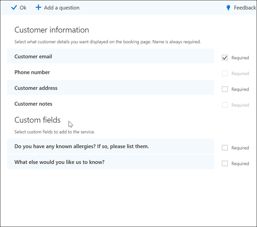
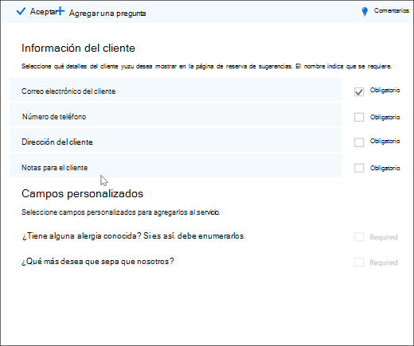

# Agregar preguntas personalizadas y obligatorias a la página de reservaAdd custom and required questions to the booking page

Las reservas le permiten crear preguntas para preguntar a los clientes cuando están reservando citas.Bookings lets you create questions to ask your customers when they are booking appointments. También le permite elegir qué preguntas son necesarias.It also lets you choose which questions are required.

Las preguntas se asocian con un servicio, por lo que cada servicio puede tener un conjunto diferente de preguntas.You associate the questions with a service, so each service can have a different set of questions. Por ejemplo, un estilo de pelo puede solicitar a los clientes que están reservando una cita para colorear el pelo si tienen alergias conocidas a blanqueamientos o matices.For example, a hair stylist may ask customers who are booking a hair coloring appointment if they have any known allergies to bleaches or tints. Esto le permite a usted y a sus clientes ahorrar tiempo cuando llegan a su cita.This allows you and your customers to save time when they arrive for their appointment.

Los clientes verán las preguntas personalizadas al crear su cita en la página de reserva.The customers will see the custom questions when they are creating their appointment on the booking page. El personal verá las preguntas personalizadas al crear una nueva reserva desde el calendario de reservas o al ver una cita existente.Staff will see the custom questions when they create a new booking from the Bookings calendar or when viewing an existing appointment. Bookings guarda todas sus preguntas en una lista maestra para que no tenga que volver a crear las mismas preguntas para cada servicio.Bookings saves all of your questions to a master list so that you don't have to re-create the same questions for every service. También puede elegir si las preguntas son obligatorias u opcionales.You can also choose whether questions are required or optional.

> [!NOTE]
> Las respuestas del cliente a las preguntas se pueden ver al mirar su cita en el calendario de reserva.The customer's answers to the questions can be seen when you look at their appointment in the booking calendar.

Para obtener más información acerca de cómo personalizar y personalizar la página de reserva, vea [personalizar la página de reserva](customize-booking-page.md).For more information about how to personalize and customize your booking page, see [Customize your booking page](customize-booking-page.md).

## Agregar preguntas personalizadas a los serviciosAdd custom questions to your services

1. Inicie sesión en Microsoft 365 y vaya a **reservas**.Sign in to Microsoft 365 and go to **Bookings**.

1. Vaya a **servicios** y edite un servicio existente o **agregue un servicio**.Go to **Services** and either edit an existing service or **Add a service**.

1. Desplácese hacia abajo hasta la sección **campos personalizados** y, a continuación, seleccione **modificar**.Scroll down to the **Custom fields** section, and then select **Modify**.

   Ya hemos agregado algunas preguntas básicas sobre la información del cliente: correo electrónico del cliente, número de teléfono, dirección del cliente y notas para el cliente.We already added some basic customer information questions: Customer email, phone number, customer address, and customer notes. La primera vez que lo haga, las preguntas de información del cliente se resaltan en gris.The first time you do this, the customer information questions are highlighted in gray. Esto significa que el usuario verá esta pregunta.That means that the user will see this question. Si selecciona la pregunta, el cuadro resaltado que hay alrededor desaparecerá y no se le preguntará al cliente.If you select the question, the highlight box around it will disappear and your customer won't be asked that question.

   En este ejemplo, los números de teléfono y las notas de los clientes se han desactivado, y se han creado dos preguntas nuevas personalizadas.In this example, phone number and customer notes have been turned off and we created two new custom questions to ask.

   

1. Para hacer la pregunta necesaria, active la casilla **obligatorio** .To make the question required, select the **Required** checkbox. El cliente no podrá completar la reserva hasta que haya respondido a las preguntas necesarias.Your customer won't be able to complete the booking until they've answered the required questions.

1. Para crear una pregunta personalizada, seleccione **Agregar una pregunta** en la parte superior del panel.To create a custom question, select **Add a question** from the top of the panel. Escribe la pregunta y, a continuación, selecciona **Guardar**.Write your question, and then select **Save**.

1. Haga clic en la pregunta para habilitarla.Click on the question to enable it. Aparece una casilla resaltada alrededor y la pregunta está habilitada.A highlighted box appears around it and the question is enabled.

1. Haga clic en **Aceptar** en la parte superior de la página y, a continuación, **guarde el servicio**.Click **Ok** at the top of the page, and then **Save the service**.

Las reservas guardarán todas las preguntas personalizadas en una lista general para que pueda agregar fácilmente preguntas a cada servicio sin necesidad de escribir repetidamente las mismas preguntas.Bookings will save all of your custom questions in a master list so that you can easily add questions to each service without needing to repeatedly type the same questions. Por ejemplo, si abre un servicio diferente, la pregunta que ha creado para el primer servicio se mostrará en la sección campos personalizados, pero quedará deshabilitada.For example, if you open a different service, the question you created for the first service will show in the Custom fields section, but it wil be disabled. Haga clic en la pregunta para que se muestre un rectángulo resaltado y la pregunta esté habilitada.Click the question so that a highlighted rectangle displays and the question is enabled.

En este ejemplo, puede ver que las preguntas que se agregaron para el primer servicio están disponibles para este servicio.In this example, you can see that the questions that were added for the first service are available for this service. Las preguntas que cree para este servicio estarán disponibles para todos los servicios.Any questions you create for this service will be available for all services.

   

Si la página de reserva ya está publicada, no es necesario que haga nada más.If your booking page is already published, you don't need to do anything else. Los clientes verán las preguntas la próxima vez que se pongan en el libro.Customers will see the questions the next time they book with you. Si aún no se ha publicado la página de reservas, vaya a la **Página de reserva** de Outlook en la web y, a continuación, seleccione **Guardar y publicar**.If your booking page isn't published yet, go to the **booking page** from Outlook on the web, and then select **Save and publish**.

> [!WARNING]
> También puede eliminar preguntas de la lista general.You can also delete questions from the master list. Sin embargo, si elimina una pregunta, se eliminará de todos los servicios.However, if you delete a question it will be deleted from every service. Le recomendamos que deshabilite la pregunta seleccionándola para asegurarse de que no afecta a ningún otro servicio.We recommend that you disable the question by selecting it to ensure you do not impact any other services. Puede ver que una pregunta está deshabilitada si no está rodeada por un rectángulo resaltado.You can see that a question is disabled if it is not surrounded by a highlighted rectangle.

## Experiencia del clienteCustomer experience

Cuando sus clientes le concertan una cita con usted, las preguntas básicas de información del cliente se mostrarán en la sección **Agregar sus detalles** .When your customers book an appointment with you, the basic customer information questions will show in the **Add your details** section. Las preguntas personalizadas que agregues estarán en la sección **proporcionar información adicional** .Any customized questions you add will be in the **Provide additional information** section.

## Experiencia del personalStaff experience

Cuando sus clientes reserven una cita con usted, el personal verá las preguntas y las respuestas del cliente en el calendario de reserva.When your customers book an appointment with you, your staff will see the questions and the customer's answers on the booking calendar. Para verlo, vaya al calendario de **reservas** \> **Calendar** y, después, abra una cita.To see it, go to **Bookings** \> **Calendar** and then open an appointment.

