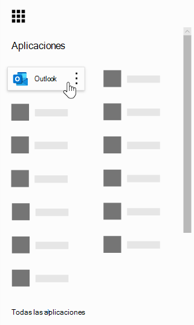
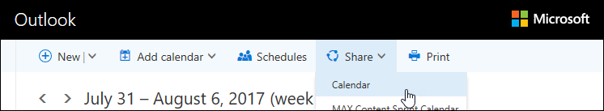
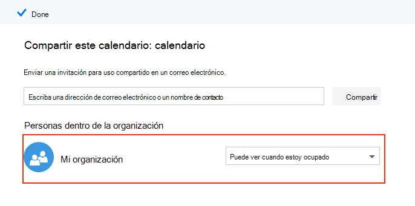
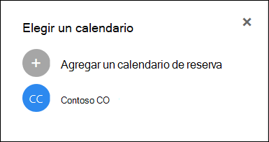

# Preguntas más frecuentes sobre Microsoft bookings

## General

### ¿Qué es Microsoft bookings?

Microsoft bookings es una aplicación de Microsoft 365 que facilita la programación y la administración de las citas. Las reservas incudesn un calendario de reserva basado en Web y se integran con Outlook para optimizar el calendario del personal, dando flexibilidad a los clientes para reservar una hora que funcione mejor para ellos. Los mensajes de correo electrónico de notificación automatizada reducen los programas y las organizaciones ahorran tiempo con una disminución de las tareas de programación repetitivas. Las reservas le ayudarán a realizar citas virtuales fácilmente a través de Skype o Microsoft Teams y le ayudarán a administrar la programación diaria a través de la aplicación bookings en Teams. Con la capacidad integrada para la personalización, las reservas están diseñadas para satisfacer las necesidades de varias partes de cualquier organización.

### ¿Cómo se usa Microsoft bookings?

Las reservas son un servicio en línea, por lo que no es necesario descargar nada. Solo tiene que ir al selector de aplicaciones dentro de la experiencia web de Microsoft 365. Los administradores también pueden usar la aplicación de libro guía de reservas para estar al día de la información más reciente sobre los clientes y sus citas.

### ¿Quién tiene acceso a Microsoft bookings?

Bookings está disponible y activo de forma predeterminada para los clientes de Microsoft 365 Business Premium, a3, A5, E3 y E5 en todo el mundo. Las reservas también están disponibles en Office 365 operado por 21Vianet.

### ¿Mis clientes verán mi calendario personal o de negocio?

Los clientes solo verán el calendario de reservas que publique en línea para los servicios, las horas y el personal que decida registrar.

### ¿Cómo acceden los usuarios finales a la aplicación de reservas?

Los usuarios con licencia para Microsoft 365 Business Premium, a3, A5, E3, E5 o se agregan como miembros del personal en los roles de administrador o visor pueden obtener acceso a reservas en el selector de aplicaciones dentro de la experiencia web de Microsoft 365. También hay una aplicación complementaria disponible para iOS y Android.

### ¿Puedo usar reservas en mi propio sitio web?

Sí. Le proporcionamos una forma de insertar su calendario de reservas en su sitio a través de un iFrame. El código de incrustación de vínculos se encuentra en la pestaña **Página de reservas** dentro de la aplicación de reservas.

### ¿Puedo usar reservas incluso si no tengo una página web para mi empresa?

Sí. Se proporciona un vínculo a la página de reserva en la pestaña de la **Página de reserva** de la aplicación Web. Solo tiene que proporcionar ese vínculo a los clientes o clientes y verán la información de disponibilidad más reciente para su empresa. Como alternativa, puede compartir la página de reserva en los medios sociales o incluso usar la característica de incrustación para hospedarla en un iFrame. También tiene la posibilidad de controlar quién puede tener acceso a la página al deshabilitar la indización directa del motor de búsqueda y restringir el acceso solo a los usuarios de la organización.

### ¿Puede nuestro Departamento de ti controlar si los usuarios finales pueden acceder a reservas?

Las reservas están disponibles de forma predeterminada en los inquilinos de empresa Premium, M365 A3/A5 y E3/E5, pero los administradores pueden desactivarla en el centro de administración de Microsoft 365, si así lo deciden. Para ello, [siga estas instrucciones](turn-bookings-on-or-off.md).

Si un cliente desea deshabilitar el acceso a las reservas para determinadas licencias elegibles en su inquilino, puede que el usuario tenga una directiva de grupo para restringir las licencias o implementar una directiva de buzón de OWA que restrinja los usuarios que pueden crear calendarios de reservas nuevos.

Si usa una directiva de buzón de OWA para deshabilitar el acceso a las reservas, todos los usuarios tendrán una licencia de reservas, pero cuando intenten acceder a la aplicación, solo tendrán éxito si forman parte de la Directiva o si se han agregado a un calendario de reservas existente como personal. Detalles [aquí](turn-bookings-on-or-off.md) en la sección "permitir solo a los usuarios seleccionados para crear calendarios de reservas".

### ¿Hay reservas personalizables?

Sí, las reservas se pueden personalizar y se pueden usar para una variedad de escenarios diferentes. Al configurar un calendario de reservas, se pueden personalizar muchos aspectos de la página de programación basada en Web, la información de la empresa, los detalles del personal, los tipos de servicio y las directivas de programación.

### ¿Todas las funciones de la aplicación Web de reservas originales están disponibles en Microsoft Teams?

Una versión ligera de reservas está ahora disponible como una aplicación en Microsoft Teams. Busque [aquí](https://www.microsoft.com/microsoft-365/blog/2020/03/06/empowering-care-teams-with-new-tools-in-microsoft-365/)el anuncio inicial. Hay una funcionalidad de vínculo de Deep que se puede mostrar en la aplicación web y, después de la instalación, el uso diario de las reservas se puede realizar sin salir de los equipos. La información fluye entre plataformas.

### ¿Tiene reservas una oferta pequeña de negocio o una oferta empresarial o ambas?

Las reservas son una solución ideal tanto para los clientes empresariales como para las pequeñas empresas, en una amplia variedad de industrias. Entre los casos de uso se incluyen:

- Servicios financieros
    - consultas
    - servicios de banca y seguros
    - archivado de impuestos

- Recursos humanos (HR)
    - entrevistas con candidatos
    - incorporación
    - asistencia para los beneficios
    - formación y seminarios

- Salud
    - visitas al paciente
    - colaboración entre proveedores
    - consultas de los seguros

- Sector público de & de gobierno
    - audiencias y pruebas judiciales
    - servicios públicos
    - citas de Departamento

- Educación--K-12
    - conferencias de padres y profesores
    - Salón de la ciudad del centro educativo
    - estudiantes: visitas counselor

- Educación: superior Ed
    - horas de oficina
    - tutores
    - servicios para alumnos
    - registro del examen

- Venta al por menor
    - compra asistida
    - programación de contratistas
    - servicios de diseño

- Necesidades generales de empresa y pequeña empresa
    - reuniones de clientes y clientes
    - soporte técnico
    - revisiones legales
    - alojamientos

## Precios y licencias

### ¿Cómo obtengo Microsoft bookings?

Las reservas están disponibles en Microsoft 365 para los clientes con licencias de Business Premium, a3, A5, E3 y E5, junto con una aplicación complementaria de iOS y Android. Las reservas no están disponibles como una aplicación independiente. Outlook Web App u Outlook en la web deben estar habilitados para usar reservas, ya que almacena datos en Outlook.

Una licencia de reservas proporciona funcionalidad completa al producto, incluida la creación y la administración de calendarios. También permite a los usuarios ver y editar los calendarios existentes, cuando dichos usuarios se agregan como personal en un rol de administrador o visor.

### ¿Es necesario migrar mi cuenta de correo electrónico de mi proveedor actual a Microsoft 365?

Puede mantener su proveedor actual, pero las reservas enviarán todas las notificaciones al correo electrónico usado en su cuenta de Microsoft 365.

### ¿Pueden mis empleados usar reservas sin una cuenta de Microsoft 365?

Sí. Puede Agregar a su personal con cualquier correo electrónico y, igualmente, recibirá la confirmación por correo electrónico y la invitación de calendario cuando alguien ponga en un libro una cita con ellos.

### ¿Puedo crear más de un calendario de reservas en la misma cuenta de Microsoft 365 y cambiar entre ellos?

Sí. Puede crear y administrar más de un calendario de reservas con una cuenta. Puede cambiar entre ellos usando el símbolo de intercalación junto al nombre de la empresa en la aplicación web Bookings.

### ¿Qué sucede si mi organización tiene licencias mixtas con F1/F3, E1 y E3/E5?

Reconocemos que muchas organizaciones tienen una mezcla de licencias de Microsoft 365. Por ejemplo, un cliente puede tener licencias de M365 E3 para los empleados de la sede central, pero M365 las licencias E1 (o F1 o F3) para sus empleados de la tienda.

En este ejemplo, los empleados de la sede central con una licencia de M365 E3 tienen acceso completo a las reservas, lo que significa que pueden crear nuevos calendarios, editar la configuración, agregar personal, publicar una página de reserva, crear y administrar citas dentro del calendario y extraer informes.

De esta forma, los empleados de la tienda pueden seguir agregando a los calendarios en un rol de invitado y, a continuación, se reservan mensajes de confirmación para las citas, y recibirán un mensaje de confirmación cuando estén reservados. Todavía se pueden reservar durante las horas programadas/disponibles, como se indica en la ficha personal. La disponibilidad del calendario de reservas limita las horas de bookable por sus horas de servicio y horas de servicio.

Los empleados de la tienda también se mostrarán como no disponibles en las reservas si ya se ha programado una cita en ese momento a través de la aplicación web Bookings. Las citas reservadas a través de reservas se reflejarán como ocupado en el calendario de un miembro del personal dentro de las reservas. El personal con una licencia que no esté habilitada para las reservas todavía puede tener el mismo impacto que su calendario personal en las reservas, siempre que se encuentren dentro del mismo espacio empresarial.

Los usuarios del rol Guests pueden ver cualquier información que el cliente haya proporcionado en la creación de la cita inicial. Por ejemplo, si el representante del almacén que está reservado para la cita es necesario para llamar al cliente antes de la cita, tendrá acceso a la información que el cliente proporciona durante el proceso de programación. El miembro del personal que se registra tendrá acceso a toda la información que aparece en el correo electrónico de confirmación, así como al evento de calendario. ICS (como el número de teléfono del cliente si se ha escrito).

Los usuarios del rol invitado no podrán acceder a la aplicación web Bookings para cambiar la configuración o para ver y administrar citas (agregar, cancelar y reprogramar). Sin embargo, pueden realizar citas en nombre de los clientes mediante la página de autoservicio, de la misma manera que un cliente debería hacer una cita.

Se recomienda conceder licencias a un administrador o administrador de negocio de cada tienda con una licencia elegible para reservas para configurar y administrar páginas y citas. El resto del personal, a continuación, trabajará con el empleado con licencia con reservas para volver a programar o cancelar una reserva.

## Características del producto

### ¿Dónde se muestran los calendarios de reservas en mi inquilino de Microsoft 365? * *

Cada nuevo calendario de reservas crea un buzón de correo correspondiente en Exchange, así como una entrada relacionada en Azure Active Directory (AAD), donde la entrada aparece como un usuario sin licencia.

### ¿Puedo eliminar un calendario de reservas creado anteriormente?

Para eliminar un calendario de reservas, debe eliminar el buzón asociado en Exchange.

### Si creo un calendario y alguien más tiene acceso a reservas, ¿podré ver mi calendario?

Las únicas personas que tienen acceso a los calendarios de reservas que crea (a través de la aplicación web) son todos los que se han agregado como personal en una función de administrador o visor. Los administradores de inquilinos podrán ver una lista de todos los buzones de correo de reservas en Exchange y AAD.

### ¿Las reuniones de videoconferencia están integradas en la aplicación de reservas?

Las reuniones en línea están disponibles en las reservas cuando se usan los clientes de Skype o Microsoft Teams. Las reuniones en línea pueden habilitarse en el nivel de servicio y el cliente de la reunión que elija (Skype o Teams) será el único establecido de forma predeterminada para un miembro del personal de reserva. Para unirse a las reuniones en línea, cada nueva cita tendrá un vínculo de reunión único adjunto a la cita y además, las opciones de combinación sencilla se incluyen en el evento y en los correos electrónicos de confirmación.

### ¿Cómo funciona la Directiva de programación?

Una configuración llamada plazo **máximo** determina la más lejana (medida en días) que se puede realizar una reserva. Debe haber al menos 24 horas entre el tiempo de **entrega mínimo** (tiempo de entrega mínimo, en horas, para reservas y cancelaciones) y el plazo de entrega máximo. El plazo máximo se puede establecer en un día si el plazo mínimo se establece en 0 horas, que en este caso significa que un cliente puede cancelar una reserva hasta el momento en que se inicia y los clientes solo pueden programar reservas si la cita pertenece al día siguiente.

:::image type="content" source="media/bookings-faq-scheduling.png" alt-text="Programación en reservas":::

### ¿Cómo funcionan las reservas en zonas horarias?

Todas las horas se encuentran en la zona horaria comercial (la zona horaria local) de forma predeterminada. Esto significa que cualquier configuración que configure para un calendario de reservas, como horas laborables, aparecerá en esta zona horaria. La página de autoservicio tiene la capacidad de mostrar todas las horas de las citas en la zona horaria del usuario final, lo que se puede desactivar si se desea.Si **siempre mostrar las franjas temporales en la zona horaria comercial** permanece desactivada en la pestaña de la página de reservas, las personas que visiten la página verán las franjas horarias en sus propias zonas horarias locales.

:::image type="content" source="media/bookings-faq-region.png" alt-text="Configuración de zona horaria y región de reservas":::

No hay ninguna disposición para establecer la zona horaria para el personal en las reservas. La zona horaria del personal y, por lo tanto, el horario comercial, estará en la zona horaria comercial.

### ¿Se pueden enviar notificaciones de correo electrónico como nombre de dominio del inquilino?

Las direcciones de correo electrónico se controlan y administran en el nivel de configuración de Microsoft 365 y dependen de las opciones de configuración del dominio. Puede encontrar más información [aquí](https://docs.microsoft.com/powershell/module/exchange/get-accepteddomain).

### ¿Es la capacidad de enviar mensajes SMS que dependen de un servicio o una configuración específica diferentes?

Los mensajes SMS están actualmente disponibles en Norteamérica y se utilizará una cuenta de Skype o Twilio para la entrega de SMS.

### ¿Cómo se pueden mostrar citas de reservas en el calendario de una persona?

La confirmación de la reserva se envía a las bandejas de entrada del proveedor de servicios y del cliente. El correo electrónico de confirmación contiene un archivo de datos adjuntos *. ics, que se puede Agregar al calendario del usuario con todos los detalles relevantes de la cita.

### ¿Qué desencadena el proveedor de servicios o el personal y los correos electrónicos de clientes?

Los correos electrónicos se activan en función de la configuración en la pestaña servicios de la aplicación web Bookings. Una reserva realizada por el cliente en la página de autoservicio, o en la ficha calendario de la aplicación web Bookings, desencadenará una confirmación o un aviso de correo electrónico. Lo mismo ocurrirá cuando alguien realice un cambio en la reserva a través del botón **administrar reserva** en el correo electrónico de confirmación o dentro de la aplicación Web. Los correos electrónicos de aviso se envían en un período de tiempo especificado antes de una cita, como se detalla en la pestaña servicios de la aplicación web Bookings.

### ¿Puedo reservar citas de tipo aula que sean 1: muchas en lugar de 1:1?

Sí, tenemos una funcionalidad de reservas de grupo que permite que varias personas puedan reservar la misma cita al mismo tiempo (por ejemplo, para una clase física). Esta funcionalidad se describe en detalle [aquí](https://techcommunity.microsoft.com/t5/microsoft-bookings-blog/microsoft-bookings-now-supports-online-meetings-and-group/ba-p/1214120).

### ¿Los calendarios permanecen sin publicar (no accesibles públicamente) pero siguen siendo accesibles para los usuarios designados?

Sí. Hay una casilla de verificación en la pestaña de la página de reserva en la aplicación web: **requerir una cuenta de Microsoft 365 o de Office 365 de mi organización para reservar un libro**. Al activar esta casilla de verificación, se restringe el acceso a páginas de autoservicio solo a los que se encuentran en el espacio empresarial. El calendario de reservas que se encuentra dentro de la aplicación web para la creación y la administración solo pueden obtener acceso los usuarios agregados como personal a la página con roles de administrador o visor.

:::image type="content" source="media/bookings-faq-access-ctrl.png" alt-text="Control de acceso a la página de reserva en reservas":::

### ¿Con qué frecuencia se actualiza la Página principal?

Los datos más recientes vinculados a la Página principal se recuperan siempre que se carga la aplicación Web. Para obtener más información sobre el tipo de información de la que se realiza un seguimiento mediante reservas, consulte este [artículo de soporte](metrics-and-activity-tracking.md).

### ¿Puedo desactivar las notificaciones de correo electrónico para que no se puedan usar?

El tiempo de grabación en la aplicación Web de reservas siempre desencadenará un mensaje de correo electrónico de notificación a los miembros del personal. Si algún miembro del personal está confundido sobre la notificación, le recomendamos que agregue más detalles en las notas o el título de la notificación de tiempo de inactividad, para informar al personal sobre lo que ocurre en el administrador.

### ¿Pueden clonar los calendarios de reserva o duplicarlos, y pueden ser templatized para facilitar el escalado?

Actualmente, la capacidad para duplicar páginas está disponible a través de PowerShell. El proceso sería usar la API de Graph para obtener detalles de los buzones y, a continuación, usar estos detalles para crear un nuevo buzón. La documentación de la API está [aquí](https://docs.microsoft.com/graph/api/resources/booking-api-overview?view=graph-rest-beta).

### ¿Qué informes está disponible en las reservas?

Todo el personal de reservas asignado a la función de administrador puede descargar valores separados por tabuladores (. TSV) con todas las reservas realizadas en los últimos 120 días. Los informes de reservas se pueden descargar en. TSV desde la pestaña Inicio de la página reservas. La API de reservas también se puede usar para recopilar estos datos para fines más personalizados y específicos.

### ¿Es posible compartir un solo servicio en la página de autoservicio al mismo tiempo?

Sí, puede crear calendarios de pedidos independientes para cada servicio, o bien puede ir a la pestaña servicios, editar un servicio y, en la parte superior de la página, verá una opción para compartir una dirección URL solo para ese servicio específico.

### ¿Qué opciones hay disponibles para insertar un formulario de consentimiento o revelación para los que están reservando una cita?

Se recomienda habilitar la casilla de verificación **consentimiento del uso de datos del cliente** de la página de reserva y personalizar la redacción para transmitir correctamente los requisitos de divulgación o consentimiento de la organización. Otra opción consiste en agregar un campo personalizado al servicio que incluya un vínculo al formulario de consentimiento y requerir a los clientes que confirmen que han completado el formulario antes de continuar con la toma de la cita. También puede Agregar la dirección URL del formulario de consentimiento como notas adicionales en los correos electrónicos de confirmación y aviso, pero esto no impedirá que los usuarios reserven una cita.

### ¿Qué cambios se pueden realizar en la función de selección de personal en la página de reserva de autoservicio?

La posibilidad de que los clientes seleccionen miembros del personal específicos cuando se pueden quitar por completo la reserva mediante la desactivación de la opción **permitir a los clientes elegir una persona específica para la reserva** en la página reserva o en la sección servicios. Las reservas asignarán automáticamente un miembro del personal disponible de forma aleatoria a la reserva, en función de la disponibilidad del personal.

### ¿Pueden las reservas admitir muchas solicitudes de reserva simultáneas y visitas de página de autoservicio?

La reserva puede admitir una gran cantidad de visitantes y reservas al mismo tiempo. Si la página experimenta un gran volumen de tráfico, los usuarios recibirán un error de "servidor ocupado". La disponibilidad de la cita se actualiza cuando se carga la página, así como cuando se realiza una reserva. Si varias personas intentan reservar la misma cita al mismo tiempo, las reservas solo permitirán que un usuario tenga la misma hora y entregue un mensaje de notificación a los demás clientes potenciales, y les pedirá que busquen una hora distinta.

## Privacidad

### ¿Dónde se almacenan los datos de las reservas?

Bookings es una aplicación de Microsoft 365, lo que significa que todos los datos se almacenan en la plataforma de Microsoft 365 y en Exchange. Reservas sigue todas las directivas de almacenamiento de datos establecidas por Microsoft, que son las mismas directivas seguidas por todas las aplicaciones de Office. Las reservas usan buzones compartidos en Exchange para almacenar los detalles de los clientes, el personal, el servicio y las citas. Las directivas de cumplimiento para buzones compartidos en Exchange también se aplican a los buzones de reserva. Todos los datos de los clientes (incluida la información proporcionada por los clientes al reservar) se capturan en reservas y se almacenan dentro de la aplicación, por lo que se almacenan en Exchange. Microsoft bookings usa las mismas directivas usadas por Microsoft 365, que puede encontrar [aquí.](https://www.microsoft.com/online/legal/v2/?docid=22&langid=en-us)

### ¿Hay alguna forma de administrar de forma centralizada los calendarios de reservas para todos los usuarios?

Cada calendario de reservas se mantiene de forma independiente. No hay ninguna vista consolidada que no sea la lista desplegable de búsqueda después de hacer clic en el símbolo de intercalación de la Página principal.

### ¿Cómo se autentican los usuarios?

El acceso a la aplicación Web de reservas implica la autenticación mediante la autenticación normal de Azure Active Directory (AAD). La página de reserva de autoservicio se puede poner a disposición de todos los usuarios con el vínculo de la Página Web. Sin embargo, cuando la opción **requerir una cuenta de Microsoft 365 u Office 365 de mi organización** al libro está seleccionada, la página está restringida para usarse solo dentro del inquilino de Microsoft 365 (mediante la autenticación de AAD).

:::image type="content" source="media/bookings-faq-access-ctrl.png" alt-text="Control de acceso a la página de reserva en reservas":::

### ¿Los datos de cliente abandonan el sistema de producción por algún motivo?

Sí, dado que las reservas forman parte de Exchange, permitimos las API de Graph y las API de servicios web Exchange (EWS) para que los clientes descarguen sus propios datos a los que tienen acceso.

### ¿Existe la posibilidad de personalizar las direcciones de correo electrónico para las respuestas de los clientes?

Existe la posibilidad de definir a qué dirección de correo electrónico deben enviar sus respuestas los clientes. Esta configuración se encuentra en la pestaña **información empresarial** . El nombre del buzón de correo de las reservas también puede cambiarse dentro de Exchange, a través de los procesos habituales de cambio de nombre de los buzones de Exchange.

### Nos gustaría que el cliente Acepte nuestros términos y condiciones durante el proceso de reserva. ¿Es posible?

Esta característica ya existe para el cumplimiento de RGPD. La página de reserva tiene un campo para el consentimiento personalizado, justo debajo de la sección detalles de publicación. Solo tiene que activar esta casilla y escribir su propio mensaje de consentimiento personalizado y se mostrará como un campo obligatorio en la página de autoservicio. Se registrará la fecha y la hora en que el cliente concede el consentimiento.

En esta sección no se admite texto enriquecido, pero se pueden agregar vínculos en la sección información de la empresa y mostrarse justo debajo de la casilla de verificación consentimiento.

### ¿Cómo pueden identificarse los buzones asociados a la reserva en Exchange?

El siguiente comando se puede usar para recuperar información de todos los buzones de correo de reservas y los usuarios que tienen acceso a ellas.

`Get-Mailbox -RecipientTypeDetails SchedulingMailbox -ResultSize:Unlimited | Get-MailboxPermission |Select-Object Identity,User,AccessRights | Where-Object {($\_.user -like '\*@\*')}`

## Preguntas técnicas

### Si un usuario programa una cita para un servicio que consta de una reunión en línea, ¿cómo reciben el vínculo de Microsoft Teams a la reunión si dejan el campo de dirección de correo electrónico opcional vacío?

Si el sistema no tiene la información de correo electrónico del cliente, no hay forma de que el mensaje de confirmación se entregue al cliente, por lo que no recibirá un vínculo de Microsoft Teams. La solución es establecer la dirección de correo electrónico como campo obligatorio, que se puede realizar en la pestaña servicios de reservas. Tenga en cuenta que cada vez que se crea un nuevo servicio en reservas, el campo correo electrónico del cliente se establece de forma predeterminada como un campo obligatorio.

### ¿Cómo se asigna el personal a las citas cuando se selecciona "cualquiera" o cuando los clientes no tienen la posibilidad de elegir un miembro del personal para la cita?

El personal se asigna de forma aleatoria en estos escenarios y todos los miembros del personal están disponibles en el momento en que se reserva la cita. Actualmente no hay ninguna manera de garantizar la misma distribución de citas asignadas de forma aleatoria en todos los miembros del personal o para recapitular el número de citas asignadas a cada miembro del personal. Si hay un equilibrio de carga que debe realizarse en el personal después de varias asignaciones aleatorias, puede realizarse manualmente en la ficha calendario dentro de la página reservas.

### ¿Cómo pueden los usuarios dejar de recibir mensajes SMS si ya han optado por ellos anteriores?

Cuando Reserve una cita con los mensajes de texto de SMS habilitados, se les pedirá a los clientes que marquen el cuadro participar cada vez que lo hagan. Los clientes también pueden responder directamente al mensaje SMS (el proveedor de SMS), lo que indica que desea que cesen los mensajes y, a continuación, no se enviarán más textos a ese número de teléfono. Si el cliente opta por no recibir mensajes de texto del proveedor, no de sus propias reservas, ya no recibirán mensajes de SMS en el futuro, incluso cuando se opte por la página reservas.

## Solución de problemas

### El calendario de este miembro del personal no se puede sincronizar

Si recibe el error, "no se puede sincronizar el calendario de un miembro del personal", esta sección contiene varios procedimientos de solución de problemas para ayudarle a resolver el error.

> [!NOTE]
> Las reservas están activadas de forma predeterminada para los clientes con las suscripciones Microsoft 365 Business Standard, Microsoft 365 a3 o Microsoft 365 A5. Las reservas también están disponibles para los clientes que tienen Office 365 Enterprise E3 y Office 365 Enterprise E5, pero están desactivados de forma predeterminada. Para empezar, vea [obtener acceso a Microsoft bookings](get-access.md). Para activar o desactivar las reservas, consulte [activar o desactivar las reservas para su organización](turn-bookings-on-or-off.md).

Si está buscando información sobre cómo sincronizar el calendario del personal, vea [Agregar personal a reservas](add-staff.md). Asegúrese de que en la página **detalles del personal** , se ha seleccionado la casilla **eventos en el calendario afectar a la disponibilidad** .

### El miembro del personal debe cambiar los permisos de calendario

Para que los pedidos se sincronicen correctamente con los calendarios de los miembros del personal, cada miembro del personal debe compartir su calendario. Cada miembro del personal debe seguir estas instrucciones para compartir su propio calendario.

1. Inicie sesión en Microsoft 365 y, a continuación, seleccione **Outlook** desde el iniciador de aplicaciones.

   

1. En la parte superior de la página, seleccione **compartir** \> **calendario**.

   

1. En la sección **personas dentro de la organización** , active la casilla desplegable situada junto a **mi organización**y, a continuación, seleccione **puede ver cuando estoy ocupado**.

> [!NOTE]
> Esta opción comparte la información de disponibilidad con reservas y con otros usuarios de la organización. No incluye ninguna otra información, como el tipo de cita que ha programado, la persona con la que ha programado la cita o la ubicación.

   

1. Seleccione **Listo**.

### No encontramos un miembro del personal en nuestra organización

Si un empleado abandonó la compañía y la ha quitado de su organización de Microsoft 365 u Office 365, aún tendrá que quitar ese usuario de reservas para que no aparezca en el calendario y para evitar que los clientes reserven citas con ellos.

1. Inicie sesión en Microsoft 365 y, a continuación, vaya al personal de **reservas** \> **Staff**.

1. Sitúe el cursor del mouse sobre el nombre del miembro del personal. Los iconos **Editar** y **eliminar** aparecen a la derecha de la columna **teléfono** .

1. Seleccione el icono **eliminar** .

1. En el cuadro de confirmación, seleccione **Aceptar**.

> [!NOTE]
> Si tiene más de un calendario de reserva, debe quitar el usuario de todos ellos.

Para comprobar si tiene más de un calendario, en el menú de la izquierda, seleccione la flecha desplegable junto al nombre de la compañía y, a continuación, seleccione **abrir**. Si solo tiene un calendario, solo verá la opción para agregar un calendario de reserva. En este ejemplo se muestra que hay un segundo calendario denominado "Contoso CO".

   

### Hay un error de sincronización que no se puede identificar

Se trata de un error transitorio y normalmente se produce debido a una conexión a Internet inestable. Estos problemas suelen resolverse a sí mismos tras unos minutos.

Si sigue viendo este error después de un período de tiempo prolongado o si lo ve con frecuencia, póngase en contacto con el soporte técnico.

## Recursos adicionales

  - [Microsoft bookings amplía la disponibilidad en el blog de empresas](https://techcommunity.microsoft.com/t5/microsoft-bookings-blog/microsoft-bookings-expands-availability-in-enterprises/ba-p/1214065)

  - [Cómo funciona Microsoft bookings en vídeo](https://support.office.com/article/microsoft-bookings-69c45b78-6de4-4f28-9449-cdcc18b7ae45)

  - [Empezar a usar Microsoft bookings](get-access.md)

  - [Activar o desactivar Microsoft bookings](turn-bookings-on-or-off.md)

  - [Agregar usuarios individualmente o de forma masiva](https://docs.microsoft.com/microsoft-365/admin/add-users/add-users?view=o365-worldwide.)

  - [Agregar personal a las reservas](add-staff.md)

  - [Componentes de la API para automatizar una vez que se ha definido la plantilla](https://docs.microsoft.com/graph/api/bookingbusiness-post-bookingbusinesses)

  - [Dirección URL del calendario de reservas para mostrar](https://outlook.office.com/bookings/calendar)

  - [Directivas de cumplimiento de las reservas](https://docs.microsoft.com/microsoft-365/compliance/gdpr-dsr-office365?view=o365-worldwide#bookings)

  - [Personalizar y publicar la página de reserva](customize-booking-page.md)

  - [Configuración de buzón del espacio empresarial](https://docs.microsoft.com/powershell/module/exchange/get-accepteddomain)

  - [Reservas de grupo](https://techcommunity.microsoft.com/t5/microsoft-bookings-blog/microsoft-bookings-now-supports-online-meetings-and-group/ba-p/1214120)

  - [Métricas de reservas y seguimiento de actividades](metrics-and-activity-tracking.md)

  - [Guía básica de M365 pública](https://www.microsoft.com/microsoft-365/roadmap?filters=&searchterms=bookings)

  - Enviar comentarios a través de [UserVoice](https://outlook.uservoice.com/forums/314907-microsoft-bookings/suggestions/39505261-365-admins-should-have-full-access-to-all-bookings)
