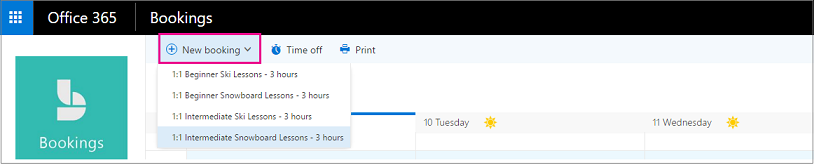
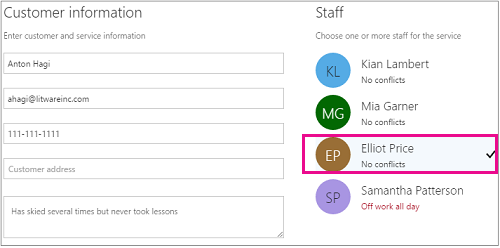

# Crear una reserva manual

Las reservas se pueden programar y proveer de personal de dos maneras diferentes. La primera forma es que el cliente use una página de reserva independiente o una página de reserva integrada que agregue a su sitio Web. La otra forma es que usted o uno de sus empleados especifique las reservas manualmente, como cuando un cliente llama a una cita. En este artículo se describe el escenario manual.

1. En Microsoft 365, seleccione el iniciador de aplicaciones y, a continuación, seleccione **reservas**.

   

1. En el panel de navegación, **Calendar** seleccione \> **nuevo reserva**del calendario.

   

1. Seleccione el servicio que se va a proporcionar. Consulte [definir las ofertas de servicio en Microsoft bookings](define-service-offerings.md) para obtener instrucciones de configuración de servicio.

1. Escriba la información del cliente, incluido el nombre, la dirección de correo electrónico, el número de teléfono y otros detalles relevantes.

1. Seleccione el miembro del personal que proporcionará el servicio. La lista de miembros del personal que se muestra se basa en lo que ha configurado en la página servicios.

   

1. Especifique los detalles del servicio, como la fecha, la hora, la ubicación y otra información relevante. Una vez que escriba una dirección de correo electrónico válida para el cliente, el botón **Guardar** cambiará a **Enviar**y verá una nota que le indicará que se enviará una confirmación al cliente. La confirmación del cliente incluye datos adjuntos para que puedan agregar a su calendario. Los miembros seleccionados del personal también recibirán invitaciones a reuniones con la información de la cita para que puedan agregarla a sus calendarios personales.

1. Seleccione **Agregar un aviso de correo electrónico**.

1. Especifica cuándo debe enviarse el aviso, donde debe enviarse (**cliente**, **personal**, **todos los asistentes**) y qué debe ser el mensaje de aviso.

1. Seleccione **Guardar** \> **envío**.

   Este es un ejemplo de correo electrónico del aviso que recibirá el cliente:

:::image type="content" source="../media/bookings-confirmed-email.png" alt-text="Captura de pantalla: ejemplo de correo electrónico de confirmación de una reserva manual":::