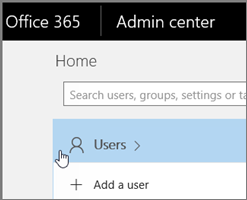

# <a name="delete-a-booking-calendar-in-bookings"></a>Eliminar un calendario de reserva en Bookings

En este artículo se explica cómo eliminar un calendario de reserva no deseado. Puede eliminar el calendario de reserva en el Centro de administración de Microsoft 365 o puede usar PowerShell. El calendario de Bookings es un buzón en Exchange Online, por lo que se elimina la cuenta de usuario correspondiente para eliminar el calendario de reserva.

> [!IMPORTANT]
> Todos los calendarios de reserva que creó en 2017 o antes deben eliminarse con las instrucciones de PowerShell de este tema. Todos los calendarios de reserva creados en 2018 o posterior se pueden eliminar en el Centro de administración de Microsoft 365.

El calendario de reserva es donde se almacena toda la información relevante sobre ese calendario de reserva y los datos, incluidos:

- Información empresarial, logotipo y horario laboral agregados al crear el calendario de reserva
- Personal y servicios relevantes agregados al crear el calendario de reserva
- Todas las reservas y citas de tiempo libre agregadas al calendario de reserva una vez que se creó.

> [!WARNING]
> Una vez que se elimina un calendario de reserva, esta información adicional también se elimina permanentemente y no se puede recuperar.

## <a name="delete-a-booking-calendar-in-the-microsoft-365-admin-center"></a>Eliminar un calendario de reserva en el Centro de administración de Microsoft 365

1. Vaya al Centro de administración de Microsoft 365.

1. En el Centro de administración, seleccione **Usuarios**.

   

1. En la página **Usuarios activos**, elija los nombres de los usuarios que quiera eliminar y después seleccione **Eliminar usuario**.

   

## <a name="delete-a-booking-calendar-using-exchange-online-powershell"></a>Eliminar un calendario de reserva con Exchange Online PowerShell

Consulte [Conectarse a Exchange Online PowerShell](https://docs.microsoft.com/powershell/exchange/exchange-online-powershell-v2?view=exchange-ps) para obtener requisitos previos e instrucciones para conectarse a Exchange Online PowerShell.

Para realizar estos pasos, debe usar una ventana de comandos activa de PowerShell de Microsoft que ejecutó eligiendo la opción "Ejecutar como administrador".

1. Escriba el siguiente comando:

   ```PowerShell
    $user = get-credential
   ```

1. Cuando se le solicite, inicie sesión con las credenciales de administrador de inquilinos en el inquilino de Microsoft 365 que hospeda el calendario de reserva que desea eliminar permanentemente.

1. En el símbolo del sistema de PowerShell, escriba este comando:

   ```PowerShell
    $s = New-Pssession -ConnectionUri https://outlook.office365.com/powershell-liveid -Credential $user -Authentication basic -AllowRedirection -ConfigurationName Microsoft.Exchange
   ```

1. Escriba el siguiente comando:

   ```PowerShell
    Import-PSSession $s
   ```

1. Una vez que este comando haya terminado de procesarse, escriba el siguiente comando para obtener una lista de los buzones de reserva de su espacio empresarial:

   ```PowerShell
    get-mailbox -RecipientTypeDetails Scheduling
   ```

1. Escriba el siguiente comando:

   ```PowerShell
   remove-mailbox [BookingCalendarToDelete]
   ```

   > [!IMPORTANT]
   > Tenga cuidado de escribir el nombre exacto del alias de buzón de reserva que desea eliminar permanentemente.

1. Para comprobar que el calendario se ha eliminado, escriba el siguiente comando:

   ```PowerShell
    get-mailbox -RecipientTypeDetails Scheduling
   ```

   El calendario eliminado no aparecerá en el resultado.
