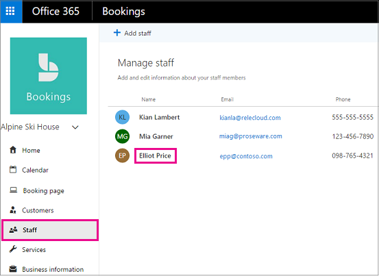

# Horario laboral de los empleados en Microsoft BookingsEmployee working hours in Microsoft Bookings

Establecer el horario laboral de los empleados garantiza que su disponibilidad se muestra con precisión cuando los clientes intentan reservarlas.Setting employee working hours ensures that their availability is accurately shown when your customers try to book them. De forma predeterminada, el horario laboral de cada uno de los empleados coincide con el horario laboral establecido en la aplicación Microsoft Bookings.By default, the working hours for each of your employees match the business hours you've established in the Microsoft Bookings app. Vea la sección "Establecer el horario comercial" de [Introducir información comercial.](enter-business-information.md#set-your-business-hours)See the "Set your business hours" section of [Enter business information](enter-business-information.md#set-your-business-hours).

En la **página Personal,** puede personalizar las horas laborales de los empleados para que se adapten a las necesidades de su empresa y de los empleados.On the **Staff** page, you can customize employee working hours to match the needs of your business and employees.

Si desea reservar tiempo libre para los miembros del personal para que los clientes no puedan reservarlos mientras no están en la oficina, consulte Programar cierres de [negocios,](schedule-closures-time-off-vacation.md) tiempo libre y tiempo de vacaciones para obtener instrucciones.If you want to book time off for staff members so customers can't book them while they're out of the office, see [Schedule business closures, time off, and vacation time](schedule-closures-time-off-vacation.md) for instructions.

## Personalizar el horario laboral de los empleadosCustomize employee working hours

Vea este vídeo o siga los pasos siguientes para establecer el horario laboral de un empleado.Watch this video or follow the steps below to set an employee's working hours.

> [!VIDEO https://www.microsoft.com/videoplayer/embed/RWuXUq]

1. En Microsoft 365, seleccione el iniciador de aplicaciones y, a continuación, **seleccione Bookings**.In Microsoft 365, select the app launcher, and then select **Bookings**.

1. En el panel de navegación, seleccione **Personal** y, a continuación, seleccione el miembro del personal cuyas horas desea establecer.In the navigation pane, select **Staff**, and then select the staff member whose hours you want to set.

   

1. En Horario laboral, desactive la casilla **Usar horario** comercial.Under Working hours, clear the **Use business hours** checkbox.

1. Use las listas desplegables para seleccionar las horas de inicio y finalización de cada día.Use the dropdowns to select start and end times for each day. Los tiempos están disponibles en incrementos de 15 minutos.Times are available in 15-minute increments.

   

1. Haga clic para agregar selectores de hora de **+** inicio y finalización.Click **+** to add start- and end-time selectors.

1. Seleccione Guardar.Select Save.

## Establecer los días de descanso de un empleadoSet an employee's days off

Cuando programe un día libre para un empleado, este aparecerá como no disponible en la página de reserva.When you schedule a day off for an employee, that employee will appear unavailable on the booking page. Los clientes que usan la página de reserva no podrán programarlo para su servicio ese día.Customers using the booking page will be unable to schedule him or her for service on that day.

1. En la pantalla de horario laboral, seleccione la **x** junto al día que el empleado tendrá libre.On the working hours screen, select the **x** next to the day that the employee will have off.

   

1. Si desea programar un día que se marcó previamente como día libre, seleccione el signo junto al día **+** que desea programar.If you want to schedule a day that was previously marked as a day off, select the **+** sign next to the day you want to schedule.

> [!TIP]
> Si programa el tiempo de vacaciones de los empleados u otros grandes bloques de tiempo libre, vea la sección "Programar el tiempo libre del empleado" de Programar cierres de negocios, tiempo libre y tiempo de [vacaciones.](schedule-closures-time-off-vacation.md#schedule-employee-time-off)If scheduling employee vacation time or other large blocks of time off, see the "Schedule employee time off" section of [Schedule business closures, time off, and vacation time](schedule-closures-time-off-vacation.md#schedule-employee-time-off).
