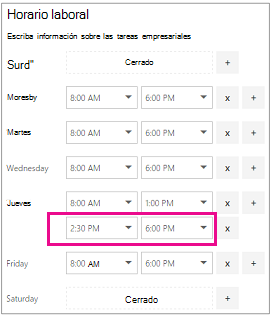
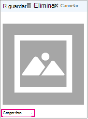

# Escribir la información empresarial

En Microsoft Bookings, la página de información empresarial de la aplicación web contiene todos los detalles que normalmente encontraría en la página "acerca de nosotros" de la empresa. Estos detalles incluyen el nombre, la dirección, el número de teléfono, la dirección URL del sitio web, la dirección URL de la Directiva de privacidad, el logotipo y el horario comercial pertinentes.

La información que proporcione aquí se mostrará en la página que los clientes y clientes usan para reservar citas (conocidas como la página de reserva) y en mensajes y avisos que se les envían mediante reservas. A continuación se resalta un ejemplo de esta información en la página de reserva.

   

> [!NOTE]
> Las reservas están activadas de forma predeterminada para los clientes con las suscripciones Microsoft 365 Business Standard, Microsoft 365 a3 o Microsoft 365 A5. Las reservas también están disponibles para los clientes que tienen Office 365 Enterprise E3 y Office 365 Enterprise E5, pero están desactivados de forma predeterminada. Para empezar, vea [obtener acceso a Microsoft bookings](get-access.md). Para activar o desactivar las reservas, consulte [activar o desactivar las reservas para su organización](turn-bookings-on-or-off.md).

## Proporcionar el nombre de la empresa y la información de contacto

1. En Microsoft 365, seleccione el iniciador de aplicaciones y, a continuación, seleccione **reservas**.

1. En el panel de navegación, seleccione **información empresarial**.

1. Escriba el nombre, la dirección y el número de teléfono relevante que desea usar para el calendario de reservas.

1. En **enviar respuestas de los clientes a**, escriba la dirección de correo electrónico preferida en la que se reenviarán las confirmaciones de reserva y los avisos.

1. En el campo **dirección URL del sitio web** , escriba la dirección URL de la Página principal de su empresa.

1. Especifique la **Directiva de privacidad** y los **términos & las** direcciones URL.

1. Seleccione **Guardar**.

## Configurar el horario comercial

De forma predeterminada, el horario comercial en la aplicación bookings se establece en 8 a.m. a 5 p.m., de lunes a viernes. Las horas se proporcionan en incrementos de 15 minutos. La aplicación de reservas usa el reloj de 12 horas.

Establezca el **horario comercial** para sus horas operativas. Estas son las horas en las que todas las reservas están restringidas. Se pueden establecer restricciones de tiempo adicionales en las que se pueden reservar citas para cada servicio y para cada miembro del personal de las páginas de servicios y personal, respectivamente.

1. En la página información de la empresa, en horario comercial, use los menús desplegables para seleccionar las horas de inicio y finalización de cada día.

1. Haga clic **+** para agregar selectores de inicio y de finalización.

## Cómo establecer horas para un desplazamiento dividido

Es posible que deba bloquear una parte de cada día o semana para que las reuniones del personal, actualicen el inventario o se ocupen de otros detalles del ritmo de la empresa. La aplicación de reservas le permite limitar las citas de los clientes a sus franjas horarias especificadas.

Por ejemplo, tiene reuniones de personal cada jueves de 1 punto a 2:30 y desea bloquear ese tiempo para que todos los miembros del personal puedan asistir. Para ello:

1. En la página información de la empresa, en horario comercial, seleccione una hora de inicio y de finalización para los jueves. En este ejemplo, configuraremos 8:00 a.m. a 1:00 p.m.

1. Seleccione esta **+** columna para crear una fila nueva para el jueves.

   

1. En la fila nueva, seleccione 2:30 p.m. para la hora de inicio y 6:00 p.m. para la hora de finalización.

   

1. Seleccione Guardar.

    Cuando un cliente va a la página de reserva, verá que su empresa está cerrada de 1 a 2:30 los jueves.

## Cargar el logotipo

Si todavía no ha cargado el logotipo de la empresa en la aplicación de reservas, puede hacerlo desde la página de información de la empresa.

1. En la página información de la empresa, en cargar logotipo, seleccione **cambiar**.

1. Seleccione **cargar foto**.

   

1. Haga clic en **Guardar**.
