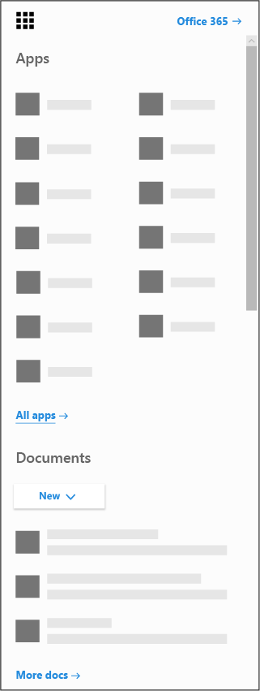

# Obtener la aplicación de Microsoft bookings para iOS y Android

Gracias por descargar la aplicación Microsoft bookings. Microsoft bookings está disponible como una aplicación móvil para iOS y Android. La aplicación de reservas para iOS está disponible en todas las regiones y países compatibles con Apple. Puede descargar la aplicación desde la [App Store de iTunes](https://apps.apple.com/app/microsoft-bookings/id1065657468). La aplicación de reservas para Android está disponible para su descarga desde [Google Play Store](https://play.google.com/store/apps/details?id=com.microsoft.exchange.bookings) en los Estados Unidos y Canadá.

Antes de empezar, debe configurar las reservas en la Web.

1. ¿No encuentra la aplicación que busca? En el iniciador de aplicaciones, seleccione todas las aplicaciones para ver una lista alfabética de las aplicaciones de Microsoft 365 disponibles para usted. Desde allí, puede buscar una aplicación específica

   

2. Vaya a [la Página principal de Office](https://office.com) y desde el iniciador de aplicaciones y seleccione **reservas**.

3. Seleccione **obtenerlo ahora**.

4. Proporcione el nombre y el tipo de empresa que ejecuta, como salon o medicina dental, y seleccione **en reservas**.

5. Ya está listo para configurar las reservas para su organización. Siga los pasos del tema [Microsoft bookings](bookings-overview.md) para finalizar la configuración de reservas. Vuelva a su dispositivo móvil y cierre la sesión de la aplicación móvil. Vuelva a iniciar sesión para ir al nuevo calendario de reserva.

## Modo de solo vista

Cualquier usuario que no tenga acceso de lectura y escritura en las reservas todavía podrá usar la aplicación móvil en modo de solo vista. Cualquier usuario con una licencia de reservas que se agregue a un calendario de reserva puede ver su propia y sus compañeros, los detalles de la cita y la información de la empresa. Un usuario con acceso de solo vista no puede realizar cambios ni editar y no puede tener acceso a la lista de clientes.
