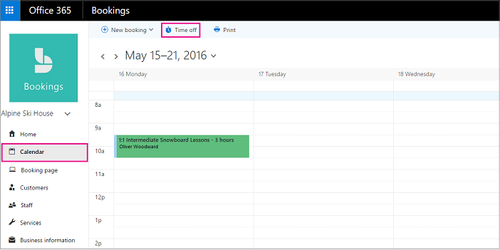

# Programar cierres de la empresa, horas libres y tiempo de vacacionesSchedule business closures, time off, and vacation time

De vez en cuando, querrás cerrar tu empresa en caso de vacaciones o eventos de grupo, o bien, los empleados no tendrán tiempo libre cuando estén enfermo, en vacaciones o no estén disponibles por otros motivos.Occasionally, you'll want to close your business for holidays or team events, or your employees will need time off when they're sick, on vacation, or unavailable for other reasons. Puede programar el tiempo de inactividad desde el calendario de Microsoft bookings y el empleado no estará disponible para las reservas durante el período de tiempo especificado.You can schedule time off from the Microsoft Bookings calendar, and the employee will be unavailable for bookings during the specified time. Una vez que se vuelve a abrir el negocio o los empleados vuelven a trabajar, todos los usuarios se enumeran en la página de reserva de acuerdo con las horas laborales establecidas.Once the business reopens or employees return to work, everyone will be listed on the booking page according to their established work hours.

Vea este vídeo o siga los pasos que se indican a continuación para programar el cierre de la empresa o el empleado.Watch this video or follow the steps below to schedule business closures or employee off.

> [!VIDEO https://www.microsoft.com/videoplayer/embed/RE2TxDC]

## Programar cierres de negocios ad hocSchedule ad hoc business closures

1. En Microsoft 365, seleccione el iniciador de aplicaciones y, a continuación, seleccione reservas.In Microsoft 365, select the app launcher, and then select Bookings.

1. En el panel de navegación, seleccione tiempo de **calendario** \> **desactivado**.In the navigation pane, select **Calendar** \> **Time off**.

   

1. Rellene los detalles, incluido el título, la fecha y hora de inicio y finalización, la ubicación y las notas adicionales.Fill in the details, including a title, start and end date and times, location, and additional notes.

1. Seleccionar **todo el día**.Select **All day event**.

1. Seleccione todos los miembros del personal.Select all staff members.

1. Seleccione **Guardar**.Select **Save**.

Cuando un cliente intenta programar el servicio en un día en el que se cierra la oficina, verá un mensaje en la página de reserva.When a customer attempts to schedule service on a day the office is closed, they'll see a message on the booking page.

   

## Programar el tiempo libre de los empleadosSchedule employee time off

1. En Microsoft 365, seleccione el iniciador de aplicaciones y, a continuación, seleccione **reservas**.In Microsoft 365, select the app launcher, and then select **Bookings**.

   

1. En el panel de navegación, seleccione tiempo de **calendario** \> **desactivado**.In the navigation pane, select **Calendar** \> **Time off**.

   

1. Rellene los detalles, incluido el título, la fecha y hora de inicio y finalización, la ubicación y las notas adicionales.Fill in the details, including a title, start and end date and times, location, and additional notes. Si el empleado va a ser de un día completo o de varios días, seleccione **evento de todo el día**.If the employee will be gone for a full day or for several days, select **All day event**.

1. Seleccione el miembro o los miembros del personal que están dedicando el tiempo.Select the staff member or members who are taking the time off.

1. Haga clic en **Guardar**.Select **Save**.
