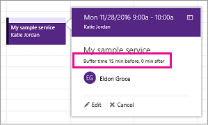

# Establecer tiempo de búfer en Microsoft Bookings

Algunas de las citas pueden requerir tiempo antes o después de reunirse con el cliente para configurar, limpiar o restablecer la sala y el equipamiento. O bien, si está en el camino entre las citas de cliente, es posible que necesite tiempo para asegurarse de que usted y su equipo puedan viajar entre citas sin hacer que el cliente espere.

Puede establecer el tiempo de búfer antes de que comiencen las citas, una vez que finalicen las citas, o ambas para dar al personal el tiempo adicional que necesitan para prepararse para su próxima cita.

## Establecer valores predeterminados de tiempo de búfer

Los valores predeterminados de tiempo de búfer se establecen en **la página Detalles del** servicio en Bookings. Al igual que todos los valores predeterminados de servicio establecidos en esta página, estos valores predeterminados se pueden editar para una reserva específica para satisfacer las necesidades específicas del cliente.

La configuración de tiempo de búfer se encuentra justo debajo de los **selectores** de duración predeterminada en la **página Detalles del** servicio. Para poder establecerlo para un servicio determinado, debe habilitar la configuración de tiempo del búfer seleccionando la alternancia de tiempo del búfer. Esto hace **que** aparezcan las desplegables Antes y Después, que se usan para elegir la cantidad predeterminada de tiempo para retener antes y después de cada reserva, como se muestra aquí: 

   

## Tiempo de búfer y tiempo de cita

Para evitar confusiones sobre cuándo los clientes esperan reunirse con usted, Bookings muestra la hora de búfer y la hora real de la cita (el tiempo que los clientes esperan reunirse con usted) en el calendario y en confirmaciones de correo electrónico y avisos al personal relevante. Por ejemplo, a continuación se muestra lo que verías en Bookings para una cita con un cliente que incluye 15 minutos de tiempo de búfer antes de la cita.

Tenga en cuenta que el evento en sí (a la izquierda de la imagen siguiente) muestra sombreado más claro para el tiempo de búfer y sombreado más oscuro para la cita real del cliente. La llamada de cita (que se abre al seleccionar el evento) indica específicamente que la cita es de 9:00AM a 10:00AM con Katie Jordan e incluye 15 minutos de tiempo de búfer antes de la cita y 0 minutos después de la cita. Las confirmaciones y avisos al personal hacen referencia de forma similar al búfer específico y la hora de cita, mientras que el cliente solo recibiría confirmaciones y avisos que hacen referencia a una hora de cita de 9:00AM a 10:00AM.

   

## Tiempo y disponibilidad del búfer

Los clientes no ven directamente y no pueden cambiar los tiempos de búfer establecidos. Sin embargo, como el tiempo de búfer se usa para calcular la duración general del servicio, los clientes lo verán a usted y a su personal relevante como reservados durante las horas de almacenamiento intermedio y de citas regulares. Los clientes también solo ven disponibilidad para usted y su personal si hay tiempo suficiente para la cita y su tiempo de búfer.

Por ejemplo, una cita de una hora con un tiempo de búfer de 15 minutos antes de la cita requiere un bloque de tiempo disponible de al menos 1 hora y 15 minutos. Por lo tanto, una cita para este servicio rellenaría un bloque de tiempo de 75 minutos en el calendario y necesita 75 minutos de disponibilidad para reservar sin conflictos.
