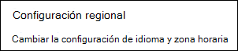
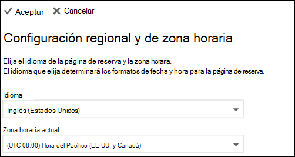

# Establecer zonas horarias y de idioma en Microsoft bookingsSet language and time zones in Microsoft Bookings

Si está usando Microsoft bookings y se crean reservas en un momento incorrecto, puede que sea necesario cambiar la configuración de la zona horaria.If you are using Microsoft Bookings and bookings are created at the wrong time, then your time zone settings might need to be changed. Del mismo modo, si algunas reservas están en un idioma incorrecto, es posible que deba cambiar la configuración de idioma.Likewise, if some bookings are in the wrong language, you might need to change your language settings.

Existen dos configuraciones de idioma y de zona horaria diferentes para las reservas.There are two separate language and time zone settings for Bookings. La primera opción controla el idioma y la zona horaria del calendario de reserva y se establece mediante la configuración de Outlook en la web para el calendario personal del usuario que ha iniciado sesión.The first setting controls the language and time zone of the booking calendar and is set using the Outlook on the web settings for the personal calendar of the logged-in user. La segunda configuración afecta a la página de reserva de autoservicio que usan los clientes y se establece mediante una página de "configuración regional" que controla el idioma y la zona horaria sólo para esa página.The second setting affects the self-service booking page that your customers use and is set using a "regional settings" page that controls language and time zone only for that page.

> [!NOTE]
> Las reservas están activadas de forma predeterminada para los clientes con las suscripciones Microsoft 365 Business Standard, Microsoft 365 a3 o Microsoft 365 A5.Bookings is turned on by default for customers who have the Microsoft 365 Business Standard, Microsoft 365 A3, or Microsoft 365 A5 subscriptions. Las reservas también están disponibles para los clientes que tienen Office 365 Enterprise E3 y Office 365 Enterprise E5, pero están desactivados de forma predeterminada.Bookings is also available to customers who have Office 365 Enterprise E3 and Office 365 Enterprise E5, but it is turned off by default. Para empezar, vea [obtener acceso a Microsoft bookings](get-access.md).To get started, see [Get access to Microsoft Bookings](get-access.md). Para activar o desactivar las reservas, consulte [activar o desactivar las reservas para su organización](turn-bookings-on-or-off.md).To turn Bookings on or off, see [Turn Bookings on or off for your organization](turn-bookings-on-or-off.md).

## Configuración de idioma y zona horaria para un calendario de reservaSetting language and time zone for a booking calendar

El calendario de reserva usa la configuración de idioma y zona horaria del usuario que ha iniciado sesión.The booking calendar uses the logged-in user’s language and time zone settings. Por ejemplo, si la zona horaria del usuario que ha iniciado sesión se establece en la hora estándar del este (EST), el calendario de reserva mostrará las horas de inicio y finalización de las citas existentes en EST.For example, If the logged-in user’s time zone is set to Eastern Standard Time (EST), then the booking calendar will show existing appointment start and end times in EST. Esta zona horaria se estableció originalmente cuando se crearon las cuentas de Microsoft 365 y Outlook en la web del usuario.This time zone was originally set when the user’s Microsoft 365 and Outlook on the web accounts were created.

Para establecer el idioma y la zona horaria del calendario de reserva:To set the language and time zone for the booking calendar:

1. Inicie sesión en Microsoft 365 y seleccione el icono de Outlook en la página de aterrizaje (tal como se muestra en la captura de pantalla siguiente) o en el iniciador de aplicaciones de Microsoft 365.Log into Microsoft 365 and select the Outlook tile on the landing page (as shown in the screenshot below) or in the Microsoft 365 App Launcher.

   

1. Cuando se abra Outlook, seleccione el **icono de engranaje** en la esquina superior derecha de la pantalla para abrir la configuración personal y de la cuenta y, a continuación, busque "zona horaria" en el cuadro de búsqueda del panel de **configuración** .After Outlook opens, select the **gear icon** in the upper, right-hand corner of the screen to open your personal and account settings, then search for “time zone” in the **Settings** panel search box. El panel se actualizará para mostrar la configuración actual de idioma y zona horaria para esta cuenta.The panel will update to show your current personal language and time zone settings for this account. Como se indicó anteriormente, esta configuración también controla el idioma y la zona horaria del calendario de reserva.As noted above, this setting also controls the language and time zone of the booking calendar.

1. Para cambiar el idioma o la zona horaria, seleccione la flecha desplegable en el cuadro **idioma o zona horaria actual** y elija la configuración deseada.Change the language or time zone by selecting the drop-down arrow in the **Language or Current time zone** box and choosing the desired setting.

1. Haga clic en **Guardar**.Click **Save**. El panel configuración se cierra, Outlook en la web se reiniciará y se aplicará la nueva configuración de idioma y zona horaria.The Settings panel closes, Outlook on the web restarts, and the new language and time zone settings are applied.

## Establecimiento de la zona horaria y el idioma de la página de reservaSetting the language and time zone for the booking page

1. En Microsoft 365, seleccione el iniciador de aplicaciones y, a continuación, seleccione **reservas**.In Microsoft 365, select the app launcher, and then select **Bookings**.

1. En el panel de navegación, seleccione **Página de reserva** y seleccione cambiar la **configuración de idioma y zona horaria**.In the navigation pane, select **Booking page** and select **Change language and time zone settings**.

   

1. Seleccione su idioma y la zona horaria actual y elija Aceptar.Select your language and current time zone and choose OK.

   
