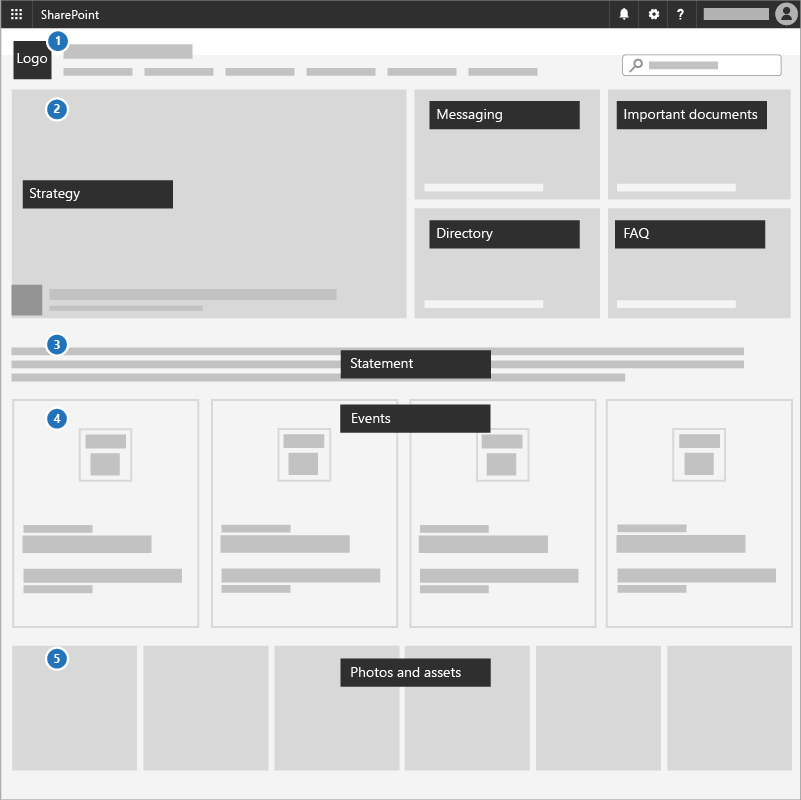

# Crear un sitio de comunicaciones

Una excelente manera de comunicar prioridades, compartir documentos de estrategia y resaltar los próximos eventos es usar un sitio de comunicaciones en SharePoint y de eso trata esta misión. Los sitios de comunicaciones sirven para compartir cosas de forma general en toda la empresa o campaña &mdash; es el sitio de estrategia interna y el espacio táctico. 

## Procedimientos recomendados

Incluya los siguientes elementos en un sitio de comunicaciones:

1. Agregue el logotipo y los colores como una imagen de encabezado y un tema.

2. Dirija con su estrategia, mensaje, documentos importantes, un directorio y preguntas más frecuentes en un **elemento web Hero**.

3. Incluya una declaración de candidato o ceo al equipo en un **Texto elemento web**.

4. Agregue eventos a un **elemento web Events** para que todos puedan ver las novedades.

5. Agrega fotos que los usuarios pueden usar o compartir en un elemento web de la galería **Image**.

## Infografía: Crear una infografía del sitio de comunicaciones

Los siguientes vínculos para PowerPoint y PDF se pueden descargar e imprimir en formato tabloide (también conocido como libro de contabilidad, 11 x 17 o A3).

[PDF](https://download.microsoft.com/download/3/f/f/3ff49b41-e5a4-4993-a00c-7f791a80b627/M365CampaignsCreateCommunicationSite.pdf) | [PowerPoint](https://download.microsoft.com/download/3/f/f/3ff49b41-e5a4-4993-a00c-7f791a80b627/M365CampaignsCreateCommunicationSite.pptx)

## Configúrelo

1. Inicie sesión en [https://Office.com](https://Office.com).

2. In the top-left corner of the page, select the app launcher icon and then select the **SharePoint** tile. If you don't see the **SharePoint** tile, click the **Sites** tile or **All** if SharePoint isn't visible.

3. En la parte superior de la página principal de SharePoint, haga clic en **+ Crear sitio** y elija la opción **Sitio de comunicaciones**.

Obtenga información sobre todos los [sitios de comunicaciones](https://support.office.com/article/What-is-a-SharePoint-communication-site-94A33429-E580-45C3-A090-5512A8070732) y cómo [crear un sitio de comunicación en SharePoint Online](https://support.microsoft.com/en-us/office/create-a-communication-site-in-sharepoint-online-7fb44b20-a72f-4d2c-9173-fc8f59ba50eb).

## Configuración de administrador

Si no ve el vínculo de **+ Crear sitio**, es posible que la creación de sitios sin intervención del administrador no esté disponible en Microsoft 365. Para crear un sitio de grupo, póngase en contacto con la persona que administra Microsoft 365 en su organización. Si es un administrador de Microsoft 365, consulte [Administrar la creación de sitios en SharePoint Online](/sharepoint/manage-site-creation) para habilitar la creación de sitios sin intervención del administrador en su organización o [Administrar sitios en el nuevo Centro de administración de SharePoint](/sharepoint/manage-sites-in-new-admin-center) para crear un sitio desde el <a href="https://go.microsoft.com/fwlink/?linkid=2185219" target="_blank">Centro de administración de SharePoint</a>.

## Próxima misión

Congratulations &mdash; you've completed the mission! Now, immediately turn your focus toward [protecting the managed devices](m365bp-protect-devices.md) for the entire org!