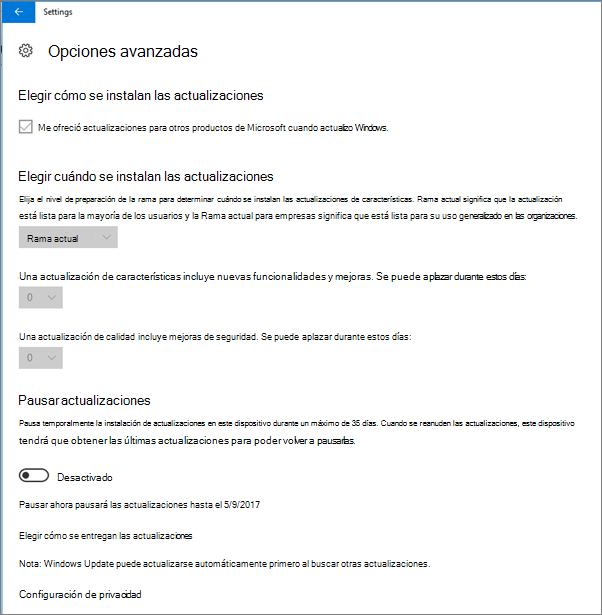
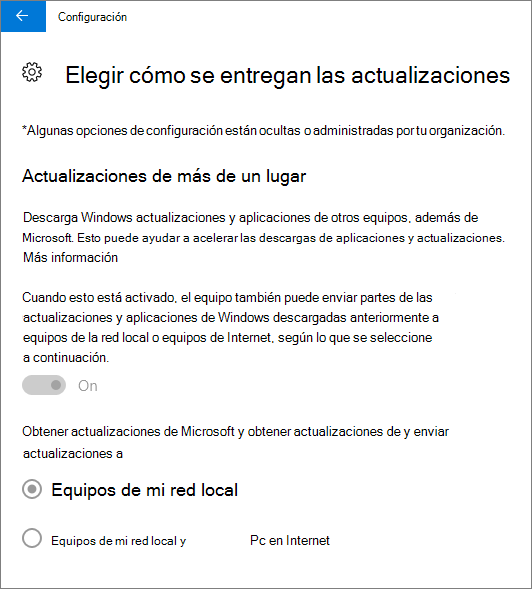
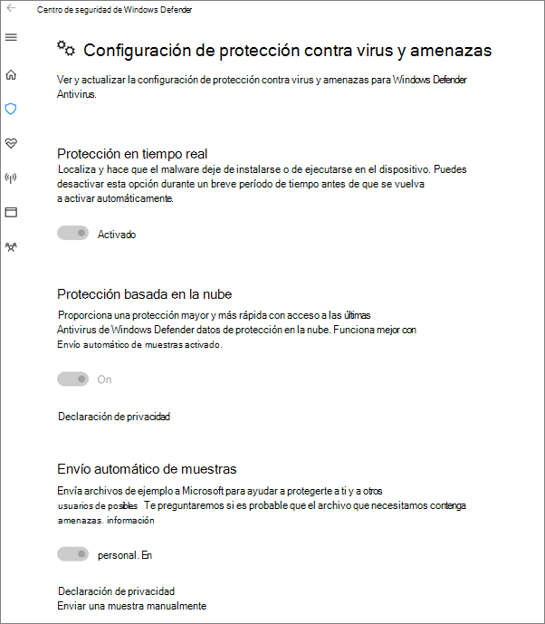

# Validación de la configuración de protección de dispositivos para Windows 10 o 11 equipos

## Compruebe que Windows 10 o 11 directivas de dispositivo están establecidas

Después de [configurar las directivas de dispositivo](../business-premium/m365bp-protection-settings-for-windows-10-devices.md), la directiva puede tardar hasta unas horas en surtir efecto en los dispositivos de los usuarios. Puede confirmar que las directivas surtieron efecto examinando varias pantallas de configuración de Windows en los dispositivos de los usuarios. Dado que los usuarios no podrán modificar la configuración de antivirus de Windows Update y Microsoft Defender en sus dispositivos Windows 10 o 11, muchas opciones se atenuarán.
  
1. Vaya a **Configuración** \> **Actualizar &amp; seguridad** \> **Windows Update** \> **Opciones de reinicio** y confirme que toda la configuración está atenuada.

    
  
2. Vaya a **Configuración** \> **Actualizar &amp; seguridad** \> **Windows Update** \> **Opciones avanzadas** y confirme que toda la configuración está atenuada.

    
  
3. Vaya a **Configuración Actualizar** \> **&amp; seguridad** \> **Windows Update** \> Opciones \> **avanzadas** **Elija cómo se entregan las actualizaciones**.

    Confirme que puede ver el mensaje (en rojo) de que algunas configuraciones están ocultas o administradas por su organización y que todas las opciones están atenuadas.

    
  
4. Para abrir el Windows Defender Security Center, vaya a **Configuración** \> **Actualizar &amp; seguridad** \> **Windows Defender** \> haga clic en **Abrir Windows Defender** protección \> **&amp;** contra **amenazas de virus de Security Center.&amp;** \>

5. Compruebe que todas las opciones estén atenuadas.

    
  
## Contenido relacionado

[Documentación y recursos de Microsoft 365 para empresas](/admin)

[Establecimiento de configuraciones de dispositivos para equipos Windows 10](../business-premium/m365bp-protection-settings-for-windows-10-devices.md)
[Procedimientos recomendados para proteger Microsoft 365 para planes empresariales](../admin/security-and-compliance/secure-your-business-data.md)

## Siguiente objetivo

[Revisión y edición de directivas de protección](m365bp-view-edit-create-mdb-policies.md)
